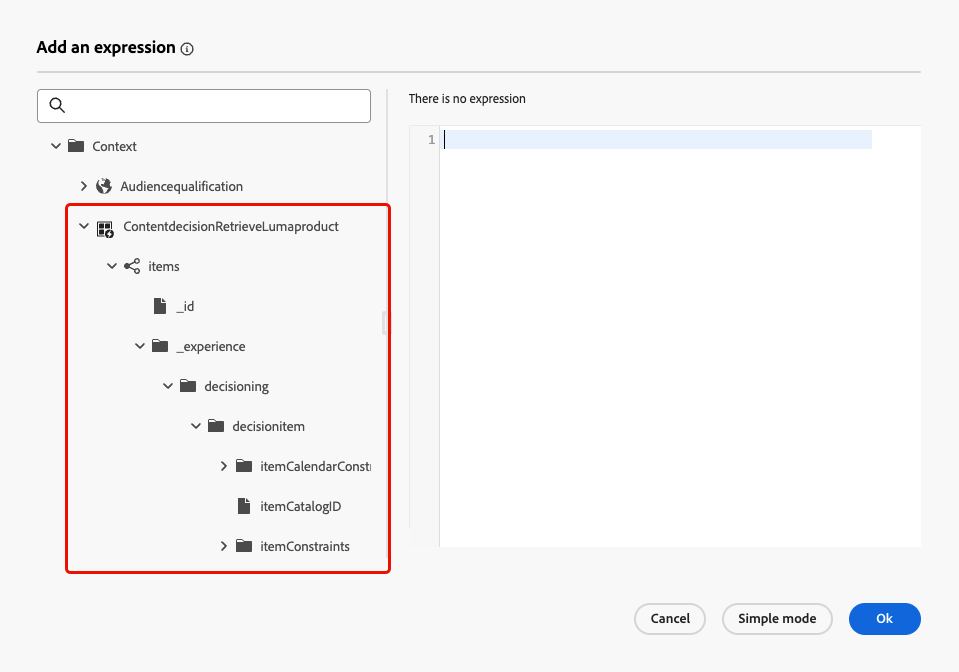
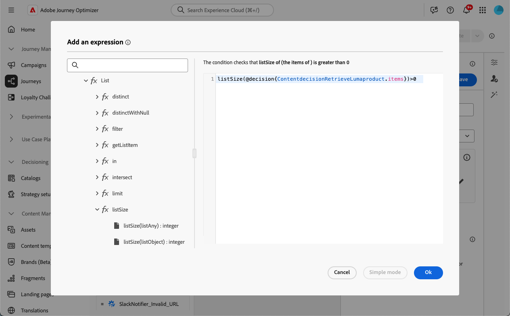

# 内容决策活动 {#content-decision}

>[!AVAILABILITY]
>
>此功能仅面向一部分组织提供（限量发布），将会通过未来的版本在全球范围内推出。

[!DNL Journey Optimizer]允许您通过历程画布中的专用&#x200B;**内容决策**&#x200B;活动在历程中包含优惠。 然后，您可以向历程中添加其他活动（如[自定义操作](../action/about-custom-action-configuration.md)），以使用这些个性化优惠定位受众。

>[!NOTE]
>
>内容决策活动的输出不能用于本机渠道活动。

要利用此功能，请创建一个历程，在此历程中添加[内容决策活动](#add-content-decision-activity)以定义要提供给合格用户档案的优惠。

然后，您可以在以下位置使用内容决策活动的输出：

* [条件活动](#add-condition-activity)，用于根据检索到的选件将用户档案移动到特定路径；

* 一个[自定义操作](#add-custom-action)，您可以在其中将这些选件发送到外部系统。

## 配置内容决策活动 {#add-content-decision-activity}

使用内容决策活动，您可以定义一个决策策略，该策略允许您从[!DNL Journey Optimizer]决策中选择最佳项目并将它们交付给正确的受众。

<!--Their goal is to select the best offers for each profile, while the campaign/journey authoring allows you to indicate how the selected decision items should be presented, including which item attributes to be included in the message.-->

要配置&#x200B;**[!UICONTROL 内容决策]**&#x200B;活动，请执行以下步骤。

1. 展开&#x200B;**[!UICONTROL 业务流程]**&#x200B;类别并将&#x200B;**[!UICONTROL 内容决策]**&#x200B;活动拖放到画布中。

   {width=100%}

1. 或者，为活动添加标签和描述。

1. 单击&#x200B;**[!UICONTROL 添加决策策略]**。 [了解有关决策政策的更多信息](../experience-decisioning/create-decision.md)

   >[!NOTE]
   >
   >需要决策权限才能创作决策策略。 [了解详情](../experience-decisioning/gs-experience-decisioning.md#steps)

1. 选择要返回的项目数。 例如，如果您选择2，则会显示最佳的2个符合条件的优惠。 单击&#x200B;**[!UICONTROL 下一步]**。

1. 在&#x200B;**[!UICONTROL 策略序列]**&#x200B;部分中，选择要与决策策略一起显示的决策项和/或选择策略。 [了解详情](../experience-decisioning/create-decision.md#select)

1. 根据需要安排评估顺序。

   添加多个决策项目和/或策略时，将按顺序评估它们，每个对象或对象组左侧的数字表示它们。 要更改默认顺序，您可以拖放对象和/或组以根据需要重新排序。 [了解详情](../experience-decisioning/create-decision.md#evaluation-order)

1. 或者，添加后备优惠。 [了解详情](../experience-decisioning/create-decision.md#fallback)

1. 查看并保存决策策略。

   {width=70%}<!--reshoot or change screen-->

您现在可以在历程中利用此内容决策活动的输出。

## 使用内容决策活动的输出 {#use-content-decision-output}

内容决策的输出可用于多个历程活动。 例如，您可以使用[条件活动](#add-condition-activity)，根据检索到的选件数，将用户档案移动到历程的特定分支。

您还可以向历程添加[自定义操作](#add-custom-action)，以将内容决策活动中的选件共享到外部系统。

### 在条件活动中 {#add-condition-activity}

要利用内容决策活动的输出，您可以向历程添加条件，其中使用来自这些选件的数据定义表达式以将配置文件移动到特定路径。 请按照以下步骤操作。

1. 从&#x200B;**[!UICONTROL 业务流程]**&#x200B;类别中，将&#x200B;**[!UICONTROL 条件]**&#x200B;活动拖放到画布中。 [了解详情](condition-activity.md#add-condition-activity)

1. （可选）将对应于将定义的第一个表达式的&#x200B;**[!UICONTROL Path1]**&#x200B;重命名为更相关的标签。

1. 对于第一个路径，单击&#x200B;**[!UICONTROL 表达式]**&#x200B;字段内部或使用“编辑”图标添加表达式。

   {width=80%}

1. 在打开的弹出窗口中，切换到&#x200B;**[!UICONTROL 高级模式]**&#x200B;以使用[高级表达式编辑器](expression/expressionadvanced.md)。

   >[!CAUTION]
   >
   >内容决策节点的输出仅在&#x200B;**[!UICONTROL 高级模式]**&#x200B;下可用。

1. 展开&#x200B;**[!UICONTROL Context]**&#x200B;节点并导航到您的决策策略以显示[优惠目录架构](../experience-decisioning/catalogs.md#access-catalog-schema)中的所有可用属性。

   

   >[!NOTE]
   >
   >在决策规则（作为上下文数据）中使用的历程体验事件中或[优惠架构](../experience-decisioning/catalogs.md#access-catalog-schema)中对属性定义的任何受限标签都不会导致违反DULE或同意的策略。 在[本节](../action/action-privacy.md)中了解有关数据治理策略的更多信息

1. 要检查是否为进入历程的用户档案返回了任何选件，请使用具有以下语法的[listSize](functions/functionlistsize.md)函数： `listSize(@decision{ContentdecisionName.items})>0`

   >[!NOTE]
   >
   >在此示例中，`Name`是您添加到历程的内容决策的标签。

   

1. 单击&#x200B;**[!UICONTROL 确定]**。

1. 添加更多路径以根据需要定义其他条件。

   您还可以通过选中&#x200B;**[!UICONTROL 为上述情况以外的其他情况显示路径]**，为不符合第一个条件的配置文件创建其他路径。<!--These profiles will then exit the journey if no other activity is added in that path.-->

1. 保存条件活动。

### 在自定义操作中 {#add-custom-action}

要利用内容决策活动的输出，您可以向历程添加自定义操作，其中您会将定义的选件共享到外部系统。 请按照以下步骤操作。

1. 向历程添加自定义操作。 [了解详情](../action/about-custom-action-configuration.md)

1. 输入操作的标签。

1. 在&#x200B;**[!UICONTROL 请求参数]**&#x200B;部分中，选择要映射到已检索选件中属性的参数。

   单击可编辑文本字段，然后选择要映射到已检索选件中属性的任何参数。

   

1. 在打开的弹出窗口中切换到&#x200B;**[!UICONTROL 高级模式]**。 在[高级表达式编辑器](expression/expressionadvanced.md)中，展开&#x200B;**[!UICONTROL Context]**&#x200B;节点以显示所有决策策略项。

   >[!CAUTION]
   >
   >内容决策节点的输出仅在&#x200B;**[!UICONTROL 高级模式]**&#x200B;下可用。

1. 使用[数组浏览](../experience-decisioning/catalogs.md#access-catalog-schema)优惠目录架构`items`。 例如，使用检索到的第一个选件的`itemName`和检索到的第二个选件的`itemName`。

   

1. 单击&#x200B;**[!UICONTROL 确定]**&#x200B;以保存表达式。

1. **[!UICONTROL 保存]**&#x200B;您的自定义操作配置。

### 端到端示例 {#use-case}

以下是历程的完整示例，该历程使用组合到条件活动和自定义操作的内容决策活动 — 如上所述。

<!--When all activities are properly configured and saved, [publish](publishing-the-journey.md) your journey.-->

历程激活后[&#128279;](publishing-the-journey.md)：

<!--* Profiles who enter the journey and are eligible for at least one offer are targeted by the custom action.

* If no offer is returned for a profile, they are excluded from the custom action.-->

1. 每次配置文件符合该受众的资格时，它都会进入历程。

1. 通过内容决策活动，[!DNL Journey Optimizer]检索与每个配置文件相关的选件。

1. 只有至少检索了一个选件的用户档案才会继续历程（通过“符合条件的用户档案”路径）。

1. 如果满足条件，则相应的选件将通过自定义操作发送到外部系统。
