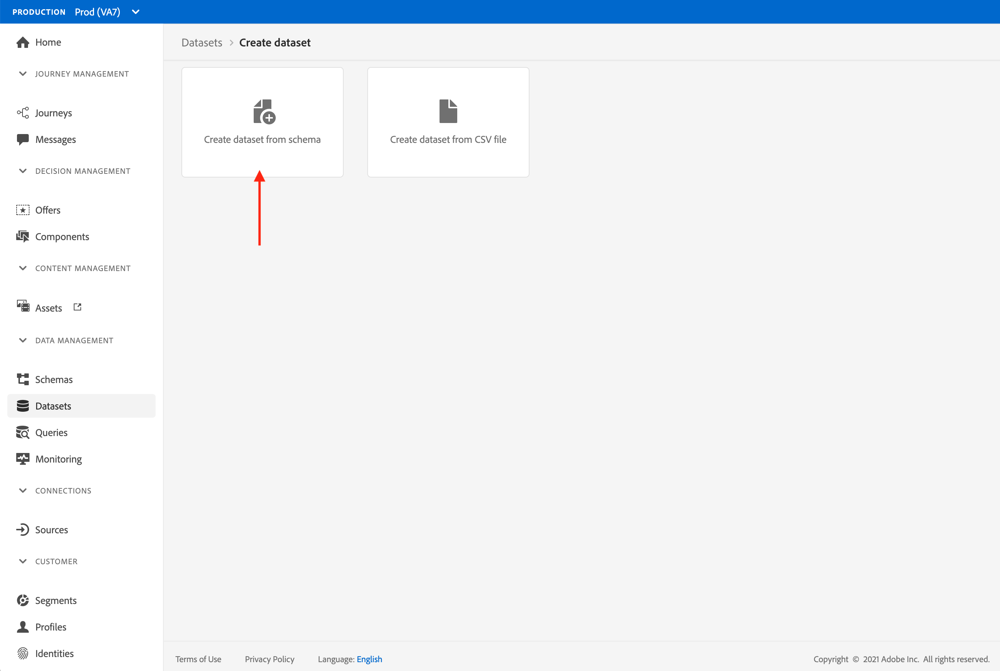
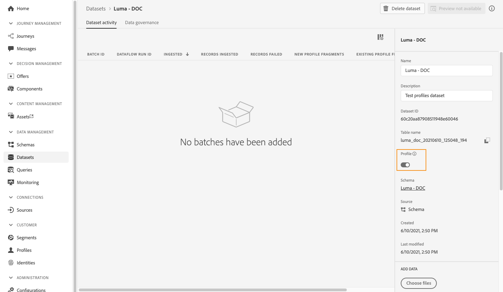
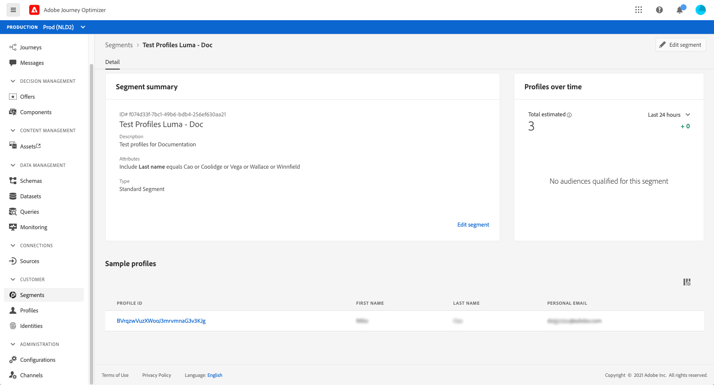
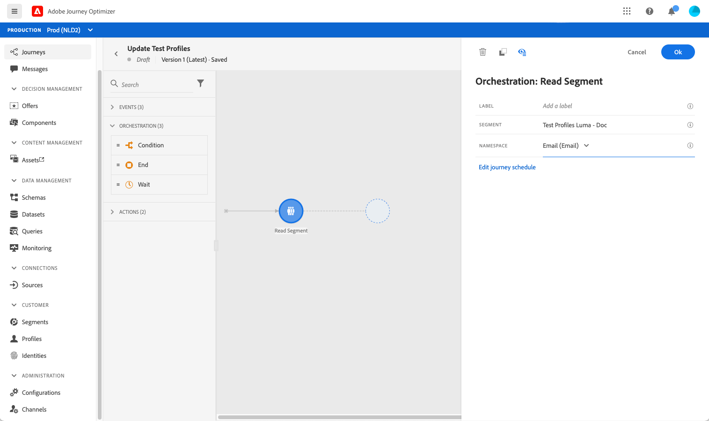

# 创建测试用户档案{#create-test-profiles}


在历程中使用测试模式时需要测试用户档案。 您可以将[现有配置文件](../building-journeys/creating-test-profiles.md#turning-profile-into-test)转换为测试配置文件，或者[创建测试配置文件](../building-journeys/creating-test-profiles.md#create-test-profiles-csv)。 要了解如何使用测试模式，请参阅[此部分](../building-journeys/testing-the-journey.md)。

在Adobe Experience Platform中创建测试用户档案的方法有所不同。 在本文档中，我们将重点介绍两种方法：上传[csv文件](../building-journeys/creating-test-profiles.md#create-test-profiles-csv)并使用[API调用](../building-journeys/creating-test-profiles.md#create-test-profiles-api)。 您还可以在数据集中上传json文件，请参阅[数据摄取文档](https://experienceleague.adobe.com/docs/experience-platform/ingestion/tutorials/ingest-batch-data.html#add-data-to-dataset)。

创建测试用户档案与在Adobe Experience Platform中创建常规用户档案类似。 有关更多信息，请参阅[实时客户资料文档](https://experienceleague.adobe.com/docs/experience-platform/profile/home.html)。

## 先决条件{#test-profile-prerequisites}

为了能够创建用户档案，您首先需要在[!DNL Journey Optimizer]Adobe中创建架构和数据集。

首先，您需要&#x200B;**创建架构**。 请执行以下步骤：

1. 在“管理”部分，单击&#x200B;**[!UICONTROL Schemas]**。
   
1. 单击右上方的&#x200B;**[!UICONTROL Create schema]**，然后选择架构类型，例如&#x200B;**XDM Indivial Profile**。
   
1. 选择相应的字段组。 确保添加&#x200B;**配置文件测试详细信息**字段组。
   
完成后，单击 **[!UICONTROL Add field groups]**:字段组列表显示在架构概述屏幕上。
   

   >[!NOTE]
   >
   >* 单击架构的名称以更改它并更新其属性。
      >
      >
   * 单击“字段组”部分中的&#x200B;**[!UICONTROL Add]**&#x200B;按钮以选择要添加到架构中的其他字段组


1. 在字段列表中，单击要定义为主标识的字段。
   
1. 在&#x200B;**[!UICONTROL Field properties]**&#x200B;右侧面板中，选中****[!UICONTROL Identity]**&#x200B;和****[!UICONTROL Primary Identity]**&#x200B;选项，然后选择命名空间。 如果希望主标识是电子邮件地址，请选择&#x200B;**Email**&#x200B;命名空间。 单击&#x200B;**应用**。
   
1. 选择架构并启用&#x200B;**[!UICONTROL Schema properties]**&#x200B;中的&#x200B;**[!UICONTROL Profile]**选项。
   
1. 单击&#x200B;**保存**。

>[!NOTE]
>
>有关模式创建的更多信息，请参阅[XDM文档](https://experienceleague.adobe.com/docs/experience-platform/xdm/ui/resources/schemas.html#prerequisites)。

然后，您需要&#x200B;**创建要导入用户档案的数据集**。 请执行以下步骤：

1. 浏览到&#x200B;**[!UICONTROL Datasets]**，然后单击&#x200B;**[!UICONTROL Create dataset]**。
   
1. 选择&#x200B;**[!UICONTROL Create dataset from schema]**。
   
1. 选择之前创建的架构，然后单击&#x200B;**[!UICONTROL Next]**。
   
1. 选择一个名称，然后单击&#x200B;**[!UICONTROL Finish]**。
   
1. 启用&#x200B;**[!UICONTROL Profile]**选项。
   

>[!NOTE]
>
> 有关数据集创建的更多信息，请参阅[目录服务文档](https://experienceleague.adobe.com/docs/experience-platform/catalog/datasets/user-guide.html#getting-started)。

## 将用户档案转换为测试用户档案{#turning-profile-into-test}

您可以将现有用户档案转换为测试用户档案：您可以采用与创建用户档案相同的方式更新用户档案属性。

实现此目的的一种简单方法是：在历程中使用&#x200B;**[!UICONTROL Update profile]**&#x200B;操作活动，并将testProfile布尔字段从false更改为true。

您的历程将由&#x200B;**[!UICONTROL Read segment]**&#x200B;和&#x200B;**[!UICONTROL Update profile]**&#x200B;活动组成。 您首先需要创建一个区段，以定向要转换为测试用户档案的用户档案。

>[!NOTE]
>
> 由于您将要更新&#x200B;**testProfile**&#x200B;字段，因此所选的用户档案必须包含此字段。 相关架构必须具有&#x200B;**配置文件测试详细信息** mixin。 请参阅[此小节](../building-journeys/creating-test-profiles.md#test-profiles-prerequisites)。

1. 浏览到&#x200B;**区段**，然后浏览右上方的&#x200B;**创建区段**。
   
1. 为区段定义名称并构建区段：选择字段和值以定向所需的用户档案。
   
1. 单击&#x200B;**Save**并检查区段是否正确定向了用户档案。
   

   >[!NOTE]
   >
   > 区段计算可能需要一些时间。 在[此部分](../segment/about-segments.md)中了解有关区段的更多信息。

1. 现在，创建新历程并开始&#x200B;**[!UICONTROL Read segment]**&#x200B;编排活动。
1. 选择之前创建的区段以及用户档案使用的命名空间。
   
1. 添加&#x200B;**[!UICONTROL Update profile]**&#x200B;操作活动。
1. 选择架构、 **testProfiles**&#x200B;字段、数据集，并将值设置为&#x200B;**True**。 要执行此操作，请在&#x200B;**[!UICONTROL VALUE]**&#x200B;字段中，单击右侧的&#x200B;**Pen**&#x200B;图标，选择&#x200B;**[!UICONTROL Advanced mode]**&#x200B;并输入&#x200B;**true**。
   
1. 添加&#x200B;**End**&#x200B;活动，然后单击&#x200B;**[!UICONTROL Publish]**。
1. 在&#x200B;**[!UICONTROL Segments]**部分中，检查配置文件是否已正确更新。
   

   >[!NOTE]
   >
   > 有关&#x200B;**[!UICONTROL Update profile]**&#x200B;活动的更多信息，请参阅[此部分](../building-journeys/update-profiles.md)。

## 使用csv文件{#create-test-profiles-csv}创建测试用户档案

在Adobe Experience Platform中，您可以通过将包含不同配置文件字段的csv文件上传到数据集中来创建用户档案。 这是最简单的方法。

1. 使用电子表格软件创建一个简单的csv文件。
1. 为每个所需字段添加一列。 确保添加主标识字段（上面示例中为“personID”）和“testProfile”字段设置为“true”。
   
1. 为每个用户档案添加一行，并填写每个字段的值。
   
1. 将电子表格另存为CSV文件。 确保使用逗号作为分隔符。
1. 浏览Adobe Experience Platform **工作流**。
   
1. 选择&#x200B;**将CSV映射到XDM架构**，然后单击&#x200B;**Launch**。
   
1. 选择要将用户档案导入的数据集。 单击&#x200B;**下一步**。
   
1. 单击&#x200B;**选择文件**，然后选择csv文件。 上传文件后，单击&#x200B;**Next**。
   
1. 将源csv字段映射到架构字段，然后单击&#x200B;**完成**。
   
1. 数据导入开始。 状态将从&#x200B;**Processing**&#x200B;移至&#x200B;**Success**。 单击右上方的&#x200B;**预览数据集**。
   
1. 检查测试用户档案是否已正确添加。
   

您的测试用户档案已添加，现在可在测试历程时使用。 请参阅[此小节](../building-journeys/testing-the-journey.md)。
>[!NOTE]
>
> 有关csv导入的更多信息，请参阅[数据摄取文档](https://experienceleague.adobe.com/docs/experience-platform/ingestion/tutorials/map-a-csv-file.html#tutorials)。

## 使用API调用创建测试用户档案{#create-test-profiles-api}

您还可以通过API调用创建测试用户档案。 在此[page](https://experienceleague.adobe.com/docs/experience-platform/profile/home.html)中了解详情。

您必须使用包含“用户档案测试详细信息”混合的用户档案架构。 testProfile标记是此混合标记的一部分。

创建用户档案时，请确保传递值：testProfile = true。

请注意，您还可以更新现有的用户档案，以将其testProfile标记更改为“true”。

以下是用于创建测试用户档案的API调用示例：

```
curl -X POST \
'https://dcs.adobedc.net/collection/xxxxxxxxxxxxxx' \
-H 'Cache-Control: no-cache' \
-H 'Content-Type: application/json' \
-H 'Postman-Token: xxxxx' \
-H 'cache-control: no-cache' \
-H 'x-api-key: xxxxx' \
-H 'x-gw-ims-org-id: xxxxx' \
-d '{
"header": {
"msgType": "xdmEntityCreate",
"msgId": "xxxxx",
"msgVersion": "xxxxx",
"xactionid":"xxxxx",
"datasetId": "xxxxx",
"imsOrgId": "xxxxx",
"source": {
"name": "Postman"
},
"schemaRef": {
"id": "https://example.adobe.com/mobile/schemas/xxxxx",
"contentType": "application/vnd.adobe.xed-full+json;version=1"
}
},
"body": {
"xdmMeta": {
"schemaRef": {
"contentType": "application/vnd.adobe.xed-full+json;version=1"
}
},
"xdmEntity": {
"_id": "xxxxx",
"_mobile":{
"ECID": "xxxxx"
},
"testProfile":true
}
}
}'
```
