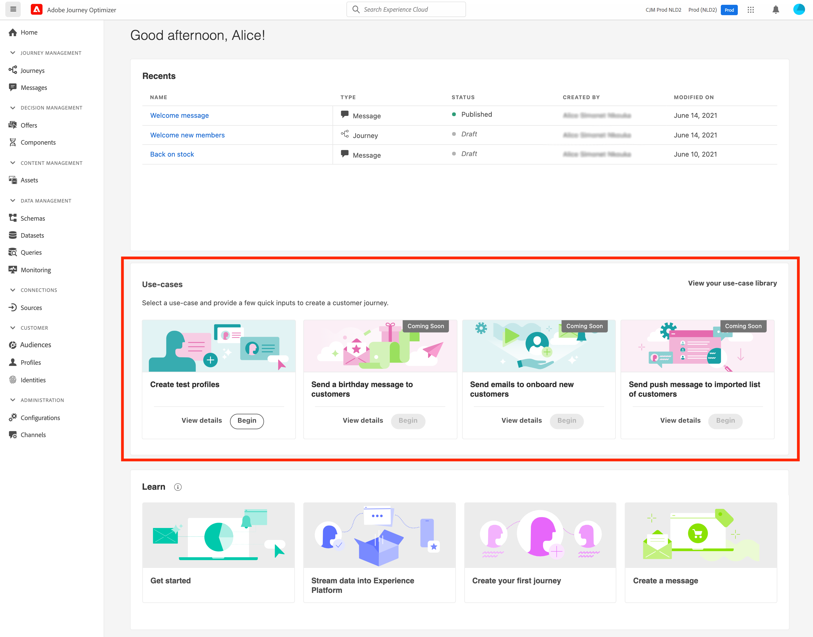

# 创建测试用户档案 {#create-test-profiles}

使用 [测试模式](../building-journeys/testing-the-journey.md) 在旅程中，和 [预览和测试内容](../messages/preview.md).

有多种方法可创建测试用户档案。 您可以在此页面的详细信息中找到：

* 翻转 [现有配置文件](#turning-profile-into-test) 输入测试用户档案

* 通过上传 [csv文件](#create-test-profiles-csv) 或使用 [API调用](#create-test-profiles-api).

   除了这两种方法之外，Adobe Journey Optimizer还提供了 [产品内用例](#use-case-1) 以便于创建测试用户档案。

您还可以在现有数据集中上传json文件。 有关更多信息，请参阅 [数据摄取文档](https://experienceleague.adobe.com/docs/experience-platform/ingestion/tutorials/ingest-batch-data.html#add-data-to-dataset){target=&quot;_blank&quot;}。

请注意，创建测试用户档案与在Adobe Experience Platform中创建常规用户档案类似。 有关更多信息，请参阅 [实时客户资料文档](https://experienceleague.adobe.com/docs/experience-platform/profile/home.html?lang=zh-Hans){target=&quot;_blank&quot;}。

## 先决条件 {#test-profile-prerequisites}

为了能够创建用户档案，您首先需要创建架构和Adobe集 [!DNL Journey Optimizer].

至 **创建模式**，请执行以下步骤：

1. 在“数据管理”菜单部分中，单击 **[!UICONTROL Schemas]**.
   
1. 单击 **[!UICONTROL Create schema]**，然后选择模式类型，例如 **XDM个人配置文件**.
   
1. 选择相应的字段组。 确保将 **用户档案测试详细信息** 字段组。
   
完成后，单击 **[!UICONTROL Add field groups]**:字段组列表显示在架构概述屏幕上。
   

   >[!NOTE]
   >
   >* 单击架构的名称以更改它并更新其属性。
   >
   >* 单击 **[!UICONTROL Add]** 字段组部分中的按钮以选择要添加到架构中的其他字段组


1. 在字段列表中，单击要定义为主标识的字段。
   
1. 在 **[!UICONTROL Field properties]** 右窗格，检查 **[!UICONTROL Identity]** 和 **[!UICONTROL Primary Identity]** 选项，然后选择命名空间。 如果希望主标识是电子邮件地址，请选择 **[!UICONTROL Email]** 命名空间。 单击 **[!UICONTROL Apply]**。
   
1. 选择架构并启用 **[!UICONTROL Profile]** 选项 **[!UICONTROL Schema properties]** 中。
   
1. 单击&#x200B;**保存**。

>[!NOTE]
>
>有关模式创建的更多信息，请参阅 [XDM文档](https://experienceleague.adobe.com/docs/experience-platform/xdm/ui/resources/schemas.html#prerequisites){target=&quot;_blank&quot;}。

那你需要 **创建数据集** 导入用户档案的位置。 请执行以下步骤：

1. 浏览到 **[!UICONTROL Datasets]**，然后单击 **[!UICONTROL Create dataset]**.
   
1. 选择 **[!UICONTROL Create dataset from schema]**.
   
1. 选择之前创建的架构，然后单击 **[!UICONTROL Next]**.
   
1. 选择一个名称，然后单击 **[!UICONTROL Finish]**.
   
1. 启用 **[!UICONTROL Profile]** 选项。
   

>[!NOTE]
>
> 有关数据集创建的更多信息，请参阅 [目录服务文档](https://experienceleague.adobe.com/docs/experience-platform/catalog/datasets/user-guide.html#getting-started){target=&quot;_blank&quot;}。

## 产品内用例{#use-case-1}

从Adobe Journey Optimizer主页中，您可以利用产品中的测试用户档案用例。 此用例有助于在发布之前创建用于测试历程的测试用户档案。



单击 **[!UICONTROL Begin]** 按钮开始实施用例。

需要提供以下信息：

1. **身份命名空间**:的 [标识命名空间](../start/get-started-identity.md) 用于唯一标识测试用户档案。 例如，如果使用电子邮件来标识测试用户档案，则表示身份命名空间 **电子邮件** 中。 如果唯一标识符是电话号码，则标识命名空间为 **电话** 中。

2. **CSV文件**:包含要创建的测试用户档案列表的逗号分隔文件。 用例要求CSV文件具有预定义的格式，其中包含要创建的测试用户档案列表。 文件中的每一行应按正确顺序包含以下字段：

   1. **人员Id**:测试用户档案的唯一标识符。 此字段的值应反映所选的身份命名空间。 (例如，如果 **电话** 为标识命名空间选择，则此字段的值应为电话号码。 同样，如果 **电子邮件** ，则此字段的值应为电子邮件)
   1. **电子邮件地址**:测试用户档案电子邮件地址。 ( **人员Id** 字段和 **电子邮件地址** 字段可能包含相同的值(如果 **电子邮件** 被选作身份命名空间)
   1. **名字**:测试用户档案的名字。
   1. **姓氏**:测试用户档案姓氏。
   1. **城市**:测试居住地
   1. **国家/地区**:测试居住地概况
   1. **性别**:测试用户档案性别。 可用值包括 **男**, **女性** 和 **未指定**

选择身份命名空间并根据上述格式提供CSV文件后，单击 **[!UICONTROL Run]** 按钮。 用例可能需要几分钟才能完成。 用例完成处理和创建测试用户档案后，将发送通知以通知用户。

>[!NOTE]
>
>测试用户档案可能会覆盖现有用户档案。 在执行用例之前，请确保CSV仅包含测试用户档案，并且会针对正确的沙盒执行测试用户档案。

## 将用户档案转换为测试用户档案{#turning-profile-into-test}

您可以将现有用户档案转换为测试用户档案：您可以采用与创建用户档案相同的方式更新用户档案属性。

实现此目的的简单方法是使用 **[!UICONTROL Update Profile]** 历程中的操作活动，并更改 **testProfile** 布尔字段，从false到true。

您的历程将由 **[!UICONTROL Read Segment]** 和 **[!UICONTROL Update Profile]** 活动。 您首先需要创建一个区段，以定向要转换为测试用户档案的用户档案。

>[!NOTE]
>
> 由于您要更新 **testProfile** 字段中，选定的用户档案必须包含此字段。 相关架构必须具有 **用户档案测试详细信息** 字段组。 请参阅[此小节](../building-journeys/creating-test-profiles.md#test-profiles-prerequisites)。

1. 浏览到 **区段**，则 **创建区段**，位于右上方。
   
1. 为区段定义名称并构建区段：选择字段和值以定向所需的用户档案。
   
1. 单击 **保存** 并检查区段是否正确定位了用户档案。
   

   >[!NOTE]
   >
   > 区段计算可能需要一些时间。 了解有关 [此部分](../segment/about-segments.md).

1. 现在，创建新历程并开始 **[!UICONTROL Read Segment]** 编排活动。
1. 选择之前创建的区段以及用户档案使用的命名空间。
   
1. 添加 **[!UICONTROL Update Profile]** 操作活动。
1. 选择架构， **testProfiles** 字段，并将值设置为 **True**. 要执行此操作，请在 **[!UICONTROL VALUE]** 字段，单击 **笔** 图标，选择 **[!UICONTROL Advanced mode]** 输入 **true**.
   
1. 添加 **结束** 活动，单击 **[!UICONTROL Publish]**.
1. 在 **[!UICONTROL Segments]** 部分，检查用户档案是否已正确更新。
   

   >[!NOTE]
   >
   > 有关 **[!UICONTROL Update Profile]** 活动，请参阅 [此部分](../building-journeys/update-profiles.md).

## 使用csv文件创建测试用户档案{#create-test-profiles-csv}

在Adobe Experience Platform中，您可以通过将包含不同配置文件字段的csv文件上传到数据集中来创建用户档案。 这是最简单的方法。

1. 使用电子表格软件创建一个简单的csv文件。
1. 为每个所需字段添加一列。 确保添加主标识字段（上面示例中为“personID”）和“testProfile”字段设置为“true”。
   
1. 为每个用户档案添加一行，并填写每个字段的值。
   
1. 将电子表格另存为CSV文件。 确保使用逗号作为分隔符。
1. 浏览到Adobe Experience Platform **工作流**.
   
1. 选择 **将CSV映射到XDM架构**，然后单击 **Launch**.
   
1. 选择要将用户档案导入的数据集。 单击&#x200B;**下一步**。
   
1. 单击 **选择文件** ，然后选择csv文件。 上传文件后，单击 **下一个**.
   
1. 将源csv字段映射到架构字段，然后单击 **完成**.
   
1. 数据导入开始。 状态将从 **处理** to **成功**. 单击 **预览数据集**，位于右上方。
   
1. 检查测试用户档案是否已正确添加。
   

您的测试用户档案已添加，现在可在测试历程时使用。 请参阅[此小节](../building-journeys/testing-the-journey.md)。
>[!NOTE]
>
> 有关csv导入的更多信息，请参阅 [数据摄取文档](https://experienceleague.adobe.com/docs/experience-platform/ingestion/tutorials/map-a-csv-file.html#tutorials){target=&quot;_blank&quot;}。

## 使用API调用创建测试用户档案{#create-test-profiles-api}

您还可以通过API调用创建测试用户档案。 在 [Adobe Experience Platform文档](https://experienceleague.adobe.com/docs/experience-platform/profile/home.html){target=&quot;_blank&quot;}。

您必须使用包含“用户档案测试详细信息”字段组的用户档案架构。 testProfile标记是此字段组的一部分。
创建用户档案时，请确保传递值：testProfile = true。

请注意，您还可以更新现有的用户档案，以将其testProfile标记更改为“true”。

以下是用于创建测试用户档案的API调用示例：

```
curl -X POST \
'https://dcs.adobedc.net/collection/xxxxxxxxxxxxxx' \
-H 'Cache-Control: no-cache' \
-H 'Content-Type: application/json' \
-H 'Postman-Token: xxxxx' \
-H 'cache-control: no-cache' \
-H 'x-api-key: xxxxx' \
-H 'x-gw-ims-org-id: xxxxx' \
-d '{
"header": {
"msgType": "xdmEntityCreate",
"msgId": "xxxxx",
"msgVersion": "xxxxx",
"xactionid":"xxxxx",
"datasetId": "xxxxx",
"imsOrgId": "xxxxx",
"source": {
"name": "Postman"
},
"schemaRef": {
"id": "https://example.adobe.com/mobile/schemas/xxxxx",
"contentType": "application/vnd.adobe.xed-full+json;version=1"
}
},
"body": {
"xdmMeta": {
"schemaRef": {
"contentType": "application/vnd.adobe.xed-full+json;version=1"
}
},
"xdmEntity": {
"_id": "xxxxx",
"_mobile":{
"ECID": "xxxxx"
},
"testProfile":true
}
}
}'
```
