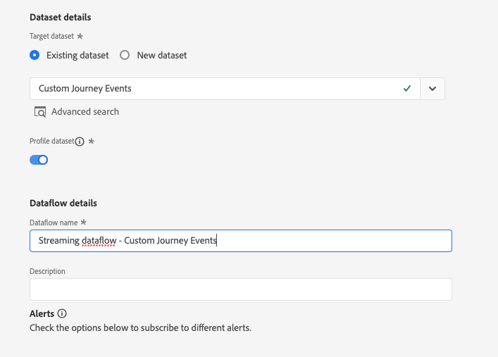

# 用例：使用自定义操作在Experience Platform中写入历程事件 {#custom-action-aep}

此用例说明了如何使用自定义操作和经过身份验证的调用，从历程将自定义事件写入Adobe Experience Platform。

## 配置IO项目 {#custom-action-aep-IO}

1. 在Adobe Developer Console中，单击&#x200B;**项目**&#x200B;并打开您的IO项目。

1. 在&#x200B;**凭据**&#x200B;部分中，单击&#x200B;**OAuth服务器到服务器**。

   

1. 单击&#x200B;**查看cURL命令**。

   

1. 复制cURL命令并存储client_id、client_secret、grant_type和scope。

```
curl -X POST 'https://ims-na1.adobelogin.com/ims/token/v3' -H 'Content-Type: application/x-www-form-urlencoded' -d 'grant_type=client_credentials&client_id=1234&client_secret=5678&scope=openid,AdobeID,read_organizations,additional_info.projectedProductContext,session'
```

>[!CAUTION]
>
>在Adobe Developer Console上创建项目后，请确保向开发人员和API授予具有正确权限的访问控制。 请参阅[Adobe Experience Platform文档](https://experienceleague.adobe.com/en/docs/experience-platform/landing/platform-apis/api-authentication#grant-developer-and-api-access-control){target="_blank"}以了解详情

## 使用HTTP API入口配置Source

1. 在Adobe Experience Platform中创建端点以写入历程中的数据。

1. 在Adobe Experience Platform中，单击左侧菜单中的&#x200B;**连接**&#x200B;下的&#x200B;**源**。 在&#x200B;**HTTP API**&#x200B;下，单击&#x200B;**添加数据**。

   

1. 选择&#x200B;**新帐户**&#x200B;并启用身份验证。 单击&#x200B;**连接到Source**。

   

1. 单击&#x200B;**下一步**&#x200B;并选择要将数据写入的数据集。 单击&#x200B;**下一步**&#x200B;和&#x200B;**完成**。

   

1. 打开新创建的数据流。 复制架构有效负载并将其保存在记事本中。

```
{
"header": {
"schemaRef": {
"id": "https://ns.adobe.com/<your_org>/schemas/<schema_id>",
"contentType": "application/vnd.adobe.xed-full+json;version=1.0"
},
"imsOrgId": "<org_id>",
"datasetId": "<dataset_id>",
"source": {
"name": "Custom Journey Events"
}
},
"body": {
"xdmMeta": {
"schemaRef": {
"id": "https://ns.adobe.com/<your_org>/schemas/<schema_id>",
"contentType": "application/vnd.adobe.xed-full+json;version=1.0"
}
},
"xdmEntity": {
"_id": "test1",
"<your_org>": {
"journeyVersionId": "",
"nodeId": "", "customer_Id":""
},
"eventMergeId": "",
"eventType": "",
"producedBy": "self",
"timestamp": "2018-11-12T20:20:39+00:00"
}
}
}
```

## 配置自定义操作 {#custom-action-config}

在[此页面](../action/about-custom-action-configuration.md)中详细描述了自定义操作配置。

对于此示例，请按照以下步骤操作：

1. 打开Adobe Journey Optimizer，然后单击左侧菜单中&#x200B;**管理**&#x200B;下的&#x200B;**配置**。 在&#x200B;**操作**&#x200B;下，单击&#x200B;**管理**，然后单击&#x200B;**创建操作**。

1. 设置URL并选择Post方法。

   `https://dcs.adobedc.net/collection/<collection_id>?syncValidation=false`

1. 确保配置标头(Content-Type、Charset、sandbox-name)。

   

### 设置身份验证 {#custom-action-aep-authentication}

1. 使用以下有效负载选择&#x200B;**Type**&#x200B;作为&#x200B;**Custom**。

1. 粘贴client_secret、client_id、scope和grant_type（来自以前使用的IO项目有效负载）。

   ```
   {
   "type": "customAuthorization",
   "authorizationType": "Bearer",
   "endpoint": "https://ims-na1.adobelogin.com/ims/token/v3",
   "method": "POST",
   "headers": {},
   "body": {
   "bodyType": "form",
   "bodyParams": {
   "grant_type": "client_credentials",
   "client_secret": "********",
   "client_id": "<client_id>",
   "scope": "openid,AdobeID,read_organizations,additional_info.projectedProductContext,session"
   }
   },
   "tokenInResponse": "json://access_token",
   "cacheDuration": {
   "duration": 28000,
   "timeUnit": "seconds"
   }
   }
   ```

1. 使用&#x200B;**单击测试身份验证**&#x200B;按钮测试连接。

   

### 设置有效负载 {#custom-action-aep-payload}

1. 在&#x200B;**请求**&#x200B;和&#x200B;**响应**&#x200B;字段中，粘贴以前使用的源连接中的有效负载。

   ```
   {
   "xdmMeta": {
   "schemaRef": {
   "id": "https://ns.adobe.com/<your_org>/schemas/<schema_id>",
   "contentType": "application/vnd.adobe.xed-full+json;version=1.0"
   }
   },
   "xdmEntity": {
   "_id": "/uri-reference",
   "<your_org>": {
   "journeyVersionId": "Sample value",
   "nodeId": "Sample value",
   "customer_Id":""
   },
   "eventMergeId": "Sample value",
   "eventType": "advertising.completes,
   "producedBy": "self",
   "timestamp": "2018-11-12T20:20:39+00:00"
   }
   }
   ```

1. 将动态填充的字段的字段配置从&#x200B;**常量**&#x200B;更改为&#x200B;**变量**。

1. 保存自定义操作。

## 历程

1. 最后，在历程中使用此自定义操作编写自定义历程事件。

1. 根据您的用例填充历程版本ID、节点ID、节点名称和其他属性。

   
