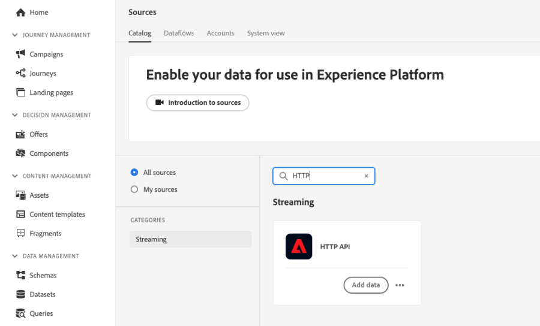

# 使用自定义操作在 Experience Platform 中写入历程事件 {#custom-action-aep}

>[!BEGINSHADEBOX]

**在此页面上：**&#x200B;了解如何使用自定义操作和经过身份验证的API调用，将自定义历程事件从历程写入Adobe Experience Platform。

>[!ENDSHADEBOX]

此用例说明了如何使用自定义操作和经过身份验证的调用，将自定义事件从历程写入[!DNL Adobe Experience Platform]。

## 配置开发人员项目 {#custom-action-aep-IO}

1. 在Adobe Developer Console中，单击&#x200B;**项目**&#x200B;并打开您的IO项目。

1. 在&#x200B;**凭据**&#x200B;部分中，单击&#x200B;**OAuth服务器到服务器**。

   

1. 单击&#x200B;**查看cURL命令**。

   ![[!DNL Adobe Experience Platform]操作类型选择](assets/custom-action-aep-2.png)

1. 复制cURL命令并存储client_id、client_secret、grant_type和scope。

```
curl -X POST 'https://ims-na1.adobelogin.com/ims/token/v3' -H 'Content-Type: application/x-www-form-urlencoded' -d 'grant_type=client_credentials&client_id=1234&client_secret=5678&scope=openid,AdobeID,read_organizations,additional_info.projectedProductContext,session'
```

>[!CAUTION]
>
>在Adobe Developer Console上创建项目后，请确保向开发人员和API授予具有正确权限的访问控制。 请参阅[[!DNL Adobe Experience Platform] 文档](https://experienceleague.adobe.com/en/docs/experience-platform/landing/platform-apis/api-authentication#grant-developer-and-api-access-control){target="_blank"}以了解详情

## 使用HTTP API入口配置源

1. 在[!DNL Adobe Experience Platform]中创建端点以写入历程中的数据。

1. 在[!DNL Adobe Experience Platform]中，单击左侧菜单中的&#x200B;**连接**&#x200B;下的&#x200B;**源**。 在&#x200B;**HTTP API**&#x200B;下，单击&#x200B;**添加数据**。

   [!DNL Adobe Experience Platform]的沙盒选择下拉列表

1. 选择&#x200B;**新帐户**&#x200B;并启用身份验证。 选择&#x200B;**连接到Source**。

   流数据的

1. 选择&#x200B;**下一步**&#x200B;以及要写入数据的数据集。 单击&#x200B;**下一步**&#x200B;和&#x200B;**完成**。

   

1. 打开新创建的数据流。 复制架构有效负载并将其保存在记事本中。

```
{
"header": {
"schemaRef": {
"id": "https://ns.adobe.com/<your_org>/schemas/<schema_id>",
"contentType": "application/vnd.adobe.xed-full+json;version=1.0"
},
"imsOrgId": "<org_id>",
"datasetId": "<dataset_id>",
"source": {
"name": "Custom Journey Events"
}
},
"body": {
"xdmMeta": {
"schemaRef": {
"id": "https://ns.adobe.com/<your_org>/schemas/<schema_id>",
"contentType": "application/vnd.adobe.xed-full+json;version=1.0"
}
},
"xdmEntity": {
"_id": "test1",
"<your_org>": {
"journeyVersionId": "",
"nodeId": "", "customer_Id":""
},
"eventMergeId": "",
"eventType": "",
"producedBy": "self",
"timestamp": "2018-11-12T20:20:39+00:00"
}
}
}
```

## 配置自定义操作 {#custom-action-config}

自定义操作配置在[此页面](../action/about-custom-action-configuration.md)中有详细说明。

对于此示例，请按照以下步骤操作：

1. 打开[!DNL Adobe Journey Optimizer]，然后单击左侧菜单中&#x200B;**管理**&#x200B;下的&#x200B;**配置**。 在&#x200B;**操作**&#x200B;下，单击&#x200B;**管理**，然后单击&#x200B;**创建操作**。

1. 设置URL并选择Post方法。

   `https://dcs.adobedc.net/collection/<collection_id>?syncValidation=false`

1. 确保配置标头(Content-Type、Charset、sandbox-name)。

   

### 设置身份验证 {#custom-action-aep-authentication}

1. 使用以下有效负载选择&#x200B;**Type**&#x200B;作为&#x200B;**Custom**。

1. 粘贴client_secret、client_id、scope和grant_type（来自以前使用的IO项目有效负载）。

   ```
   {
   "type": "customAuthorization",
   "authorizationType": "Bearer",
   "endpoint": "https://ims-na1.adobelogin.com/ims/token/v3",
   "method": "POST",
   "headers": {},
   "body": {
   "bodyType": "form",
   "bodyParams": {
   "grant_type": "client_credentials",
   "client_secret": "********",
   "client_id": "<client_id>",
   "scope": "openid,AdobeID,read_organizations,additional_info.projectedProductContext,session"
   }
   },
   "tokenInResponse": "json://access_token",
   "cacheDuration": {
   "duration": 28000,
   "timeUnit": "seconds"
   }
   }
   ```

1. 使用&#x200B;**单击测试身份验证**&#x200B;按钮测试连接。

   

### 设置有效负载 {#custom-action-aep-payload}

1. 在&#x200B;**请求**&#x200B;和&#x200B;**响应**&#x200B;字段中，粘贴以前使用的源连接中的有效负载。

   ```
   {
   "xdmMeta": {
   "schemaRef": {
   "id": "https://ns.adobe.com/<your_org>/schemas/<schema_id>",
   "contentType": "application/vnd.adobe.xed-full+json;version=1.0"
   }
   },
   "xdmEntity": {
   "_id": "/uri-reference",
   "<your_org>": {
   "journeyVersionId": "Sample value",
   "nodeId": "Sample value",
   "customer_Id":""
   },
   "eventMergeId": "Sample value",
   "eventType": "advertising.completes,
   "producedBy": "self",
   "timestamp": "2018-11-12T20:20:39+00:00"
   }
   }
   ```

1. 将动态填充的字段的字段配置从&#x200B;**常量**&#x200B;更改为&#x200B;**变量**。

1. 保存自定义操作。

## 历程

1. 最后，在历程中使用此自定义操作编写自定义历程事件。

1. 根据您的用例填充历程版本ID、节点ID、节点名称和其他属性。

   复杂字段映射的

+++ AI知识参考

本节包含结构化知识，用于支持与本主题相关的解释、检索和问答。

要全面了解相关信息，应将此信息与本页上的文档相结合。 这两个源都不是独立的；页面描述了功能，而本节提供了其他上下文来帮助消除术语、意图、适用性和约束条件的歧义。

- **TL；DR：**&#x200B;此用例介绍了如何在Journey Optimizer中配置自定义操作，该操作使用HTTP API入口和OAuth服务器到服务器身份验证调用将历程事件数据写入Adobe Experience Platform。

**意图：**
- 使用OAuth服务器到服务器凭据设置Adobe Developer Console IO项目，以进行AEP API身份验证
- 在Adobe Experience Platform中创建一个HTTP API入口源，以接收流式历程事件数据
- 在Journey Optimizer中使用正确的URL、标头和自定义持有者令牌身份验证配置自定义操作
- 将历程字段（历程版本ID、节点ID、客户ID）动态映射为自定义操作有效负载中的变量
- 使用历程中的自定义操作将自定义事件写入AEP数据集

**术语表：**
- **HTTP API入口**： Adobe Experience Platform源连接器，它通过HTTP POST请求&#x200B;*（产品特定）*&#x200B;创建用于引入数据的流端点
- **OAuth服务器到服务器**： Adobe Developer Console中的一种身份验证凭据类型，它无需用户交互即可为服务器到服务器API调用生成持有者令牌&#x200B;*（产品特定）*
- **自定义授权**： Journey Optimizer自定义操作身份验证类型，从指定的终结点获取持有者令牌并在配置的持续时间&#x200B;*（产品特定）*&#x200B;内缓存它
- **XDM实体**：符合Experience Data Model架构的数据有效负载结构，在通过HTTP API入口&#x200B;*（产品特定）*&#x200B;将事件写入AEP时用作主体
- **cacheDuration**：自定义授权配置中的令牌缓存设置，用于控制在请求新的持有者令牌之前重用获取的持有者令牌的时间&#x200B;*（产品特定）*

**护栏：**
- 创建Adobe Developer Console项目后，必须先明确授予开发人员和API访问控制权限，然后才能使用凭据
- 必须在启用身份验证的情况下创建HTTP API入口源；必须复制并存储连接端点URL和架构有效负载，以便在自定义操作配置中使用
- 自定义操作标头必须包括Content-Type、Charset和sandbox-name
- 必须在自定义操作有效负载配置中，将要在运行时动态填充的字段从常量更改为变量

**术语：**
- 规范名称：自定义操作 — 首字母缩写：none — 变体：自定义操作配置，Journey Optimizer自定义操作
- 规范名称：Adobe Experience Platform — 首字母缩写：AEP — 变体：Experience Platform， Platform
- 同义词： &quot;HTTP API Inlet&quot; = &quot;streaming endpoint&quot; = &quot;DCS collection endpoint&quot;
- 请勿混淆：“OAuth服务器到服务器”≠“OAuth用户身份验证”（服务器到服务器不需要用户登录；它使用客户端凭据）

**常见问题解答：**
- **问：哪种身份验证类型用于从Journey Optimizer自定义操作调用AEP HTTP API入口？**  — 使用从Adobe IMS令牌端点获取的OAuth服务器到服务器客户端凭据进行自定义持有者令牌身份验证。
- **问：在哪里可以找到client_id、client_secret、grant_type和作用域值？**  — 在Adobe Developer Console IO项目的“OAuth服务器到服务器凭据”部分，通过单击“查看cURL命令”。
- **问：如何在有效负载中使历程特定的字段（如journeyVersionId、nodeId）成为动态字段？**  — 在自定义操作有效负载设置中，将其字段配置从常量更改为变量，以便在运行时从历程上下文中填充它们。
- **问：Adobe Developer Console项目需要哪些权限？**  — 在创建项目后，必须向开发人员和API访问控制授予适当的权限，如AEP API身份验证文档中所述。
- **问：在身份验证有效负载中，cacheDuration设置的用途是什么？**  — 它控制缓存和重新使用获取的持有者令牌的时间（示例中为28,000秒），超过此时间后，自定义操作将请求新令牌。

+++
