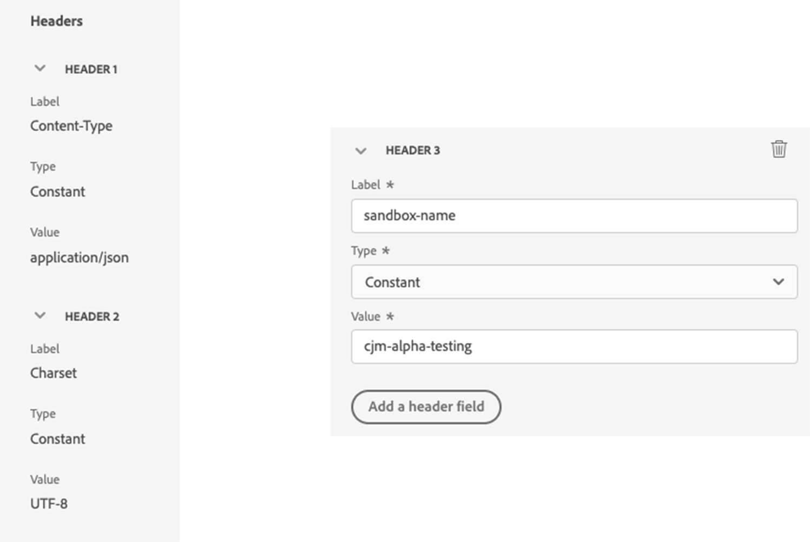

# 用例：使用自定义操作在Experience Platform中写入历程事件{#custom-action-aep}

此用例说明了如何使用自定义操作和经过身份验证的调用，从历程将自定义事件写入Adobe Experience Platform。

## 配置IO项目

1. 在Adobe Developer控制台中，单击 **项目** 并打开您的IO项目。

1. 在 **凭据** 部分，单击 **OAuth服务器到服务器**.

   

1. 单击 **查看cURL命令**.

   

1. 复制cURL命令并存储client_id、client_secret、grant_type和scope。

```
curl -X POST 'https://ims-na1.adobelogin.com/ims/token/v3' -H 'Content-Type: application/x-www-form-urlencoded' -d 'grant_type=client_credentials&client_id=1234&client_secret=5678&scope=openid,AdobeID,read_organizations,additional_info.projectedProductContext,session'
```

>[!CAUTION]
>
>在Adobe Developer Console上创建项目后，请确保授予具有正确权限的开发人员和API访问控制。 在中了解详情 [Adobe Experience Platform文档](https://experienceleague.adobe.com/en/docs/experience-platform/landing/platform-apis/api-authentication#grant-developer-and-api-access-control){target="_blank"}

## 使用HTTP API入口配置源

1. 在Adobe Experience Platform中创建端点以写入历程中的数据。

1. 在Adobe Experience Platform中，单击 **源**，下 **连接** ，位于左侧菜单。 下 **HTTP API**，单击 **添加数据**.

   

1. 选择 **新帐户** 并启用身份验证。 单击 **连接到源**.

   

1. 单击 **下一个** 并选择要从中写入数据的数据集。 单击 **下一个** 和 **完成**.

   

1. 打开新创建的数据流。 复制架构有效负载并将其保存在记事本中。

```
{
"header": {
"schemaRef": {
"id": "https://ns.adobe.com/<your_org>/schemas/<schema_id>",
"contentType": "application/vnd.adobe.xed-full+json;version=1.0"
},
"imsOrgId": "<org_id>",
"datasetId": "<dataset_id>",
"source": {
"name": "Custom Journey Events"
}
},
"body": {
"xdmMeta": {
"schemaRef": {
"id": "https://ns.adobe.com/<your_org>/schemas/<schema_id>",
"contentType": "application/vnd.adobe.xed-full+json;version=1.0"
}
},
"xdmEntity": {
"_id": "test1",
"<your_org>": {
"journeyVersionId": "",
"nodeId": "", "customer_Id":""
},
"eventMergeId": "",
"eventType": "",
"producedBy": "self",
"timestamp": "2018-11-12T20:20:39+00:00"
}
}
}
```

## 配置自定义操作

1. 打开Adobe Journey Optimizer，然后单击 **配置**，下 **管理** ，位于左侧菜单。 下 **操作**，单击 **管理** 并单击 **创建操作**.

1. 设置URL并选择Post方法。

   `https://dcs.adobedc.net/collection/<collection_id>?syncValidation=false`

1. 确保配置标头(Content-Type、Charset、sandbox-name)。

   

### 设置身份验证

1. 选择 **类型** 作为 **自定义** 的有效负载为。

1. 粘贴client_secret、client_id、scope和grant_type（来自以前使用的IO项目有效负载）。

   ```
   {
   "type": "customAuthorization",
   "authorizationType": "Bearer",
   "endpoint": "https://ims-na1.adobelogin.com/ims/token/v3",
   "method": "POST",
   "headers": {},
   "body": {
   "bodyType": "form",
   "bodyParams": {
   "grant_type": "client_credentials",
   "client_secret": "********",
   "client_id": "<client_id>",
   "scope": "openid,AdobeID,read_organizations,additional_info.projectedProductContext,session"
   }
   },
   "tokenInResponse": "json://access_token",
   "cacheDuration": {
   "duration": 28000,
   "timeUnit": "seconds"
   }
   }
   ```

1. 使用 **单击以测试身份验证** 按钮以测试连接。

   

### 设置有效负载

1. 在 **请求** 和 **响应** 字段中，粘贴以前使用的源连接中的有效负载。

   ```
   {
   "xdmMeta": {
   "schemaRef": {
   "id": "https://ns.adobe.com/<your_org>/schemas/<schema_id>",
   "contentType": "application/vnd.adobe.xed-full+json;version=1.0"
   }
   },
   "xdmEntity": {
   "_id": "/uri-reference",
   "<your_org>": {
   "journeyVersionId": "Sample value",
   "nodeId": "Sample value",
   "customer_Id":""
   },
   "eventMergeId": "Sample value",
   "eventType": "advertising.completes,
   "producedBy": "self",
   "timestamp": "2018-11-12T20:20:39+00:00"
   }
   }
   ```

1. 更改字段配置 **常量** 到 **变量** 用于动态填充的字段。 保存自定义操作。

## 历程

1. 最后，在历程中使用此自定义操作编写自定义历程事件。

1. 根据您的用例填充历程版本ID、节点ID、节点名称和其他属性。

   
