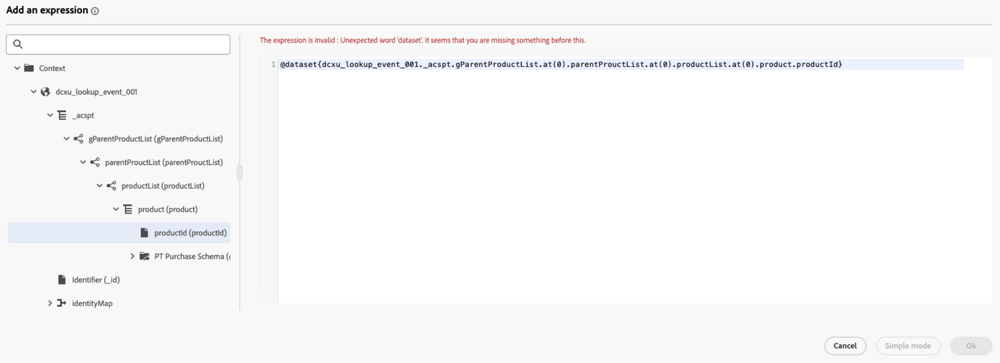

# 在历程中使用[!DNL Adobe Experience Platform]数据 {#datalookup}

>[!CONTEXTUALHELP]
>id="ajo_journey_dataset_lookup"
>title="数据集查找活动"
>abstract="**[!UICONTROL 数据集查找]**&#x200B;活动允许您在运行时期间从 Adobe Experience Platform 的记录数据集动态检索数据。通过利用此功能，您可以访问可能不存在于轮廓或事件负载中的数据，从而确保客户交互既相关又及时。"

**[!UICONTROL 数据集查找]**&#x200B;活动允许您在运行时期间从 Adobe Experience Platform 的记录数据集动态检索数据。通过利用此功能，您可以访问可能不存在于轮廓或事件负载中的数据，从而确保客户交互既相关又及时。

主要优点：

* **实时个性化**：使用扩充数据定制客户体验。
* **动态决策**：使用外部数据驱动历程逻辑和操作。
* **增强的数据访问**：检索产品元数据、定价表或与特定键关联的关系数据。

>[!AVAILABILITY]
>
>此活动仅适用于一组组织（限量发布）。 要获得访问权限，请与 Adobe 代表联系。

## 必读 {#must-read}

### 数据集启用

必须在Adobe Experience Platform中启用数据集以进行查找。 此部分中有详细信息： [使用Adobe Experience Platform数据](../data/lookup-aep-data.md)。

### 限制和限制

* 每个历程最多包含10个数据集查找活动。
* 最多选择20个字段。
* 查找键数组中最多500个键。
* 扩充数据大小限制为10KB。

## 配置数据集查找活动 {#configure}

要配置&#x200B;**[!UICONTROL 数据集查找]**&#x200B;活动，请执行以下步骤：

1. 展开&#x200B;**[!UICONTROL 业务流程]**&#x200B;类别并将&#x200B;**[!UICONTROL 数据集查找]**&#x200B;活动放入画布中。

   

1. 添加标签和描述。

1. 在&#x200B;**[!UICONTROL 数据集]**&#x200B;字段中，选择具有所需属性的数据集。

   >[!NOTE]
   >
   >如果您要查找的数据集未显示在列表中，请确保已为其启用查找功能。 有关更多详细信息，请参阅[必须读取](#must-read)部分。

1. 选择要从数据集中获取的特定字段。

   * 您只能选择叶节点（架构最低级别的字段）。 该字段必须是基元值（字符串、数字、布尔值、日期等）。

   * 无法选择列表（数组）和映射（键值对象）。

   +++示例

   

   +++

1. 在&#x200B;**[!UICONTROL 查找键]**&#x200B;字段中，选择决策项属性和数据集中都存在的联接键。 系统使用此键在选定的数据集中搜索。

   * 键可以是从历程上下文中派生的表达式，例如SKU、电子邮件ID或其他标识符。 示例： `@profile.email`或`list(@event{purchase_event.products.sku})`。

   * 仅支持&#x200B;**字符串**&#x200B;或&#x200B;**字符串**&#x200B;列表。

   +++示例

   

   +++

## 在历程中使用扩充数据

**[!UICONTROL 数据集查找]**&#x200B;活动检索的数据作为对象数组存储在历程上下文中。 它可以在历程表达式编辑器和个性化编辑器中使用，从而根据扩充的数据实现条件逻辑和个性化消息传递。

* **历程表达式编辑器**：

  访问&#x200B;**[!UICONTROL 高级模式]**&#x200B;编辑器并使用语法： `@datasetLookup{MyDatasetLookUpActivity1.entities}`。 [了解如何使用高级表达式编辑器](../building-journeys/expression/expressionadvanced.md)

* **Personalization编辑器**：

  使用语法： `{{context.journey.datasetLookup.1482319411.entities}}`。

>[!NOTE]
>
>扩充数据是临时性的，并且仅在历程运行时以及个性化叫客活动（电子邮件、推送、短信等）时可用

## 用例示例

+++基于产品类别的筛选

**情景**:Send&#x200B;为家庭产品消费超过40美元的用户提供优惠券。

**历程流**：

1. **购买事件**：从用户的购物车中捕获SKU。

1. **数据集查找活动**：
* 数据集： `products-dataset` （SKU作为主键）。
* 查找键： `list(@event{purchase_event.products.sku})`。
* 要返回的字段： `["SKU", "category", "price"]`。

1. **条件活动**：

   * 过滤类别为“家庭”的SKU。

     ```
     @event{purchase_event.products.all( in(currentEventField.sku, @datasetlookup{MyDatasetLookupActivity1.entities.all(currentDatasetLookupField.category == ‘household’).sku} ) )} 
     ```

   或者

   * 汇总家庭产品总支出，并将其与40美元的门槛值进行比较。

     ```
     sum(@event{purchase_event.products.all( in(currentEventField.sku, @datasetlookup{MyDatasetLookUpActivity1.entities.all(currentDatasetLookupField.category == ‘household’).sku} ) )}.price}, ',', true ) > 40
     ```

1. **Personalization编辑器**：

   使用扩充的数据使电子邮件内容个性化：

   ```
   
   {{#each journey.datasetlookup.3709000.entities as |product|}}
   
   
   {{/each}}
   "Hi, thanks for spending " +  + " on household products. Here is your reward!"
   ```

+++

+++使用外部忠诚度数据的Personalization

**方案**：识别用户档案的哪个电子邮件帐户具有白金会员状态。 在这种情况下，忠诚度帐户与电子邮件ID关联，忠诚度数据在标准配置文件查找存储中不可用。

**历程流**：

1. **配置文件事件触发器**：从配置文件或事件上下文中捕获电子邮件ID。

1. **数据集查找活动**：
   * 数据集： `loyalty-member-dataset` （通过电子邮件作为主键）。
   * 查找键： `@profile.email`。
   * 要返回的字段： `["email", "loyaltyTier"]`。

1. **条件活动**：

   根据忠诚度级别分支历程：

   ```
   @datasetLookup{MyDatasetLookUpActivity1.entity.loyaltyMember.loyaltyTier} == 'Platinum'
   ```

1. **Personalization编辑器**：

   使用扩充的忠诚度级别数据来个性化出站通信：

   ```
   {{context.journey.datasetLookup.1482319411.entity.loyaltyMember.loyaltyTier}}
   ```
