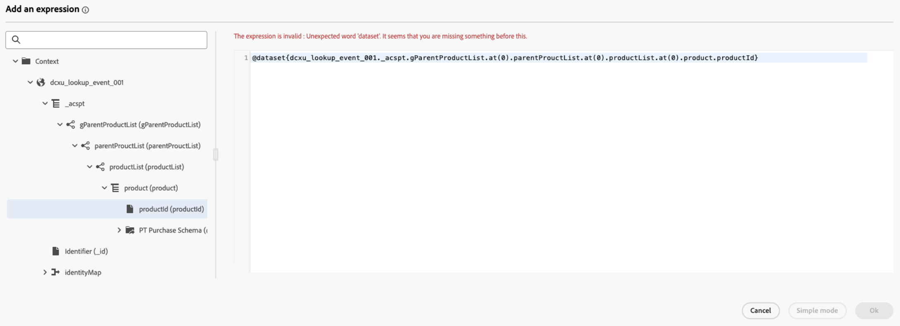

# 在历程中使用 [!DNL Adobe Experience Platform] 数据 {#datalookup}

>[!BEGINSHADEBOX]

**在此页面上：**&#x200B;了解如何使用数据集查找活动在运行时动态检索Adobe Experience Platform记录数据集中的数据，并使用外部数据扩充您的历程，以进行个性化和决策。

>[!ENDSHADEBOX]

>[!CONTEXTUALHELP]
>id="ajo_journey_dataset_lookup"
>title="数据集查找活动"
>abstract="**[!UICONTROL 数据集查找]**&#x200B;活动允许您在运行时过程中动态检索来自 [!DNL Adobe Experience Platform] 记录数据集的数据。 通过利用此功能，您可以访问可能不在轮廓或事件负载中的数据，从而确保客户互动既相关又及时。"

**[!UICONTROL 数据集查找]**&#x200B;活动允许您在运行时过程中动态检索来自 [!DNL Adobe Experience Platform] 记录数据集的数据。 通过利用此功能，您可以访问可能不在轮廓或事件负载中的数据，从而确保客户互动既相关又及时。

>[!AVAILABILITY]
>
>此功能目前以有限可用版本的形式提供给所有客户。

主要优点：

* **实时个性化**：使用扩充数据定制客户体验。
* **动态决策**：使用外部数据驱动历程逻辑和操作。
* **增强的数据访问**：检索产品元数据、定价表或与特定键关联的关系数据。

## 必读 {#must-read}

在配置数据集查找之前，请查看这些要求。

### 数据集启用

必须在[!DNL Adobe Experience Platform]中启用数据集以进行查找。 此部分中有详细信息： [使用 [!DNL Adobe Experience Platform] 数据](../data/lookup-aep-data.md)。

### 限制和限制

* 每个历程最多包含10个数据集查找活动。
* 最多选择20个字段。
* 查找键数组中最多50个键。
* 扩充数据大小限制为10KB。

### 其他性能注意事项

以下建议旨在避免交付延迟：

| 考虑 | 建议限制 | 描述 |
| ------- | ------- | ------- |
| 每个查找的属性 | 最多20 | 在单个查找活动中每个记录检索的数据字段数。 |
| 查找活动 | 每个历程最多5个 | 每个历程最多可包含5个单独的查找活动。 每个查询都可以定位不同的数据集。 |

## 配置数据集查找活动 {#configure}

要配置&#x200B;**[!UICONTROL 数据集查找]**&#x200B;活动，请执行以下步骤：

1. 展开&#x200B;**[!UICONTROL 业务流程]**&#x200B;类别并将&#x200B;**[!UICONTROL 数据集查找]**&#x200B;活动放入画布中。

   历程中的[!DNL Adobe Experience Platform]数据集查找活动

1. 添加标签和描述。

1. 在&#x200B;**[!UICONTROL 数据集]**&#x200B;字段中，选择具有所需属性的数据集。

   >[!NOTE]
   >
   >如果您要查找的数据集未显示在列表中，请确保已为其启用查找功能。 有关更多详细信息，请参阅[必须读取](#must-read)部分。

1. 选择要从数据集中获取的特定字段。

   * 您只能选择叶节点（架构最低级别的字段）。 该字段必须是基元值（字符串、数字、布尔值、日期等）。

   * 无法选择列表（数组）和映射（键值对象）。

   +++示例

   

   +++

1. 在&#x200B;**[!UICONTROL 查找键]**&#x200B;字段中，选择决策项属性和数据集中都存在的联接键。 系统使用此键在选定的数据集中搜索。

   * 键可以是从历程上下文中派生的表达式，例如SKU、电子邮件ID或其他标识符。 示例： `@profile.email`或`list(@event{purchase_event.products.sku})`。

   * 仅支持&#x200B;**字符串**&#x200B;或&#x200B;**字符串**&#x200B;列表。

   >[!IMPORTANT]
   >
   >必须使用&#x200B;**高级模式**&#x200B;定义查找键。 如果您使用简单模式设置键，则数据集查找活动输出将无法作为下游活动中的上下文属性，并且`@datasetLookup{}`语法将失败，在条件活动中出现“未找到数据集查找”错误。

   +++示例

   

   +++

## 在历程中使用扩充数据

**[!UICONTROL 数据集查找]**&#x200B;活动检索的数据作为对象数组存储在历程上下文中。 它可以在历程表达式编辑器和个性化编辑器中使用，从而根据扩充的数据实现条件逻辑和个性化消息传递。

* **历程表达式编辑器**：

  访问&#x200B;**[!UICONTROL 高级模式]**&#x200B;编辑器并使用语法： `@datasetLookup{MyDatasetLookUpActivity1.entities}`。 [了解如何使用高级表达式编辑器](../building-journeys/expression/expressionadvanced.md)

* **Personalization编辑器**：

  使用语法： `{{context.journey.datasetLookup.1482319411.entities}}`。

>[!NOTE]
>
>扩充数据是临时性的，并且仅在历程运行时以及个性化叫客活动（电子邮件、推送、短信等）时可用

## 用例示例

+++基于产品类别的筛选

**情景**:Send&#x200B;为家庭产品消费超过40美元的用户提供优惠券。

**历程流**：

1. **购买事件**：从用户的购物车中捕获SKU。

1. **数据集查找活动**：

   * 数据集： `products-dataset` （SKU作为主键）。
   * 查找键： `list(@event{purchase_event.products.sku})`。
   * 要返回的字段： `["SKU", "category", "price"]`。

1. **条件活动**：

   * 过滤类别为“家庭”的SKU。

     ```
     @event{purchase_event.products.all( in(currentEventField.sku, @datasetlookup{MyDatasetLookupActivity1.entities.all(currentDatasetLookupField.category == 'household').sku} ) )} 
     ```

   或者

   * 汇总家庭产品总支出，并将其与40美元的门槛值进行比较。

     ```
     sum(@event{purchase_event.products.all( in(currentEventField.sku, @datasetlookup{MyDatasetLookUpActivity1.entities.all(currentDatasetLookupField.category == 'household').sku} ) )}.price}, ',', true ) > 40
     ```

1. **Personalization编辑器**：

   使用扩充的数据使电子邮件内容个性化：

   ```
   
   {{#each journey.datasetlookup.3709000.entities as |product|}}
   
   
   {{/each}}
   "Hi, thanks for spending " +  + " on household products. Here is your reward!"
   ```

+++

+++使用外部忠诚度数据的Personalization

**方案**：识别用户档案的哪个电子邮件帐户具有白金会员状态。 在这种情况下，忠诚度帐户与电子邮件ID关联，忠诚度数据在标准配置文件查找存储中不可用。

**历程流**：

1. **配置文件事件触发器**：从配置文件或事件上下文中捕获电子邮件ID。

1. **数据集查找活动**：
   * 数据集： `loyalty-member-dataset` （通过电子邮件作为主键）。
   * 查找键： `@profile.email`。
   * 要返回的字段： `["email", "loyaltyTier"]`。

1. **条件活动**：

   根据忠诚度级别分支历程：

   ```
   @datasetLookup{MyDatasetLookUpActivity1.entity.loyaltyMember.loyaltyTier} == 'Platinum'
   ```

1. **Personalization编辑器**：

   使用扩充的忠诚度级别数据来个性化出站通信：

   ```
   {{context.journey.datasetLookup.1482319411.entity.loyaltyMember.loyaltyTier}}
   ```

+++

## 疑难解答 {#troubleshooting}

### 条件活动中的“未找到数据集查找”错误 {#troubleshooting-not-found}

**症状：**&#x200B;条件活动的高级表达式编辑器中的`@datasetLookup{}`语法返回“未找到数据集查找”错误，即使已在历程中正确配置了数据集查找活动也是如此。

**原因：**&#x200B;数据集查找活动中的查找键是使用简单模式设置的。 在高级模式下未定义键时，活动输出不会作为下游活动中的上下文属性显示。

**修复：**&#x200B;打开数据集查找活动，找到&#x200B;**[!UICONTROL 查找键]**&#x200B;字段，然后切换到&#x200B;**高级模式**&#x200B;以重新定义键表达式。 保存活动并重新发布历程。

+++ AI知识参考

本节包含结构化知识，用于支持与本主题相关的解释、检索和问答。

要全面了解相关信息，应将此信息与本页上的文档相结合。 这两个源都不是独立的；页面描述了功能，而本节提供了其他上下文来帮助消除术语、意图、适用性和约束条件的歧义。

* **TL；DR：**&#x200B;本页说明如何配置数据集查找活动，以便在历程运行时动态检索AEP记录数据集数据，以实现实时个性化和条件逻辑。

**意图：**

* 向历程添加数据集查找活动，以在运行时获取外部AEP记录数据
* 选择要在查找期间检索的特定数据集字段（叶节点/基元值）
* 在高级模式下定义查找键以连接历程上下文和数据集记录
* 在历程表达式编辑器或个性化编辑器中使用扩充的数据集数据
* 解决由于对查找键使用简单模式导致的“未找到数据集查找”错误

**术语表：**

* **数据集查找活动**：使用连接键&#x200B;*（产品特定）*&#x200B;在运行时从AEP记录数据集检索数据的历程编排活动
* **叶节点**：架构层次结构最低级别的字段，它包含基本值（字符串、数字、布尔值、日期）*（产品特定）*
* **查找键**：用于将历程上下文数据与选定数据集&#x200B;*（产品特定）*&#x200B;中的记录匹配的联接表达式（字符串或字符串列表）
* **扩充数据**：由数据集查找活动检索并暂时存储在历程上下文中以用于下游活动&#x200B;*（产品特定）*&#x200B;的数据

**护栏：**

* 每个历程最多包含10个数据集查找活动。
* 每个查找活动最多选择20个字段。
* 查找键数组中最多50个键。
* 扩充数据大小限制为10KB。
* 必须先在Adobe Experience Platform中启用该数据集以供查找，然后才能将其显示在活动配置中。
* 只能选择叶节点（基元值）；不能选择数组和映射。
* 仅支持字符串或字符串列表作为查找键。
* 查找键必须在高级模式下定义；使用简单模式会导致活动输出作为下游的上下文属性不可用。
* 扩充的数据是瞬态的，仅在历程运行时间和叫客活动个性化期间可用。
* 为了提高性能，建议每个历程最多5个查找活动以及每个查找最多20个属性。

**术语：**

* 规范名称：数据集查找活动 — 缩写：n/a — 变体：AEP数据查找，数据扩充活动
* 同义词： &quot;lookup key&quot; = &quot;joining key&quot;
* 请勿混淆：“数据集查找活动”≠“体验事件查找” — 数据集查找可检索记录数据集数据，而不是时间序列体验事件

**常见问题解答：**

* **问：为什么我的数据集没有显示在数据集字段下拉列表中？**  — 必须在Adobe Experience Platform中启用数据集以进行查找。 按照必读一节中的说明启用它。
* **问：为什么`@datasetLookup{}`在条件中返回“未找到数据集查找”错误？**  — 查找键是使用简单模式而不是高级模式定义的。 在高级模式下重新定义它并重新发布历程。
* **问：我是否可以从数据集中检索数组或映射字段？**  — 否，只能选择原始叶节点字段（字符串、数字、布尔值、日期）。
* **问：如何在电子邮件中访问扩充数据？**  — 使用语法为`{{context.journey.datasetLookup.<activityId>.entities}}`的个性化编辑器。
* **问：历程结束后是否保留扩充数据？**  — 否，扩充数据是瞬态数据，且仅在历程运行时会话期间可用。

+++
