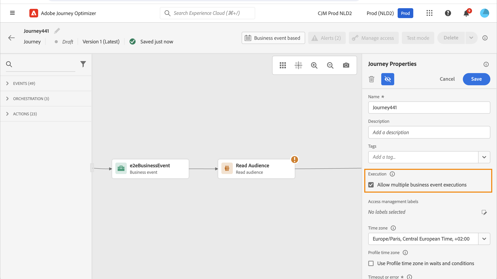

# 轮廓入口管理 {#entry-management}

用户档案入口管理取决于历程类型。

## 历程类型 {#types-of-journeys}

在Adobe Journey Optimizer中，可以使用以下类型的历程：

* **单一事件**&#x200B;历程：这些历程以单一事件开始。 收到事件后，关联的配置文件将进入旅程。 [了解详情](#entry-unitary)

* **业务事件**&#x200B;历程：这些历程首先是一个业务事件，随后是&#x200B;**读取受众**&#x200B;活动。 收到事件后，属于目标受众的用户档案将进入历程。 为每个用户档案创建一个此历程的实例。 [了解详情](#entry-business)

* **读取受众**&#x200B;历程：这些历程以&#x200B;**读取受众**&#x200B;活动开始。 执行历程时，属于目标受众的用户档案进入历程。 为每个用户档案创建一个此历程的实例。 这些历程可以是循环或“一次性”。 [了解详情](#entry-read-audience)

* **受众资格**&#x200B;历程：这些历程以受众资格事件开始。 这些历程侦听受众中用户档案的进出口。 发生此情况时，关联的配置文件将进入旅程。 [了解详情](#entry-unitary)

在所有历程类型中，同一历程中无法同时存在多个用户档案。 要检查人员是否在历程中，会将用户档案身份用作密钥。 系统不允许将相同的键（例如键`CRMID=3224`）放置在同一历程的不同位置。

## 单一事件和受众资格历程{#entry-unitary}

在&#x200B;**单一事件**&#x200B;和&#x200B;**受众资格**&#x200B;历程中，您可以启用或禁用重新进入：

* 如果启用了重新进入，则用户档案可以多次进入历程，但只有在完全退出历程的上一个实例后才能进入历程。

* 如果禁用重新进入，则用户档案无法在全局历程超时时间内多次进入同一历程。 请参阅此[部分](../building-journeys/journey-properties.md#global_timeout)。

默认情况下，历程允许重新进入。 激活&#x200B;**允许重新进入**&#x200B;选项时，将显示&#x200B;**重新进入等待期**&#x200B;字段。 它允许您定义允许用户档案再次进入历程之前的等待时间。 这可防止同一事件多次错误触发历程。默认情况下，字段设置为 5 分钟。最长持续时间为91天（[全局超时](journey-properties.md#global_timeout)）。

<!--
When a journey ends, its status is **[!UICONTROL Closed]**. New individuals can no longer enter the journey. Persons already in the journey automatically exit the journey. 
-->

在重新进入期间后，用户档案可以重新进入历程。 要避免此情况，并完全禁止这些用户档案的重新进入，您可以使用用户档案或受众数据，添加条件以测试是否已经输入用户档案。

<!--
Due to the 30-day journey timeout, when journey reentrance is not allowed, we cannot make sure the reentrance blocking will work more than 91 days. Indeed, as we remove all information about persons who entered the journey 91 days after they enter, we cannot know the person entered previously, more than 91 days ago. -->

## 业务历程 {#entry-business}

<!--
Business events follow reentrance rules in the same way as for unitary events. If a journey allows reentrance, the next business event will be processed.
-->

在&#x200B;**业务历程**&#x200B;中，要允许多个业务事件执行，请在历程属性的&#x200B;**[!UICONTROL 执行]**&#x200B;部分中激活相应的选项。

对于业务事件，对于给定历程，在1小时时间范围内重用首次执行时检索到的受众数据。

同一历程中可以同时存在多个用户档案，但不同业务事件的上下文中可能出现多个用户档案。

有关详细信息，请参阅此[部分](../event/about-creating-business.md)

## 读取受众历程 {#entry-read-audience}

**读取受众**&#x200B;历程可以是循环或“一次性”：

* 对于非定期/“一次性”历程：用户档案在历程中只进入一次。

* 对于定期历程：默认情况下，属于受众的所有用户档案都会在每次定期时进入历程。 必须先完成历程，然后才能在另一个事件中再次进入。

有两个选项可用于定期读取受众历程：

* **增量读取**&#x200B;选项：当具有定期&#x200B;**读取受众**&#x200B;的历程首次执行时，受众中的所有配置文件都会进入该历程。 利用此选项，可在首次发生后仅定向自上次执行历程以来进入受众的个人。

  >[!NOTE]
  >
  >如果您在历程中以[自定义上传受众](../audience/about-audiences.md#segments-in-journey-optimizer)为目标，则只有在循环历程中启用此选项时，才会在第一次循环时检索配置文件，因为这些受众已修复。

* **在重复时强制重入**：此选项允许您使历程中仍存在的所有用户档案在下次执行时自动退出它。 如果配置文件在此历程中的生命周期可能长于重复频率（例如，如果您使用等待活动），请勿激活此选项以确保配置文件可以完成其历程。

有关详细信息，请参阅此[部分](../building-journeys/read-audience.md#configuring-segment-trigger-activity)

<!--
After 91 days, a Read audience journey switches to the **Finished** status. This behavior is set for 91 days only (i.e. journey timeout default value) as all information about profiles who entered the journey is removed 91 days after they entered. Persons still in the journey automatically are impacted. They exit the journey after the 30 day timeout. 
-->
