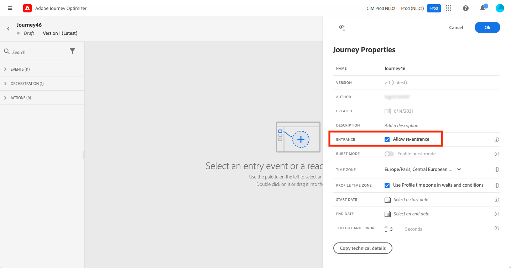

# 轮廓入口管理 {#entry-management}

>[!BEGINSHADEBOX]

**在此页面上：**&#x200B;了解用户档案进入和重新进入如何适用于每种类型的历程，以便您能够控制用户档案进入您的历程的时间和频率。

>[!ENDSHADEBOX]

用户档案入口管理取决于历程类型。

>[!TIP]
>
>寻找实际示例的实用指导？ 查看我们的[历程进入和退出标准综合指南](entry-exit-criteria-guide.md)，其中包括欢迎营销活动、放弃的购物车恢复和具有完整进入和退出配置示例的忠诚度计划等用例。

## 历程类型 {#types-of-journeys}

通过[!DNL Adobe Journey Optimizer]，您可以创建以下类型的历程：

* **单一事件**&#x200B;历程：这些历程以单一事件开始。 收到事件后，关联的配置文件将进入旅程。 [了解详情](#entry-unitary)

* **业务事件**&#x200B;历程：这些历程首先是一个业务事件，随后是&#x200B;**读取受众**&#x200B;活动。 收到事件后，属于目标受众的用户档案将进入历程。 为每个用户档案创建一个此历程的实例。 [了解详情](#entry-business)

* **读取受众**&#x200B;历程：这些历程以&#x200B;**读取受众**&#x200B;活动开始。 执行历程时，属于目标受众的用户档案进入历程。 为每个用户档案创建一个此历程的实例。 这些历程可以是循环或“一次性”。 [了解详情](#entry-read-audience)

* **受众资格**&#x200B;历程：这些历程以受众资格事件开始。 这些历程侦听受众中用户档案的进出口。 发生此情况时，关联的配置文件将进入旅程。 [了解详情](#entry-unitary)

[将所有历程类型与用例进行比较→](journey.md#journey-types)

在所有历程类型中，同一历程[&#128279;](publish-journey.md#journey-versions)的所有活动版本不能同时存在多个配置文件。 要检查人员是否在历程中，会将用户档案身份用作密钥。 系统不允许将相同的键（例如键`CRMID=3224`）放置在同一历程的不同位置。

## 历程处理率 {#journey-processing-rate}

历程处理速率受多个因素影响，这些因素决定了用户档案在旅程中的流动方式：

### 用户档案进入率 {#profile-entrance-rate}

用户档案输入历程的方式及其预期比率取决于使用的第一个活动：

* **读取受众**&#x200B;历程（批处理场景，您定位一个受众配置文件并触发该完整受众的历程）：最大值为20,000 TPS（每秒事务数）。 这是&#x200B;**沙盒级别**&#x200B;的可用配额。 如果在该沙盒中同时运行多个历程，则可能无法实现20,000 TPS。 请将此最大情况视为最佳情况。

* **受众资格**&#x200B;历程（单一场景，您希望在用户档案符合或不符合流式受众资格时触发历程）：最大为5,000 TPS。 请注意，这是以事件开始的历程的共享限制，还在&#x200B;**组织级别**&#x200B;的历程之间共享。

* **单一事件**&#x200B;历程（单一场景，您希望在从用户档案发出事件时触发历程）：与上述相同，都共享相同的5,000 TPS限制。 有关历程事件吞吐量的详细信息，请参阅[此部分](../event/about-events.md#event-thoughput)。

* **业务事件**&#x200B;历程（单一到批次方案，因为业务事件始终后跟读取受众）：业务事件计入5,000 TPS配额。 后续的读取受众活动与以读取受众(20,000 TPS)开始的历程具有相同的限制。

### 历程中的事件和受众资格 {#events-inside-journeys}

进入后，您可以在历程中使用&#x200B;**单一事件**&#x200B;或&#x200B;**受众资格**&#x200B;活动。 用户档案可以输入上述4种历程类型中的任意一种，并等待事件发出或等待此用户档案符合受众条件。 这些单一事件和受众资格将计入上述配额中。 例如：如果您以读取受众（最多20,000 TPS）开始历程，并在之后有一个事件，则此事件最多为5,000 TPS。

### 等待活动影响 {#wait-activities-impact}

历程中的&#x200B;**等待**&#x200B;活动也会影响在特定时间流经历程的用户档案数。 通常，等待活动基于相对时间（例如：在进入等待2小时后退出，因此所有用户档案都不会同时退出）。 但是，如果在该等待活动上定义了固定时间，则多个用户档案可能会同时退出该历程。 不建议采用这种做法。 随后可以看到大量流量，并且从此点开始TPS可以超过20,000 TPS。

### 操作活动 {#action-activities-impact}

最后，**操作**&#x200B;活动可能会受到来自历程的用户档案负载的影响，并且还会影响处理速度。 这些渠道包括电子邮件、短信和推送等本机渠道，以及自定义操作、跳至其他历程和更新用户档案活动。 例如，针对响应时间较长的外部端点的自定义操作将降低历程处理速度。

对于自定义操作，默认上限为每分钟300,000次调用，可使用自定义上限策略更改此值。 在[本节](../configuration/external-systems.md#capping)中了解有关自定义操作上限的更多信息。

## 单一事件和受众资格历程{#entry-unitary}

在&#x200B;**单一事件**&#x200B;和&#x200B;**受众资格**&#x200B;历程中，您可以启用或禁用重新进入：

* 如果启用了重新进入，则用户档案可以多次进入历程，但只有在完全退出历程的上一个实例后才能进入历程。

* 如果禁用重新进入，则用户档案无法在全局历程超时时间内多次进入同一历程。 请参阅此[部分](../building-journeys/journey-properties.md#global_timeout)。

默认情况下，历程允许重新进入。 激活&#x200B;**允许重新进入**&#x200B;选项时，将显示&#x200B;**重新进入等待期**&#x200B;字段。 它允许您定义允许用户档案再次进入历程之前的等待时间。 这可防止同一事件多次错误触发历程。 默认情况下，字段设置为 5 分钟。 最长持续时间为91天（[全局超时](journey-properties.md#global_timeout)）。

<!--
When a journey ends, its status is **[!UICONTROL Closed]**. New individuals can no longer enter the journey. Persons already in the journey automatically exit the journey. 
-->

在历程属性中

在重新进入期间后，用户档案可以重新进入历程。 要避免此情况，并完全禁止这些用户档案的重新进入，您可以使用用户档案或受众数据，添加条件以测试是否已经输入用户档案。

<!--
Due to the 30-day journey timeout, when journey reentrance is not allowed, we cannot make sure the reentrance blocking will work more than 91 days. Indeed, as we remove all information about persons who entered the journey 91 days after they enter, we cannot know the person entered previously, more than 91 days ago. 
-->

## 业务历程 {#entry-business}

<!--
Business events follow reentrance rules in the same way as for unitary events. If a journey allows reentrance, the next business event will be processed.
-->

在&#x200B;**业务历程**&#x200B;中，要允许多个业务事件执行，请在历程属性的&#x200B;**[!UICONTROL 执行]**&#x200B;部分中激活相应的选项。

历程配置中的

对于业务事件，对于给定历程，在1小时时间范围内重用首次执行时检索到的受众数据。

同一历程中可以同时存在多个用户档案，但不同业务事件的上下文中可能出现多个用户档案。

有关详细信息，请参阅此[部分](../event/about-creating-business.md)

## 读取受众历程 {#entry-read-audience}

**读取受众**&#x200B;历程可以是循环或非循环：

* 对于非循环历程：用户档案在历程中只输入一次。

* 对于定期历程：默认情况下，属于受众的所有用户档案都会在每次定期时进入历程。 必须先完成历程，然后才能在另一个事件中再次进入。

有几个选项可用于定期读取受众历程。 有关更多信息，请参阅[在历程中使用受众](../building-journeys/read-audience.md)部分。

<!--
After 91 days, a Read audience journey switches to the **Finished** status. This behavior is set for 91 days only (i.e. journey timeout default value) as all information about profiles who entered the journey is removed 91 days after they entered. Persons still in the journey automatically are impacted. They exit the journey after the 30 day timeout. 
-->

## 相关主题

* [历程进入和退出标准指南](entry-exit-criteria-guide.md) — 包含真实示例和最佳实践的完整指南
* [配置退出条件](journey-properties.md#exit-criteria) — 定义用户档案应何时离开您的历程
* [结束历程](end-journey.md) — 了解历程如何结束和结束
* [历程用例](jo-use-cases.md) — 查看包含登录和退出配置的完整示例

+++ AI知识参考

本节包含结构化知识，用于支持与本主题相关的解释、检索和问答。

要全面了解相关信息，应将此信息与本页上的文档相结合。 这两个源都不是独立的；页面描述了功能，而本节提供了其他上下文来帮助消除术语、意图、适用性和约束条件的歧义。

* **TL；DR：**&#x200B;本页介绍配置文件条目管理如何在Adobe Journey Optimizer中的四种历程类型中工作，包括吞吐量限制、重入设置以及等待和处理速率上的操作活动的行为。

**意图：**

* 了解每个历程类型（单一事件、业务事件、读取受众、受众资格）的进入行为和吞吐量限制
* 启用或禁用用户档案重新进入并配置重新进入等待期
* 允许为业务历程执行多个业务事件
* 确定等待活动和操作活动如何影响历程处理率
* 确保同一历程中不存在用户档案

**术语表：**

* **重新进入**：配置文件在先前退出后再次进入同一历程的功能；可使用等待期&#x200B;*（产品特定）*&#x200B;进行配置
* **重新进入等待期**：配置文件重新进入历程之前必须经过的最短时间；默认值为5分钟，最长为91天&#x200B;*（产品特定）*
* **TPS （每秒事务数）**：在历程&#x200B;*（产品特定）中可以输入或处理配置文件的吞吐率*
* **单一事件历程**：由一个事件触发的历程，该事件与一个用户档案&#x200B;*（产品特定）*&#x200B;关联
* **读取受众历程**：一次或按定期计划&#x200B;*（产品特定）*&#x200B;处理属于某个已定义受众的配置文件批次的历程
* **业务事件历程**：由针对受众的业务事件触发的历程，为每个配置文件&#x200B;*（产品特定）创建一个历程实例*
* **受众资格历程**：当配置文件实时&#x200B;*（产品特定）*&#x200B;进入或退出流受众时触发的历程

**护栏：**

* 配置文件不能在所有活动版本的同一历程中同时出现多次。
* 读取受众历程：沙盒级别最大20,000个TPS。
* 受众资格和单一事件历程：在组织级别共享的最多5,000个TPS。
* 业务事件计入5,000 TPS配额中；后续读取受众活动遵循20,000 TPS限制。
* 默认重新进入等待时间为5分钟；最长为91天（全局超时）。
* 固定时间等待活动可能会导致配置文件激增超过20,000 TPS，因此不建议这样做。
* 自定义操作的默认上限为每分钟300,000次调用。
* 对于业务历程，首次执行的受众数据会重复使用1小时。

**术语：**

* 规范名称：用户档案入口管理 — 首字母缩写：n/a — 变体：用户档案入口管理、历程入口
* 同义词： &quot;reentrance&quot; = &quot;re-entry&quot;
* 请勿混淆：“单一事件历程”≠“受众资格历程” — 都是单一场景，但触发方式不同（事件发送与受众成员身份更改）

**常见问题解答：**

* **问：用户档案可以同时进入同一历程两次吗？**  — 否，系统使用用户档案标识作为键，并防止同一用户档案同时位于同一历程的不同位置。
* **问：默认的重新进入等待期是多长时间？** — 5分钟，最多可配置91天。
* **问：读取受众历程进程每秒可以读取多少个配置文件？**  — 在沙盒级别最多可达20,000 TPS，但如果同一沙盒中同时运行多个历程，则可能无法实现此最大值。
* **问：具有固定时间的等待活动后，吞吐量会发生什么情况？**  — 多个用户档案可以同时退出等待，可能会超过20,000 TPS；建议使用相对时间等待活动以避免这种情况。
* **问：个人资料能否在业务历程中同时出现多次？**  — 可以，但仅限于不同的业务事件。

+++
