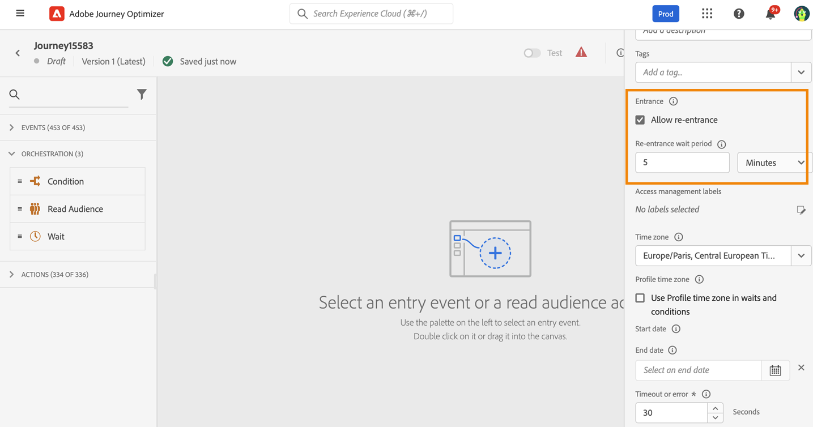

# 配置文件条目管理 {#entry-management}

默认情况下，新历程允许重新进入。 您可以取消选中“一次性”旅程的选项，例如，如果您希望在人员进入商店时提供一次性礼品。 在这种情况下，您不希望客户能够重新进入历程并再次收到选件。

历程结束时，其状态为 **[!UICONTROL 已关闭]**. 新个人再也无法进入旅程。 已在旅程中的人员正常完成旅程。

默认全局超时30天后，历程将切换到 **已完成** 状态。  [了解详情](journey-gs.md#global_timeout)。

## 单一历程{#entry-unitary}

单一历程（从事件或受众资格开始）包含护栏，可防止同一事件多次错误触发历程。 默认情况下，重新访问用户档案会被暂时阻止 5 分钟。例如，如果某个事件在 12:01 触发某个特定用户档案的历程，而另一个事件在 12:03 到达（无论是同一事件还是其他事件触发同一历程），则对于此用户档案，该历程将不会重新开始。

此外：

* 如果启用了重新进入，则用户档案可以多次进入历程，但只有在完全退出该历程的上一个实例后才能进入历程。

* 如果禁用了重新进入，则用户档案无法多次进入同一历程

## 读取受众历程{#entry-read-segment}

在读取受众历程中：

* 对于非循环历程：用户档案只进入历程一次。

* 对于周期性历程：如果个人资料处于受众/预期状态，则个人资料会在每次周期性时进入历程。 如果他仍然在上一次重复中处于旅程中，他将从头开始重新开始。

在商业事件历程中，从 **读取受众** 活动：了解此历程基于对业务事件的接收，如果个人资料符合预期受众的资格，他将进入收到的每个业务事件的历程，这意味着此个人资料可能在同一历程中同时多次，但在不同业务事件的上下文中。
