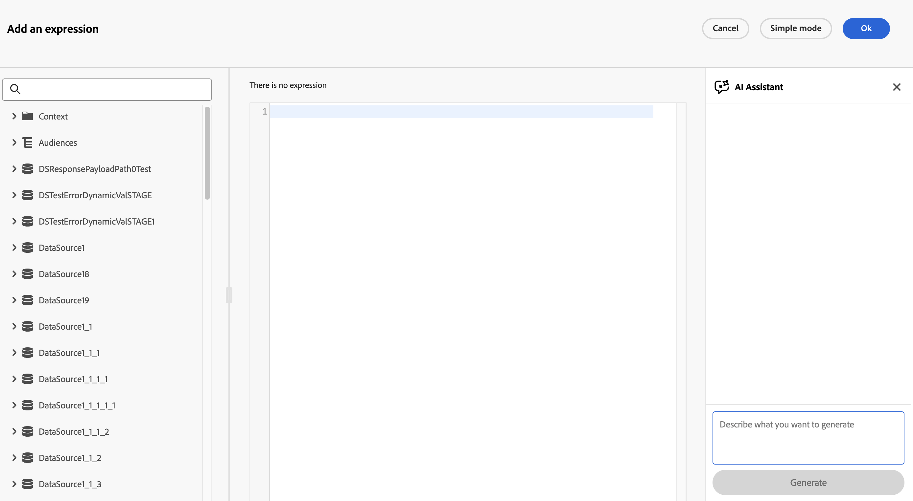

# 使用表达式助手生成表达式 {#expression-agent}

>[!CONTEXTUALHELP]
>id="journeyExpAI"
>title="使用表达式助手生成表达式"
>abstract="表达式助手使用生成式 AI 帮助您直接在历程高级表达式编辑器中构建和生成表达式。 例如，在条件、**优化**&#x200B;活动或使用自定义日期的&#x200B;**等待**&#x200B;活动中。 当您使用自然语言描述需求时，AI 助手会为您生成相应的表达式。"

>[!AVAILABILITY]
>
>此功能当前处于&#x200B;**公共测试版**&#x200B;中。 有关发行周期和可用性阶段的完整详细信息，请参阅 [Journey Optimizer 发行周期](../../rn/releases.md)。
>
>在使用Expression Assistant之前，请阅读适用于Journey Optimizer中的创作AI功能的相关[护栏和限制](../../content-management/gs-generative.md#generative-guardrails)。

Expression Assistant是历程高级表达式编辑器中内置的AI支持的功能。 它可帮助您从纯语言提示生成有效的表达式。

在历程&#x200B;**[!UICONTROL 高级表达式编辑器]**&#x200B;打开的任何位置，它都可用。 例如，当您在&#x200B;**[优化活动](../optimize.md)**&#x200B;中配置条件和路由时，或者当您配置使用自定义日期的[**[!UICONTROL 等待&#x200B;]**活动](../wait-activity.md)时，您需要一个`dateTimeOnly`表达式。

## 生成表达式 {#generate}

要使用“表达式助手”生成表达式，请执行以下操作：

1. 在历程中打开&#x200B;**[!UICONTROL 高级表达式编辑器]**，例如，从分支条件、**[!UICONTROL 优化]**&#x200B;活动或具有自定义日期的&#x200B;**[!UICONTROL 等待]**&#x200B;活动打开。

   

1. 在文本字段中，以纯语言描述要生成的表达式。 例如：

   * *“来自美国且年龄大于18岁的用户”*
   * *“过去30天内购买过的客户”*

   请参阅本页末尾的[示例提示](#example-prompts)以了解想法。

1. 单击&#x200B;**[!UICONTROL 生成]**&#x200B;提交提示。

   助理开始生成相应的表达式，并在生成过程中显示进度状态消息。

   >[!NOTE]
   >
   >如果助理无法生成有效的表达式（例如，如果提示引用了可用数据源中不存在的字段），则会显示错误消息。 发生这种情况时，请修改您的提示以使用历程配置中可用的字段名称和数据源，然后再次生成。

1. 表达式准备就绪后，在面板中查看结果。

   

   * 在申请前单击图标，以查看您请求的方案的助理输出。

   * 单击&#x200B;**[!UICONTROL 应用]**&#x200B;将生成的表达式直接插入高级表达式编辑器（与手动粘贴到的位置相同）。
   * 使用复制控件来获取建议的表达式文本，并根据需要将其粘贴到其他位置。

## 示例提示 {#example-prompts}

以下列表仅为提示性想法。 它们不显示生成的表达式语法，确切的输出取决于历程中定义的字段和活动。

### 历程事件和自定义操作 {#example-prompts-event-action}

* 订单价格合计大于100的&#x200B;*&quot;事件&quot;*
* *“过去7天内创建订单的事件”*
* *“事件类型为商业购买的事件”*
* *“过去一小时内已创建订单的事件”*
* 订单价格合计超过200的&#x200B;*&quot;事件和操作响应具有状态代码&quot;*

### 等待活动表达式 {#example-prompts-datetime}

当&#x200B;**[!UICONTROL 等待]**&#x200B;活动使用自定义日期时，您可以通过在&#x200B;**[!UICONTROL 高级表达式编辑器]**&#x200B;中生成`dateTimeOnly`表达式来定义配置文件继续的时间。 例如，来自配置文件属性、事件时间戳、区段资格数据或计算的来自当前时间的偏移。 有关如何配置自定义等待和适用的限制，请参阅[自定义等待](../wait-activity.md#custom)。

* *“将客户的上次订单日期仅用作日期时间”*
* *“使用同意电子邮件时间作为仅日期时间”*
* *“将区段成员资格的上次资格时间转换为仅日期时间”*
* *“等待节点：2024年圣诞节后一周作为仅日期时间”*
* *“等待节点：从现在起的30天下午10:00仅作为日期时间”*
* *&quot;在UTC时区中等到今天上午9点，仅返回为日期时间&quot;*

## 相关资源 {#related}

* [使用高级表达式编辑器](expressionadvanced.md) — 表达式编辑器界面和受支持语法的概述。
* [Journey Optimizer中的AI助手入门](../../content-management/gs-generative.md) — 创作AI功能的常规护栏、访问和设置。

+++ AI知识参考

本节包含结构化知识，用于支持与本主题相关的解释、检索和问答。

要全面了解相关信息，应将此信息与本页上的文档相结合。 这两个源都不是独立的；页面描述了功能，而本节提供了其他上下文来帮助消除术语、意图、适用性和约束条件的歧义。

* **TL；DR：**&#x200B;本页介绍Expression Assistant，它是历程高级表达式编辑器中的AI支持功能，可从纯语言提示生成有效的旅程表达式。

**意图：**

* 使用表达式助手从自然语言描述生成历程表达式
* 使用应用按钮将生成的表达式直接应用于高级表达式编辑器
* 在优化活动、条件活动和自定义日期等待活动中使用表达式助手
* 为基于事件的条件和`dateTimeOnly`等待表达式提供示例提示
* 通过修改提示以引用有效字段名称和数据源来排除生成失败的问题

**术语表：**

* **Expression Assistant**：嵌入在历程高级表达式编辑器中的AI支持的生成功能，可将纯语言提示转换为有效的历程表达式&#x200B;*（产品特定）*
* **高级表达式编辑器**：用于在条件、等待活动和操作参数映射&#x200B;*（产品特定）*&#x200B;中编写复杂表达式的Journey Optimizer接口
* **dateTimeOnly**：不带时区的日期时间表达式类型，自定义日期等待活动&#x200B;*（产品特定）*&#x200B;需要
* **优化活动**：支持分支条件的历程活动，可通过高级表达式编辑器&#x200B;*（特定于产品）进行配置*

**护栏：**

* Expression Assistant当前处于&#x200B;**公共测试版**&#x200B;中 — 可用性和行为可能会发生变化
* 主AI Assistant文档中的创作AI护栏和限制适用于此功能
* 如果助理引用了历程数据源中不存在的字段，则会返回错误 — 请修改提示以使用可用的字段名称
* 确切生成的表达式语法取决于特定历程中配置的字段和活动

**术语：**

* 规范名称：表达式助手 — 缩写：none — 变体：表达式AI，历程表达式生成器
* 同义词： &quot;Expression Assistant&quot; = &quot;AI表达式生成器&quot;
* 请勿混淆： Expression Assistant （AI支持的生成器）≠高级表达式编辑器（手动代码编辑器本身）

**常见问题解答：**

* **问：Expression Assistant在哪里可用？**  — 无论在何处打开历程高级表达式编辑器（包括“条件”活动、“优化”活动和具有自定义日期的“等待”活动），它都可用。
* **问：如果助理无法生成有效的表达式，会发生什么情况？**  — 出现错误消息；您应该修改提示以使用历程配置中存在的字段名称和数据源。
* **问：如何将生成的表达式插入编辑器？**  — 单击助理面板中的&#x200B;**应用**&#x200B;按钮，将其直接插入高级表达式编辑器的当前光标位置。
* **问：Expression Assistant能否为Wait活动生成`dateTimeOnly`表达式？**  — 是；例如，提示“从现在起30天的10 PM仅作为日期时间”生成相应的`dateTimeOnly`表达式。
* **问：表达式助手是否通常可用？**  — 否；目前处于公开测试阶段。 有关可用性更新，请查看Journey Optimizer发行周期页面。

+++
