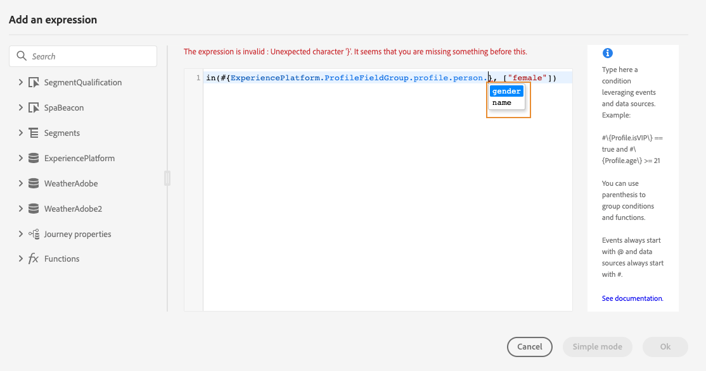

# 使用高级表达式编辑器 {#about-the-advanced-expression-editor}

>[!CONTEXTUALHELP]
>id="ajo_journey_expression_advanced"
>title="关于高级表达式编辑器"
>abstract="高级表达式编辑器可在界面的多个页面中构建高级表达式。 例如，您可以在配置和使用历程时以及在定义数据源条件时生成表达式。"

使用历程高级表达式编辑器在界面的各种屏幕中构建高级表达式。 例如，您可以在配置和使用历程时以及在定义数据源条件时生成表达式。

它还可在您每次需要定义需要特定数据操作的操作参数时使用。 您可以利用来自事件的数据或从数据源检索的其他信息。 在历程中，显示的事件字段列表是符合上下文的，并根据历程中添加的事件而有所不同。

高级表达式编辑器提供一组内置函数和运算符，让您处理值并定义一个专门满足您需求的表达式。 高级表达式编辑器还允许您定义外部数据源参数的值、处理映射字段和集合。

>[!NOTE]
>
>历程高级表达式编辑器中可用的功能和功能与[个性化编辑器](../../personalization/functions/functions.md)中可用的功能和功能不同。

## 访问高级表达式编辑器 {#accessing-the-advanced-expression-editor}

高级表达式编辑器可用于：

* 为数据源和事件信息创建[高级条件](../conditions.md#data_source_condition)
* 定义自定义[等待活动](../wait-activity.md#custom)
* 定义操作参数映射

如果可能，您可以使用&#x200B;**[!UICONTROL 高级模式]** / **[!UICONTROL 简单模式]**&#x200B;按钮在两种模式之间切换。 [此处](../conditions.md#about_condition)介绍了简单模式。

>[!NOTE]
>
>* 条件可以在简单或高级表达式编辑器中定义。 它们始终返回布尔类型。
>
>* 操作参数可以通过选择字段或通过高级表达式编辑器来定义。 他们根据表达式返回特定数据类型。

您可以通过不同方式访问高级表达式编辑器：

* 在创建数据源条件时，单击&#x200B;**[!UICONTROL 高级模式]**&#x200B;可访问高级编辑器。

  

* 创建自定义计时器时，系统将直接显示高级编辑器。
* 映射操作参数时，单击&#x200B;**[!UICONTROL 高级模式]**。

>[!NOTE]
>
>要使用自然语言提示生成历程表达式，请通过高级编辑器中的AI控件使用&#x200B;**[Expression Assistant](expression-agent.md)** （**公共beta**）。

## 探索界面 {#discovering-the-interface}

此屏幕允许您手动编写表达式。

屏幕左侧显示了可用字段和函数：

* **[!UICONTROL 事件]**：选择从入站事件接收的字段之一。 显示的事件字段列表是符合上下文的，并根据历程中添加的事件而有所不同。 [了解详情](../../event/about-events.md)

  >[!CAUTION]
  >
  >不支持使用体验事件创建表达式。 [此处](../../building-journeys/exp-event-lookup.md)引用了使用体验事件创建表达式/逻辑的替代方法和最佳实践

* **[!UICONTROL 受众]**：如果您已删除&#x200B;**[!UICONTROL 受众资格]**&#x200B;事件，请选择要在表达式中使用的受众。 [了解详情](../conditions.md#using-a-segment)
* **[!UICONTROL 数据源]**：从数据源的字段组提供的字段列表中进行选择。 [了解详情](../../datasource/about-data-sources.md)
* **[!UICONTROL 历程属性]**：此部分重新分组与给定用户档案的历程相关的技术字段。 [了解详情](journey-properties.md)
* **[!UICONTROL 函数]**：从允许执行复杂筛选的内置函数列表中进行选择。 函数按类别组织。 [了解详情](functions.md)

自动完成机制会显示上下文建议。

语法验证机制检查代码的完整性。 错误显示在编辑器顶部。

>[!TIP]
>
>在高级表达式编辑器中创建条件时，请确保表达式不包含隐藏或不可打印的字符。 此外，使用单行表达式以避免分析错误。

**使用高级表达式编辑器构建条件时需要参数**

如果您从外部数据源中选择需要调用参数的字段（请参阅[此页面](../../datasource/external-data-sources.md)），则右侧将显示一个新选项卡，允许您指定此参数。 参数值可能来自位于历程或Experience Platform数据源中的事件（而非其他外部数据源）。 例如，在与天气相关的数据源中，常用的参数将为“city”。 因此，必须选择要获取此城市参数的位置。 还可以将函数应用于参数以执行格式更改或连接。

对于更复杂的用例，如果要在主表达式中包含数据源的参数，可以使用“params”关键字定义其值。 请参阅[此页](../expression/field-references.md)。

+++ AI知识参考

本节包含结构化知识，用于支持与本主题相关的解释、检索和问答。

要全面了解相关信息，应将此信息与本页上的文档相结合。 这两个源都不是独立的；页面描述了功能，而本节提供了其他上下文来帮助消除术语、意图、适用性和约束条件的歧义。

* **TL；DR：**&#x200B;本页介绍了历程高级表达式编辑器 — 其访问点、界面面板，以及使用事件、数据源、函数和运算符构建复杂条件、自定义等待计时器和操作参数映射的功能。

**意图：**

* 从数据源条件、自定义等待活动或操作参数映射访问高级表达式编辑器
* 使用事件字段、数据源字段、受众成员资格和历程属性构建高级布尔条件
* 配置条件时在简单模式和高级模式之间切换
* 使用`params`关键字直接在主表达式中引用外部数据源参数
* 使用AI支持的表达式助手从自然语言提示生成表达式

**术语表：**

* **高级表达式编辑器**：用于编写复杂表达式的Journey Optimizer代码编辑器；与较简单的点击式条件编辑器&#x200B;*（特定于产品）*&#x200B;不同
* **简单模式**：点击式条件编辑器；比高级编辑器灵活，但更易于非开发人员&#x200B;*（产品特定）*
* **历程属性**：可在表达式编辑器&#x200B;*（产品特定）中访问的有关历程实例（ID、版本、错误、当前节点）的技术字段*
* **Expression Assistant**：高级编辑器中的AI支持的工具（公共测试版），它从纯语言提示&#x200B;*（产品特定的）*&#x200B;生成表达式

**护栏：**

* 不支持直接使用体验事件创建表达式 — 请使用其他方法，例如计算属性
* 无论编辑器模式如何，条件始终返回布尔类型
* 表达式不得包含隐藏或不可打印的字符，并且应使用单行格式以避免分析错误
* 外部数据源参数值只能来自历程事件或Experience Platform数据源，不能来自其他外部数据源
* 高级表达式编辑器的功能与个性化编辑器中的功能不同

**术语：**

* 规范名称：高级表达式编辑器 — 首字母缩略词：none — 变体：高级编辑器，表达式编辑器
* 同义词：“高级模式”=“高级表达式编辑器”
* 请勿混淆：高级表达式编辑器（历程条件/操作）≠个性化编辑器（消息内容个性化）

**常见问题解答：**

* **问：何时必须使用高级表达式编辑器而不是简单模式？**  — 当您需要查询收藏集、使用函数、引用历程属性或构建简单编辑器无法表达的多条件逻辑时，请使用高级编辑器。
* **问：如何将参数传递到表达式中的外部数据源？**  — 在表达式语法中使用`params`关键字，如`#{DataSource.fieldGroup.field, params: {paramName: value}}`。
* **问：自动完成机制有什么作用？**  — 它会在您键入时显示上下文字段和函数建议，从而帮助您更快地构建有效表达式。
* **问：访问Expression Assistant的位置？**  — 通过高级表达式编辑器中的AI控件；它当前处于公共测试阶段。
* **问：高级编辑器中的条件是否返回与简单模式不同的类型？**  — 否；条件始终在这两种模式下返回布尔值。

+++
