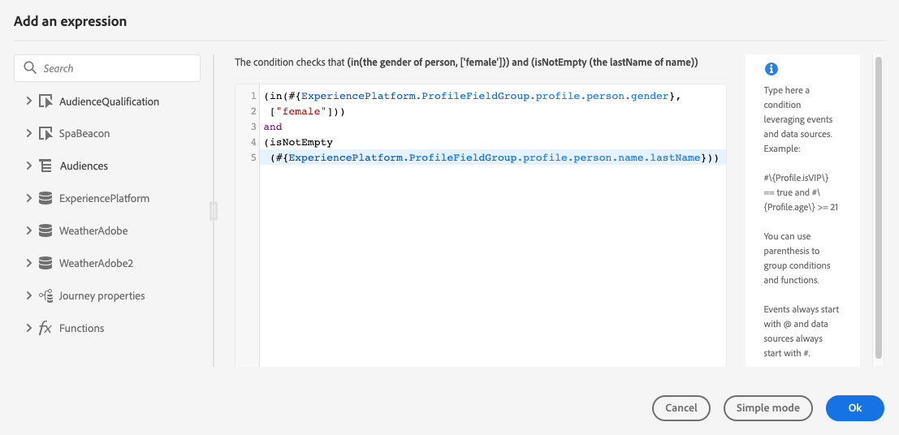

# 使用高级表达式编辑器 {#about-the-advanced-expression-editor}

>[!CONTEXTUALHELP]
>id="ajo_journey_expression_advanced"
>title="关于高级表达式编辑器"
>abstract="使用高级表达式编辑器可以在界面的各个屏幕中生成高级表达式。例如，您可以在配置和使用历程时以及在定义数据源条件时生成表达式。"

使用Journey高级表达式编辑器可在界面的各种屏幕中构建高级表达式。 例如，您可以在配置和使用历程时以及在定义数据源条件时生成表达式。

它还可在您每次需要定义需要特定数据操作的操作参数时使用。您可以利用来自事件的数据或从数据源检索的其他信息。在历程中，显示的事件字段列表是符合上下文的，并根据历程中添加的事件而有所不同。

高级表达式编辑器提供一组内置函数和运算符，让您处理值并定义一个专门满足您需求的表达式。高级表达式编辑器还允许您定义外部数据源参数的值、处理映射字段和集合，如体验事件。

>[!NOTE]
>
>Journey高级表达式编辑器中提供的功能和能力与[个性化编辑器](../../personalization/functions/functions.md)中提供的功能和能力不同。

## 访问高级表达式编辑器 {#accessing-the-advanced-expression-editor}

高级表达式编辑器可用于：

* 为数据源和事件信息创建[高级条件](../condition-activity.md#about_condition)
* 定义自定义[等待活动](../wait-activity.md#custom)
* 定义操作参数映射

如果可能，您可以使用&#x200B;**[!UICONTROL 高级模式]**/**[!UICONTROL 简单模式]**&#x200B;按钮在两个模式之间切换。 [此处](../condition-activity.md#about_condition)介绍了简单模式。

>[!NOTE]
>
>* 条件可以在简单或高级表达式编辑器中定义。它们始终返回布尔类型。
>
>* 操作参数可以通过选择字段或通过高级表达式编辑器来定义。他们根据表达式返回特定数据类型。

您可以通过不同方式访问高级表达式编辑器：

* 创建数据源条件时，可通过单击&#x200B;**[!UICONTROL 高级模式]**&#x200B;访问高级编辑器。

  

* 创建自定义计时器时，系统将直接显示高级编辑器。
* 映射操作参数时，单击&#x200B;**[!UICONTROL 高级模式]**。

## 探索界面 {#discovering-the-interface}

此屏幕允许您手动编写表达式。

屏幕左侧显示了可用字段和函数：

* **[!UICONTROL 事件]**：选择从入站事件接收的字段之一。 显示的事件字段列表是基于上下文的，并且根据在旅程中添加的事件而有所不同。 [了解详情](../../event/about-events.md)

  >[!CAUTION]
  >
  >支持在Journey表达式/条件中使用体验事件，但不建议这样做。 如果您的用例需要使用体验事件，请考虑其他方法，例如[计算属性](../../audience/computed-attributes.md)，或者使用事件创建段并将该段合并到[`inAudience`表达式](../../building-journeys/functions/functioninaudience.md)中。

* **[!UICONTROL 受众]**：如果您已删除&#x200B;**[!UICONTROL 受众资格]**&#x200B;活动，请选择要在表达式中使用的受众。 [了解详情](../condition-activity.md#using-a-segment)
* **[!UICONTROL 数据源]**：从数据源的字段组中可用的字段列表中进行选择。 [了解详情](../../datasource/about-data-sources.md)
* **[!UICONTROL 旅程属性]**：此部分将与给定配置文件的旅程相关的技术字段重新分组。 [了解详情](journey-properties.md)
* **[!UICONTROL 函数]**：从允许执行复杂筛选的内置函数列表中进行选择。 函数按类别进行组织。 [了解详情](functions.md)

自动完成机制会显示上下文建议。

语法验证机制检查代码的完整性。错误显示在编辑器顶部。

>[!TIP]
>
>在高级表达式编辑器中创建条件时，请确保表达式不包含隐藏或不可打印的字符。 此外，使用单行表达式以避免分析错误。

**使用高级表达式编辑器构建条件时需要参数**

如果从需要调用参数的外部数据源中选择字段（请参阅[此页](../../datasource/external-data-sources.md)），则右侧会出现一个新的选项卡，用于指定此参数。 参数值可以来自位于历程或Experience Platform数据源中的事件（而不是来自其他外部数据源）。 例如，在与天气相关的数据源中，常用的参数将为“city”。因此，必须选择要获取此城市参数的位置。还可以将函数应用于参数以执行格式更改或连接。

对于更复杂的用例，如果要在主表达式中包含数据源的参数，可以使用“params”关键字定义其值。请参阅[此页](../expression/field-references.md)。
