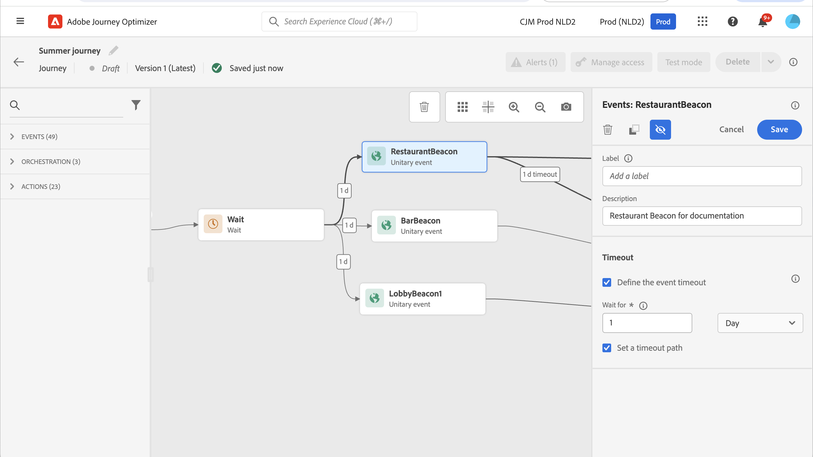

# 一般事件 {#general-events}

>[!CONTEXTUALHELP]
>id="ajo_journey_event_custom"
>title="单一事件"
>abstract="事件允许您统一触发历程，向流入历程的个人实时发送消息。对于此类事件，只能添加标签和描述。事件配置由数据工程师执行，不可编辑。"

事件允许您统一触发历程，向流入历程的个人实时发送消息。

对于此类事件，只能添加标签和描述。配置的其他部分无法编辑。 该操作由技术用户执行。 请参阅[此页](../event/about-events.md)。

删除业务事件时，会自动添加 **读取受众** 活动。 有关业务事件的详细信息，请参阅 [本节](../event/about-events.md)

## 在特定时间监听事件 {#events-specific-time}

位于历程中的事件活动可无限期地侦听事件。 要仅在特定时间内侦听事件，必须为事件配置超时。

然后，该历程将在超时指定的时间内侦听事件。 如果在该时间段内收到事件，则该人员将流入事件路径。 如果没有，则客户将流入超时路径（如果已定义），或将继续该历程。

如果未定义超时路径，则超时设置将充当等待活动，从而使配置文件等待一段时间，如果事件发生在该等待结束之前，则该时间可能会停止。 如果要在超时后从历程中排除用户档案，则必须设置超时路径。

要为事件配置超时，请执行以下步骤：

1. 激活 **[!UICONTROL 定义事件超时]** 事件属性中的选项。

1. 指定历程将等待事件的时间量。 最长持续时间为29天。

1. 如果在指定的超时内未收到任何事件时要将个人发送到超时路径中，请启用 **[!UICONTROL 设置超时路径]** 选项。 如果未启用此选项，则到达超时后个人将继续历程。 我们再次命令您始终启用 **设置超时路径** 选项。

   

在此示例中，历程在客户进入大厅后向客户发送第一封欢迎电子邮件。 然后，仅当客户在隔天进入餐厅时，它才会发送餐饮折扣电子邮件。 因此，我们将restaurant事件配置为1天超时：

* 如果在欢迎电子邮件后不到1天收到餐厅事件，则发送餐饮折扣电子邮件。
* 如果在第二天未收到餐馆事件，则该人员将流过超时路径。

请注意，如果要对位于之后的多个事件配置超时， **[!UICONTROL 等待]** 活动，您只需在这些事件之一上配置超时。

定义的超时适用于以下时间之后放置的所有事件： **[!UICONTROL 等待]** 活动：

* 如果在超时持续时间内接收了一个事件，则单个事件将流入接收事件的路径。
* 如果在超时持续时间内未收到任何事件，则单个事件将流入已定义超时的事件的超时分支。

