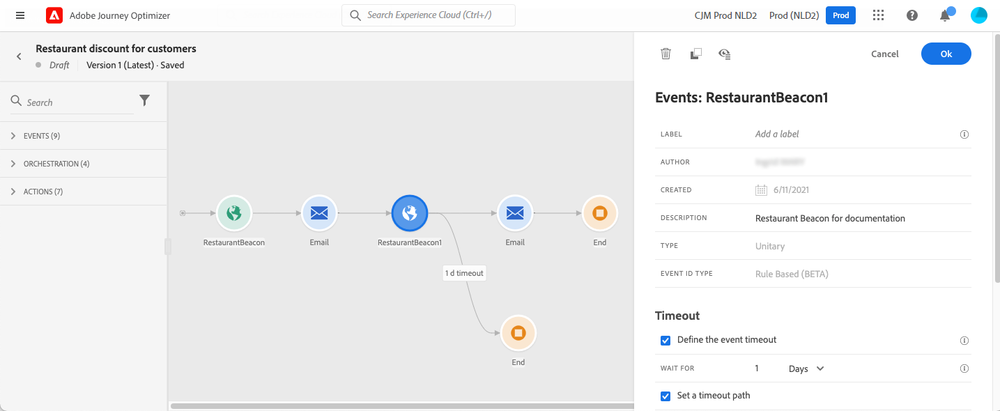

# 一般事件 {#general-events}

>[!BEGINSHADEBOX]

**在此页面上：**&#x200B;了解如何使用常规事件统一实时触发历程，并配置事件超时和超时路径以仅在定义的时段内侦听事件。

>[!ENDSHADEBOX]

>[!CONTEXTUALHELP]
>id="ajo_journey_event_custom"
>title="单一事件"
>abstract="事件允许您统一触发历程，向流入历程的个人实时发送消息。 对于此类事件，只能添加标签和描述。 事件配置由数据工程师执行，不可编辑。"

>[!CONTEXTUALHELP]
>id="ajo_journey_event_business_canvas"
>title="业务事件"
>abstract="这些事件允许您使用非轮廓相关事件启动历程。 当该事件触发时，您将能够向轮廓受众发送消息。 对于此类事件，只能添加标签和描述。 事件配置由技术用户执行，不可编辑。"

事件允许您统一触发历程，向流入历程的个人实时发送消息。

对于此类事件，只能添加标签和描述。 配置的其他部分无法编辑。 该操作由技术用户执行。 请参阅[此页](../event/about-events.md)。

在[本节](entry-management.md#journey-processing-rate)中了解有关事件吞吐量和历程处理率的更多信息。

删除业务活动时，该活动会自动添加&#x200B;**读取受众**&#x200B;活动。 有关业务活动的详细信息，请参阅[此部分](../event/about-events.md)

## 在特定时间监听事件 {#events-specific-time}

位于历程中的事件活动可无限期地侦听事件。 要仅在特定时间内侦听事件，必须为事件配置超时。

然后，该历程将在超时指定的时间内侦听事件。 如果在该时间段内收到事件，则该人员将流入事件路径。 如果没有，则客户将流入超时路径（如果已定义），或将继续该历程。

如果未定义超时路径，则超时设置将充当等待活动，从而使配置文件等待一段时间，如果事件发生在该等待结束之前，则该时间可能会停止。 如果要在超时后从历程中排除用户档案，则必须设置超时路径。

要为事件配置超时，请执行以下步骤：

1. 从事件属性激活&#x200B;**[!UICONTROL 定义事件超时]**&#x200B;选项。

1. 指定历程将等待事件的时间量。 最长持续时间为&#x200B;**90天**。

1. 如果在指定的超时时间内未收到任何事件，则最佳实践是将个人发送到超时路径中。 为此，启用&#x200B;**[!UICONTROL 设置超时路径]**&#x200B;选项。 在这种情况下，一旦达到超时，个人将继续该历程。 我们建议您始终启用&#x200B;**[!UICONTROL 设置超时路径]**&#x200B;选项。

   

在此示例中，历程在客户进入大厅后向客户发送第一封欢迎电子邮件。 然后，仅当客户在隔天进入餐厅时，它才会发送餐饮折扣电子邮件。 因此，我们将restaurant事件配置为1天超时：

* 如果在欢迎电子邮件后不到1天收到餐厅事件，则发送餐饮折扣电子邮件。
* 如果在第二天未收到餐馆事件，则该人员将流过超时路径。

请注意，如果要在&#x200B;**[!UICONTROL 等待]**&#x200B;活动之后放置的多个事件上配置超时，则只需在这些事件之一上配置超时。

定义的超时适用于位于&#x200B;**[!UICONTROL 等待]**&#x200B;活动之后的所有事件：

* 如果在超时持续时间内收到一个事件，则单个事件将流入所接收事件的路径。
* 如果在超时持续时间内未收到任何事件，则单个事件将流入已定义超时的事件的超时分支。

+++ AI知识参考

本节包含结构化知识，用于支持与本主题相关的解释、检索和问答。

要全面了解相关信息，应将此信息与本页上的文档相结合。 这两个源都不是独立的；页面描述了功能，而本节提供了其他上下文来帮助消除术语、意图、适用性和约束条件的歧义。

* **TL；DR：**&#x200B;本页介绍如何在历程中使用常规（单一和商业）事件来触发实时的单个级别消息投放，包括如何配置事件超时和超时路径。

**意图：**
* 将常规事件活动添加到历程画布以触发实时配置文件条目
* 配置事件超时以限制历程侦听事件的时间
* 设置超时路径以处理不会及时触发预期事件的配置文件
* 区分单一事件和业务事件，并了解何时自动添加每个事件
* 将事件超时与等待活动结合使用，以控制多事件超时行为

**术语表：**
* **单一事件**：一次触发一个人历程的事件，实时&#x200B;*（产品特定）*
* **业务事件**：与配置文件无关的事件，它触发配置文件受众的历程，自动添加读取受众活动&#x200B;*（产品特定）*
* **事件超时**：可配置的持续时间（最多90天），在此之后历程停止等待特定事件，并将配置文件路由到超时路径&#x200B;*（产品特定）*
* **超时路径**：在超时窗口&#x200B;*（特定于产品）*&#x200B;内未收到预期事件时，配置文件将遵循的可选历程分支

**护栏：**
* 事件标签和描述是画布上常规事件的唯一可编辑字段；所有其他配置由技术用户执行，无法从历程中进行更改
* 最长事件超时持续时间为90天
* 当多个事件跟随“等待”活动时，必须仅对这些事件中的一个事件配置超时；定义的超时随后将应用于“等待”活动之后的所有事件
* 如果未定义超时路径，则超时将充当等待活动；未收到事件的配置文件将保留在历程中，直到超时为止

**术语：**
* 规范名称：常规事件 — 首字母缩写：none — 变体：单一事件、自定义事件
* 同义词： &quot;general event&quot; = &quot;unitary event&quot;（在画布活动的上下文中）
* 请勿混淆：“业务事件”≠“单一事件” — 业务事件以用户档案的受众为目标，而单一事件以单个个人为目标

**常见问题解答：**
* **问：我是否可以从历程画布更改事件配置？**  — 否；只能在画布上编辑标签和描述。 完整事件配置由技术用户设置，无法从历程中修改。
* **问：如果在超时过期之前未收到任何事件，会发生什么情况？**  — 如果定义了超时路径，则配置文件将流入该路径。 如果未设置超时路径，则超时的行为类似于等待活动，并且配置文件在超时时间后继续历程。
* **问：最长事件超时持续时间是多少？** —90天。
* **问：何时应启用超时路径选项？**  — 如果您希望配置文件在超时后退出该分支，请始终启用该功能；如果没有超时路径，配置文件将保留在历程中等待事件。
* **问：业务事件与历程画布中的单一事件有何不同？**  — 删除业务事件会自动添加读取受众活动，因为业务事件同时针对多个用户档案，而不是单个用户。

+++
