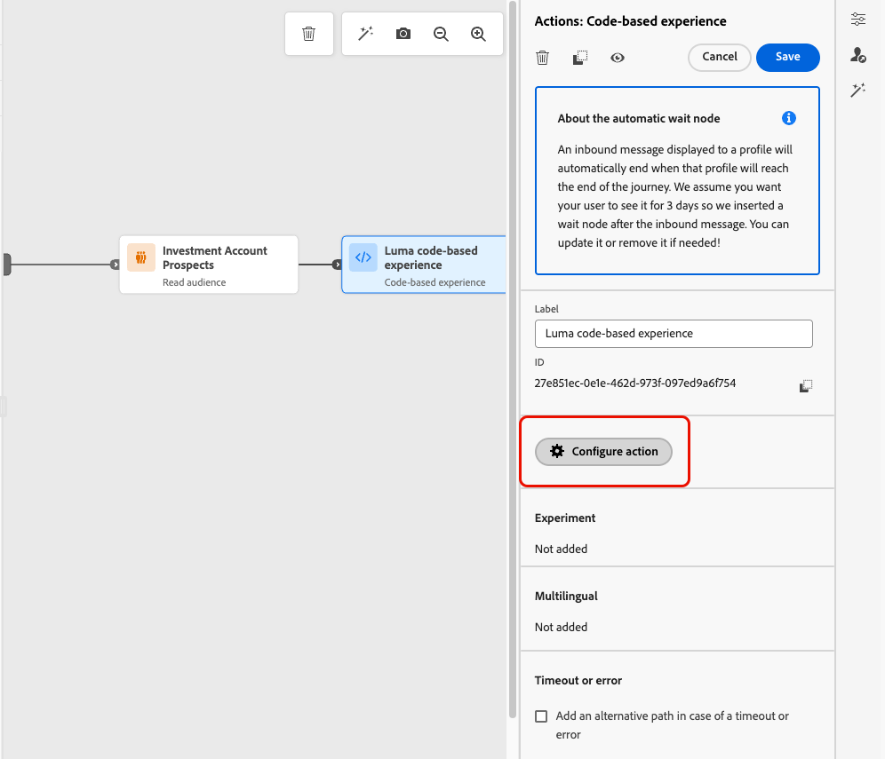
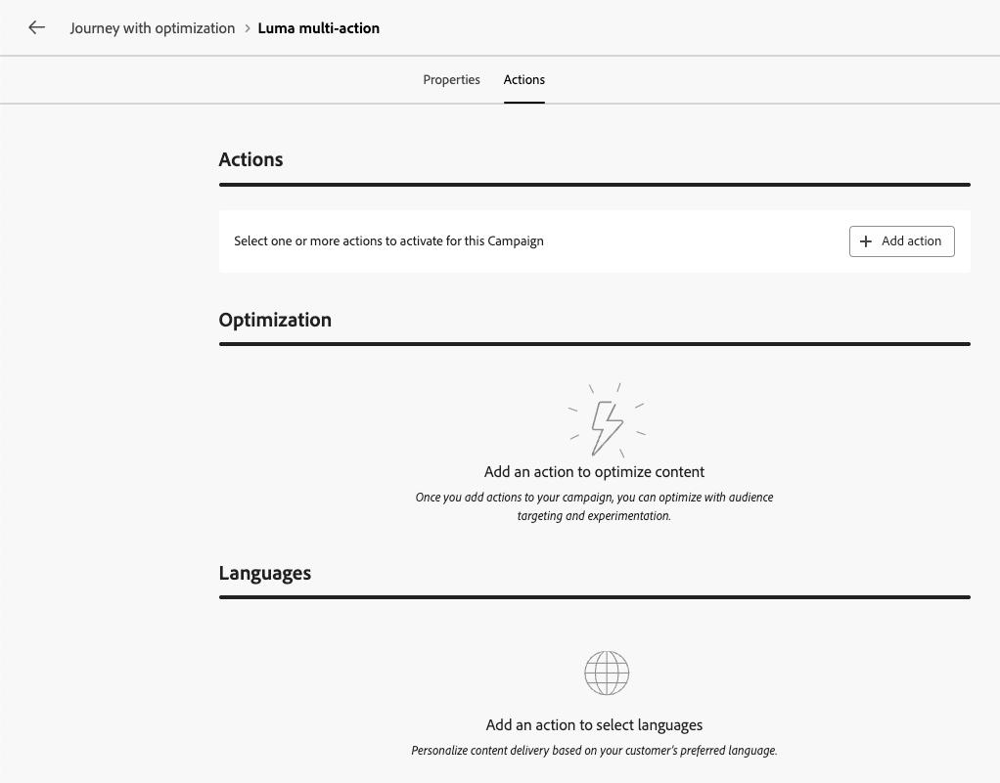

# 使用操作活动 {#add-a-message-in-a-journey}

>[!CONTEXTUALHELP]
>id="ajo_action_activity"
>title="操作活动"
>abstract="**操作**&#x200B;活动允许您配置单个原生渠道操作以及多个入站活动，并可为任何内置渠道操作添加优化。"

**操作**&#x200B;活动是历程画布中所有渠道操作的单一入口点。

它取代了以前的各个内置渠道活动，并将电子邮件、推送、短信、应用程序内、Web、基于代码的体验和内容卡整合到一个统一的活动类型中。

使用它可以：

* 从单个简化的界面配置任何内置渠道操作。
* 构建多操作入站操作组。
* 将优化应用于任何渠道操作。

>[!NOTE]
>
>您还可以设置自定义操作以在[!DNL Journey Optimizer]中发送消息。 [了解详情](#recommendation)

## 关于旧版渠道活动

从2026年3月版本&#x200B;**起，已弃用旧版本机渠道活动（电子邮件、推送、短信、应用程序内、Web、基于代码的体验和内容卡）。**

使用这些活动的现有历程可以继续工作，且不会发生任何更改 — 无需迁移。

在以下情况下，旧版本机渠道活动也会保留：

* **复制历程** — 复制的历程继续使用旧版活动。 您可以按原样编辑和发布；无需迁移。
* **创建新历程版本** — 新版本继续使用旧版活动。 您可以按原样编辑和发布；无需迁移。
* **在历程中复制并粘贴旧版活动** — 粘贴的活动仍然是旧版活动。 您可以按原样编辑和发布它们；无需迁移。

## 将内置渠道操作添加到历程  {#add-action}

要使用&#x200B;**[!UICONTROL 操作]**&#x200B;活动将内置渠道操作添加到历程，请执行以下步骤。

>[!NOTE]
>
>有关历程中可用渠道的更多信息，请参阅本节中的表：[历程和营销活动中的渠道](../channels/gs-channels.md#channels)。

1. 通过[事件](general-events.md)或[读取受众](read-audience.md)活动开始您的历程。

1. 从调色板的&#x200B;**[!UICONTROL 操作]**&#x200B;部分，将&#x200B;**[!UICONTROL 操作]**&#x200B;活动拖放到画布中。

1. 选择要在历程中利用的内置渠道活动。

   

1. 向操作添加标签并选择&#x200B;**[!UICONTROL 配置操作]**。

   {width="80%"}

1. 您将被定向到历程操作配置屏幕的&#x200B;**[!UICONTROL 操作]**&#x200B;选项卡。

   选择要用于所选渠道的配置。

   “管理”菜单中的

1. 如果您选择了入站渠道，则可以添加多个操作。 [了解详情](#multi-action)

1. 根据选定的渠道配置活动。 详细配置指南可在以下链接中找到。

   * 了解创建叫客操作的详细步骤，如下所示：

     <table style="table-layout:fixed">
      <tr style="border: 0;">
      <td>
      
      
<a href="../email/create-email.md"><strong>创建电子邮件</strong>
      

      

      </td>
      <td>
      
      

      <a href="../push/create-push.md"><strong>创建推送通知<strong></a>
      

      

      </td>
      <td>
      
      

      <a href="../sms/create-sms.md"><strong>创建短信(SMS/MMS)</strong></a>
      

      

      </td>
      </tr>
      </table>

   * 了解创建集客操作的详细步骤，如下所示：

     <table style="table-layout:fixed">
      <tr style="border: 0;">
      <td>
      
      
<a href="../in-app/create-in-app.md"><strong>创建应用程序内消息</strong>
      

      

      </td>
      <td>
      
      
<a href="../web/create-web.md"><strong>创建Web体验</strong>
      

      

      </td>
      <td>
      
      
<a href="../content-card/create-content-card.md"><strong>创建内容卡</strong>
      

      

      </td>
      <td>
      
      

      <a href="../code-based/create-code-based.md"><strong>创建基于代码的体验<strong></a>
      

      

      </td>
      </tr>
      </table>

   >[!NOTE]
   >
   >* 每个入站体验操作都附带3天&#x200B;**等待**&#x200B;活动。 [了解详情](wait-activity.md#auto-wait-node)
   >
   >* 对于电子邮件和推送通知，您可以启用发送时间优化。 [了解详情](send-time-optimization.md)

1. 根据活动，您可以显示特定于所选渠道的高级参数，并覆盖某些默认值，如执行地址。 [了解详情](about-journey-activities.md#advanced-parameters)

   >[!NOTE]
   >
   >如果高级参数已隐藏，请单击右窗格顶部的&#x200B;**[!UICONTROL 显示只读字段]**&#x200B;按钮。

1. 使用&#x200B;**[!UICONTROL 优化]**&#x200B;部分运行内容实验、利用定位规则，或使用实验和定位的高级组合。

   [此部分](../content-management/gs-message-optimization.md)中详细说明了这些不同的选项以及要遵循的步骤。

1. 使用&#x200B;**[!UICONTROL 语言]**&#x200B;部分在历程操作中创建多种语言的内容。 要进行此操作，请单击&#x200B;**[!UICONTROL 添加语言]**&#x200B;按钮，然后选择所需的&#x200B;**[!UICONTROL 语言设置]**。

   有关如何设置和使用多语言功能的详细信息，请参阅[此部分](../content-management/multilingual-gs.md)。

根据所选通信渠道，可以使用其他设置。 展开以下部分以获取更多信息。

+++**应用上限规则**（电子邮件、推送、短信）

在&#x200B;**[!UICONTROL 业务规则]**&#x200B;下拉列表中，选择一个规则集以将上限规则应用于历程操作。

利用渠道规则集，可设置按通信类型划分的频率封顶，以防止消息类似的客户超载。

[了解如何使用规则集](../conflict-prioritization/rule-sets.md)

+++

+++**跟踪参与情况**（电子邮件、短信）。

使用&#x200B;**[!UICONTROL 操作跟踪]**&#x200B;部分，跟踪收件人对电子邮件或短信投放的反应。

一旦执行历程，即可从历程报表访问跟踪结果。

[了解有关历程报告的更多信息](../reports/journey-global-report-cja.md)

+++

+++**启用快速传递模式** （推送）。

快速投放模式是一个 [!DNL Journey Optimizer] 附加组件，允许通过营销活动以非常快的速度发送大量推送消息。

如果消息投放延迟对业务有重大影响，并且您想要在手机上发送紧急推送警报（例如，向已安装新闻频道应用程序的用户发送突发新闻），可使用快速投放。

了解如何在此页面[&#128279;](../push/create-push.md#rapid-delivery)上为推送通知启用快速传递模式。

有关使用快速传递模式时性能的详细信息，请参阅[[!DNL Adobe Journey Optimizer] 产品描述](https://helpx.adobe.com/cn/legal/product-descriptions/adobe-journey-optimizer.html){target="_blank"}。

+++

+++**分配优先级得分**（Web、应用程序内、基于代码）

在&#x200B;**[!UICONTROL 冲突管理]**&#x200B;部分中，您可以为历程操作分配优先级得分，这样您便可以在存在多个历程操作或使用相同渠道配置的营销活动时为集客操作设置优先级。

在默认情况下，操作的优先级分数从历程的总体优先级分数继承。

[了解如何为渠道操作分配优先级得分](../conflict-prioritization/priority-scores.md#priority-action)

+++

+++**设置其他投放规则**（内容卡片）

对于内容卡历程，您可以启用其他投放规则以选择触发消息的事件和条件。

[了解如何创建内容卡片](../content-card/create-content-card.md)

+++

+++**定义触发器**（应用程序内）

对于应用程序内消息，您可以使用&#x200B;**[!UICONTROL 编辑触发器]**&#x200B;按钮选择触发消息的事件和条件。

[了解如何创建应用程序内消息](../in-app/create-in-app.md)

+++

## 添加多个入站操作 {#multi-action}

>[!CONTEXTUALHELP]
>id="ajo_multi_action_journey"
>title="添加多个入站操作"
>abstract="您可以在一个历程中选择多个入站操作。 此功能使您能够同时向不同地点传递多个基于代码的体验、应用程序内消息、内容卡或 Web 操作，每个操作包含一个特定的内容。"

为了简化旅程编排，您可以在单个旅程操作中定义多个入站操作。

>[!NOTE]
>
>此容量仅适用于入站渠道。 不支持当前出站渠道，如电子邮件。

利用此功能，您可以向不同位置同时交付各种基于代码的体验、应用程序内消息、内容卡或Web操作，而无需创建多个历程操作。 它将所有数据整合到一个历程中，使历程的部署更轻松，并允许更流畅的报告。

例如，您可以将基于代码的体验发送到内容略有不同的多个端点。 为此，请在同一历程操作中创建多个基于代码的操作，每个操作具有不同的端点配置。

要在单个历程操作节点中定义多个入站操作，请执行以下步骤。

1. 通过[事件](general-events.md)或[读取受众](read-audience.md)活动开始您的历程。

1. 从调色板的&#x200B;**[!UICONTROL 操作]**&#x200B;部分，将&#x200B;**[!UICONTROL 操作]**&#x200B;活动拖放到画布中。

1. 选择&#x200B;**[!UICONTROL 多项操作]**&#x200B;作为操作类型。

   在编排下的历程调色板中

1. 根据需要添加标签并选择&#x200B;**[!UICONTROL 配置操作]**。

   {width="60%"}

1. 您将被定向到历程操作配置屏幕的&#x200B;**[!UICONTROL 操作]**&#x200B;选项卡。

   {width="70%"}

1. 从&#x200B;**[!UICONTROL 操作]**&#x200B;部分中选择入站操作（**基于代码的体验**、**应用程序内消息**、**内容卡**&#x200B;或&#x200B;**Web**）。

1. 选择渠道配置并定义该操作的特定内容。

1. 使用&#x200B;**[!UICONTROL 添加操作]**&#x200B;按钮从下拉列表中选择其他入站操作。

   {width="80%"}

1. 继续以类似方式添加更多操作。 可在历程操作组中添加最多10个集客操作。

历程处于[实时](publish-journey.md)状态后，将同时激活所有操作。

## 更新实时内容 {#update-live-content}

您可以在实时历程中更新内置渠道操作的内容。

在保存操作的属性之前，对内容所做的任何更改都不会反映在历程中。 [了解详情](about-journey-activities.md#advanced-parameters)

为此，请打开您的实时历程，选择渠道活动，然后单击&#x200B;**编辑内容**。

但是，您无法更改个性化中使用的属性，无论这些属性是配置文件属性还是上下文数据（来自事件或历程属性）。

* 如果您修改了上下文数据，则会显示以下错误消息： `ERR_AUTHORING_JOURNEYVERSION_201`

* 如果您修改了配置文件属性，将显示以下错误消息： `ERR_AUTHORING_JOURNEYVERSION_202`

请注意，对于应用程序内活动，可以在历程实时期间对内容进行任何更改，但无法修改应用程序内触发器。

## 通过自定义操作发送 {#recommendation}

您可以使用自定义操作配置第三方系统的连接，以发送消息或API调用，而不是使用内置的消息功能。

* 如果您使用第三方系统来发送消息，则可以创建自定义操作。 [了解详情](../action/action.md)

* 如果您在使用Adobe Campaign，请参阅以下章节：

   * [[!DNL Journey Optimizer]和Campaign v7/v8](../action/acc-action.md)
   * [[!DNL Journey Optimizer]和Campaign Standard](../action/acs-action.md)
