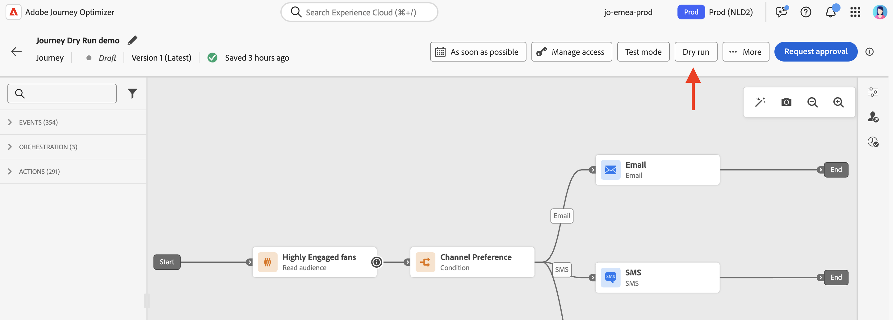

# 历程试运行 {#journey-dry-run}

>[!CONTEXTUALHELP]
>id="ajo_journey_dry_run"
>title="干运行模式"
>abstract="当前历程处于干运行状态。干运行是 Adobe Journey Optimizer 中的一种特殊历程发布模式，使历程设计人员能够在不接触真实客户或更新轮廓信息的前提下，使用真实生产数据对历程进行测试。此功能有助于历程设计人员在正式发布前验证历程设计和受众定位，从而增强信心。"

>[!CONTEXTUALHELP]
>id="ajo_journey_dry_run_start"
>title="以干运行模式发布历程"
>abstract="干运行是 Adobe Journey Optimizer 提供的一种特殊历程发布模式，允许历程设计人员使用真实的生产数据测试历程。设计历程后，执行空运行以确认它可以正常工作并确保步骤正确无误。通过此发布模式，您可以对历程进行冒烟测试，而无需向任何轮廓发送通信。"

干运行是 Adobe Journey Optimizer 中的一种特殊历程发布模式，使历程设计人员能够在不接触真实客户或更新轮廓信息的前提下，使用真实生产数据对历程进行测试。此功能有助于历程设计人员在正式发布前验证历程设计和受众定位，从而增强信心。

>[!AVAILABILITY]
>
>此功能仅面向一部分组织提供（限量发布），将会通过未来的版本在全球范围内推出。

## 主要优点 {#journey-dry-run-benefits}

历程练习通过使用真实的生产数据对客户旅程进行安全、数据驱动的测试，而无需联系客户或更改用户档案信息，从而增强了从业者的信心并促进了旅程的成功。 此功能使历程从业者能够在上线之前验证受众覆盖范围和分支逻辑，确保历程与其预期业务目标一致。

借助历程练习，您可以提前发现问题、优化定位策略以及根据实际数据（而非假设）改进旅程设计。 练习直接集成到历程画布中，可提供直观的报告和对关键绩效指标的可见性，使团队能够自信地迭代并简化审批工作流。 这提高了运营效率，降低了发布风险，并实现了更好的客户参与结果。

最终，此功能可缩短实现价值的时间并减少历程失败。

历程练习带来了：

1. **安全测试环境**：未联系处于练习模式的用户档案，确保没有发送通信或影响实时数据的风险。
1. **受众见解**：历程从业者可以预测受众在各种旅程节点上的可达性，包括选择退出、排除和其他条件。
1. **实时反馈**：量度直接显示在历程画布中，类似于实时报告，使历程参与者能够优化其历程设计。

在练习期间，将按以下特定条件执行历程：

* 不执行&#x200B;**渠道操作**&#x200B;节点，包括电子邮件、短信或推送通知
* **自定义操作**&#x200B;在试运行期间被禁用，并且其响应设置为null
* 在试运行期间绕过&#x200B;**等待节点**。
  <!--You can override the wait block timeouts, then if you have wait blocks duration longer than allowed dry run journey duration, then that branch will not execute completely.-->
* 默认情况下会执行&#x200B;**数据源**，包括外部数据源

>[!CAUTION]
>
>* 启动练习的权限仅限于具有&#x200B;**[!DNL Publish journeys]**&#x200B;高级权限的用户。 停止练习的权限仅限于具有&#x200B;**[!DNL Manage journeys]**&#x200B;高级权限的用户。 在[本节](../administration/permissions-overview.md)中了解有关管理[!DNL Journey Optimizer]用户访问权限的更多信息。
>
>* 在开始使用练习功能之前，[请阅读护栏和限制](#journey-dry-run-limitations)。

## 开始试运行 {#journey-dry-run-start}

您可以在任何草稿历程中使用模拟运行功能，而不会出错。

要激活试运行，请执行以下步骤：

1. 打开要测试的历程。
1. 选择&#x200B;**练习**&#x200B;按钮。

   

1. 确认发布。

   转换过程中出现状态消息&#x200B;**正在激活练习**。

1. 一旦激活，历程将进入&#x200B;**练习**&#x200B;模式。

## 监控练习 {#journey-dry-monitor}

启动干模式发布后，您可以可视化历程执行以及用户档案如何通过历程分支和节点进行进度。

量度直接显示在历程画布中。

对于每个活动，在其活动框中，您可以选中：

* **[!UICONTROL 已输入]**：进入此活动的个人总数。 对于&#x200B;**操作**&#x200B;活动，由于它们不是在练习模式下执行，因此此量度表示用户档案通过。
* **[!UICONTROL 已退出（符合退出条件）]**：由于退出条件而退出该活动的个人总数。
* **[!UICONTROL 已退出（强制退出）]**：由于历程从业者配置而暂停历程时退出历程的个人总数。 对于处于练习模式的历程，此量度始终等于零。
* **[!UICONTROL 错误]**：在该活动上发生错误的个人总数。

在历程级别，在画布的左上部，您可以检查：

* **输入的配置文件总数**
* **已退出的配置文件总数**
* 错误&#x200B;**的**&#x200B;配置文件总数
* 历程中&#x200B;**丢弃的配置文件**&#x200B;的总数

您还可以访问练习的&#x200B;**最近24小时报告**&#x200B;和&#x200B;**所有时间报告**。 要访问这些报告，请单击历程画布右上角的&#x200B;**查看报告**&#x200B;按钮。

>[!CAUTION]
>
> 仅当练习为&#x200B;**活动**&#x200B;时，报表数据才可用。  停止后，将无法再访问报表数据。 如果需要，请使用报告上方的&#x200B;**导出**&#x200B;按钮下载报告。

## 停止练习 {#journey-dry-run-stop}

练习历程&#x200B;**必须**&#x200B;手动停止。

单击&#x200B;**关闭**&#x200B;按钮结束测试，然后单击&#x200B;**返回草稿**&#x200B;确认。

<!-- After 14 days, Dry run journeys automatically transition to the **Draft** status.-->

## 护栏和限制 {#journey-dry-run-limitations}

* 练习模式不适用于包含反应事件的历程
* 处于试运行模式的配置文件将计入可参与配置文件
* 处于试运行模式的历程将计入实时旅程配额
* 模拟历程不会影响业务规则
* 创建新历程版本时，如果以前的历程版本为&#x200B;**Live**，则不允许对新版本进行模拟激活。
* 历程练习生成stepEvents。 这些stepEvents具有特定标志和练习ID：
   * 如果已激活模拟运行，`_experience.journeyOrchestration.stepEvents.inDryRun`将返回`true`，否则返回`false`
   * `_experience.journeyOrchestration.stepEvents.dryRunID`返回练习实例的ID

* 使用Adobe Experience Platform查询服务分析旅程报告量度时，必须排除练习生成的步骤事件。 要执行此操作，请将`inDryRun`标志设置为`false`。