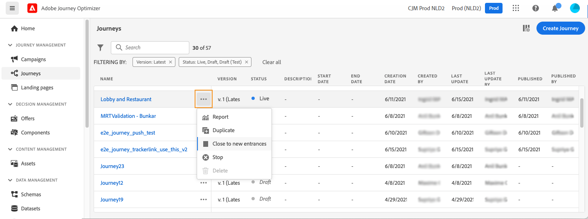

# 历程生命周期{#journey-lifecyle}

## 历程中的用户档案{#profile-journey}

在单一历程中：

* 如果启用了重新进入，则用户档案可以多次进入历程，但只有在完全退出该历程的上一个实例后才能进入该历程。

* 如果禁用了重新进入，则用户档案无法多次输入同一历程

有关用户档案重新进入的更多信息，请参阅此 [部分](../building-journeys/journey-gs.md#change-properties).

在读取区段历程中：

* 对于非循环历程：用户档案只进入一次历程。
* 对于循环历程：如果用户档案处于区段/预期状态，则该用户档案会在每次重复时进入历程。 如果他仍在历程中，从上一次重复开始，他将从头开始。

在以读取区段开始的业务事件历程中：

了解此历程基于业务事件的接收，如果用户档案在预期区段中符合条件，他将输入收到的每个业务事件的历程，这意味着此用户档案可以在同一历程中同时多次，但是可以在不同的业务事件上下文中。

单一历程（从事件或区段鉴别开始）包括护栏，可防止同一事件多次错误触发历程。 默认情况下，用户档案重新进入会暂时阻止5分钟。 例如，如果某个事件在12:01触发某个特定用户档案的历程，而另一个事件在12:03到达（无论是同一事件还是其他事件触发同一历程），则该历程将不会为此用户档案再次开始。

## 历程结束{#journey-ending}

历程可以在两个特定环境中结束：

* 人到达了路的最后一个活动。
* 人到达 **条件** 活动(或 **等待** 活动（包含条件），且与任何条件都不匹配。

如果允许重新进入，则人员可以重新进入历程。 请参阅 [本页](../building-journeys/journey-gs.md#change-properties)

要终止实时历程，我们建议您关闭该历程。 随后，将阻止新客户进入历程。 已在历程中进入的客户能够体验到该历程的结束。 请参阅 [此部分](../building-journeys/journey-end.md#close-journey)

仅当发生紧急情况并且需要在旅程中立即结束所有处理时，才能停止旅程。 已进入历程的人员都会停止其进度。 请参阅 [此部分](../building-journeys/journey-end.md#stop-journey)

>[!NOTE]
>
>请注意，您无法恢复已关闭或已停止的历程。

### 历程结束标记{#end-tag}

在创作历程时，“结束标记”显示在每个路径的末尾。 用户无法添加此节点，无法删除此节点，只能更改其标签。 它标记历程每个路径的结尾。 如果历程包含多个路径，我们建议您向每个端点添加标签，以便更便于阅读报表。 请参阅[此页](../reports/live-report.md)。

<!--

### End activity{#journey-end-activity}

The **[!UICONTROL End]** activity allows you to mark the end of each path of the journey. It is not mandatory but recommended for visual clarity. See [this page](../building-journeys/end-activity.md)

-->

### 结束历程{#close-journey}

由于以下原因，历程可能会关闭：

* 历程通过 **[!UICONTROL 靠近新入口]** 按钮。
* 基于一次性区段的历程，已完成执行。
* 在基于定期客户细分的历程的最后一次发生之后。

手动结束历程可确保已进入历程的客户能够完成其路径，但新用户无法进入历程。 当历程关闭（出于上述任何原因）时，将具有状态 **[!UICONTROL 已关闭]**. 历程不再允许新人进入历程。 已在历程中的人员可以正常完成历程。 在默认的全局超时为30天后，历程将切换到 **已完成** 状态。 请参阅 [部分](../building-journeys/journey-gs.md#global_timeout).

无法重新启动或删除已关闭的历程版本。 您可以创建新版本或复制该版本。 只能删除已完成的历程。

要从历程列表关闭历程，请单击 **[!UICONTROL 省略号]** 位于历程名称右侧并选择 **[!UICONTROL 靠近新入口]**.

您还可以：

1. 在 **[!UICONTROL 历程]** 列表，单击要关闭的历程。
1. 单击右上角的向下箭头。

   

1. 单击 **[!UICONTROL 靠近新入口]**，并在对话框中确认。

### 停止旅程{#stop-journey}

如果您需要阻止历程中所有个人的进度，则可以阻止该进度。 停止历程将超时历程中的所有个人。 但是，停止历程涉及已进入历程的人员都会在其进度中停止。 旅程基本关闭。 如果要结束旅程，我们建议您关闭该历程。

无法重新启动已停止的历程版本。

停止时，历程状态将设置为 **[!UICONTROL 已停止]**.

例如，如果营销人员意识到历程定向了错误的受众，或者用于传递消息的自定义操作无法正常工作，则可以停止历程。 要从历程列表中停止历程，请单击 **[!UICONTROL 省略号]** 位于历程名称右侧并选择 **[!UICONTROL 停止]**.

您还可以：

1. 在 **[!UICONTROL 历程]** 列表，单击要停止的历程。
1. 单击右上角的向下箭头。
   
1. 单击 **[!UICONTROL 停止]**，并在对话框中确认。
