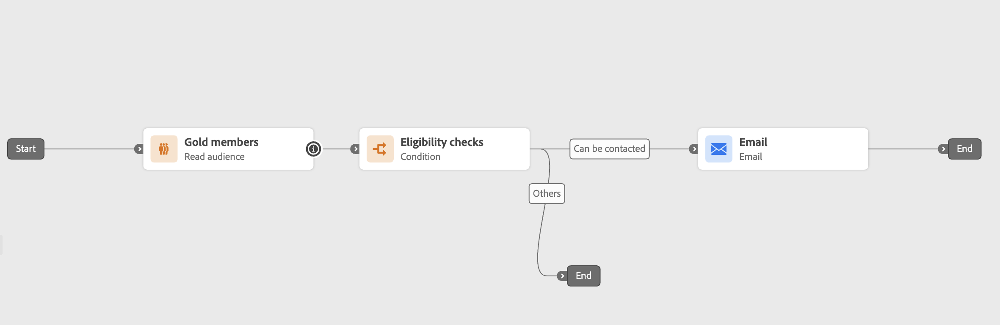
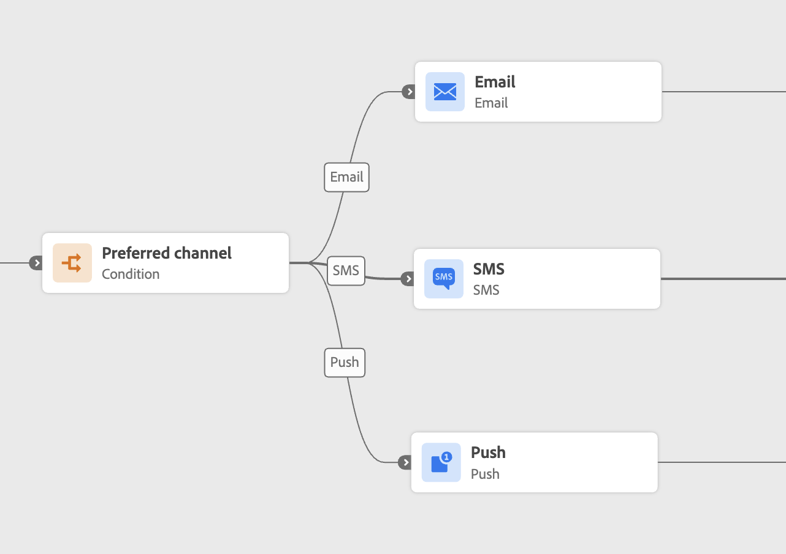
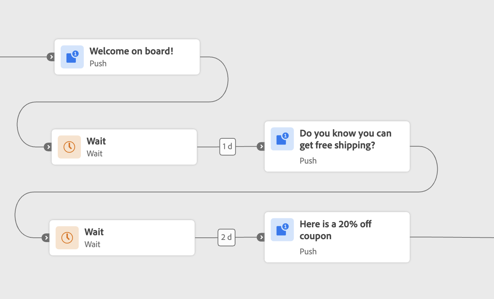

# 历程片段 {#journey-fragments}

历程片段是可重用的旅程节点集，您可以只构建一次这些节点，然后将其放到沙盒中的任意旅程中。 无论是资格检查、首选渠道路由逻辑还是欢迎序列，片段都可以帮助团队更快地移动并保持一致，而无需每次从头开始重建相同的逻辑。 [查看用例示例。](#examples)

创建后，片段将存储在专用的&#x200B;**[!UICONTROL 片段清单]**&#x200B;中，并可使用&#x200B;**[!UICONTROL 历程片段]**&#x200B;活动插入任何历程。

>[!NOTE]
>
>**历程片段**&#x200B;是可重用的旅程节点集。 它们与以下不同：
>
>* **[片段](../content-management/fragments.md)** — 跨营销活动和历程在电子邮件中使用的可重用内容组件。
>* **[AEM内容片段](../integrations/aem-fragments.md)** — 在Adobe Experience Manager中创作并在[!DNL Journey Optimizer]中使用的内容。

>[!NOTE]
>历程片段使用&#x200B;**复制行为**：将片段插入旅程将创建原始节点的静态副本。 对原始片段所做的任何更新都不会反映在已使用该片段的历程中。

## 权限 {#journey-fragments-permissions}

要使用历程片段，您需要以下[权限](../administration/permissions.md)：

* **管理历程** — 创建、编辑和删除片段所需。
* **发布历程** — 需要激活片段。

## 访问片段清单 {#journey-fragments-inventory}

可从&#x200B;**[!UICONTROL 历程]**&#x200B;部分访问历程片段。 打开&#x200B;**[!UICONTROL 片段]**&#x200B;选项卡以浏览沙盒中所有可用的片段。

您可以按片段名称、状态、创建日期、创建者、上次修改日期或标记筛选列表。

## 创建一个历程片段 {#create-journey-fragment}

>[!CONTEXTUALHELP]
>id="ajo_journey_fragment_create_canvas"
>title="另存为一个历程片段"
>abstract="在保存之前输入了唯一的片段名称。 选定的节点将另存为片段清单中可用的可重用片段。"

您可以通过两种方式创建历程片段：直接从历程画布（推荐）或从片段清单。

>[!BEGINTABS]

>从历程画布[!TAB ]

要直接从历程画布将历程节点另存为片段，请执行以下操作：

1. 打开旅程，然后在画布上选择一个或多个连接的节点。
1. 单击工具栏中的&#x200B;**[!UICONTROL 另存为片段]**&#x200B;图标。

   

1. 为您的沙盒中的片段输入唯一名称。

   

1. 单击&#x200B;**[!UICONTROL 保存]**。 片段将另存为草稿。

>[!TIP]
>
>如果您从历程创建片段，请在保存片段&#x200B;**之前[测试或模拟您的历程](testing-the-journey.md)**，以确保所选节点按预期运行。

>[!TAB 来自片段清单]

要直接从清单创建片段，请执行以下操作：

1. 导航到&#x200B;**[!UICONTROL 历程]** > **[!UICONTROL 历程片段]**&#x200B;选项卡。
1. 单击&#x200B;**[!UICONTROL 创建历程片段]**。
1. 在片段创作画布中，添加并配置历程活动。
1. 完成后，单击&#x200B;**[!UICONTROL 保存]**&#x200B;以将片段另存为草稿。

>[!CAUTION]
>
>测试模式和模拟在片段编辑器中不可用。 这意味着在激活片段并将其插入到历程之前，无法验证配置的活动的行为。 对于逻辑准确性至关重要的片段，请考虑[首先在完整历程](testing-the-journey.md)中构建和测试或模拟节点，然后从上面的画布选项卡中将它们另存为片段。

>[!ENDTABS]

## 编辑片段 {#edit-journey-fragment}

>[!CONTEXTUALHELP]
>id="ajo_journey_fragment_properties"
>title="历程片段属性"
>abstract="从清单中打开片段可修改其节点、属性、标记或标签。 活跃的片段必须先停用，然后才能进行编辑。"

要编辑片段，请单击&#x200B;**[!UICONTROL 片段清单]**&#x200B;中的名称以将其打开。 在片段创作UI中，您可以：

* 添加、删除或修改活动。
* 设置或更新片段属性：名称、标记和标签。

>[!NOTE]
>
>* 只能编辑&#x200B;**[!UICONTROL 草稿]**&#x200B;片段。 要修改&#x200B;**[!UICONTROL 活动]**&#x200B;片段，请先将其停用。
>
>* 测试模式和模拟在片段编辑器中不可用。 在将节点另存为片段之前，测试或模拟完整历程中的任何历程级别逻辑。
>
>* 片段中不允许有[跳转](jump.md)活动。

## 管理您的片段 {#manage-journey-fragments}

### 片段状态 {#fragment-statuses}

历程片段在生命周期之后具有以下状态：

| 状态 | 描述 |
|---|---|
| **[!UICONTROL 草稿]** | 片段正在创作，并且尚无法在历程中使用。 |
| **[!UICONTROL 活动]** | 片段已准备好在历程中使用。 |
| **[!UICONTROL 已存档]** | 片段已存档，并且不再可用于历程。 |

以下规则适用于片段状态转换：

* 只能激活&#x200B;**[!UICONTROL 草稿]**&#x200B;片段。 打开草稿片段并使用&#x200B;**[!UICONTROL 激活]**&#x200B;图标。
* 只能停用或存档&#x200B;**[!UICONTROL 活动]**&#x200B;片段。
* 只能取消存档&#x200B;**[!UICONTROL 已存档的]**&#x200B;片段。 将片段取消存档会将其返回到&#x200B;**[!UICONTROL 草稿]**&#x200B;状态。
* 只能删除&#x200B;**[!UICONTROL 草稿]**&#x200B;片段。

>[!NOTE]
>激活片段时，将应用历程发布期间运行的大多数相同验证检查。 但是，**上下文属性未验证**&#x200B;和&#x200B;**治理策略未在激活时强制执行** — 在插入片段并在历程中使用片段时都会对这两个属性进行评估。

### 片段操作 {#fragment-actions}

在片段清单中，您可以对片段执行以下操作：

* **[!UICONTROL 打开]**：通过单击片段名称来编辑片段。
* **[!UICONTROL 复制]**：从&#x200B;**[!UICONTROL 更多操作]** (...)创建片段的副本 图标。
* **[!UICONTROL 存档]**：通过&#x200B;**[!UICONTROL 更多操作]** (...)存档片段（仅适用于&#x200B;**[!UICONTROL 活动]**&#x200B;片段） 图标。 已存档的片段在片段选取器中不再可用。
* **[!UICONTROL 取消存档]**：从&#x200B;**[!UICONTROL 其他操作]** (...)还原已存档的片段（仅适用于&#x200B;**[!UICONTROL 已存档]**&#x200B;片段） 图标。 片段返回到&#x200B;**[!UICONTROL 草稿]**&#x200B;状态。
* **[!UICONTROL 删除]**：从&#x200B;**[!UICONTROL 其他操作]**(...)中永久删除片段（仅适用于&#x200B;**[!UICONTROL 草稿]**&#x200B;片段） 图标。
* **[!UICONTROL 编辑标记]**：在&#x200B;**[!UICONTROL 更多操作]**&#x200B;中添加或删除片段的标记(...) 图标。

## 在历程中使用片段 {#use-journey-fragment}

>[!CONTEXTUALHELP]
>id="ajo_journey_fragment_add"
>title="添加一个历程片段"
>abstract="选取器中只有&#x200B;**[!UICONTROL 活跃]**&#x200B;的片段可用。 插入一个片段后会创建其节点的一个&#x200B;**静态副本**——对原始片段的更新不会反映在历程中。"

要将片段插入历程，请执行以下操作：

1. 打开您的旅程，然后从左边栏拖动&#x200B;**[!UICONTROL 历程片段]**&#x200B;活动。
1. 将其拖放到现有分支中，或拖到空画布上。 出现片段选取器。
1. 浏览或搜索要使用的片段。 您可以预览片段，或在插入片段之前在其他选项卡中将其打开。
1. 选择片段。 其节点将复制到画布的放置点处。

>[!NOTE]
>选取器中只有&#x200B;**[!UICONTROL 活跃]**&#x200B;的片段可用。 插入一个片段后会创建其节点的一个&#x200B;**静态副本**——对原始片段的任何后续更新都不会反映在历程中。
>
>将片段拖放到空画布上时，片段必须以&#x200B;**[!UICONTROL 读取受众]**、**[!UICONTROL 受众资格]**&#x200B;或&#x200B;**[!UICONTROL 事件]**&#x200B;节点开头（与开始任何历程时的规则相同）。

## 护栏和限制 {#guardrails}

以下护栏适用于历程片段：

**片段创建**

* 每个沙盒&#x200B;**的片段名称必须是**&#x200B;唯一的。
* 一个片段只能有&#x200B;**个条目路径**。 无法将具有多个入口点的选择另存为片段。
* 只有&#x200B;**个连接的节点**&#x200B;可以一起另存为片段。
* 片段&#x200B;**不能包含[跳转](jump.md)活动**。
* 片段最多可包含&#x200B;**个20个节点**。
* 沙盒最多可以有&#x200B;**个200个活动片段**。

**片段使用情况**

* 只能将&#x200B;**[!UICONTROL 活动]**&#x200B;片段插入到历程中。
* 插入片段将创建其节点的&#x200B;**静态副本**。 对原始片段的更新不会传播到已使用该片段的历程。
* 片段可以拖放到现有分支或空画布上。 拖放到空画布上时，片段必须以&#x200B;**[!UICONTROL 读取受众]**、**[!UICONTROL 受众资格]**&#x200B;或&#x200B;**[!UICONTROL 事件]**&#x200B;节点开头。

**常规**

* 可以使用&#x200B;**[!UICONTROL 历程片段]**&#x200B;类别下的[统一搜索](../start/search-filter-categorize.md)栏找到片段。
* 片段支持[标记](tags.md)和&#x200B;**标签**。
* 支持[审核日志](../privacy/audit-logs.md)。
* 在旧栈栈上运行的历程（使用内联营销活动）不支持旅程片段。 在使用此功能之前，复制此类历程以移动到新栈栈。
* 历程片段支持[沙盒工具](../configuration/copy-objects-to-sandbox.md)。 片段可以打包并导出到另一个沙盒。

## 用例示例 {#examples}

以下示例说明了可以作为历程片段保存和重用的常见历程模式。

**资格检查**

标准进入模式（例如[读取受众](read-audience.md)节点，后跟资格过滤器）可以封装到片段中。 这允许团队保持用户档案进入历程方式的一致性，同时减少设置时间。 片段可以是[Optimize](optimize.md)活动（仅限该活动），也可以同时是“读取受众”和“优化”活动。

**首选渠道**

片段可以评估用户档案的首选通信渠道（电子邮件、推送或短信），并相应地路由用户档案。 此逻辑可以在任何涉及出站消息传递的历程中重复使用，以确保一致的渠道首选项管理。 片段可以包括[优化](optimize.md)活动和所有三个渠道分支。

**入门欢迎序列**

定时欢迎序列（例如一系列介绍产品或服务的三条消息）可以另存为片段。 这有助于在不同的受众区段或产品线中载入新用户。 片段可以包含[等待](wait-activity.md)活动和消息节点。

**基于反应的等待和提醒**

片段可以封装电子邮件活动，后跟[反应](reaction-events.md)，等待用户档案在设置的天数内打开电子邮件，如果未打开，则发送提醒。 此逻辑通常在培养历程和试验转化流中重用。 片段可以包含电子邮件和反应活动。

