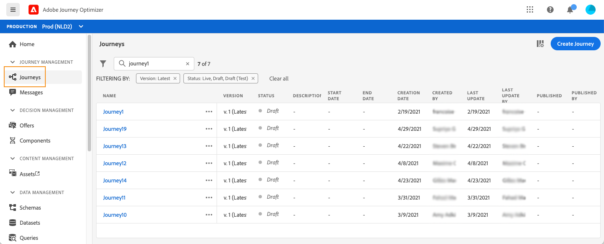

# 历程入门{#jo-quick-start}

## 先决条件

要随历程发送消息，需要以下配置：

1. **配置事件**:如果要在收到事件后一直触发历程，则需要配置事件。您可以定义预期信息以及处理方式。 此步骤由&#x200B;**技术用户**&#x200B;执行。[了解更多信息](../event/about-events.md).

   

1. **创建区段**:您的历程还可以监听Adobe Experience Platform区段，以便将消息批量发送到一组指定的用户档案。为此，您需要创建区段。 [了解更多信息](../segment/about-segments.md).

   

1. **配置数据源**:您可以定义与系统的连接，以检索将在您的历程中使用的其他信息，例如在您的条件中。在预配时还会配置内置 Adobe Experience Platform 数据源。如果您仅利用历程中事件的数据，则不需要执行此步骤。此步骤由&#x200B;**技术用户**&#x200B;执行。[了解更多信息](../datasource/about-data-sources.md)

   

1. **配置操作**:Journey Optimizer消息功能是内置的，您只需设计内容并发布消息即可。请参阅[此小节](../get-started-content.md)。如果您使用第三方系统发送消息，则可以创建自定义操作。 在此[部分](../action/action.md)中了解详情。 此步骤由&#x200B;**技术用户**&#x200B;执行。

   

## 构建您的历程{#jo-build}

此步骤由&#x200B;**业务用户**&#x200B;执行。 您可以在此处创建历程。 结合不同的事件、编排和操作活动，构建多步跨渠道方案。

以下是通过历程发送消息的主要步骤：

1. 在“历程管理”菜单部分，单击&#x200B;**[!UICONTROL Journeys]**。 将显示历程列表。

   

1. 单击&#x200B;**[!UICONTROL Create Journey]**&#x200B;以创建新历程。

1. 编辑右侧显示的配置窗格中的历程属性。在此[部分](journey-gs.md#change-properties)中了解详情。

   

1. 首先，将事件或&#x200B;**读取区段**&#x200B;活动从面板拖放到画布中。 要了解有关历程设计的更多信息，请参阅[此部分](using-the-journey-designer.md)。

   

1. 拖放个人将遵循的后续步骤。 例如，您可以添加一个条件，后跟一条消息。 要了解有关活动的更多信息，请参阅[此部分](using-the-journey-designer.md)。

1. 使用测试用户档案测试您的历程。 在此[部分中了解详情](testing-the-journey.md)

1. 发布历程以激活它。 在此[部分](publishing-the-journey.md)中了解详情。

   

1. 使用专用的报告工具监控您的历程以衡量历程的有效性。 在此[部分](../reports/live-report.md)中了解详情。

   

## 更改属性 {#change-properties}

单击右上方的铅笔图标以访问历程的属性。

您可以更改历程名称、添加描述、允许重新进入、选择开始和结束日期，并定义&#x200B;**[!UICONTROL Timeout and error]**&#x200B;持续时间（如果您是管理员）。

对于实时历程，此屏幕显示发布日期和发布历程的用户名称。

**复制技术详细信息**&#x200B;允许您复制有关历程的技术信息，供支持团队用于进行故障排除。 将复制以下信息：JourneyVersion UID、OrgID、orgName、sandboxName、lastDeployedBy、lastDeployedAt。

### 入口{#entrance}

默认情况下，新历程允许重新进入。 您可以取消选中“一次性”历程的选项，例如，如果您希望在某人进入商店时提供一次性礼品。 在这种情况下，您不希望客户能够重新进入历程并再次接收选件。

当历程“结束”时，其状态为&#x200B;**[!UICONTROL Closed]**。 历程将不再允许新人进入历程。 已在历程中的人员将正常完成历程。

在默认的全局超时为30天后，历程将切换到&#x200B;**已完成**&#x200B;状态。 请参阅此[部分](../building-journeys/journey-gs.md#global_timeout)。

### 历程活动中的超时和错误 {#timeout_and_error}

在编辑操作或条件活动时，您可以定义出现错误或超时的替代路径。 如果查询第三方系统的活动的处理时间超过了历程的属性（**[!UICONTROL Timeout and  error]**&#x200B;字段）中定义的超时时长，则将选择第二个路径以执行潜在的回退操作。

授权值介于1到30秒之间。

如果您的历程是时间敏感的，我们建议您定义一个非常短的&#x200B;**[!UICONTROL Timeout and error]**&#x200B;值(例如：响应人员的实时位置)，因为您不能将操作延迟超过几秒钟。 如果您的历程不太时间敏感，您可以使用较长的值为调用的系统提供更多时间以发送有效响应。

历程还使用全局超时。 请参阅[下一节](#global_timeout)。

### 全局历程超时 {#global_timeout}

除了在历程活动中使用的[timeout](#timeout_and_error)之外，还存在全局历程超时，该超时未显示在界面中，且无法更改。 此超时将在个人进入后30天停止历程中的进度。 这意味着个人的历程不能持续超过30天。 在30天超时期后，将删除个人数据。 在超时时段结束时仍在历程中流动的个人将被停止，并将其作为报表中的错误考虑在内。

>[!NOTE]
>
>历程不会直接对隐私选择退出、访问或删除请求做出反应。 但是，全局超时可确保个人在任何历程中停留的时间不得超过30天。

由于历程超时30天，因此当不允许历程重新进入时，我们无法确保重新进入阻止的工作时间超过30天。 事实上，由于我们删除了有关在进入历程30天后进入历程的人员的所有信息，因此我们无法知道之前进入的人员，即30天前。

### 时区和配置文件时区 {#timezone}

在历程级别定义时区。

您可以输入固定时区或使用Adobe Experience Platform配置文件定义历程时区。

有关时区管理的更多信息，请参阅[此页面](../building-journeys/timezone-management.md)。

### 突发模式 {#burst}

拆分模式是一个付费的附加组件，它允许以非常快的速度发送大量推送消息。 它用于包括读取区段和简单推送消息的简单历程。 当消息投放的延迟对业务至关重要时，如果您想在手机上发送紧急推送警报（例如，向已安装您的新闻渠道应用程序的用户发送突发新闻），则会使用Burst。

限制:

* 历程必须以读取区段开头。 不允许发生事件。
* 下一步必须是推送消息。 不允许执行其他活动或步骤（可选的结束活动除外）：
   * 仅推送渠道
   * 消息中不允许进行个性化
   * 消息必须小(&lt;2KB)

重要说明：

如果任何要求未满足，则历程中将不提供拆分模式。

要激活突发模式，请打开您的历程并单击右上方的铅笔图标以访问历程的属性。 然后，激活&#x200B;**启用突发模式**&#x200B;切换开关。

如果您修改拆分历程并添加与拆分不兼容的活动（消息、任何其他操作、事件等），则将停用拆分模式。 将显示一条消息。

然后，正常测试和发布您的历程。 测试模式消息不会通过拆分模式发送。

## 结束旅程

历程可能会因为以下两个原因而终止：

* 人到达了路的最后一个活动。 最后一个活动可以是结束活动或其他活动。 没有义务通过结束活动结束路径。 请参阅[此页](../building-journeys/end-activity.md)。
* 人员到达条件活动（或包含条件的等待活动），且与任何条件都不匹配。

如果允许重新进入，则人员可以重新进入历程。 请参阅[此页面](../building-journeys/journey-gs.md#change-properties)

由于以下原因，历程可能会关闭：

* 通过&#x200B;**[!UICONTROL Close to new entrances]**&#x200B;按钮手动关闭历程。
* 基于一次性区段的历程，已完成执行。
* 在上次发生基于定期区段的历程之后。

当历程关闭（出于上述任何原因）时，其状态将为&#x200B;**[!UICONTROL Closed]**。 历程将不再允许新人进入历程。 已在历程中的人员将正常完成历程。 在默认的全局超时为30天后，历程将切换到&#x200B;**已完成**&#x200B;状态。 请参阅此[部分](../building-journeys/journey-gs.md#global_timeout)。

如果您需要阻止历程中所有个人的进度，则可以阻止该进度。 停止历程将超时历程中的所有个人。

以下是手动关闭或停止历程的方式：

利用&#x200B;**[!UICONTROL Stop]**&#x200B;和&#x200B;**[!UICONTROL Close to new entrances]**&#x200B;选项，可终止&#x200B;**live**&#x200B;历程。 结束历程涉及&#x200B;**阻止新客户到达历程**，并且已在历程中输入的客户能够体验到最终。 这是结束旅程的最推荐方法，因为它为客户提供了最佳体验。 停止历程涉及已进入历程的人员都会在其进程中被停止。 旅程基本关闭。

>[!NOTE]
>
>请注意，您无法恢复已关闭或已停止的历程。

### 结束旅程

您可以手动关闭历程，以确保已进入历程的客户能够完成其路径，但新用户无法进入历程。

关闭后，历程的状态将为&#x200B;**[!UICONTROL Closed]**。 在默认的全局超时为30天后，历程将切换到&#x200B;**已完成**&#x200B;状态。 请参阅此[部分](../building-journeys/journey-gs.md#global_timeout)。

无法重新启动或删除已关闭的历程版本。 您可以创建新版本或复制该版本。 只能删除已完成的历程。

要从历程列表关闭历程，请单击位于历程名称右侧的&#x200B;**[!UICONTROL Ellipsis]**&#x200B;按钮，然后选择&#x200B;**[!UICONTROL Close to new entrances]**。

您还可以：

1. 在&#x200B;**[!UICONTROL Journeys]**&#x200B;列表中，单击要关闭的历程。
1. 单击右上角的向下箭头。

   

1. 单击 **[!UICONTROL Close to new entrances]**。将显示一个对话框。
1. 单击&#x200B;**[!UICONTROL Close to new entrances]**&#x200B;确认。

### 停止旅程

当出现紧急情况且需要在旅程中立即结束所有处理时，您可以停止旅程。

无法重新启动已停止的历程版本。

停止后，历程的状态将为&#x200B;**[!UICONTROL Stopped]**。

例如，如果营销人员意识到历程定向了错误的受众，或者用于传递消息的自定义操作无法正常工作，则可以停止历程。 要从历程列表中停止历程，请单击历程名称右侧的&#x200B;**[!UICONTROL Ellipsis]**&#x200B;按钮，然后选择&#x200B;**[!UICONTROL Stop]**。

您还可以：

1. 在&#x200B;**[!UICONTROL Journeys]**&#x200B;列表中，单击要停止的历程。
1. 单击右上角的向下箭头。

1. 单击 **[!UICONTROL Stop]**。将显示一个对话框。
1. 单击&#x200B;**[!UICONTROL Stop]**&#x200B;确认。
