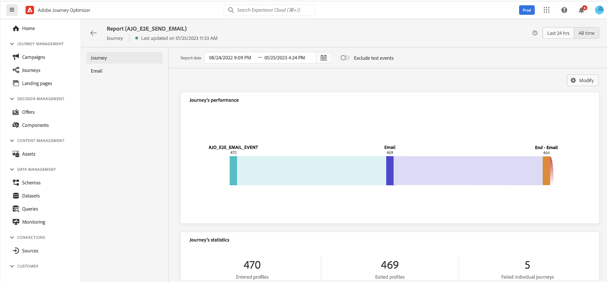

# 历程入门{#jo-quick-start}

## 先决条件{#start-prerequisites}

要通过历程发送消息，需要以下配置：

1. **配置事件**:如果要在收到事件后一直触发历程，则需要配置事件。 您可以定义预期信息以及处理方式。 此步骤由&#x200B;**技术用户**&#x200B;执行。[了解更多信息](../event/about-events.md)。

   

1. **创建区段**:您的历程还可以监听Adobe Experience Platform区段，以便将消息批量发送到一组指定的用户档案。 为此，您需要创建区段。 [了解更多信息](../segment/about-segments.md)。

   

1. **配置数据源**:您可以定义与系统的连接，以检索将在您的历程中使用的其他信息，例如在您的条件中。 在预配时还会配置内置 Adobe Experience Platform 数据源。如果您仅利用历程中事件的数据，则不需要执行此步骤。此步骤由&#x200B;**技术用户**&#x200B;执行。[了解详情](../datasource/about-data-sources.md)

   

1. **配置操作**:Journey Optimizer消息功能是内置的，您只需设计内容并发布消息即可。 请参阅[此小节](../messages/get-started-content.md)。如果您使用第三方系统发送消息，则可以创建自定义操作。 在中了解详情 [部分](../action/action.md). 此步骤由&#x200B;**技术用户**&#x200B;执行。

   

## 构建历程{#jo-build}

>[!CONTEXTUALHELP]
>id="ajo_journey_create"
>title="构建历程"
>abstract="此屏幕显示现有历程的列表。 打开旅程或单击“创建旅程”，并组合不同的事件、编排和操作活动以构建多步跨渠道方案。"

此步骤由 **商业用户**. 您可以在此处创建历程。 结合不同的事件、编排和操作活动，构建多步跨渠道方案。

以下是通过历程发送消息的主要步骤：

1. 在“历程管理”菜单部分，单击 **[!UICONTROL Journeys]**. 将显示历程列表。

   

1. 单击 **[!UICONTROL Create Journey]** 以创建新历程。

1. 编辑右侧显示的配置窗格中的历程属性。在中了解详情 [部分](journey-gs.md#change-properties).

   

1. 首先，拖放事件或 **读取区段** 活动。 要了解有关历程设计的更多信息，请参阅 [此部分](using-the-journey-designer.md).

   

1. 拖放个人将遵循的后续步骤。 例如，您可以添加一个条件，后跟一条消息。 要进一步了解活动，请参阅 [此部分](using-the-journey-designer.md).

1. 使用测试用户档案测试您的历程。 在中了解详情 [部分](testing-the-journey.md)

1. 发布历程以激活它。 在中了解详情 [部分](publishing-the-journey.md).

   

1. 使用专用的报告工具监控您的历程以衡量历程的有效性。 在中了解详情 [部分](../reports/live-report.md).

   

## 定义历程属性 {#change-properties}

>[!CONTEXTUALHELP]
>id="ajo_journey_properties"
>title="历程属性"
>abstract="此部分显示历程属性。 默认情况下，只读参数处于隐藏状态。 可用设置取决于历程的状态、权限和产品配置。"

单击右上方的铅笔图标以访问历程的属性。

您可以更改历程名称、添加描述、允许重新进入、选择开始和结束日期，并作为管理员用户定义 **[!UICONTROL Timeout and error]** 持续时间。 如果为贵组织启用了，则还可以激活 [突发消息](#burst).

对于实时历程，此屏幕显示发布日期和发布历程的用户名称。

的 **复制技术详细信息** 允许您复制有关历程的技术信息，供支持团队用于进行故障排除。 将复制以下信息：JourneyVersion UID、OrgID、orgName、sandboxName、lastDeployedBy、lastDeployedAt。

### 入口{#entrance}

默认情况下，新历程允许重新进入。 您可以取消选中“一次性”历程的选项，例如，如果您希望在某人进入商店时提供一次性礼品。 在这种情况下，您不希望客户能够重新进入历程并再次接收选件。

当历程“结束”时，将具有状态 **[!UICONTROL Closed]**. 历程将不再让新人进入历程。 已在历程中的人员将正常完成历程。

在默认的全局超时为30天后，历程将切换到 **已完成** 状态。 请参阅 [部分](../building-journeys/journey-gs.md#global_timeout).

### 历程活动中的超时和错误 {#timeout_and_error}

在编辑操作或条件活动时，您可以定义出现错误或超时的替代路径。 如果查询第三方系统的活动的处理超过了历程属性中定义的超时持续时间(**[!UICONTROL Timeout and  error]** 字段)，则将选择第二个路径来执行潜在的回退操作。

授权值介于1到30秒之间。

我们建议您定义一个非常短的 **[!UICONTROL Timeout and error]** 值(例如：响应人员的实时位置)，因为您不能将操作延迟超过几秒钟。 如果您的历程不太时间敏感，您可以使用较长的值为调用的系统提供更多时间以发送有效响应。

历程还使用全局超时。 请参阅 [下一部分](#global_timeout).

### 全局历程超时 {#global_timeout}

除 [超时](#timeout_and_error) 在历程活动中，还存在全局历程超时，该超时未显示在界面中，且无法更改。 此超时将在个人进入后30天停止历程中的进度。 这意味着个人的历程不能持续超过30天。 在30天超时期后，将删除个人数据。 在超时时段结束时仍在历程中流动的个人将被停止，并将其作为报表中的错误考虑在内。

>[!NOTE]
>
>历程不会直接对隐私选择退出、访问或删除请求做出反应。 但是，全局超时可确保个人在任何历程中停留的时间不得超过30天。

由于历程超时30天，因此当不允许历程重新进入时，我们无法确保重新进入阻止的工作时间超过30天。 事实上，由于我们删除了有关在进入历程30天后进入历程的人员的所有信息，因此我们无法知道之前进入的人员，即30天前。

### 时区和配置文件时区 {#timezone}

在历程级别定义时区。

您可以输入固定时区或使用Adobe Experience Platform配置文件定义历程时区。

如果在Adobe Experience Platform配置文件中定义了时区，则可以在历程中进行检索。

有关时区管理的更多信息，请参阅 [本页](../building-journeys/timezone-management.md).

### 突发模式 {#burst}

拆分模式是一个Journey Optimizer加载项，它允许在大卷中快速发送推送消息。 它用于包含 **读取区段** 活动和简单的推送消息。 当消息投放的延迟对业务至关重要时，如果您想在手机上发送紧急推送警报（例如，向已安装您的新闻渠道应用程序的用户发送突发新闻），则会使用Burst。

突发消息传送具有以下要求：

* 历程必须以 **读取区段** 活动。 不允许发生事件。
* 下一步必须是推送消息。 不允许使用其他渠道、活动或步骤。
* 推送消息中不允许进行个性化。
* 消息必须小(&lt;2KB)。

>[!CAUTION]
>
>如果任何要求未满足，则历程中将不提供拆分模式。

激活 **突发模式**，打开您的历程，然后单击右上方的铅笔图标以访问历程的属性。 然后，激活 **启用拆分模式** 切换。

如果您修改拆分历程并添加与拆分消息不兼容的活动（如电子邮件、任何其他操作、事件等），则会自动停用拆分模式。

然后，像往常一样测试并发布您的历程。 请注意，在测试模式下，消息不会通过拆分模式发送。

在此视频中，了解突发消息的适用用例，以及如何配置突发消息的历程：

>[!VIDEO](https://video.tv.adobe.com/v/334523?quality=12)
