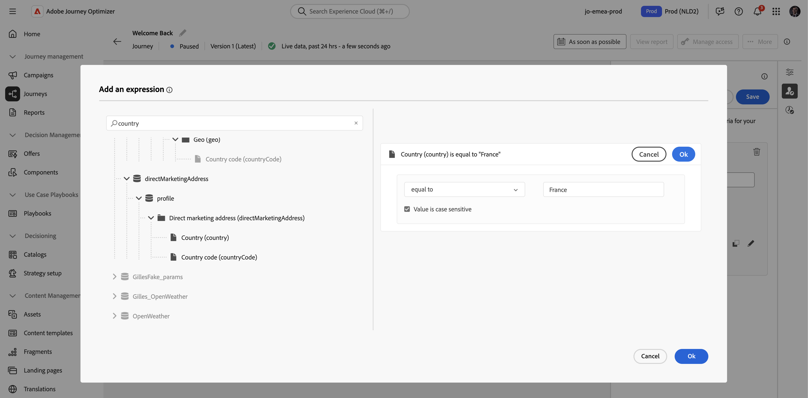

# 暂停历程 {#journey-pause}

>[!CONTEXTUALHELP]
>id="ajo_journey_pause"
>title="暂停您的历程"
>abstract="暂停实时历程以阻止新用户档案进入。 选择是丢弃历程中当前的用户档案还是将其保留在适当位置。 如果保留，它们将在历程重新启动后在下一个操作活动时继续执行。 非常适合更新或紧急停止，而不会失去进度。"

您可以暂停实时历程，执行所有需要的更改，然后随时重新恢复它们。<!--You can choose whether the journey is resumed at the end of the pause period, or whether it stops completely. -->在暂停期间，您可以[应用全局筛选器](#journey-global-filters)以根据配置文件的特性排除配置文件。 历程在暂停期结束时自动恢复。 您也可以[手动](#journey-resume-steps)恢复它。

>[!AVAILABILITY]
>
>此功能仅适用于一组组织（限量发布），并将在未来版本中在全球范围内推出。

## 主要优点 {#journey-pause-benefits}

暂停和恢复历程通过允许暂停实时历程而不中断客户体验，为历程参与者提供了更好的控制和灵活性。 暂停后，不会发送任何通信，并且用户档案将保持暂停状态，直到历程恢复。

此功能降低在错误或更新（例如：更改消息内容）期间发送意外消息的风险，支持更安全的历程管理，并提高从业者的信心。 直接在UI中查看暂停的历程及其状态可进一步提高透明度和操作敏捷性。

>[!CAUTION]
>
>* 暂停和恢复历程的权限仅限于具有&#x200B;**[!DNL Publish journeys]**&#x200B;高级权限的用户。 在[本节](../administration/permissions-overview.md)中了解有关管理[!DNL Journey Optimizer]用户访问权限的更多信息。
>
>* 在开始使用暂停/恢复功能之前，[阅读护栏和限制](#journey-pause-guardrails)。

## 如何暂停历程 {#journey-pause-steps}

您可以暂停任何&#x200B;**实时**&#x200B;历程。

要暂停历程，请执行以下步骤：

1. 打开要暂停的历程。
1. 单击历程画布右上角的&#x200B;**...更多**&#x200B;按钮，然后选择&#x200B;**暂停**。

   

1. 选择如何管理当前位于历程中的配置文件。

   {width="50%" align="left"}

   您可以：

   * **保持**&#x200B;配置文件 — 配置文件将等待历程恢复
   * **放弃**&#x200B;配置文件 — 配置文件将在下一个操作节点从历程中排除

1. 单击&#x200B;**暂停**&#x200B;按钮确认。

从历程列表中，您可以暂停一个或多个&#x200B;**实时**&#x200B;历程。 要暂停一组历程（_批量暂停_），请在列表中选择它们，然后单击屏幕底部蓝色栏中的&#x200B;**暂停**&#x200B;按钮。 **暂停**&#x200B;按钮仅在选择&#x200B;**实时**&#x200B;历程时可用。

### 暂停的历程中的行为

当历程暂停时，无论保持/丢弃模式如何，都会丢弃新入口。

暂停历程时的用户档案管理取决于活动。 行为详见下文。 如需全面了解，另请参阅此[端到端示例](#journey-pause-sample)。

| 历程活动 | 轮廓管理 |
|-------------------------|--------------------------------------------------|
| [受众资格](audience-qualification-events.md) | <ul> <li>在第一个节点中：丢弃用户档案 </li> <li>在其他节点中：与实时历程中的行为相同，但是，如果受众资格在<strong>操作</strong>活动之后并且用户在该操作上暂停，则受众资格将被丢弃。 </li></ul> |
| [单一事件](general-events.md) |  — 在第一个节点中：丢弃用户档案 在其他节点中：行为与实时历程相同，但是，如果事件在<strong>操作</strong>活动之后并且用户在该操作上暂停，则丢弃该事件。 |
| [读取受众](read-audience.md) | 与实时历程中的行为相同，具有一些特性： 1。  如果在<strong>读取受众</strong>活动开始后按下<strong>暂停</strong>，则进入历程的用户档案将继续（直到下一个<strong>操作</strong>活动）。 当历程以特定速度读取受众时，如果整个受众尚未进入，则将丢弃队列中的剩余配置文件。    2. 对于单次执行：如果计划日期早于恢复日期，则在恢复时不会显示任何错误。 该时间表将被忽略。  3. 对于增量历程：   — 如果在首次发生之前发生暂停，则在恢复时，将播放完整受众。   — 例如，如果发生暂停，则在每日重复周期的第4天，历程保持暂停状态直到第9天，则在恢复时，将包含从第4天到第9天输入的所有用户档案 |
| [反应](reaction-events.md) | 与实时历程中的行为相同，但是，如果反应在<strong>操作</strong>活动之后并且用户在该操作上暂停，则将放弃该事件。 |
| [等待](wait-activity.md) | 与实时历程中的行为相同 |
| [条件](condition-activity.md) | 与实时历程中的行为相同 |
| 内容决策 | 根据暂停历程后用户选择的内容，暂停或丢弃用户档案 |
| [渠道操作](journeys-message.md) | 根据暂停历程后用户选择的内容，暂停或丢弃用户档案 |
| [自定义操作](../action/action.md) | 根据暂停历程后用户选择的内容，暂停或丢弃用户档案 |
| [更新配置文件](update-profiles.md)和[跳转](jump.md) | 与实时历程中的行为相同 |
| [外部数据Source](../datasource/external-data-sources.md) | 与实时历程中的行为相同 |
| [退出条件](journey-properties.md#exit-criteria) | 与实时历程中的行为相同 |

## 如何恢复暂停的历程 {#journey-resume-steps}

>[!CONTEXTUALHELP]
>id="ajo_journey_resume"
>title="继续您的历程"
>abstract="恢复暂停的历程，以允许新用户档案再次进入。 如果用户档案在暂停期间等待，则将继续其历程。 适用于在更新或暂停后安全重新启动历程。"

暂停的历程在最大暂停时段14天结束时自动恢复。 它们可以随时手动恢复。 恢复暂停的历程允许新用户档案再次进入。 如果用户档案在暂停期间等待，则将继续其历程。 适用于在更新或暂停后安全重新启动历程。

要恢复暂停的历程并开始再次侦听历程事件，请执行以下步骤：

1. 打开要恢复的历程。
1. 单击历程画布右上角的&#x200B;**...更多**&#x200B;按钮，然后选择&#x200B;**继续**。

   历程切换到&#x200B;**恢复**&#x200B;状态。 当历程继续时，新入口在一分钟内开始。 恢复保留的用户档案可能需要一些时间。  由于必须恢复所有配置文件才能使历程再次处于&#x200B;**实时**&#x200B;状态，因此从&#x200B;**恢复**&#x200B;状态过渡到&#x200B;**实时**&#x200B;状态可能需要一些时间。

1. 单击“**继续**”按钮确认。

从历程列表中，您可以恢复一个或多个&#x200B;**已暂停**&#x200B;历程。 要恢复一组历程（_批量恢复_），请选择这些历程并单击屏幕底部蓝色栏中的&#x200B;**恢复**&#x200B;按钮。 请注意，**继续**&#x200B;按钮仅在选择&#x200B;**已暂停**&#x200B;历程时可用。

## 将全局过滤器应用于暂停历程中的配置文件 {#journey-global-filters}

暂停历程时，您可以根据用户档案属性应用全局过滤器。 此过滤器允许排除与恢复时定义的表达式匹配的用户档案。 设置全局过滤器后，该过滤器将应用于操作节点，甚至适用于新用户档案的入口。 符合条件的用户档案和尝试输入的新用户档案将在他们遇到的下一个操作节点&#x200B;**上从历程**&#x200B;中排除。

例如，要从暂停的历程中排除所有法国客户，请执行以下步骤：

1. 浏览到要修改的暂停历程。

1. 单击&#x200B;**退出标准和全局过滤器**&#x200B;图标。

   

1. 在&#x200B;**退出标准和全局筛选器**&#x200B;设置中，单击&#x200B;**添加全局筛选器**&#x200B;根据配置文件属性定义筛选器。

1. 设置表达式以排除国家/地区属性等于“法国”的用户档案。

   

1. 保存筛选器并单击&#x200B;**更新历程**&#x200B;按钮以应用更改。

1. [继续历程](#journey-resume-steps)。

   在恢复时，所有将“国家/地区”属性设置为“法国”的用户档案都将在下一个操作节点自动从历程中排除。 任何将“国家/地区”属性设置为“法国”的新用户档案尝试进入历程时，都将在下一个操作节点被阻止。

请注意，当前在历程中的用户档案和新用户档案的用户档案排除，仅在它们到达操作节点时发生。

>[!CAUTION]
>
>* 每个历程只能设置&#x200B;**一个**&#x200B;全局筛选器。
>
>* 您只能在&#x200B;**已暂停**&#x200B;历程中创建、更新或删除全局筛选器。

## 护栏和限制 {#journey-pause-guardrails}

* 历程版本最长可暂停14天。
* 暂停的历程会以与实时历程相同的方式纳入所有业务规则中。
* 当用户档案到达操作活动时，将会在暂停的历程中“丢弃”用户档案。 如果他们在旅程暂停期间坚持等待并在恢复后退出，则将继续旅程，而不会被丢弃。
* 即使是在暂停后，随着事件继续处理，这些事件也将计入每秒的历程事件数配额，之后将形成单一形式的限制。
* 已进入历程但在暂停期间被放弃的用户档案仍将被计为可参与的用户档案。
* 当配置文件在暂停的历程中保留时，在恢复时配置文件属性会刷新
* 条件仍会在暂停的历程中执行，因此，如果历程因数据质量问题而暂停，则可以使用错误数据评估操作节点之前的任何条件。
* 对于基于受众的增量读取受众历程，请考虑暂停的持续时间。 例如，对于每日历程，如果暂停并在当月2日恢复，则在6日运行将获取从1日到6日符合条件的所有用户档案。 这不适用于受众资格或基于事件的历程（如果在暂停期间收到受众资格或事件，则这些事件将被丢弃）。
* 暂停的历程计入实时历程配额。
* 历程全局超时仍适用于暂停的旅程。 例如，如果某个用户档案在历程中持续90天且历程暂停，则此用户档案仍将在第91天退出历程。
* 如果配置文件保留在历程中，并且此历程在几天后自动恢复，则配置文件将继续该历程并且不会被丢弃。 如果要删除它们，必须停止旅程。
* 在暂停的历程中，不会触发批次区段警报的警报。
* 在历程的14天暂停状态终止后，系统中没有审核日志。
* 某些已弃用的配置文件会在历程步骤事件中可见，但在报表中不可见。 例如：丢弃读取受众的业务事件，由于历程暂停，读取受众作业被丢弃，当事件活动在配置文件正在等待的操作之后时，丢弃事件。
  <!--* There is a guardrail (at an org level) on the max number of profiles that can be held in paused journeys. This guardrail is per org, and is visible in the journey inventory on a new bar (only visible when there are paused journeys).-->

## 端到端示例 {#journey-pause-sample}

让我们以以下历程为例：

暂停此历程时，您可以选择配置文件是&#x200B;**Discarded**&#x200B;还是&#x200B;**Hold**，然后配置文件管理如下：

1. **AddToCart**&#x200B;活动：所有新配置文件入口都被阻止。 如果某个用户档案在暂停之前已进入历程，则将继续到下一个操作节点。
1. **等待**&#x200B;活动：用户档案继续在节点上正常等待，即使历程处于暂停状态，用户档案也将退出该节点。
1. **条件**：配置文件继续通过条件，并根据条件上定义的表达式移动到右侧分支。
1. **推送**/**电子邮件**&#x200B;活动：在暂停的历程中，用户档案会开始等待或放弃（根据用户在暂停时所做的选择）下一个操作节点。 因此，用户档案将开始等待或丢弃在那里。
1. **Events** after action节点：如果某个配置文件正在等待某个操作节点，并且在该操作节点之后有一个事件，如果该事件被触发，则该配置文件将被丢弃。

根据此行为，您可以看到已暂停历程中的用户档案数量不断增加，大多数是在操作之前的活动中。 例如，在该示例中，将忽略“等待”，从而增加通过Condition活动访问的用户档案数。

当您继续此历程时：

1. 新旅程入口在一分钟内开始
1. 当前在历程中等待操作活动的用户档案会以5k tps的速率恢复。 然后，他们将进入等待的操作，并继续历程。
