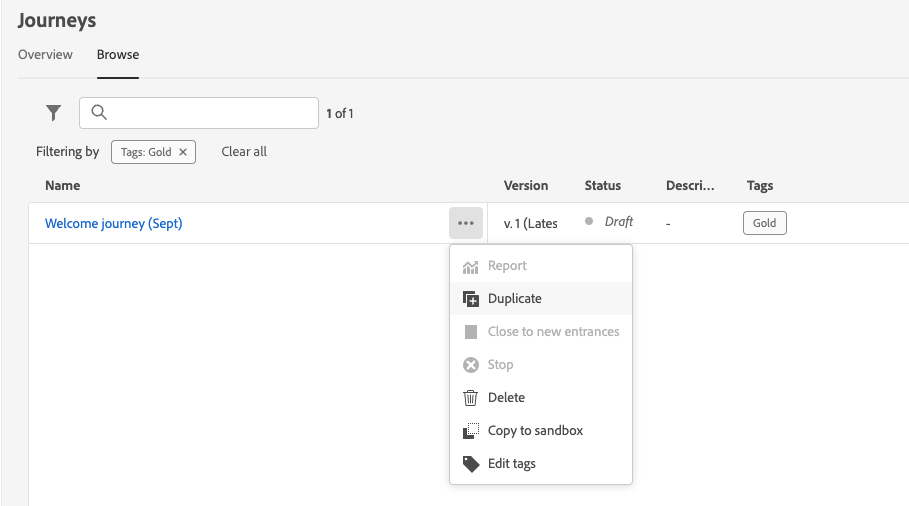

# 浏览和筛选历程 {#browse-journeys}

## 历程仪表板 {#dashboard-jo}

>[!CONTEXTUALHELP]
>id="ajo_journey_view"
>title="历程表和时间线视图"
>abstract="历程表和时间线视图"

在“历程管理”菜单部分中，单击&#x200B;**[!UICONTROL 历程]**。 两个选项卡可用：**[!UICONTROL 概述]**&#x200B;和&#x200B;**[!UICONTROL 浏览]**。

* **[!UICONTROL 概述]**&#x200B;选项卡显示一个仪表板，其中包含与您的历程相关的关键量度。

  

   * **已处理的配置文件**：过去24小时内处理的配置文件总数
   * **实时历程**：过去24小时内具有流量的实时历程总数。 实时历程包括&#x200B;**单一历程** （基于事件）和&#x200B;**批次历程** （读取受众）。
   * **错误率**：所有出错的配置文件与过去24小时内输入的配置文件总数之比。
   * **放弃率**：已放弃的所有配置文件与过去24小时内输入的配置文件总数之比。 丢弃的个人资料表示无权进入历程的人，例如，由于命名空间不正确或重入规则所致。

  >[!NOTE]
  >
  >此仪表板会考虑过去24小时内具有流量的历程。 只显示您有权访问的历程。 指标每30分钟刷新一次，并且仅在有新数据可用时刷新。

* **[!UICONTROL 浏览]**&#x200B;选项卡显示现有历程的列表。 您可以搜索历程、使用过滤器并对每个元素执行基本操作。 例如，您可以删除项目或制作项目副本。

  

## 筛选您的历程 {#journey-filter}

在历程列表中，使用各种过滤器可让您优化历程列表。

您可以根据历程的[状态](#journey-statuses)、[类型](#journey-types)、[版本](#journey-versions)以及从&#x200B;**[!UICONTROL 状态和版本筛选器]**&#x200B;分配的[标记](../start/search-filter-categorize.md#tags)来筛选历程。

使用&#x200B;**[!UICONTROL 创建过滤器]**&#x200B;根据历程的创建日期或创建历程的用户来筛选历程。

显示使用&#x200B;**[!UICONTROL 活动筛选器]**&#x200B;和&#x200B;**[!UICONTROL 数据筛选器]**&#x200B;中的特定事件、字段组或操作的历程。

使用&#x200B;**[!UICONTROL 发布筛选器]**&#x200B;选择发布日期或用户。 例如，您可以选择显示昨天发布的最新版实时历程。

要根据特定日期范围筛选历程，请从&#x200B;**[!UICONTROL 已发布]**&#x200B;下拉列表中选择&#x200B;**[!UICONTROL 自定义]**。

此外，在“事件”、“数据源”和“操作”配置窗格中，**[!UICONTROL 用于]**&#x200B;字段显示使用该特定事件、字段组或操作的历程数。 您可以单击&#x200B;**[!UICONTROL 查看历程]**&#x200B;按钮以显示相应历程的列表。

## 历程类型 {#journey-types}

历程的类型取决于该历程中使用的活动。 它可以是：

* **[!UICONTROL 单一事件]** — 单一事件历程链接到特定个人资料。 事件与个人的行为或与个人相关的事情有关（例如，某人达到10,000个忠诚点数）。 [了解详情](../event/about-events.md)。
* **[!UICONTROL 商业活动]**。 业务事件历程从非用户档案相关事件开始。 事件配置由技术用户执行，无法编辑。 [了解详情](../event/about-events.md)。
* **[!UICONTROL 受众资格]** — 受众资格历程将监听Adobe Experience Platform受众中用户档案的进出口，以便使个人进入历程或在历程中前进。 [了解详情](audience-qualification-events.md)。
* **[!UICONTROL 读取受众]** — 在读取受众历程中，受众中的所有个人都进入历程并接收历程中包含的消息。  [了解详情](read-audience.md)。

在[此页面](entry-management.md)上了解有关历程类型和关联条目管理的更多信息。

## 历程状态 {#journey-statuses}

历程状态取决于其生命周期。 它可以是：

* **已关闭**：历程已使用&#x200B;**关闭新入口**&#x200B;按钮关闭。 历程停止让新个人进入历程。 已处于历程中的人员可以正常完成历程。
* **草稿**：历程处于第一阶段。 它尚未发布。
* **草稿（测试）**：已使用&#x200B;**测试模式**&#x200B;按钮激活测试模式。
* **已完成**：历程在91天[全局超时](journey-properties.md#global_timeout)后自动切换到此状态。 历程中已有的用户档案通常会完成历程。 新配置文件无法再进入历程。
* **实时**：历程已使用&#x200B;**发布**&#x200B;按钮发布。
* **已停止**：历程已使用&#x200B;**停止**&#x200B;按钮关闭。 所有个人都会立即退出历程。

>[!NOTE]
>
>* 历程创作生命周期还包括一组不可过滤的中间状态：“发布”（在“草稿”和“实时”之间）、“激活测试模式”或“停用测试模式”(在“草稿”和“草稿（测试）”之间)以及“停止”（在“实时”和“已停止”之间）。 当历程处于中间状态时，只可读取它。
>
>* 如果需要修改为&#x200B;**实时**&#x200B;历程，请[创建历程的新版本](#journey-versions)。

## 历程版本 {#journey-versions}

在历程列表中，所有历程版本在显示时都带有版本号。搜索历程时，当应用程序首次打开时，最新版本会显示在列表顶部。然后，您可以定义所需的排序方式，应用程序会将其保留为用户首选项。历程的版本也显示在历程版本界面的顶部，位于画布上方。

>[!NOTE]
>
>通常，同一历程中无法同时存在多个轮廓。如果启用了重新进入，则用户档案可以重新进入历程，但只有在完全退出该历程的上一个实例后才能重新进入历程。[了解更多信息](end-journey.md)。

### 创建历程的新版本 {#journey-create-new-version}

如果您需要修改到实时历程，请创建历程的新版本。 要创建现有历程的新版本，请执行以下步骤：

1. 打开实时历程的最新版本，单击&#x200B;**[!UICONTROL 创建新版本]**&#x200B;并确认。

   

   >[!NOTE]
   >
   >您只能从历程的最新版本创建新版本。

1. 进行修改，单击&#x200B;**[!UICONTROL 发布]**&#x200B;并确认。

从历程发布的那一刻起，个人将开始转入历程的最新版本。已进入先前版本的用户将停留在该版本中，直到完成该历程。如果稍后重新进入同一历程，则将进入最新版本。

可以逐个单独停止历程版本。历程的所有版本具有相同的名称。

当您发布新版本的历程时，先前版本会自动结束并切换到&#x200B;**已关闭**&#x200B;状态。无法再进入该历程。即使您停止了最新版本，先前版本仍会保持关闭状态。

>[!NOTE]
>
>特定护栏和限制适用于历程的版本控制。 在[此页面](../start/guardrails.md#journey-versions-journey-versions-g)上了解详情。

## 复制历程 {#duplicate-a-journey}

您可以从&#x200B;**浏览**&#x200B;选项卡复制现有历程。 所有对象和设置都将复制到历程副本。

为此，请执行以下步骤：

1. 导航到要复制的历程，单击&#x200B;**更多操作**&#x200B;图标（历程名称旁边的三个圆点）。
1. 选择&#x200B;**复制**。

   

1. 输入历程的名称并进行确认。 您还可以在历程属性屏幕中更改名称。 默认情况下，名称设置如下： `[JOURNEY-NAME]_copy`

   

1. 将创建新旅程，该旅程可在旅程列表中找到。
