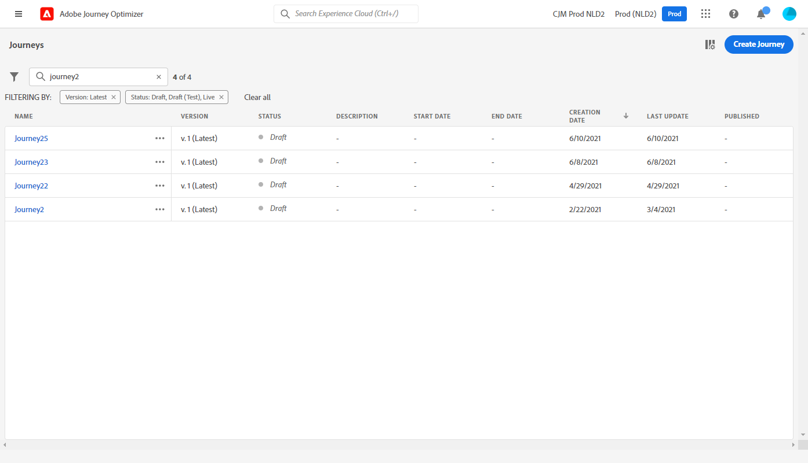
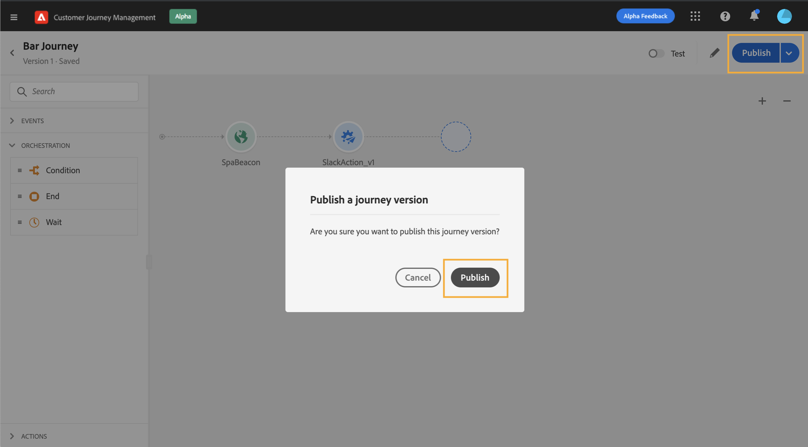

# 历程版本{#concept_ldc_k55_zgb}

在旅程列表中，所有旅程版本都显示有版本号。 请参阅[此页](../building-journeys/using-the-journey-designer.md)。当您搜索旅程时，应用程序第一次打开时，最新版本会显示在列表顶部。 然后，您可以定义所需的排序，应用程序会将其保留为用户首选项。 旅程版本也显示在旅程版界面顶部，画布上方。

如果您需要修改到实时旅程，则需要创建新版本的旅程。

>[!NOTE]
>
>要了解有关旅程版本限制的更多信息，请参阅[此页](../building-journeys/limitations.md#journey-versions-limitations)

1. 打开最新的实时旅程版本，单击&#x200B;**[!UICONTROL Create a new version]**&#x200B;并确认。

   

   >[!NOTE]
   >
   >您只能根据旅程的最新版本创建新版本。

1. 进行修改，单击&#x200B;**[!UICONTROL Publish]**&#x200B;并确认。

   

从旅程发布之日起，个人将开始流入旅程的最新版本。 已输入先前版本的用户将一直保留该版本，直到完成此旅程。 如果他们稍后重新进入同一旅程，则将进入最新版本。

历程版本可以单独停止。 所有版本的旅程都具有相同的名称。

>[!NOTE]
>
>当您发布新版本的旅程时，旧版本会自动结束并切换到&#x200B;**已关闭**&#x200B;状态。 旅程中不会有入口。 即使您停止最新版本，旧版本也将保持关闭状态。
