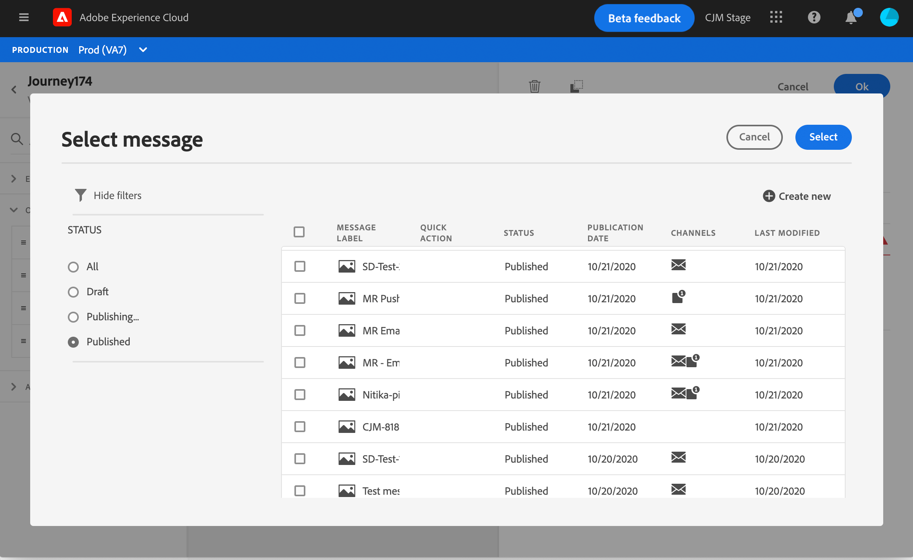
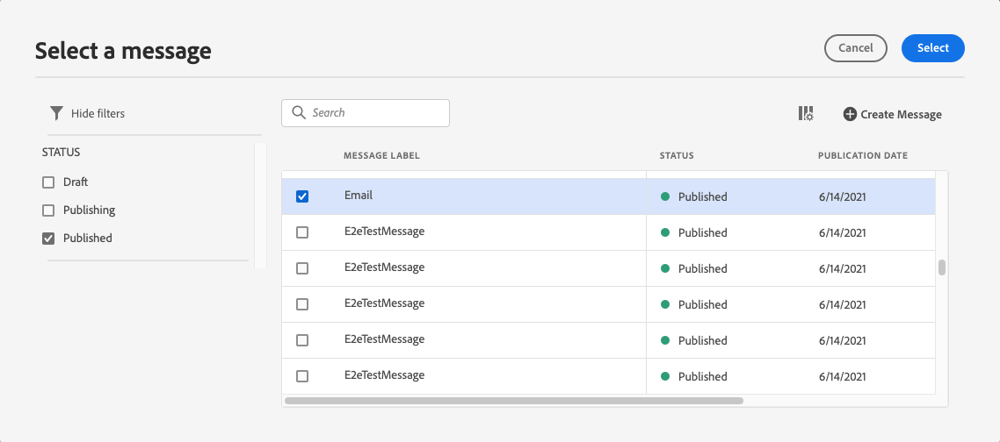

# 在历程中添加消息

[!DNL Journey Optimizer] 消息功能是内置的，您只需设计内容并发布消息即可。请参阅[此小节](../get-started-content.md)。然后，您只需在历程中添加使用Journey Optimizer设计的推送或电子邮件消息即可。

如果您使用第三方系统发送消息，则可以创建自定义操作。 在此[部分](../action/action.md)中了解详情。

## 添加消息活动

1. 与往常一样，从事件或&#x200B;**读取区段**&#x200B;活动开始您的历程。

   

1. 从面板的&#x200B;**Actions**&#x200B;部分，将&#x200B;**Message**&#x200B;活动拖放到画布中。

   

1. 添加标签和描述。

   

1. 在&#x200B;**Message**&#x200B;字段内单击。 将显示在Journey Optimizer中设计的可用消息列表。 您可以按状态过滤列表。

   

1. 选择消息并单击&#x200B;**选择**。 您还可以通过单击&#x200B;**创建消息**，直接从此屏幕创建新消息。

   

   如果要检查消息，可以单击&#x200B;**消息**&#x200B;字段中的&#x200B;**打开消息**&#x200B;图标。 该消息将在新选项卡中打开。

   

1. 向历程中添加后续步骤。

## 电子邮件参数和推送参数

**[!UICONTROL Email parameters]**&#x200B;和&#x200B;**[!UICONTROL Push parameters]**&#x200B;部分显示只读字段。 通常在创建消息时执行此配置。 请参阅[此小节](../get-started-content.md)。

要强制使用特定值，可以使用字段右侧的&#x200B;**启用参数覆盖**&#x200B;图标。 此选项可用于测试目的。 例如，对于电子邮件，您可以添加电子邮件地址。 发布历程后，将向您发送电子邮件。

## 发送时间优化{#send-time-optimization}

>[!CONTEXTUALHELP]
>id="jo_bestsendtime_disabled"
>title="关于发送时间优化"
>abstract="Adobe Journey Optimizer的“发送时间优化”功能由Adobe的AI服务提供支持，可根据历史打开率和点击率预测发送电子邮件或推送消息以最大化参与度的最佳时间。"

Adobe Journey Optimizer的“发送时间优化”功能由Adobe的AI服务提供支持，可根据历史打开率和点击率预测发送电子邮件或推送消息以最大化参与度的最佳时间。 使用我们的机器学习模型为每个用户安排个性化发送时间，以提高消息的打开率和点击率。

>[!NOTE]
>
>此功能目前为测试版，仅供测试版客户使用。 要加入测试版计划，请联系Adobe客户关怀团队。

发送时间优化模型可摄取您的Adobe Journey Optimizer数据，并查看用户级别的打开（用于电子邮件和推送）和点击（用于电子邮件）率，以确定客户何时最可能参与您的消息传送。 发送时间优化需要至少一个月的消息跟踪数据才能做出明智的建议。 对于每个用户，系统将使用以下分数自动选择最佳时间：

* 一周中每天的最佳时刻，以最大限度地提高参与度
* 一周中最好的一天，以最大程度地提高参与度
* 一周中最佳时刻的最佳时刻，以最大限度地提高参与度

无论您是在说打分还是培训，模型都会有所不同。 培训最初每周进行，然后每季度进行。 评分最初是每周，然后是每月。

* 培训 — 用于打分的算法的开发
* 评分 — 根据训练好的模型将评分应用于个人用户档案

此信息与用户的用户档案一起存储，并在历程执行时被引用，以告知Adobe Journey Optimizer何时发送消息。

>[!CAUTION]
>
>* 此功能仅适用于启用跟踪的电子邮件和推送上的单渠道消息。
>* 必须发布消息。
>* 此功能与拆分模式不兼容。

### 激活发送时间优化{#activate-send-time-optimization}

>[!CONTEXTUALHELP]
>id="jo_bestsendtime_email"
>title="激活发送时间优化"
>abstract="通过选择相应的单选按钮，选择是优化电子邮件打开次数还是电子邮件点进次数。 您还可以通过在下一个选项中为“发送”输入值，将系统使用的发送时间括起来。"

>[!CONTEXTUALHELP]
>id="jo_bestsendtime_push"
>title="激活发送时间优化"
>abstract="推送消息默认为打开选项，因为点击不适用于推送消息。 您还可以通过在下一个选项中为“发送”输入值，将系统使用的发送时间括起来。"

通过从消息活动参数中选择&#x200B;**发送时间优化**&#x200B;开关，对电子邮件或推送消息启用发送时间优化。

对于电子邮件消息，选择是优化电子邮件打开次数，还是通过选择相应的单选按钮来优化电子邮件点进次数。 推送消息默认为打开选项，因为点击不适用于推送消息。

您还可以通过输入&#x200B;**在下一个**&#x200B;选项中发送的值，将系统使用的发送时间括起来。 如果选择“6小时”作为值，[!DNL Journey Optimizer]将检查每个用户配置文件，以查看最佳发送时间是否在距离历程执行时间的6小时内发生，并选择由发送时间优化确定的时间。 如果该时间不在接下来的六小时内，则[!DNL Journey Optimizer]将默认在历程执行时发送消息。

