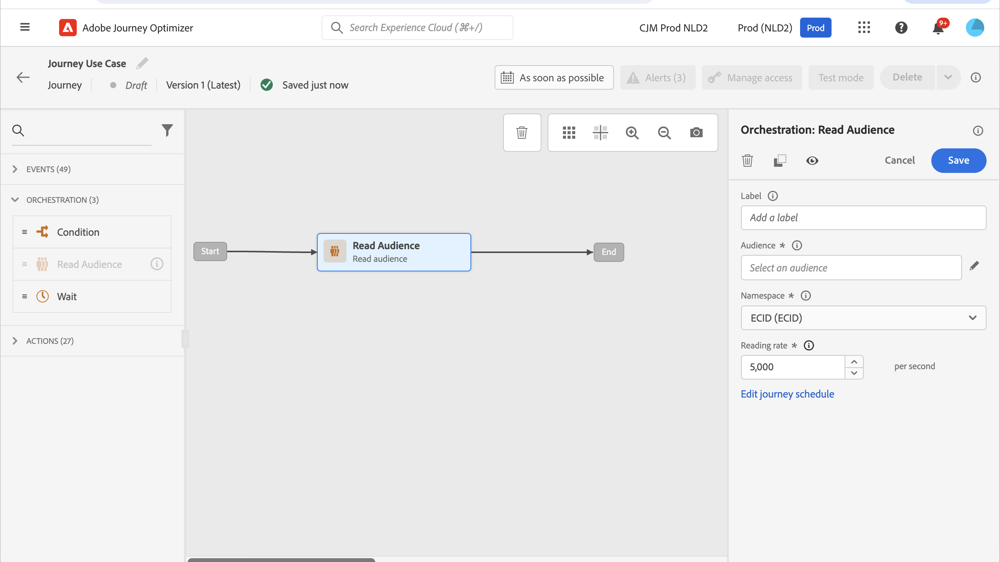

# 用例：发送多渠道消息{#send-multi-channel-messages}

本节介绍结合读取受众、事件、反应事件和电子邮件/推送消息的用例。

## 用例描述

在此使用案例中，目标是向属于特定受众的所有客户发送第一封电子邮件。

根据他们对第一条消息的反应，发送特定的跟进消息。

如果客户打开电子邮件，系统会等待购买并发送推送消息以感谢客户。

如果没有反应，将发送跟进电子邮件。

## 先决条件

要使此用例正常工作，请配置以下内容：

* 适用于亚特兰大、旧金山或西雅图（1980年后出生）的所有客户的受众
* 购买事件

### 创建受众

在此历程中，利用了特定的客户受众。 属于受众的所有个人都会进入历程并按照不同的步骤操作。 在本例中，受众定位的是生活在亚特兰大、旧金山或西雅图且出生于1980年之后的所有客户。

有关受众的详细信息，[请参阅此页面](../audience/about-audiences.md)。

1. 从“客户”菜单部分，选择&#x200B;**[!UICONTROL 受众]**。
1. 单击位于受众列表右上角的&#x200B;**[!UICONTROL 创建受众]**&#x200B;按钮。
1. 在&#x200B;**[!UICONTROL 受众属性]**&#x200B;窗格中，输入受众的名称。
1. 将所需字段从左窗格拖放到中心工作区，并根据需要对其进行配置。 在此示例中，使用&#x200B;**城市**&#x200B;和&#x200B;**出生年份**&#x200B;属性字段。
1. 单击&#x200B;**[!UICONTROL 保存]**。

   

受众现已创建并准备好在历程中使用。 使用&#x200B;**读取受众**&#x200B;活动，属于该受众的所有个人都可以进入历程。

### 配置事件

配置在客户购买时发送到历程的事件。 当历程收到事件时，会触发“感谢”消息。

为此，请使用基于规则的事件[&#128279;](../event/about-events.md)。

1. 在“管理”菜单部分中，选择&#x200B;**[!UICONTROL 配置]**，然后单击&#x200B;**[!UICONTROL 事件]**。 单击&#x200B;**[!UICONTROL 创建事件]**&#x200B;以创建新事件。

1. 输入事件的名称。

1. 在&#x200B;**[!UICONTROL 事件ID类型]**&#x200B;字段中，选择&#x200B;**[!UICONTROL 基于规则]**。

1. 定义&#x200B;**[!UICONTROL 架构]**&#x200B;和有效负载&#x200B;**[!UICONTROL 字段]**。 使用多个字段，例如购买的产品、购买日期和购买ID。

1. 在&#x200B;**[!UICONTROL 事件ID条件]**&#x200B;字段中，定义系统用于识别触发历程的事件的条件。 例如，添加`purchaseMessage`字段并定义以下规则： `purchaseMessage="thank you"`

1. 定义&#x200B;**[!UICONTROL 命名空间]**&#x200B;和&#x200B;**[!UICONTROL 配置文件标识符]**。

1. 单击&#x200B;**[!UICONTROL 保存]**。

   

事件现已配置完毕，可随时用于旅程。 使用相应的事件活动，可在客户每次购买时触发操作。

## 设计旅程

1. 通过&#x200B;**读取受众**&#x200B;活动开始历程。 选择之前创建的受众。 属于受众的所有个人都进入历程。

   

1. 删除&#x200B;**电子邮件**&#x200B;操作活动并定义“第一封邮件”的内容。 此消息将发送给历程中的所有个人。 请参阅此[部分](../email/create-email.md)，了解如何配置和设计电子邮件。

   

1. 添加&#x200B;**反应**&#x200B;事件并选择&#x200B;**已打开电子邮件**。 当属于受众的个人打开电子邮件时，将触发事件。

1. 选中&#x200B;**定义事件超时**&#x200B;框，定义持续时间（在此示例中为1天），并选中&#x200B;**设置超时路径**。 这会为未打开推送或电子邮件第一封邮件的个人创建另一个路径。

1. 在超时路径中，删除&#x200B;**电子邮件**&#x200B;操作活动并定义“跟进”消息的内容。 此消息将发送给未在次日打开电子邮件或推送第一条消息的个人。 [了解如何配置和设计电子邮件](../email/create-email.md)。

1. 在第一个路径中，添加之前创建的购买事件。 当个人购买时会触发该事件。

1. 在该事件后，删除&#x200B;**推送**&#x200B;操作活动并定义“感谢”消息的内容。 请参阅此[部分](../push/create-push.md)，了解如何配置和设计推送。

## 测试并发布历程

1. 在测试历程之前，请验证其是否有效以及是否没有错误。

1. 使用位于右上角的&#x200B;**测试**&#x200B;切换开关激活测试模式。 请参阅此[部分](testing-the-journey.md)以了解如何使用测试模式。

1. 历程就绪后，使用位于右上角的&#x200B;**发布**&#x200B;按钮发布历程。
