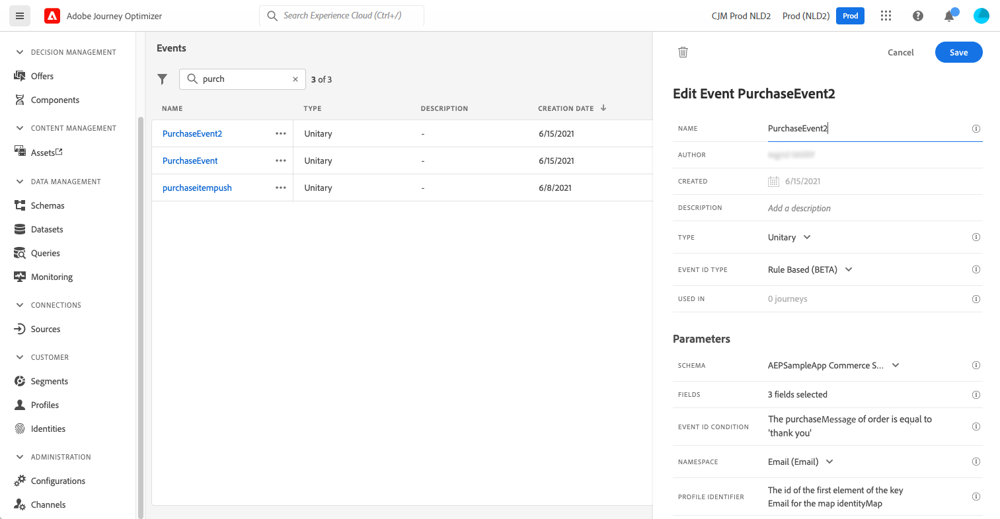

# 发送多渠道消息 {#send-multi-channel-messages}

>[!BEGINSHADEBOX]

**在此页面上：**&#x200B;了解如何构建多渠道历程，该历程将读取受众、事件、反应事件以及电子邮件和推送消息与跟进逻辑相结合。

>[!ENDSHADEBOX]

本节介绍结合读取受众、事件、反应事件和电子邮件/推送消息的用例。

## 用例描述

在此使用案例中，目标是向属于特定受众的所有客户发送第一封电子邮件。

根据他们对第一条消息的反应，发送特定的跟进消息。

如果客户打开电子邮件，系统会等待购买并发送推送消息以感谢客户。

如果没有反应，将发送跟进电子邮件。

## 先决条件

要使此用例正常工作，请配置以下内容：

* 适用于亚特兰大、旧金山或西雅图（1980年后出生）的所有客户的受众
* 购买事件

### 创建受众

在此历程中，利用了特定的客户受众。 属于受众的所有个人都会进入历程并按照不同的步骤操作。 在本例中，受众定位的是生活在亚特兰大、旧金山或西雅图且出生于1980年之后的所有客户。

有关受众的详细信息，[请参阅此页面](../audience/about-audiences.md)。

1. 从“客户”菜单部分，选择&#x200B;**[!UICONTROL 受众]**。
1. 单击位于受众列表右上角的&#x200B;**[!UICONTROL 创建受众]**&#x200B;按钮。
1. 在&#x200B;**[!UICONTROL 受众属性]**&#x200B;窗格中，输入受众的名称。
1. 将所需字段从左窗格拖放到中心工作区，并根据需要对其进行配置。 在此示例中，使用&#x200B;**城市**&#x200B;和&#x200B;**出生年份**&#x200B;属性字段。
1. 单击&#x200B;**[!UICONTROL 保存]**。

   

受众现已创建并准备好在历程中使用。 使用&#x200B;**读取受众**&#x200B;活动，属于该受众的所有个人都可以进入历程。

### 配置事件

配置在客户购买时发送到历程的事件。 当历程收到事件时，会触发“感谢”消息。

为此，请使用基于规则的事件[&#128279;](../event/about-events.md)。

1. 在“管理”菜单部分中，选择&#x200B;**[!UICONTROL 配置]**，然后单击&#x200B;**[!UICONTROL 事件]**。 单击&#x200B;**[!UICONTROL 创建事件]**&#x200B;以创建新事件。

1. 输入事件的名称。

1. 在&#x200B;**[!UICONTROL 事件ID类型]**&#x200B;字段中，选择&#x200B;**[!UICONTROL 基于规则]**。

1. 定义&#x200B;**[!UICONTROL 架构]**&#x200B;和有效负载&#x200B;**[!UICONTROL 字段]**。 使用多个字段，例如购买的产品、购买日期和购买ID。

1. 在&#x200B;**[!UICONTROL 事件ID条件]**&#x200B;字段中，定义系统用于识别触发历程的事件的条件。 例如，添加`purchaseMessage`字段并定义以下规则： `purchaseMessage="thank you"`

1. 定义&#x200B;**[!UICONTROL 命名空间]**&#x200B;和&#x200B;**[!UICONTROL 配置文件标识符]**。

1. 单击&#x200B;**[!UICONTROL 保存]**。

   

事件现已配置完毕，可随时用于旅程。 使用相应的事件活动，可在客户每次购买时触发操作。

## 设计旅程

1. 通过&#x200B;**读取受众**&#x200B;活动开始历程。 选择之前创建的受众。 属于受众的所有个人都进入历程。

   的天气情况

1. 删除&#x200B;**电子邮件**&#x200B;操作活动并定义“第一封邮件”的内容。 此消息将发送给历程中的所有个人。 请参阅此[部分](../email/create-email.md)，了解如何配置和设计电子邮件。

   

1. 添加&#x200B;**反应**&#x200B;事件并选择&#x200B;**已打开电子邮件**。 当属于受众的个人打开电子邮件时，将触发事件。

1. 选中&#x200B;**定义事件超时**&#x200B;框，定义持续时间（在此示例中为1天），并选中&#x200B;**设置超时路径**。 这会为未打开推送或电子邮件第一封邮件的个人创建另一个路径。

1. 在超时路径中，删除&#x200B;**电子邮件**&#x200B;操作活动并定义“跟进”消息的内容。 此消息将发送给未在次日打开电子邮件或推送第一条消息的个人。 [了解如何配置和设计电子邮件](../email/create-email.md)。

1. 在第一个路径中，添加之前创建的购买事件。 当个人购买时会触发该事件。

1. 在该事件后，删除&#x200B;**推送**&#x200B;操作活动并定义“感谢”消息的内容。 请参阅此[部分](../push/create-push.md)，了解如何配置和设计推送。

## 测试并发布历程

1. 在测试历程之前，请验证其是否有效以及是否没有错误。

1. 使用位于右上角的&#x200B;**测试**&#x200B;切换开关激活测试模式。 请参阅此[部分](testing-the-journey.md)以了解如何使用测试模式。

1. 历程就绪后，使用位于右上角的&#x200B;**发布**&#x200B;按钮发布历程。

## 多阶段忠诚度历程 {#multi-phase-loyalty}

此示例说明了一个关键历程架构模式：将复杂的多阶段历程分解为与[**[!UICONTROL 跳转]**](jump.md)活动连接的更小且集中的子历程。 忠诚度计划会作为场景，但此模式适用于跨多个里程碑或业务阶段的任何历程。

复杂的多阶段历程会快速生成大量独特的客户路径。 每阶段将它们拆分为一个子旅程，可让每个旅程处于可管理状态、可测试状态并可独立维护。

### 场景

考虑使用两个营销渠道（[电子邮件](../email/create-email.md)和[推送](../push/create-push.md)）引导客户完成三个里程碑的忠诚度计划：

1. **阶段1 — 下载移动应用：**&#x200B;初始通信鼓励新忠诚会员下载应用。 如果客户在规定时间段内未执行操作，将发送跟进提醒。
1. **第2阶段 — 进行第一笔交易：**&#x200B;下载应用程序后，定向消息会引导客户完成其第一笔忠诚度交易。
1. **阶段3 — 进行第二笔交易：**&#x200B;在第一次交易后，最终的一组通信推动第二次交易，以深化忠诚度参与。

即使使用此直接的策略，此历程仍会公开客户可以采取的20多个独特路径。 每个额外的接触点或渠道的复杂性都会呈指数增长。

### 子旅程分解

将端到端历程划分为三个较小的连接子历程：

| 子历程 | 输入条件 | 业务目标 |
|---|---|---|
| 阶段1 — 应用程序下载 | 客户加入忠诚度计划 | 推动移动应用程序下载 |
| 阶段2 — 第一笔交易 | 客户下载应用程序 | 推动第一个会员交易记录 |
| 第三阶段 — 第二笔交易 | 客户完成第一笔交易 | 推动第二会员交易记录 |

使用[**[!UICONTROL 跳转]**](jump.md)活动连接子历程，以便配置文件从一个阶段无缝传递到下一个阶段。 每个子历程保持简单、可读和可独立维护。

<!--
>[!NOTE]
>
>If your goal is to build a gamified loyalty program with challenges, tasks, and built-in reward tracking, Journey Optimizer also offers a dedicated **Loyalty Challenges** capability.
-->

+++ AI知识参考

本节包含结构化知识，用于支持与本主题相关的解释、检索和问答。

要全面了解相关信息，应将此信息与本页上的文档相结合。 这两个源都不是独立的；页面描述了功能，而本节提供了其他上下文来帮助消除术语、意图、适用性和约束条件的歧义。

* **TL；DR：**&#x200B;本页提供了两个实际的历程用例：一个是结合读取受众、反应事件、电子邮件和推送的多渠道消息流；另一个是使用“跳转”活动将复杂的历程分解为可管理的子历程的多阶段忠诚度历程模式。

**意图：**

* 构建多渠道历程，根据客户是否打开初始电子邮件发送跟进电子邮件或推送
* 配置购买事件以在历程中触发感谢推送通知
* 使用反应事件根据电子邮件打开行为分支历程
* 将复杂的多阶段历程分解为通过跳转活动连接的较小子历程
* 创建和配置基于规则的事件，以用作历程触发器
* 根据城市和出生年份属性定义受众以用于目标历程条目

**术语表：**

* **反应事件**：配置文件与消息交互（例如，打开电子邮件或单击链接）时触发的历程事件，启用行为驱动的分支。 *（产品特定）*
* **读取受众活动**：在指定的Adobe Experience Platform受众中加载所有用户档案的历程进入活动以开始历程。 *（产品特定）*
* **跳转活动**：将配置文件从一个历程（起源）推送到另一个历程（目标）的操作活动，启用模块化子历程架构。 *（产品特定）*
* **基于规则的事件**：一种事件类型，其中触发器条件由规则表达式而不是编排ID定义，对于购买或行为触发器很有用。 *（产品特定）*

**护栏：**

* 必须配置反应事件超时路径，以处理在定义的持续时间内未与消息交互的用户档案
* 必须在构建历程之前创建用例中使用的受众
* 必须先配置购买事件，然后才能在历程中使用
* 通过跳转连接的子历程必须使用与起源历程相同的命名空间
* 电子邮件地址覆盖（参数覆盖）只应用于特定用例，不应用作主地址的常规替换

**术语：**

* 规范名称：反应事件 — 首字母缩写：none — 变体：反应活动，消息反应
* 同义词： &quot;origin journey&quot; = &quot;source journey&quot;； &quot;target journey&quot; = &quot;destination journey&quot;
* 请勿混淆：“读取受众活动”≠“受众资格活动” — 读取受众一次以批量加载所有受众成员；当成员资格发生更改时，会实时触发每个用户档案的受众资格

**常见问题解答：**

* **问：如何只向未打开电子邮件的客户发送跟进邮件？**  — 添加具有超时路径的反应事件（已打开电子邮件）；未在超时期间内打开的用户档案沿着放置后续电子邮件的超时路径流动。
* **问：在多渠道用例中如何配置购买事件？**  — 作为基于规则的事件，其条件为`purchaseMessage="thank you"`，配置了架构、有效负载字段（产品、日期、购买ID）、命名空间和配置文件标识符。
* **问：为何要将复杂历程分解为子历程？**  — 复杂的历程可能会暴露20个或更多独特的客户路径，并且复杂性会随着每个接触点呈指数增长。 子历程使每个阶段均可读取、测试并独立维护。
* **问：跳转后，配置文件能否同时位于原始历程和目标历程中？**  — 是；当用户档案到达跳转步骤时，它会在起源历程中继续前进，同时进入目标历程。
* **问：在多阶段忠诚度示例中使用了多少子历程？**  — 三个子历程：阶段1（应用程序下载）、阶段2（第一个事务）和阶段3（第二个事务），使用跳转活动顺序连接。

+++

