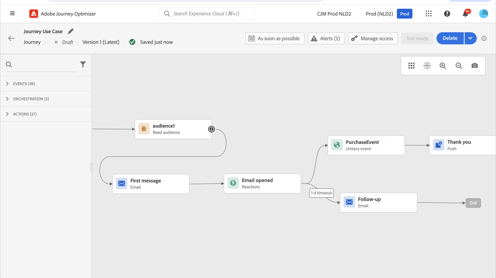
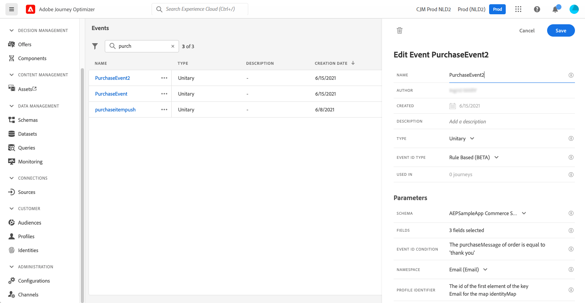

# 用例：发送多渠道消息{#send-multi-channel-messages}

本节介绍结合读取区段、事件、反应事件和电子邮件/推送消息的用例。

## 用例描述

在此使用案例中，我们希望向属于特定区段的所有客户发送第一条消息（电子邮件和推送）。

根据客户对第一条报文的反应，我们希望发送特定的报文。

收到第一条消息后，我们等待一天，以便客户打开推送或电子邮件。 如果没有反应，我们向他们发送一封跟进电子邮件。

然后，我们等待购买，并发送推送消息以感谢客户。

## 先决条件

要使此用例正常工作，您需要配置以下内容：

* 适用于亚特兰大、旧金山或西雅图（1980年后出生）的所有客户的区段。
* 购买事件

### 创建区段

在我们的历程中，我们希望利用特定的客户群体。 属于该区段的所有个人都会进入历程并按照不同的步骤操作。 在我们的示例中，我们需要一个区段，以居住亚特兰大、旧金山或西雅图且出生于1980年之后的所有客户为目标。

有关区段的更多信息，请参阅此 [页面](../segment/about-segments.md).

1. 从CUSTOMER菜单部分，选择 **[!UICONTROL 区段]**.

1. 单击 **[!UICONTROL 创建区段]** 按钮。

1. 在 **[!UICONTROL 区段属性]** 窗格中，输入区段的名称。

1. 将所需字段从左窗格拖放到中心工作区，然后根据需要进行配置。 在此示例中，我们使用 **城市** 和 **出生年份** 属性字段。

1. 单击&#x200B;**[!UICONTROL 保存]**。

   

该区段现已创建并准备就绪，可在您的历程中使用。 使用 **读取区段** 活动时，您可以使属于该区段的所有个人进入历程。

### 配置事件

您需要配置在客户购买时发送到您的历程的事件。 当历程收到事件时，将触发“感谢”消息。

为此，我们使用基于规则的事件。 有关事件的详细信息，请参阅此 [页面](../event/about-events.md).

1. 在“管理”菜单部分中，选择 **[!UICONTROL 配置]**，然后单击 **[!UICONTROL 事件]**. 单击 **[!UICONTROL 创建事件]** 以创建新事件。

1. 输入事件的名称。

1. 在 **[!UICONTROL 事件ID类型]** 字段，选择 **[!UICONTROL 基于规则]**.

1. 定义 **[!UICONTROL 架构]** 和有效负荷 **[!UICONTROL 字段]**. 您可以使用多个字段，例如购买的产品、购买日期和购买ID。

1. 在 **[!UICONTROL 事件ID条件]** 字段，定义系统用于识别触发历程的事件的条件。 例如，您可以添加 `purchaseMessage` 字段并定义以下规则： `purchaseMessage="thank you"`

1. 定义 **[!UICONTROL 命名空间]** 和 **[!UICONTROL 配置文件标识符]**.

1. 单击&#x200B;**[!UICONTROL 保存]**。

   

事件现已配置完毕，可随时用于您的旅程。 使用相应的事件活动，您可以在客户每次购买时触发操作。

## 设计旅程

1. 通过开始历程 **读取区段** 活动。 选择之前创建的区段。 属于该区段的所有个人均进入旅程。

   

1. 放置 **电子邮件** 操作活动，并定义“第一条消息”的内容。 此消息将发送给历程中的所有个人。 请参阅此 [部分](../email/create-email.md) 了解如何配置和设计电子邮件。

   

1. 将光标放在电子邮件活动上并单击“+”符号可创建新路径。

1. 在第一个路径中，添加 **反应** 事件并选择 **推送已打开**. 当属于区段的个人打开第一条消息的推送版本时，将触发该事件。

1. 在第二个路径中，添加 **反应** 事件并选择 **电子邮件已打开**. 当个人打开电子邮件时会触发该事件。

1. 在其中一个反应活动中，检查 **定义事件超时** 框，定义持续时间（在本例中为1天）并选中 **设置超时路径**. 这会为未打开推送或电子邮件第一条消息的个人创建另一个路径。

   >[!NOTE]
   >
   >为多个事件（本例中是两个反应）配置超时时，您只需为其中一个事件配置超时。

1. 在超时路径中，删除 **电子邮件** 操作活动，并定义“跟进”消息的内容。 此消息将发送给未在第二天打开电子邮件或推送第一条消息的个人。 请参阅此 [部分](../email/create-email.md) 了解如何配置和设计电子邮件。

1. 将三个路径连接到之前创建的购买事件。 当个人购买商品时会触发该事件。

1. 事件后，放置 **推送** 操作活动，并定义“感谢”消息的内容。 请参阅此 [部分](../push/create-push.md) 以了解如何配置和设计推送。

## 测试并发布历程

1. 在测试历程之前，请验证历程是否有效以及是否没有错误。

1. 单击 **测试** 切换按钮（位于右上角）以激活测试模式。 定义您希望测试用户档案输入测试的方式：单个用户档案，或一次最多100个用户档案。 请参阅此 [部分](testing-the-journey.md) 以了解如何使用测试模式。

1. 当历程准备就绪时，使用 **Publish** 按钮（位于右上角）。
