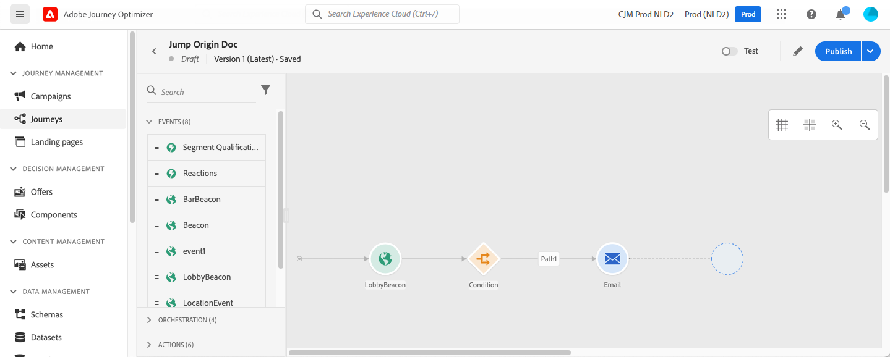
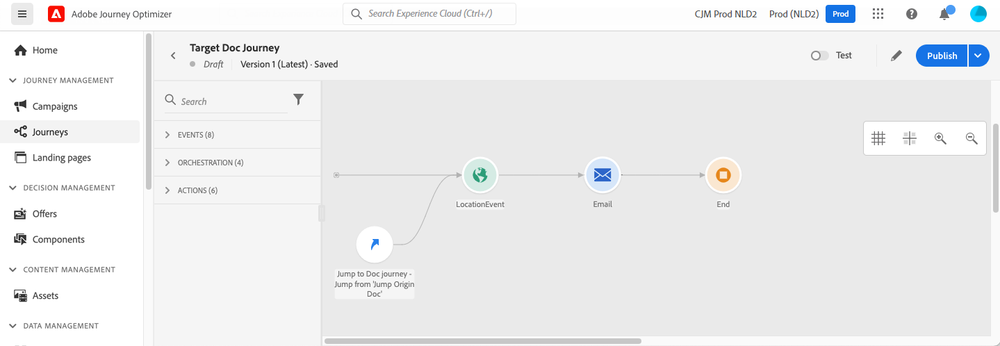
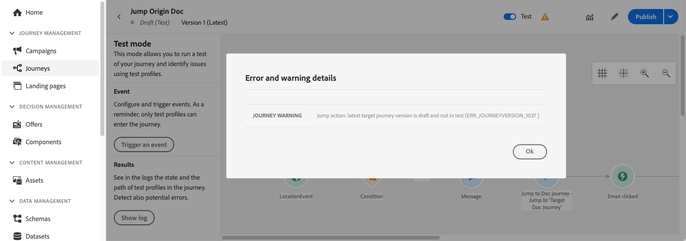

# 从一个历程跳转到另一个历程 {#jump}

>[!CONTEXTUALHELP]
>id="ajo_journey_jump"
>title="跳转活动"
>abstract="您可以通过跳转操作活动，将个人从一个历程推送到另一个历程。 使用此功能，您可以简化非常复杂历程的设计，并根据常见且可重用的历程模式生成历程。"

**[!UICONTROL 跳转]**&#x200B;操作活动允许您将个人从一个历程推送到另一个历程。 此功能允许您：

* 通过将非常复杂的历程分成若干个历程来简化其设计
* 基于通用且可重用的历程模式构建历程

在起源历程中，添加&#x200B;**[!UICONTROL 跳转]**&#x200B;活动并选择目标历程。 当个人进入&#x200B;**[!UICONTROL 跳转]**&#x200B;步骤时，内部事件将发送到目标历程的第一个事件。 如果&#x200B;**[!UICONTROL 跳转]**&#x200B;操作成功，个人将继续在历程中前进。 该行为与其他操作类似。

在目标历程中，**[!UICONTROL 跳转]**&#x200B;活动在内部触发的第一个事件在历程中生成单个流。

## 生命周期 {#jump-lifecycle}

假设您在历程A中为历程B添加了&#x200B;**[!UICONTROL 跳转]**&#x200B;活动。历程A是&#x200B;**起源历程**，历程B是&#x200B;**目标历程**。

以下是执行过程的不同步骤：

**历程A**&#x200B;是从外部事件触发的：

1. 历程A接收与个人相关的外部事件。
1. 个人达到&#x200B;**[!UICONTROL 跳转]**&#x200B;步骤。
1. 个人将被推送到历程B，并在&#x200B;**[!UICONTROL 跳转]**&#x200B;步骤后进入历程A中的后续步骤。

在历程B中，第一个事件通过历程A中的&#x200B;**[!UICONTROL 跳转]**&#x200B;活动在内部触发：

1. 历程B接收来自旅程A的内部事件。
1. 个人开始在历程B中流动。

>[!NOTE]
>
>历程B也可以通过外部事件触发。

### 跳转期间的配置文件行为 {#jump-profile-behavior}

当个人资料到达&#x200B;**[!UICONTROL 跳转]**&#x200B;步骤时，它在原始历程(历程A)中继续前进，同时进入目标历程(历程B)。 因此，用户档案在两个历程中同时处于活动状态。

这意味着：

* 在“跳转”活动后，用户档案将完成历程A中的所有剩余步骤（例如，跟进等待或关闭操作）。
* 该配置文件还开始从历程B的第一事件开始流过历程B，而不依赖于事件A。
* 执行跳转时，如果配置文件在历程B中处于&#x200B;**活动**&#x200B;状态，则它将&#x200B;**不会**&#x200B;再次进入历程B。 历程A正常继续；未报告错误。

>[!NOTE]
>
>上述情况（配置文件在历程B中处于活动状态）导致&#x200B;**静默跳过**：未引发任何错误，历程A正常继续。 在其他情况下，跳转可能&#x200B;**失败**，历程A应用其标准的操作错误处理。 有关完整案例列表，请参阅[运行时失败](#jump-troubleshoot)。

## 最佳实践和限制 {#jump-limitations}

使用这些准则可保证跳转活动行为的可预测性和安全性。

### 创作 {#jump-limitations-authoring}

* **[!UICONTROL 跳转]**&#x200B;活动仅在使用命名空间的历程中可用。
* 您只能跳转到使用与起源历程相同的命名空间的历程。
* 您无法跳转到以&#x200B;**受众资格**&#x200B;事件或&#x200B;**读取受众**&#x200B;开始的历程。
* 您不能在同一历程中具有&#x200B;**[!UICONTROL 跳转]**&#x200B;活动和&#x200B;**受众资格**&#x200B;事件或&#x200B;**读取受众**。
* 您可以在历程中包含所需数量的跳转&#x200B;**[!UICONTROL 跳转]**&#x200B;活动。 执行&#x200B;**[!UICONTROL 跳转]**&#x200B;后，您可以添加任何需要的活动。
* 您可以根据需要设置任意多个跳转级别。 例如，历程A跳转到历程B，再跳转到历程C，等等。
* 目标历程还可以包含所需数量的跳转&#x200B;**[!UICONTROL 跳转]**&#x200B;活动。
* 不支持循环模式。 无法将两个或更多历程链接在一起，这会造成无限循环。 **[!UICONTROL 跳转]**&#x200B;活动配置屏幕阻止您执行此操作。

### 执行 {#jump-limitations-exec}

* 执行&#x200B;**[!UICONTROL 跳转]**&#x200B;活动时，将触发目标历程的最新版本。
* 同一个历程中只能出现一次独特个人。 因此，如果从起源历程推送的个人已在目标历程中，则该个人将不会进入目标历程。 **[!UICONTROL 跳转]**&#x200B;活动不会报告任何错误，因为这是正常行为。

## 设计策略：小型子历程 {#jump-strategy}

复杂的客户历程可能会迅速变得难以构建和维护，尤其是在引入其他渠道或接触点的情况下。 即使是具有几个里程碑的历程，也可能暴露客户可以采用的20个或更多独特路径，并且复杂性会随着每次添加呈指数增长。

管理此问题的实用方法是将大型历程分解为更小、更集中的子历程（每个业务阶段或里程碑一个），并使用&#x200B;**[!UICONTROL 跳转]**&#x200B;活动将其连接。 这使得每个历程都可以读取、测试和独立维护。

**步骤1 — 可视化端到端历程**

绘制整个客户历程并确定其高级阶段。 例如，忠诚度入门培训历程可能包括三个不同的阶段：下载移动应用程序、进行第一次交易、进行第二次交易。

**步骤2 — 为阶段添加注释并定义子历程**

标记每个阶段的边界并定义其业务目标。 每个阶段都成为具有明确进入条件和目标的候选子历程。

**步骤3 — 生成并连接子历程**

在Journey Optimizer中将每个阶段构建为单独的历程，然后使用&#x200B;**[!UICONTROL 跳转]**&#x200B;活动将配置文件从一个子历程传递到下一个子历程。 结果是形成一组更简单、可重用的历程，这些历程结合起来产生完整的端到端体验，并降低出现错误的风险。

>[!TIP]
>
>有关使用多阶段忠诚度计划的示例，请参阅[多阶段忠诚度历程](journeys-uc.md#multi-phase-loyalty)。

## 配置跳转活动 {#jump-configure}

1. 设计您的&#x200B;**起源历程**。

   

1. 在历程的任何步骤，从&#x200B;**[!UICONTROL ACTIONS]**&#x200B;类别添加&#x200B;**[!UICONTROL 跳转]**&#x200B;活动。 添加标签和描述。

   跳转活动配置中的

1. 在&#x200B;**目标历程**字段中单击。
列表会显示草稿、实时或测试模式中的所有历程版本。 使用其他命名空间或以**历程资格**&#x200B;事件开头的受众不可用。 还会过滤掉会创建循环模式的目标历程。

   

   >[!NOTE]
   >
   >您可以单击右侧的&#x200B;**打开目标历程**&#x200B;图标，以在新选项卡中打开目标历程。

1. 选择要跳转到的目标历程。
**First event**&#x200B;字段已使用目标历程第一个事件的名称预填充。 如果您的目标历程包含多个事件，则仅在第一个事件上允许&#x200B;**[!UICONTROL 跳转]**。

   使用表达式编辑器为跳转活动配置

1. **操作参数**&#x200B;部分显示目标事件的所有字段。 使用来自源事件或数据源的字段映射每个字段，与其他类型的操作一样。 此信息将在运行时传递到目标历程。
1. 添加后续活动以完成您的起源历程。

   

   >[!NOTE]
   >
   >个人身份会自动映射。 此信息在界面中不可见。

您的&#x200B;**[!UICONTROL 跳转]**&#x200B;活动已配置。 一旦您的历程处于实时或测试模式，达到&#x200B;**[!UICONTROL 跳转]**&#x200B;步骤的个人将被推送到目标历程。

当在历程中配置&#x200B;**[!UICONTROL 跳转]**&#x200B;活动时，将在目标历程的开头自动添加&#x200B;**[!UICONTROL 跳转]**&#x200B;条目图标。 这有助于您确定历程既可以从外部触发，也可以从内部从&#x200B;**[!UICONTROL 跳转]**&#x200B;活动触发。

## 疑难解答 {#jump-troubleshoot}

### 配置错误

以下问题会导致跳转无法正常工作，并在历程画布中显示为错误：

* 目标历程不再存在。
* 目标历程是草稿、已关闭或已停止。
* 目标历程的第一个事件已更改，映射已损坏。

### 运行时失败

在以下情况下，跳转步骤在历程A中视为&#x200B;**失败的操作**。历程A应用标准的操作错误处理并继续：

* 现有目标历程实例已终止，并且目标历程不可重入。
* 目标历程上配置了重新进入时段。 即使原则上允许重新进入，在期间过去之前，配置文件也无法重新进入（跳转失败并显示“期间的非重新进入”状态）。
* 找不到目标历程版本、该版本已被删除、处于完成状态或已停止。
