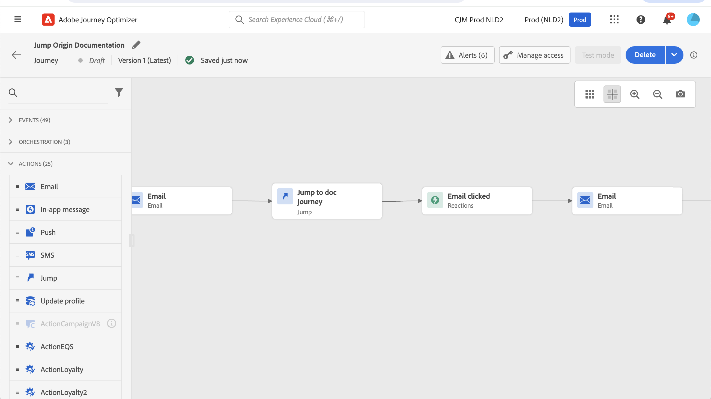
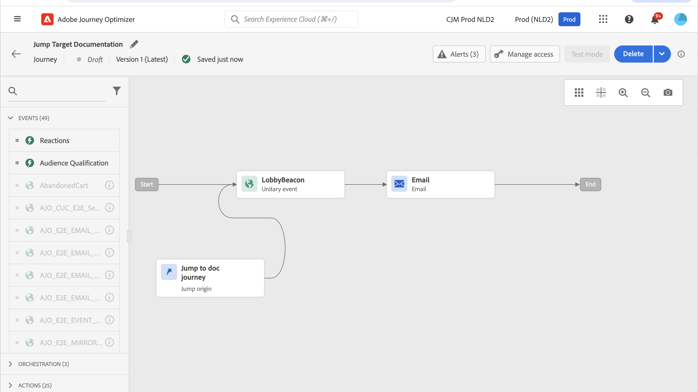

# 从一个历程跳转到另一个历程 {#jump}

>[!CONTEXTUALHELP]
>id="ajo_journey_jump"
>title="跳转活动"
>abstract="您可以通过跳转操作活动，将个人从一个历程推送到另一个历程。使用此功能，您可以简化非常复杂历程的设计，并根据常见且可重用的历程模式构建历程。"

此 **[!UICONTROL 跳转]** 利用操作活动，可将个人从一个历程推送到另一个历程。 此功能允许您：

* 通过将非常复杂的历程分成若干个历程来简化其设计
* 基于通用且可重用的历程模式构建历程

在起源历程中，只需添加 **[!UICONTROL 跳转]** 活动并选择目标历程。 当个人进入 **[!UICONTROL 跳转]** 步骤，将内部事件发送到目标历程的第一个事件。 如果 **[!UICONTROL 跳转]** 操作成功，个人将继续在历程中前进。 该行为与其他操作类似。

在目标历程中，由内部触发的第一个事件 **[!UICONTROL 跳转]** 活动将构成历程中的各个流程。

## 生命周期

假设您已添加 **[!UICONTROL 跳转]** 历程A中的活动到历程B。历程A是 **起源历程** 历程B， **目标历程**.
以下是执行过程的不同步骤：

**历程A** 从外部事件触发：

1. 历程A接收与个人相关的外部事件。
1. 个人到达 **[!UICONTROL 跳转]** 步骤。
1. 该个人将被推送到历程B，然后继续到历程A中的后续步骤。 **[!UICONTROL 跳转]** 步骤。

在历程B中，第一个事件是通过 **[!UICONTROL 跳转]** 历程A中的活动：

1. 历程B从历程A收到了一个内部事件。
1. 个人开始流入历程B。

>[!NOTE]
>
>历程B也可以通过外部事件触发。

## 最佳实践和限制

### 创作

* 此 **[!UICONTROL 跳转]** 活动仅适用于使用命名空间的历程。
* 您只能跳转到使用与起源历程相同的命名空间的历程。
* 您无法跳转到以 **受众资格** 事件或 **读取受众**.
* 您无法拥有 **[!UICONTROL 跳转]** 活动和 **受众资格** 事件或 **读取受众** 在同一历程中。
* 您可以包含任意数量的 **[!UICONTROL 跳转]** 旅程中所需的活动。 之后 **[!UICONTROL 跳转]**&#x200B;中，您可以添加所需的任何活动。
* 您可以根据需要设置任意多个跳转级别。 例如，历程A跳转到旅程B，再跳转到旅程C，等等。
* 目标历程还可以包括尽可能多的 **[!UICONTROL 跳转]** 根据需要执行活动。
* 不支持循环模式。 无法将两个或更多历程链接在一起，这会产生无限循环。 此 **[!UICONTROL 跳转]** 活动配置屏幕会阻止您执行此操作。

### 执行

* 当 **[!UICONTROL 跳转]** 执行活动，触发最新版本的Target历程。
* 像往常一样，同一个历程中只能出现一次独特个人。 因此，如果从起源历程推送的个人已在目标历程中，则该个人将不会进入目标历程。 将不会报告任何错误 **[!UICONTROL 跳转]** 活动，因为这是正常行为。

## 配置跳转活动

1. 设计您的 **起源历程**.

   

1. 在历程的任何步骤中，添加 **[!UICONTROL 跳转]** 活动，从 **[!UICONTROL 操作]** 类别。 添加标签和描述。

   

1. 在 **目标历程** 字段。
列表会显示草稿、实时或测试模式中的所有历程版本。 使用其他命名空间或以开头的历程 **受众资格** 事件不可用。 还会过滤掉会创建循环模式的目标历程。

   

   >[!NOTE]
   >
   >您可以单击 **打开目标历程** 图标，以在新选项卡中打开目标历程。

1. 选择要跳转到的目标历程。
此 **第一个事件** 字段预填充了目标历程第一个事件的名称。 如果您的目标历程包含多个事件，则 **[!UICONTROL 跳转]** 仅允许在第一个事件中使用。

   

1. 此 **操作参数** 部分显示目标事件的所有字段。 与其他类型的操作一样，将每个字段映射到来自源事件或数据源的字段。 此信息将在运行时传递到目标历程。
1. 添加后续活动以完成您的起源历程。

   

   >[!NOTE]
   >
   >个人身份会自动映射。 此信息在界面中不可见。

您的 **[!UICONTROL 跳转]** 活动已配置。 一旦您的旅程处于实时状态或测试模式，个人就会到达 **[!UICONTROL 跳转]** 步骤将从推送到目标历程。

当 **[!UICONTROL 跳转]** 活动在历程中进行配置， **[!UICONTROL 跳转]** 进入图标会自动添加到目标历程的开头。 这有助于您识别历程既可以从外部触发，也可以从内部触发。 **[!UICONTROL 跳转]** 活动。

## 故障排除

发布历程或处于测试模式时，如果出现以下情况，将发生错误：
* 目标历程不再存在
* 目标历程为草稿、已关闭或已停止
* 如果目标历程的第一个事件已更改并且映射已损坏

