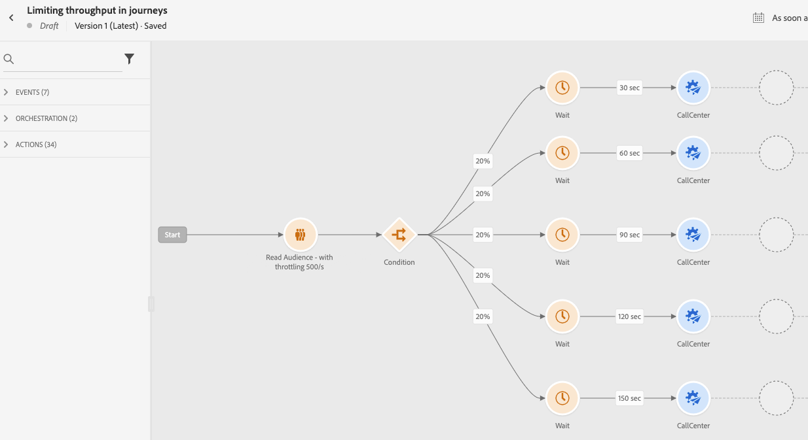

# 用例：使用外部数据源和自定义操作限制吞吐量{#limit-throughput}

## 用例描述

Adobe Journey Optimizer允许从业人员通过使用自定义操作和数据源，向外部系统发送API调用。

这可以通过完成：

* **数据源**:从外部系统收集信息并在历程上下文中使用，例如获取有关用户档案城市的天气信息，并根据该信息制定专用历程流。

* **自定义操作**:将信息发送到外部系统，例如，使用Journey Optimizer的编排功能以及用户档案信息、受众数据和journey context通过外部解决方案发送电子邮件。

如果您使用外部数据源或自定义操作，则可能需要通过限制历程吞吐量来保护外部系统：单一历程最多为5000个实例/秒，区段触发的历程最多为20000个实例/秒。 您可以在端点级别定义上限限制，以避免通过Journey Optimizer的上限API压倒那些外部系统。 但是，达到限制后的所有其余请求都将被丢弃。

在此部分中，您将找到可用于优化吞吐量的解决方法。 有关如何与外部系统集成的更多信息，请参阅此 [页面](../configuration/external-systems.md).

## 实施

对于 **区段触发的历程**，您可以定义将影响历程吞吐量的读取区段活动的限制速率。  [了解详情](../building-journeys/read-segment.md)

您可以将此值从每秒500个实例修改为每秒20 000个实例。 如果您需要的速度低于500/s，您还可以通过等待活动添加“百分比拆分”条件，以将历程拆分为多个分支，并在特定时间执行这些分支。

让我们举一个例子 **区段触发的历程** 与 **10 000个用户档案** 并向外部系统发送数据支持 **每秒100次请求**.

1. 您可以定义读取区段以读取吞吐量为500个用户档案/秒的用户档案，这意味着需要20秒才能读取所有用户档案。 在第2个1中，您将看到500个，第2个500个，等等。

1. 然后，您可以添加“百分比拆分”条件活动，其中20%拆分，以便在每个分支中每秒拥有100个用户档案。

1. 之后，在每个分支中使用特定计时器添加等待活动。 我们设置了30秒的等待时间。 每秒有100个用户档案将流入每个分支。

   * 在第1分支上，他们将等待30秒，这意味着：
      * 在第21天，100个用户档案将等待第231个
      * 在第2天，100个用户档案将等待第2个32，等等。
   * 在第2分支上，他们将等待60秒，这意味着：
      * 在第2个1月，100个用户档案将等待第2个61(1&#39;01&quot;)
      * 在第2天，100个用户档案将等待第262(1&#39;02&quot;)等待。
   * 我们知道我们最多需要20秒才能读取所有用户档案，因此每个分支之间将不会发生重叠，其次20是用户档案将流入条件的最后一个分支。 在第231到第251之间，将处理分支1中的所有用户档案。 在第261(1&#39;01&quot;)和第281(1&#39;21&quot;)之间，将处理分支2中的所有用户档案，等等。

   * 作为护栏，您还可以添加第六个分支，使每个分支的用户档案少于100个，尤其是当外部系统仅支持100个请求/秒时。

>[!IMPORTANT]
>
>与任何解决方法一样，请在投入生产之前对该解决方案进行彻底测试，以确保它能满足您的需求。

作为额外的护栏，您还可以使用上限功能。

>[!NOTE]
>
>与通过全局应用于沙盒的所有历程来保护端点的上限功能不同，此解决方法仅在历程级别起作用。 这意味着，如果多个历程并行运行且定向的是同一端点，则在设计历程时需要考虑这一点。 因此，此解决方法不适用于每个用例。

