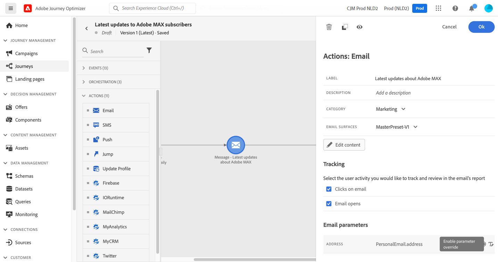

# 向列表的订阅者发送消息 {#send-a-message-to-the-subscribers-of-a-list}

此用例的目的在于创建历程，以向列表的订阅者发送消息。

在此示例中，使用了[!DNL Adobe Experience Platform]中的&#x200B;**[!UICONTROL 同意和偏好设置详细信息]**&#x200B;字段组。 若要查找此字段组，请从&#x200B;**[!UICONTROL 数据管理]**&#x200B;菜单中选择&#x200B;**[!UICONTROL 架构]**。 在&#x200B;**[!UICONTROL 字段组]**&#x200B;选项卡上，在搜索字段中输入字段组的名称。


要配置此历程，请执行以下步骤：

1. 创建以&#x200B;**[!UICONTROL 读取]**&#x200B;活动开始的历程。 [了解详情](journey-gs.md)。
1. 向历程添加&#x200B;**[!UICONTROL 电子邮件]**&#x200B;操作活动。 [了解详情](journeys-message.md)。
1. 在&#x200B;**[!UICONTROL 电子邮件]**&#x200B;活动设置的&#x200B;**[!UICONTROL 电子邮件参数]**&#x200B;部分中，将默认电子邮件地址(`PersonalEmail.adress`)替换为列表订阅者的电子邮件地址：

   1. 单击&#x200B;**[!UICONTROL 地址]**&#x200B;字段右侧的&#x200B;**[!UICONTROL 启用参数覆盖]**&#x200B;图标，然后单击&#x200B;**[!UICONTROL 编辑]**&#x200B;图标。

      

   1. 在表达式编辑器中，输入用于检索订阅者电子邮件地址的表达式。 [了解详情](expression/expressionadvanced.md)。

      此示例显示一个包含映射字段引用的表达式：

      ```json
      #{ExperiencePlatform.Subscriptions.profile.consents.marketing.email.subscriptions.entry('daily-email').subscribers.firstEntryKey()}
      ```

      在此示例中，使用以下函数：

      | 函数 | 描述 | 示例 |
      | --- | --- | --- |
      | `entry` | 根据选定的命名空间引用映射元素 | 请参阅特定订阅列表 |
      | `firstEntryKey` | 检索映射的第一个条目键 | 检索订阅者的第一个电子邮件地址 |

      在此示例中，订阅列表名为`daily-email`。 电子邮件地址在`subscribers`映射中定义为键，该映射链接到订阅列表映射。

      阅读有关表达式中[对字段](expression/field-references.md)的引用的更多信息。

      

   1. 在&#x200B;**[!UICONTROL 添加表达式]**&#x200B;对话框中，单击&#x200B;**[!UICONTROL 确定]**。

>[!CAUTION]
>
>仅应针对特定用例使用电子邮件地址覆盖。大多数情况下，无需更改电子邮件地址，应使用&#x200B;**[!UICONTROL 执行字段]**&#x200B;中定义为主地址的值。[了解详情](../configuration/primary-email-addresses.md)
