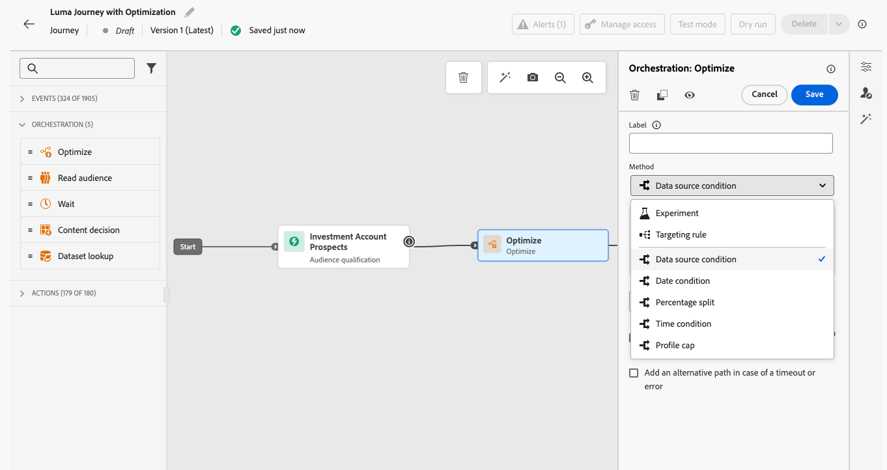
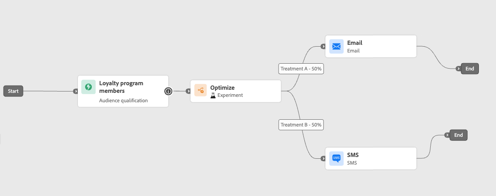
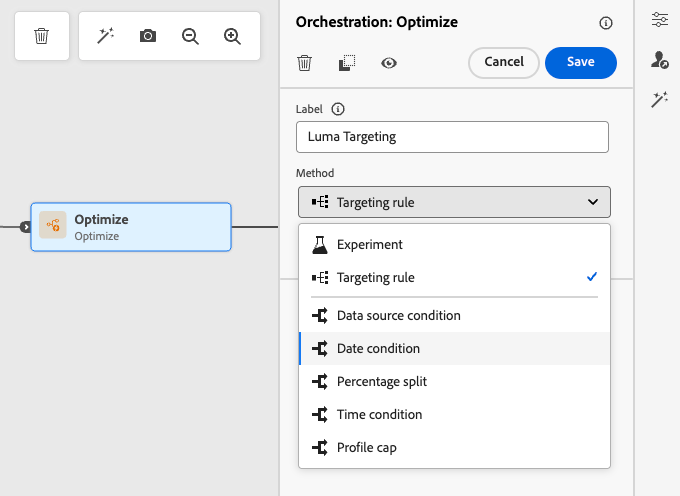

# 优化活动 {#journey-path-optimization}

>[!CONTEXTUALHELP]
>id="ajo_journey_optimize"
>title="优化活动"
>abstract="通过&#x200B;**优化**&#x200B;活动，您可以基于特定标准（包括实验、目标选择和特定条件）创建多条路径，由此定义个人在您的历程中的进度情况。"

>[!AVAILABILITY]
>
>此功能为限量发布版。请联系 Adobe 代表以获取访问权限。

通过&#x200B;**优化**&#x200B;活动，您可以根据特定条件（包括试验、定位和特定条件）创建多个&#x200B;**路径**，从而定义个人如何完成您的历程 — 确保最大程度的参与并成功创建高度自定义且有效的历程。

历程&#x200B;**路径**&#x200B;可由以下任意项组成：通信排序、通信间隔时间、通信次数或这三个变量的任意组合。

例如，一个路径可以包含一封电子邮件，另一个路径可以包含两封短信消息，第三个路径可以包含一封电子邮件，两个小时的“等待”节点，然后是一封短信消息。

<!--With this feature, [!DNL Journey Optimizer] empowers you with the tools to deliver personalized and optimized paths to your audience, ensuring maximum engagement and success to create highly customized and effective journeys.-->

通过&#x200B;**优化**&#x200B;活动，可以对生成的路径执行以下操作：

* 运行[路径实验](#experimentation)
* 在每个历程路径中利用[定位](#targeting)规则
* 将[条件](#conditions)应用到您的路径

历程上线后，系统会根据定义的标准评估用户档案，并根据匹配标准，将用户档案沿历程中的相应路径发送。

## 使用试验 {#experimentation}

>[!CONTEXTUALHELP]
>id="ajo_path_experiment_success_metric"
>title="成功量度"
>abstract="成功量度用于跟踪和评估试验中表现最佳的处理方法。"

通过试验可以基于随机拆分测试不同的路径，以根据预定义的成功量度确定哪个路径的表现最佳。

要在历程中设置路径试验，请执行以下步骤。

假设您要比较三个路径：

* 一条路径，一封电子邮件；
* **[!UICONTROL Wait]**&#x200B;节点为两天且包含电子邮件的第二个路径；
* 第三个路径，其中包含电子邮件，然后是短信消息。

1. 从&#x200B;**[!UICONTROL 业务流程]**&#x200B;部分中，将&#x200B;**[!UICONTROL 优化]**&#x200B;活动拖放到历程画布中。

1. 添加可选标签，这对于在报告和测试模式日志中标识活动很有用。

1. 从&#x200B;**[!UICONTROL 方法]**&#x200B;下拉列表中选择&#x200B;**[!UICONTROL 试验]**。

   {width=65%}

1. 单击&#x200B;**[!UICONTROL 创建试验]**。

1. 选择要为试验设置的&#x200B;**[!UICONTROL 成功量度]**。 在[本节](success-metrics.md)中了解关于可用量度和如何配置列表的详细信息。

   <!--Need to have the list of all default metrics + a description for each.
    Explain why the metric selection is important.
    Are there custom metrics? If so explain.
    If possible, add best practices and examples for each metrics (could even be a dedicated section).
    Consider adding an example in this step: For this example, select this metric to test xxx.
    -->

   {width=80%}

1. 您可以选择向投放添加&#x200B;**[!UICONTROL 维持]**&#x200B;组。 该组不会从此试验输入任何路径。

   >[!NOTE]
   >
   >打开切换栏将自动获取您群体的10%。 您可以根据需要调整此百分比。

   <!--
    DOES THIS APPLY TO PATH EXPERIMENT?
    IMPORTANT: When a holdout group is used in an action for path experimentation, the holdout assignment only applies to that specific action. After the action is completed, profiles in the holdout group will continue down the journey path and can receive messages from other actions. Therefore, ensure that any subsequent messages do not rely on the receipt of a message by a profile that might be in a holdout group. If they do, you may need to remove the holdout assignment.-->

1. 您可以为每个&#x200B;**[!UICONTROL 待遇]**&#x200B;分配精确百分比，或者只需打开&#x200B;**[!UICONTROL 平均分配]**&#x200B;切换栏。

   {width=80%}

1. 单击&#x200B;**[!UICONTROL 创建]**。

1. 为从试验生成的每个分支定义所需的元素，例如：

   * 将[电子邮件](../email/create-email.md)活动拖放到第一个分支（**处理A**）上。

   * 将为期两天的[等待](wait-activity.md)活动拖放到第一个分支上，然后是[电子邮件](../email/create-email.md)活动（**处理B**）。

   * 将[电子邮件](../email/create-email.md)活动拖放到第三个分支上，后跟[短信](../sms/create-sms.md)活动（**处理C**）。

   {width=100%}

1. 可选，在超时或错误的情况下使用&#x200B;**[!UICONTROL 添加替代路径]**&#x200B;来定义回退操作。 [了解详情](using-the-journey-designer.md#paths)

1. 选择渠道操作并使用&#x200B;**[!UICONTROL 编辑内容]**&#x200B;按钮访问设计工具。

   {width=70%}

1. 从该位置，您可以使用左窗格在试验中每个操作的不同内容之间导航。 选择每个内容并根据需要进行设计。

   {width=100%}

1. [发布](publishing-the-journey.md)您的历程。

历程开始后，将随机分配用户以沿着不同路径依次访问。 [!DNL Journey Optimizer]跟踪哪个路径效果最佳并提供可操作分析。

使用历程路径试验报告跟踪您的旅程是否成功。 [了解详情](../reports/journey-global-report-cja-experimentation.md)

### 试验用例 {#uc-experiment}

以下示例显示如何将&#x200B;**[!UICONTROL Optimize]**&#x200B;活动与&#x200B;**[!UICONTROL Experiment]**&#x200B;方法结合使用，以确定哪条路径总体效果最佳。

+++渠道有效性

测试通过电子邮件发送第一条消息还是通过短信发送第一条消息是否会提高转化率。

➡️使用转化率作为成功量度（例如：购买、注册）。

+++

+++消息发送频率

运行试验以检查在一周内发送一封电子邮件还是发送三封电子邮件是否会导致更多购买。

➡️使用购买或取消订阅率作为成功量度。

+++

+++通信之间的等待时间

比较24小时等待与跟进前72小时的等待，以确定哪个时间可最大化参与。

➡️使用点进率或收入作为成功量度。

+++

## 利用目标选择 {#targeting}

>[!CONTEXTUALHELP]
>id="ajo_path_targeting_fallback"
>title="什么是后备路径？"
>abstract="回退路径可在没有符合条件的定向规则时，让受众进入备用路径。 如果您未选择此选项，任何不符合定向规则的受众将不会进入回退路径，而是直接退出历程。"

定位规则允许您根据特定受众区段<!-- depending on profile attributes or contextual attributes-->确定客户必须符合哪些特定规则或资格才有资格进入历程路径之一。

与实验（随机分配给定路径）不同，定位是确定性的，可确保正确的受众或用户档案进入指定的路径。

<!--With targeting, specific rules can be defined based on:

* **User profile attributes** such as location (eg. geo-targeting), age, or preferences. For example, users in the US receive a "Golden Gate" promotion, while users in France receive an "Eiffel Tower" promotion.

* **Contextual data** such as device type (eg. device-targeting), time of day, or session details. For example, desktop users receive desktop-optimized content, while mobile users receive mobile-optimized content.

* **Audiences** which can be used to include or exclude profiles that have a particular audience membership.-->

要在历程中设置定位，请执行以下步骤。

1. 从&#x200B;**[!UICONTROL 业务流程]**&#x200B;部分中，将&#x200B;**[!UICONTROL 优化]**&#x200B;活动拖放到历程画布中。

1. 添加可选标签，这对于在报告和测试模式日志中标识活动很有用。

1. 从&#x200B;**[!UICONTROL 方法]**&#x200B;下拉列表中选择&#x200B;**[!UICONTROL 定位规则]**。

   {width=60%}

1. 单击&#x200B;**[!UICONTROL 创建定位规则]**。

1. 使用规则生成器定义您的标准。 例如，为忠诚度计划的金会员定义规则(`loyalty.status.equals("Gold", false)`)，为其他会员定义规则(`loyalty.status.notEqualTo("Gold", false)`)。

   

1. 根据需要选择&#x200B;**[!UICONTROL 启用回退路径]**&#x200B;选项。 此操作会为不符合以上定义的任何定位规则的受众创建回退路径。

   >[!NOTE]
   >
   >如果不选择此选项，则任何不符合定位规则的受众都不会进入回退路径并退出历程。

1. 单击&#x200B;**[!UICONTROL 创建]**&#x200B;以保存您的定位规则设置。

1. 返回历程，拖放特定操作以自定义每个路径。 例如，创建一个电子邮件，为金会员提供个性化优惠，并为所有其他会员提供短信提醒。

   

1. 如果您在定义规则设置时选择了&#x200B;**[!UICONTROL 启用回退内容]**&#x200B;选项，请为自动添加的回退路径定义一个或多个操作。

   {width=70%}

1. 可选，在超时或错误的情况下使用&#x200B;**[!UICONTROL 添加替代路径]**&#x200B;以定义在出现问题时的替代操作。 [了解详情](using-the-journey-designer.md#paths)

1. 为对应于由定位规则设置定义的每个组的每个操作设计适当的内容。 您可以无缝地在每个操作的不同内容之间导航。

   

   在此示例中，设计一封电子邮件，为金会员提供特殊优惠，并为其他会员提供短信提醒。

1. [发布](publishing-the-journey.md)您的历程。

历程处于实时状态后，将处理为每个区段指定的路径，以便Gold成员使用电子邮件选件输入路径，而其他成员使用短信提醒输入路径。

使用历程报告跟踪旅程的成功情况。 [了解详情](../reports/journey-global-report-cja.md#targeting)

### 定位规则用例 {#uc-targeting}

以下示例显示如何将&#x200B;**[!UICONTROL Optimize]**&#x200B;活动与&#x200B;**[!UICONTROL 定位规则]**&#x200B;方法结合使用，以个性化不同子受众的路径。

+++特定于区段的渠道

金会员状态忠诚会员可以通过电子邮件接收个性化优惠，而所有其他会员将被定向到短信提醒。

<!--➡️ Use the revenue per profile or conversion rate as the optimization metric.-->

+++

+++基于行为的定位

已打开电子邮件但未单击的客户会收到推送通知，而完全未打开的客户则会收到短信。

<!--➡️ Use the click-through rate or downstream conversions as the optimization metric.-->

+++

+++购买历史记录定位

最近购买过产品的客户可能会进入一个简短的“感谢您+交叉销售”路径，而那些没有购买历史的客户则会进入一个更长的培养历程。

<!--➡️ Use the repeat purchase rate or engagement rate as the optimization metric.-->

+++

### 添加条件 {#conditions}

条件是一种[定位](#targeting)规则，通过它，可根据特定条件创建多个路径，以定义个人如何在您的历程中前进。

在[本节](conditions.md)中了解如何定义条件。

可以使用以下类型的条件：

* [数据Source条件](condition-activity.md#data_source_condition)
* [时间条件](condition-activity.md#time_condition)
* [百分比拆分](condition-activity.md#percentage_split)
* [日期条件](condition-activity.md#date_condition)
* [配置文件上限](condition-activity.md#profile_cap)
