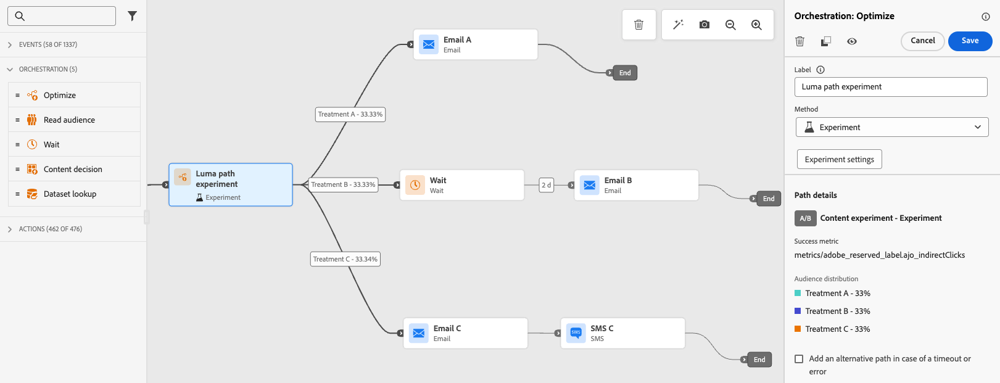
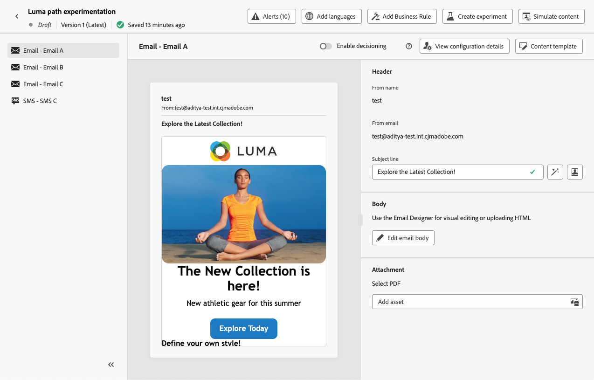
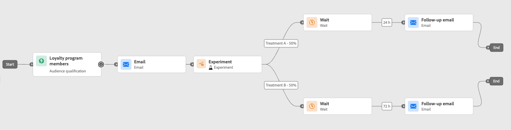

# 使用路径试验 {#experimentation}

>[!CONTEXTUALHELP]
>id="ajo_path_experiment_success_metric"
>title="成功量度"
>abstract="成功量度用于跟踪和评估试验中表现最佳的处理方法。"
>additional-url="https://experienceleague.adobe.com/zh-hans/docs/journey-optimizer/using/orchestrate-journeys/create-journey/success-metrics" text="配置和跟踪历程指标"

通过试验可以基于随机拆分测试不同的路径，以根据预定义的成功量度确定哪个路径的表现最佳。

要在历程中设置路径试验，请执行以下步骤。

假设您要比较三个路径：

* 一条路径，一封电子邮件；
* **[!UICONTROL Wait]**&#x200B;节点为两天且包含电子邮件的第二个路径；
* 第三个路径，其中包含电子邮件，然后是短信消息。

1. 从&#x200B;**[!UICONTROL 业务流程]**&#x200B;部分中，将&#x200B;**[!UICONTROL 优化]**&#x200B;活动拖放到历程画布中。

1. 添加可选标签，这对于在报告和测试模式日志中标识活动很有用。

1. 从&#x200B;**[!UICONTROL 方法]**&#x200B;下拉列表中选择&#x200B;**[!UICONTROL 试验]**。

   {width=65%}

1. 单击&#x200B;**[!UICONTROL 创建试验]**。

1. 选择要为试验设置的&#x200B;**[!UICONTROL 成功量度]**。 在[本节](success-metrics.md)中了解关于可用量度和如何配置列表的详细信息。

   {width=80%}

1. 为您的路径试验选择&#x200B;**[!UICONTROL 试验类型]**：

   * **[!UICONTROL A/B试验]** — 在测试开始时定义处理之间的流量分配。 根据您选择的主要指标评估性能；报表显示观察到的两次处理之间的提升。

   * **[!UICONTROL 多臂老虎机]** — 自动处理处理之间的流量分摊。 主要指标的表现每7天检讨一次，其权重亦作出相应调整。 报表会继续显示提升，就像A/B测试一样。

   {width=80%}

   ➡️ [了解有关A/B和多臂老虎机实验之间差异的更多信息](../content-management/mab-vs-ab.md)

1. 您可以选择向投放添加&#x200B;**[!UICONTROL 维持]**&#x200B;组。 该组不会从此试验输入任何路径。

   >[!NOTE]
   >
   >打开切换栏将自动获取您群体的10%。 您可以根据需要调整此百分比。

   <!--
    DOES THIS APPLY TO PATH EXPERIMENT?
    IMPORTANT: When a holdout group is used in an action for path experimentation, the holdout assignment only applies to that specific action. After the action is completed, profiles in the holdout group will continue down the journey path and can receive messages from other actions. Therefore, ensure that any subsequent messages do not rely on the receipt of a message by a profile that might be in a holdout group. If they do, you may need to remove the holdout assignment.
-->

1. 您可以为每个&#x200B;**[!UICONTROL 待遇]**&#x200B;分配精确百分比，或者只需打开&#x200B;**[!UICONTROL 平均分配]**&#x200B;切换栏。

   {width=80%}

1. 启用自动缩放试验以自动转出试验的入选变量。 [了解有关如何扩展入选者的更多信息](#scale-winner)

1. 单击&#x200B;**[!UICONTROL 创建]**。

1. 为从试验生成的每个分支定义所需的元素，例如：

   * 将[电子邮件](../email/create-email.md)活动拖放到第一个分支（**处理A**）上。

   * 将为期两天的[等待](wait-activity.md)活动拖放到第一个分支上，然后是[电子邮件](../email/create-email.md)活动（**处理B**）。

   * 将[电子邮件](../email/create-email.md)活动拖放到第三个分支上，后跟[短信](../mobile/create-mobile-message.md)活动（**处理C**）。

   {width=100%}

1. 或者，在超时或错误的情况下使用&#x200B;**[!UICONTROL 添加替代路径]**&#x200B;来定义回退操作。 [了解详情](using-the-journey-designer.md#paths)

1. [发布](publish-journey.md)您的历程。

<!--
    Select a channel action and use the **[!UICONTROL Edit content]** button to access the design tools.

    {width=70%}

    From there, using the left pane you can navigate between the different contents for each action in your experiment. Select each content and design it as needed.

    {width=100%}
-->

历程开始后，将随机分配用户以沿着不同路径依次访问。 [!DNL Journey Optimizer]跟踪哪个路径效果最佳并提供可操作分析。

使用历程路径试验报告跟踪您的旅程是否成功。 [了解详情](../reports/journey-global-report-cja-experimentation.md)

<!--
REMOVED WITH GA

>[!CAUTION]
>
>Do not edit the metadata of a path experiment once it has been published. Editing the metadata will disrupt the calculation and reporting of experiment results.
-->

## 试验用例 {#uc-experiment}

以下示例显示如何将&#x200B;**[!UICONTROL Optimize]**&#x200B;活动与&#x200B;**[!UICONTROL Experiment]**&#x200B;方法结合使用，以确定哪条路径总体效果最佳。

+++渠道有效性

测试通过电子邮件发送第一条消息还是通过短信发送第一条消息是否会提高转化率。

➡️使用转化率作为成功量度（例如：购买、注册）。

+++

+++消息发送频率

运行试验以检查在一周内发送一封电子邮件还是发送三封电子邮件是否会导致更多购买。

➡️使用购买或取消订阅率作为成功量度。

+++

+++通信之间的等待时间

比较24小时等待与跟进前72小时的等待，以确定哪个时间可最大化参与。

➡️使用点进率或收入作为成功量度。

+++

## 缩放入选者 {#scale-winner}

>[!AVAILABILITY]
>
>对于路径实验，缩放入选者功能仅在单一历程（事件触发和受众资格）中可用。
>
>它不适用于读取受众历程。

通过扩展入选者的范围，您可以自动或手动将试验的入选范围扩展到全体受众。 此功能确保确定入选者后，您无需持续监控试验即可扩大其影响范围和增强其有效性。

您可以在两种模式之间进行选择：

* **自动缩放**：在创建试验时，通过选择缩放入选处理的时间和条件来配置自动缩放设置，如果没有入选者，则配置回退选项。

* **手动缩放**：手动查看实验结果并启动入选处理的推出，同时保持对时间和决策的完全控制。

### 自动缩放 {#autoscaling}

自动缩放允许您根据实验结果，为何时推出入选处理或回退设置预定义的规则。

请注意，一旦发生自动缩放，手动缩放将不再可用。

要在实验中启用自动缩放，请执行以下操作：

1. 设置历程并根据需要配置试验。 [了解详情](#experimentation)

1. 在设置试验时启用自动缩放选项。

   路径试验中的

1. 选择应何时缩放入选者：

   * 一旦找到赢家。
   * 试验在选定的时间内处于活动状态。

   自动缩放时间必须安排在试验的结束日期之前。 如果将其设置为结束日期之后的时间，则会显示验证警告，并且不会发布历程。

   

1. 如果按时间范围未找到入选者，请选择回退行为：

   * 继续试验，直到按计划结束。
   * 在指定时间后缩放替代治疗。

满足所有参数后，您的入选或替代处理方式将发送给受众。

### 手动缩放 {#manual-scaling}

通过手动缩放，您能够查看实验结果，并决定何时按照自己的计划推出入选处理。

请注意，如果您在计划的自动缩放时间之前手动缩放入选者，则会取消自动缩放。

手动缩放试验的入选者：

1. 设置历程并根据需要配置试验。 [了解详情](#experimentation)

1. 让试验一直运行，直到确定入选者或实现统计学意义为止。

1. 打开您的历程，然后选择包含路径试验的&#x200B;**[!UICONTROL 优化]**&#x200B;活动。

   查看&#x200B;**[!UICONTROL 路径试验]**&#x200B;视图中的结果以确定表现最佳的处理。

   

1. 单击&#x200B;**[!UICONTROL 缩放处理]**&#x200B;以将入选处理推送到其他受众。

   <!---->

1. 从下拉菜单中选择要缩放的处理，然后单击&#x200B;**[!UICONTROL 缩放]**。

   {width=80%}

请注意，缩放处理可能需要长达一小时的时间。 手动缩放过程完成后，您将收到通知。
