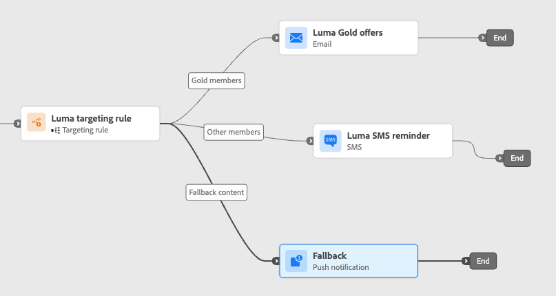
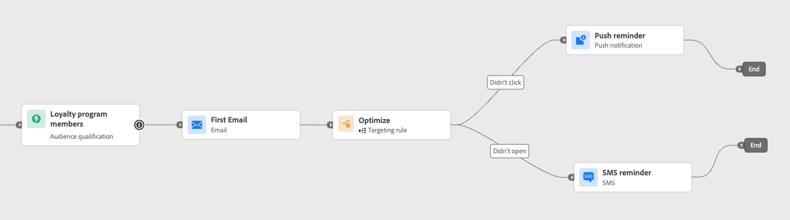

# 利用路径目标选择 {#targeting}

>[!BEGINSHADEBOX]

**在此页面上：**&#x200B;了解如何在优化活动中使用定位规则，通过可选的回退路径，确定性地将特定受众路由到正确的历程路径。

>[!ENDSHADEBOX]

>[!CONTEXTUALHELP]
>id="ajo_path_targeting_fallback"
>title="什么是后备路径？"
>abstract="回退路径可在没有符合条件的定向规则时，让受众进入备用路径。  如果未选中此选项，则任何不符合目标定位规则的受众都不会进入备用路径，而会直接退出历程。"

定位规则允许您根据特定受众区段<!-- depending on profile attributes or contextual attributes-->确定客户必须符合哪些特定规则或资格才有资格进入历程路径之一。

与实验（随机分配给定路径）不同，定位是确定性的，可确保正确的受众或用户档案进入指定的路径。

<!--
With targeting, specific rules can be defined based on:

* **User profile attributes** such as location (eg. geo-targeting), age, or preferences. For example, users in the US receive a "Golden Gate" promotion, while users in France receive an "Eiffel Tower" promotion.

* **Contextual data** such as device type (eg. device-targeting), time of day, or session details. For example, desktop users receive desktop-optimized content, while mobile users receive mobile-optimized content.

* **Audiences** which can be used to include or exclude profiles that have a particular audience membership.
-->

要在历程中设置定位，请执行以下步骤。

1. 从&#x200B;**[!UICONTROL 业务流程]**&#x200B;部分中，将&#x200B;**[!UICONTROL 优化]**&#x200B;活动拖放到历程画布中。

1. 添加可选标签，这对于在报告和测试模式日志中标识活动很有用。

1. 从&#x200B;**[!UICONTROL 方法]**&#x200B;下拉列表中选择&#x200B;**[!UICONTROL 定位规则]**。

   优化活动中的{width=60%}

1. 单击&#x200B;**[!UICONTROL 创建定位规则]**。

1. 单击&#x200B;**[!UICONTROL 创建规则]** > **[!UICONTROL 新建]**，然后使用规则生成器定义您的条件。

   {width=100%}

   例如，为忠诚度计划的金会员定义规则(`loyalty.status.equals("Gold", false)`)，为其他会员定义规则(`loyalty.status.notEqualTo("Gold", false)`)。

   金会员和非金会员的

1. 您还可以单击&#x200B;**[!UICONTROL 创建规则]** > **[!UICONTROL 选择规则]**&#x200B;以选择从&#x200B;**[!UICONTROL 规则]**&#x200B;菜单创建的现有定位规则。 [了解详情](../experience-decisioning/rules.md)

   {width=70%}

   在这种情况下，组成规则的公式将简单地复制到历程活动中。 从&#x200B;**[!UICONTROL 规则]**&#x200B;菜单对该规则进行的任何后续更改将不会影响历程的副本。

   >[!AVAILABILITY]
   >
   >[通过专用[!DNL Journey Optimizer]菜单创建定位规则](../experience-decisioning/rules.md#create)目前可供已购买Decisioning附加产品的组织使用，其他组织也可应要求使用这些规则（限量发布）。
   >
   >此容量将逐步推广到所有客户。 在此期间，请联系您的Adobe代表以获取访问权限。

1. 添加规则后，您仍可以对其进行修改。 选择&#x200B;**[!UICONTROL 编辑内联]**&#x200B;以使用规则生成器随时更新它，或选择&#x200B;**[!UICONTROL 选择规则]**&#x200B;以选取其他现有规则。

   {width=100%}

   >[!NOTE]
   >
   >编辑内联规则不会影响其源自的现有规则。

1. 根据需要选择&#x200B;**[!UICONTROL 启用回退路径]**&#x200B;选项。 此操作会为不符合以上定义的任何定位规则的受众创建回退路径。

   >[!NOTE]
   >
   >如果不选择此选项，则任何不符合定位规则的受众都不会进入回退路径并退出历程。

1. 单击&#x200B;**[!UICONTROL 创建]**&#x200B;以保存您的定位规则设置。

1. 返回历程，拖放特定操作以自定义每个路径。 例如，创建一个电子邮件，为金会员提供个性化优惠，并为所有其他会员提供短信提醒。

   

1. 如果您在定义规则设置时选择了&#x200B;**[!UICONTROL 启用回退内容]**&#x200B;选项，请为自动添加的回退路径定义一个或多个操作。

   不合格配置文件的{width=70%}

1. 或者，在超时或错误的情况下使用&#x200B;**[!UICONTROL 添加替代路径]**&#x200B;以定义在出现问题时的替代操作。 [了解详情](using-the-journey-designer.md#paths)

1. 为对应于由定位规则设置定义的每个组的每个操作设计适当的内容。

   在此示例中，设计一封电子邮件，其中为金会员提供特殊优惠，并为其他会员提供短信提醒。<!--You can seamlessly navigate between the different contents for each action. -->

1. [发布](publish-journey.md)您的历程。

历程处于实时状态后，将处理为每个区段指定的路径，以便Gold成员使用电子邮件选件输入路径，而其他成员使用短信提醒输入路径。

使用历程报告跟踪旅程的成功情况。 [了解详情](../reports/journey-global-report-cja.md#targeting)

## 定位规则用例 {#uc-targeting}

以下示例显示如何将&#x200B;**[!UICONTROL Optimize]**&#x200B;活动与&#x200B;**[!UICONTROL 定位规则]**&#x200B;方法结合使用，以个性化不同子受众的路径。

+++特定于区段的渠道

金会员状态忠诚会员可以通过电子邮件接收个性化优惠，而所有其他会员将被定向到短信提醒。

<!--➡️ Use the revenue per profile or conversion rate as the optimization metric.-->

+++

+++基于行为的定位

已打开电子邮件但未单击的客户会收到推送通知，而完全未打开的客户则会收到短信。

<!--➡️ Use the click-through rate or downstream conversions as the optimization metric.-->

+++

+++购买历史记录定位

最近购买过产品的客户可能会进入一个简短的“感谢您+交叉销售”路径，而那些没有购买历史的客户则会进入一个更长的培养历程。

<!--➡️ Use the repeat purchase rate or engagement rate as the optimization metric.-->

+++

+++ AI知识参考

本节包含结构化知识，用于支持与本主题相关的解释、检索和问答。

要全面了解相关信息，应将此信息与本页上的文档相结合。 这两个源都不是独立的；页面描述了功能，而本节提供了其他上下文来帮助消除术语、意图、适用性和约束条件的歧义。

- **TL；DR：**&#x200B;本页介绍如何在Adobe Journey Optimizer历程中使用路径定位，根据定义的规则确定性地将特定受众区段路由到指定的历程路径。

**意图：**
- 使用优化活动和定位规则方法配置确定性路径定位
- 从“规则”菜单中创建新定位规则或重用现有规则
- 为不符合任何定位规则的用户档案定义回退路径
- 个性化不同受众区段（例如，忠诚度级别、行为、购买历史记录）的历程路径
- 修改内联定位规则，而不影响原始规则定义

**术语表：**
- **优化活动**：历程画布活动，用于通过实验（随机）或定位（确定性） *（产品特定）*&#x200B;将用户档案拆分为不同的路径
- **定位规则**：确定性资格条件，用于根据用户档案或受众属性&#x200B;*（产品特定）*&#x200B;确定用户档案进入的历程路径
- **回退路径**：不满足任何已定义定位规则&#x200B;*（产品特定）的配置文件的备用历程路径*

**护栏：**
- 路径定位当前处于“有限可用”状态；请联系您的Adobe代表以请求获取访问权限。
- 从专用的Journey Optimizer“规则”菜单创建定位规则需要Decisioning加载项或可按需使用（限量发布）。
- 从“规则”菜单中选择规则并复制到历程时，对原始规则的后续更改不会影响历程的副本。
- 编辑内联规则不会修改来源规则的原始规则。
- 如果未启用回退路径选项，则不符合任何定位规则的用户档案将完全退出历程。

**术语：**
- 规范名称：路径定位 — 首字母缩写：none — 变体：确定性路径路由，基于规则的路径拆分
- 同义词： &quot;Targeting rule&quot; = &quot;quality rule&quot; = &quot;path condition&quot;
- 请勿混淆：“定位”≠“试验”（定位是确定性的；试验是随机分配）

**常见问题解答：**
- **问：路径定位与路径实验之间有何区别？**  — 定位是确定性的：用户档案根据定义的规则输入路径。 试验是随机的：用户档案会偶然分配给路径以比较性能。
- **问：不符合任何定位规则的用户档案会发生什么情况？**  — 如果启用了回退路径选项，则他们将输入回退路径。 如果未启用，他们将完全退出历程。
- **问：能否重新使用“规则”菜单中的现有规则？**  — 是，但规则公式会复制到历程活动中；对规则菜单中的原始规则的后续更改不会影响历程的副本。
- **问：编辑定位规则内联是否会更改原始规则？**  — 否，编辑内联只会更新历程活动中的规则，而不会影响源规则。
- **问：谁可以访问路径定位？**  — 当前为有限可用；请联系您的Adobe代表以请求获取访问权限。

+++
