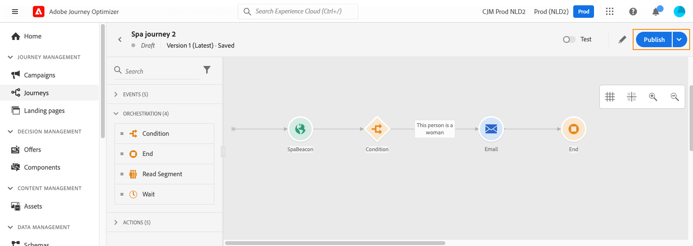

# 发布您的历程 {#publishing-the-journey}

您必须发布历程以激活它，并使其可供新配置文件进入该历程。 在发布历程之前，请验证其是否有效以及是否没有错误。 您无法发布包含错误的历程。

➡️ [在视频中了解此功能](#video)

发布历程的步骤详述如下：

1. 在发布历程之前，请验证其是否有效以及是否没有错误。 您将无法发布包含错误的历程。

   * 了解如何在[此页面](testing-the-journey.md)上测试您的历程。
   * 在[本节](../building-journeys/troubleshooting.md#checking-for-errors-before-testing)中了解如何解决您的旅程错误。

1. 要发布历程，请单击右上角下拉菜单中的&#x200B;**[!UICONTROL 发布]**&#x200B;选项。

   >[!NOTE]
   >
   > 如果您的历程受审批策略的约束，则必须请求审批才能发布历程。 [了解详情](../test-approve/gs-approval.md)

   

发布历程时，它处于&#x200B;**只读**&#x200B;模式。 当历程为只读时，您只能修改活动标签和描述、历程的名称和历程的描述。 如果您需要对已发布的历程进行更多修改，请创建历程的[新版本](journey-ui.md#journey-versions)。

当您停止旅程时，旅程将永久停止：旅程中流动的所有人员将永久停止，旅程将停止允许新进入。 如果您需要再次运行历程，必须复制它并发布新历程。

>[!IMPORTANT]
>
>如果对历程消息中使用的优惠决策进行了更改，则需要取消发布该历程并重新发布。  这将确保将更改纳入历程的消息中，并且消息与最新更新一致。

## 操作方法视频 {#video}

在此视频中了解如何发布历程：

>[!VIDEO](https://video.tv.adobe.com/v/3427941?quality=12&captions=chi_hans)