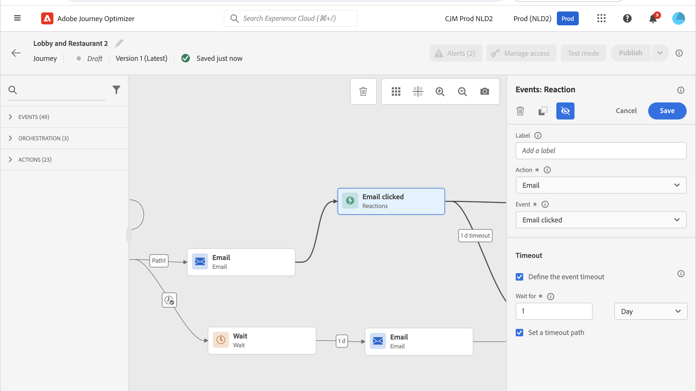

# 反应事件 {#reaction-events}

>[!CONTEXTUALHELP]
>id="ajo_journey_event_reaction"
>title="反应事件"
>abstract="您可以通过此活动，对在同一历程中与所发送消息相关的跟踪数据做出反应。我们在与 Adobe Experience Platform 共享时实时捕获此信息。"

## 概述 {#overview}

在面板中可用的不同事件活动中，您会找到内置的&#x200B;**[!UICONTROL 反应]**&#x200B;事件。 您可以通过此活动，对在同一历程中与所发送消息相关的跟踪数据做出反应。我们在与 Adobe Experience Platform 共享时实时捕获此信息。

您可以对单击或打开的消息做出反应。

查看[操作活动](../building-journeys/about-journey-activities.md#action-activities)。

如果没有对您的消息做出反应，您可以使用&#x200B;**[!UICONTROL 反应]**&#x200B;活动执行操作。 为此，请创建与&#x200B;**[!UICONTROL 反应]**&#x200B;活动平行的第二个路径，并添加&#x200B;**[!UICONTROL 等待]**&#x200B;活动。 如果在&#x200B;**[!UICONTROL 等待]**&#x200B;活动中定义的时段内没有反应，将选择第二个路径。 例如，您可以选择发送跟进消息。

## 如何配置反应事件 {#configure}

按照以下步骤配置反应事件：

1. 将&#x200B;**[!UICONTROL 反应]**&#x200B;活动&#x200B;**立即**&#x200B;放置在历程画布上的[渠道操作活动](journeys-message.md)之后。
1. 向反应添加&#x200B;**[!UICONTROL 标签]**。 此步骤是可选的。
1. 从下拉列表中，选择要做出反应的操作活动。 您可以选择位于路径前面步骤中的任何操作活动。
1. 根据您选择的操作，选择要做出反应的内容。
1. 您可以定义事件超时（40秒到90天之间）和超时路径。 这会为未在定义的持续时间内做出反应的个人创建第二个路径。 测试使用反应事件的历程时，测试模式&#x200B;**[!UICONTROL 等待时间]**&#x200B;的默认值和最小值为40秒。 请参阅[此小节](../building-journeys/testing-the-journey.md)。

## 护栏和限制 {#guardrails-limitations}

* 必须在历程画布中的&#x200B;**[!UICONTROL 渠道操作活动]**&#x200B;之后&#x200B;**立即**&#x200B;放置[反应](journeys-message.md)活动。
* 如果之前没有渠道操作活动，则不能使用&#x200B;**[!UICONTROL 反应]**&#x200B;活动。
* 不支持在渠道操作与&#x200B;**[!UICONTROL 反应]**&#x200B;活动之间放置&#x200B;**[!UICONTROL 等待]**&#x200B;活动或任何其他活动，这可能会导致反应无法按预期运行。
* 反应事件只能跟踪在同一历程中发送的消息。 它们无法跟踪在其他历程中发生的消息。
* 反应事件跟踪“已跟踪”类型链接的点击次数。 未考虑退订和镜像页面链接。
* 使用电子邮件中包含的0像素图像跟踪电子邮件打开次数。 如果电子邮件客户端（如Gmail）阻止图像，则不会考虑电子邮件打开次数。
