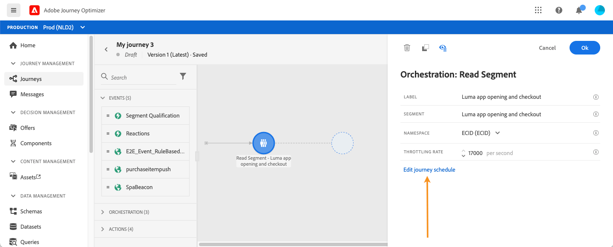
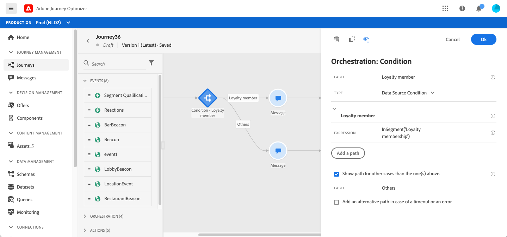

# 在旅程{#segment-trigger-activity}中使用区段

## 关于读取区段活动{#about-segment-trigger-actvitiy}

阅读区段活动允许您让属于Adobe Experience Platform区段的所有个人进入旅程。 进入历程的操作可以执行一次，也可以定期执行。

让我们举一个在[构建区段](../segment/about-segments.md)用例中创建的“Luma应用程序打开和签出”区段的示例。 利用“阅读细分”活动，您可以让属于此细分的所有个人进入一个旅程，并让他们进入个性化的旅程，并利用所有旅程功能：条件，计时器，事件，动作。

>[!NOTE]
>
>不可能在1小时以内的较短时间内触发基于区段的旅程。

### 配置活动{#configuring-segment-trigger-activity}

配置读取区段活动的步骤如下：

1. 展开&#x200B;**[!UICONTROL Orchestration]**&#x200B;类别并将&#x200B;**[!UICONTROL Read Segment]**&#x200B;活动放入画布中。

   活动必须定位为旅程的第一步。

1. 将&#x200B;**[!UICONTROL Label]**&#x200B;添加到活动（可选）。

1. 在&#x200B;**[!UICONTROL Segment]**&#x200B;字段中，选择将进入旅程的Adobe Experience Platform区段，然后单击&#x200B;**[!UICONTROL Save]**。

   请注意，您可以自定义列表中显示的列，并对其进行排序。

   >[!NOTE]
   >
   >只有具有&#x200B;**已实现**&#x200B;和&#x200B;**现有**&#x200B;区段参与状态的个人才会进入旅程。 有关如何评估区段的详细信息，请参阅[分段服务文档](https://experienceleague.adobe.com/docs/experience-platform/segmentation/tutorials/evaluate-a-segment.html?lang=en#interpret-segment-results)。

   

   添加客户细分后，即可通过&#x200B;**[!UICONTROL Copy]**&#x200B;按钮复制其名称和 ID：

   `{"name":"Luma app opening and checkout",”id":"8597c5dc-70e3-4b05-8fb9-7e938f5c07a3"}`

   

1. 在&#x200B;**[!UICONTROL Namespace]**&#x200B;字段中，选择要用于识别个人的命名空间。 [进一步了解命名空间](../event/about-creating.md#select-the-namespace)。

   >[!NOTE]
   >
   >属于不同身份之间没有选定身份(命名空间)的区段的个人无法进入旅程。

1. **[!UICONTROL Read Segment]**&#x200B;活动允许您指定段进入旅程的时间。 为此，请单击&#x200B;**[!UICONTROL Edit journey schedule]**&#x200B;链接以访问旅程的属性，然后配置&#x200B;**[!UICONTROL Scheduler type]**&#x200B;字段。

   

   默认情况下，区段会输入旅程&#x200B;**[!UICONTROL As soon as possible]**，即在旅程发布后1小时。 如果要让区段按特定日期/时间或循环方式输入旅程，请从列表中选择所需值。

   >[!NOTE]
   >
   >请注意，**[!UICONTROL Schedule]**&#x200B;部分仅在画布中放置了&#x200B;**[!UICONTROL Read Segment]**&#x200B;活动时才可用。

   

### 测试并发布历程 {#testing-publishing}

**[!UICONTROL Read Segment]**&#x200B;活动允许您在单一用户档案或在100个随机测试用户档案上测试旅程，这些是在符合区段条件的用户档案中选择的。

为此，请激活测试模式，然后从左窗格中选择所需的选项。

然后，可以像往常一样配置和运行测试模式。 [了解如何测试旅程](testing-the-journey.md)。

测试运行后，**[!UICONTROL Show logs]**&#x200B;按钮允许您根据选定的测试选项查看测试结果：

* **[!UICONTROL Single profile at a time]**:测试日志显示与使用统一测试模式时相同的信息。有关详细信息，请参阅[此部分](testing-the-journey.md#viewing_logs)

* **[!UICONTROL Up to 100 profiles at once]**:通过测试日志，您可以跟踪从Adobe Experience Platform导出区段的进度以及所有进入旅程的人员的个人进度。

   请注意，一次使用最多100个用户档案测试旅程不允许您使用视觉流跟踪旅程中个人的进度。

   

测试成功后，您可以发布您的旅程（请参阅[发布旅程](publishing-the-journey.md)）。 属于该区段的个人将在旅程的属性&#x200B;**[!UICONTROL Scheduler]**&#x200B;部分中指定的日期/时间输入旅程。

>[!NOTE]
>
>当执行不重复（“尽快开始”或“一次”）的基于区段的旅程时，其状态会自动更改为“已关闭”。
>
>对于基于区段的定期旅程，在执行最后一次出现时，旅程将自动关闭。 如果未指定结束日期/时间，您必须手动关闭通往新入口的旅程以结束它。

## 受众定位（在基于细分的旅程中）

基于区段的旅程始终使用&#x200B;**读取区段**&#x200B;开始，以检索属于Adobe Experience Platform区段的个人。

属于该段的受众会定期检索一次。

进入客户旅程后，您可以创建受众编排用例，使客户从初始细分流向客户旅程的不同分支。

**区段**

您可以使用条件使用&#x200B;**Condition**&#x200B;活动执行分段。 例如，您可以让VIP人员选择特定路径，使非VIP人员进入其他路径。

分段可基于：

* 数据源数据
* 旅程事件部分的上下文，例如：有人点击了她一小时前收到的消息吗？
* 日期，例如：我们是在6月，当一个人经历这段旅程？
* 例如：是早上在人的时区吗？
* 一种算法，它根据一个百分比拆分流入旅程的受众，例如：90% - 10%排除对照组

**排除**

用于分段的相同&#x200B;**Condition**&#x200B;活动（请参阅上文）也允许您排除部分人口。 例如，您可以排除VIP人员，方法是使他们直接流入具有结束步骤的分支。

这种排除可能在区段检索之后发生，用于人口计数目的或沿多步骤旅程。

**Union**

历程允许您在分段后创建N个分支并将它们连接在一起。

因此，您可以让两个受众返回到共同的体验。

例如，在旅程的十天内遵循不同的体验后，VIP和非VIP客户可以返回到相同的路径。

在合并之后，可以通过执行分段或排除再次拆分受众。

