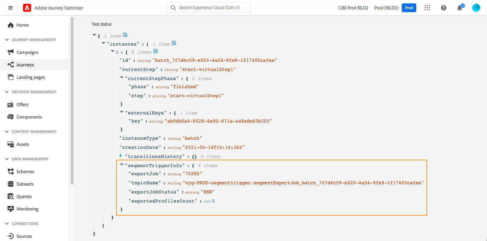

# 在历程中使用区段 {#segment-trigger-activity}

## 添加读取区段活动 {#about-segment-trigger-actvitiy}

>[!CONTEXTUALHELP]
>id="ajo_journey_read_segment"
>title="“读取区段”活动"
>abstract="利用读取区段活动，可让属于Adobe Experience Platform区段的所有个人进入历程。 进入历程的操作可以执行一次，也可以定期执行。"

使用 **读取区段** 活动，使区段的所有个人都进入历程。 进入历程的操作可以执行一次，也可以定期执行。

以在 [生成区段](../segment/about-segments.md) 用例。 通过读取区段活动，您可以让属于此区段的所有个人进入历程，并让他们进入将利用所有历程功能的个性化历程：条件、计时器、事件、操作。

>[!NOTE]
>
>对于使用读取区段活动的历程，可以同时启动的历程数上限。 重试将由系统执行，但请通过将重试分隔5到10分钟，避免从同一时间开始的历程（具有读取区段、计划或“尽快”启动）。
>
>从读取区段、区段鉴别或业务事件活动开始的历程中，无法使用体验事件字段组。

### 配置活动 {#configuring-segment-trigger-activity}

配置读取区段活动的步骤如下所示：

1. 展开 **[!UICONTROL 编排]** 类别和拖放 **[!UICONTROL 读取区段]** 活动。

   活动必须定位为历程的第一步。

1. 添加 **[!UICONTROL 标签]** （可选）。

1. 在 **[!UICONTROL 区段]** 字段中，选择将进入历程的Adobe Experience Platform区段，然后单击 **[!UICONTROL 保存]**.

   请注意，您可以自定义列表中显示的列，并对其进行排序。

   >[!NOTE]
   >
   >只有 **已实现** 和 **现有** 区段参与状态将进入历程。 有关如何评估区段的更多信息，请参阅 [Segmentation Service文档](https://experienceleague.adobe.com/docs/experience-platform/segmentation/tutorials/evaluate-a-segment.html#interpret-segment-results){target=&quot;_blank&quot;}。

   

   添加区段后， **[!UICONTROL 复制]** 按钮可复制其名称和ID:

   `{"name":"Luma app opening and checkout",”id":"8597c5dc-70e3-4b05-8fb9-7e938f5c07a3"}`

   

1. 在 **[!UICONTROL 命名空间]** 字段中，选择要用于标识个人的命名空间。 [了解有关命名空间的更多信息](../event/about-creating.md#select-the-namespace).

   >[!NOTE]
   >
   >属于某个区段、且其不同身份之间没有选定身份（命名空间）的个人无法进入历程。

1. 设置 **[!UICONTROL 节流速率]** 字段，以限制读取区段活动的吞吐量。

   此值存储在历程版本有效负载中。 默认值为每秒20,000条消息。 您可以将此值从每秒500条修改为20,000条消息。

   >[!NOTE]
   >
   >每个沙盒的总限制率设置为每秒20,000条消息。 因此，在同一沙盒中同时运行的所有读取区段的限制速率每秒最多可达20,000条消息。 您无法修改此上限。

1. 的 **[!UICONTROL 读取区段]** 活动允许您指定区段进入历程的时间。 为此，请单击 **[!UICONTROL 编辑历程计划]** 链接以访问历程的属性，然后配置 **[!UICONTROL 调度程序类型]** 字段。

   

   默认情况下，区段会进入历程 **[!UICONTROL 尽快]**. 如果要使区段在特定日期/时间或定期进入历程，请从列表中选择所需的值。

   >[!NOTE]
   >
   >请注意， **[!UICONTROL 计划]** 部分仅在 **[!UICONTROL 读取区段]** 活动已在画布中删除。

   

   **增量读取** 选项：当具有循环的历程 **读取区段** 首次执行时，区段中的所有用户档案都会进入历程。 此选项允许您在首次发生后仅定位自上次执行历程后进入区段的个人。

   **重复时强制重入**:此选项允许您使历程中仍存在的所有用户档案在下次执行时自动退出该历程。 例如，如果您在每日重复历程中等待2天，则激活此选项后，无论用户档案是否处于下次运行的受众中，用户档案都将始终在下次历程执行时（因此次日）被移动。 如果此历程中用户档案的生命周期可能比重复频率长，请不要激活此选项以确保用户档案可以完成其历程。

<!--

### Segment filters {#segment-filters}

[!CONTEXTUALHELP]
>id="jo_segment_filters"
>title="About segment filters"
>abstract="You can choose to target only the individuals who entered or exited a specific segment during a specific time window. For example, you can decide to only retrieve all the customers who entered the VIP segment since last week."

You can choose to target only the individuals who entered or exited a specific segment during a specific time window. For example, you can decide to only retrieve all the customers who entered the VIP segment since last week. Only the new VIP customers will be targeted. All the customers who were already part of the VIP segment before will be excluded.

To activate this mode, click the **Segment Filters** toggle. Two fields are displayed:

**Segment membership**: choose whether you want to listen to segment entrances or exits. 

**Lookback window**: define when you want to start to listen to entrances or exits. This lookback window is expressed in hours, starting from the moment the journey is triggered.  If you set this duration to 0, the journey will target all members of the segment. For recurring journeys, it will take into account all entrances/exits since the last time the journey was triggered.

-->

>[!NOTE]
>
>一次性读取区段历程在历程执行30天后变为“已完成”状态。 对于计划的读取区段，此期限为上次执行后的 30 天。 

### 测试并发布历程 {#testing-publishing}

的 **[!UICONTROL 读取区段]** 活动允许您在单一用户档案上或在100个随机测试从符合区段资格的用户档案中选择的用户档案上测试历程。

为此，请激活测试模式，然后从左窗格中选择所需的选项。

然后，您可以照常配置和运行测试模式。 [了解如何测试历程](testing-the-journey.md).

测试运行后， **[!UICONTROL 显示日志]** 按钮可根据选定的测试选项查看测试结果：

* **[!UICONTROL 一次只显示一个用户档案]**:测试日志显示与使用统一测试模式时相同的信息。 有关更多信息，请参阅 [此部分](testing-the-journey.md#viewing_logs)

* **[!UICONTROL 一次最多可包含100个用户档案]**:利用测试日志，可跟踪从Adobe Experience Platform导出区段的进度，以及所有进入历程的人员的个人进度。

   请注意，一次使用最多100个用户档案测试历程不允许使用可视化流程跟踪历程中个人的进度。

   

测试成功后，您可以发布历程(请参阅 [发布历程](publishing-the-journey.md))。 属于该区段的个人将在历程属性中指定的日期/时间进入历程 **[!UICONTROL 调度程序]** 中。

>[!NOTE]
>
>对于基于区段的定期历程，一旦执行最后一次事件，历程将自动关闭。 如果未指定结束日期/时间，则必须手动关闭通往新入口的历程才能结束。

## 基于客户细分的历程中的受众定位

基于区段的历程始终以 **读取区段** 活动来检索属于Adobe Experience Platform区段的个人。

属于该区段的受众将定期检索一次。

进入历程后，您可以创建受众编排用例，使个人从初始区段流入历程的不同分支。

**区段**

您可以使用条件通过 **条件** 活动。 例如，您可以使VIP人员采用特定路径，而非VIP流量进入其他路径。

分段可以基于：

* 数据源数据
* 历程数据中事件部分的上下文，例如：某人点击了一小时前收到的消息吗？
* 例如，日期：我们是在六月，当一个人走过旅程？
* 例如，某个时间：是在人的时区吗？
* 根据百分比拆分历程中流动的受众的算法，例如：90% - 10% — 排除控制组

**排除**

相同 **条件** 用于分段的活动（请参阅上文）还允许您排除部分群体。 例如，您可以排除VIP人员，方法是：使其流入紧接其后有结束步骤的分支。

出于群体计数目的或多步历程，可能会在检索区段后立即发生此排除。

**Union**

历程允许您在分段后创建N个分支并将它们连接在一起。

因此，您可以让两个受众返回到相同的体验。

例如，在历程中的十天内跟踪不同体验后，VIP和非VIP客户可以返回到同一路径。

合并后，您可以通过执行分段或排除来再次拆分受众。

