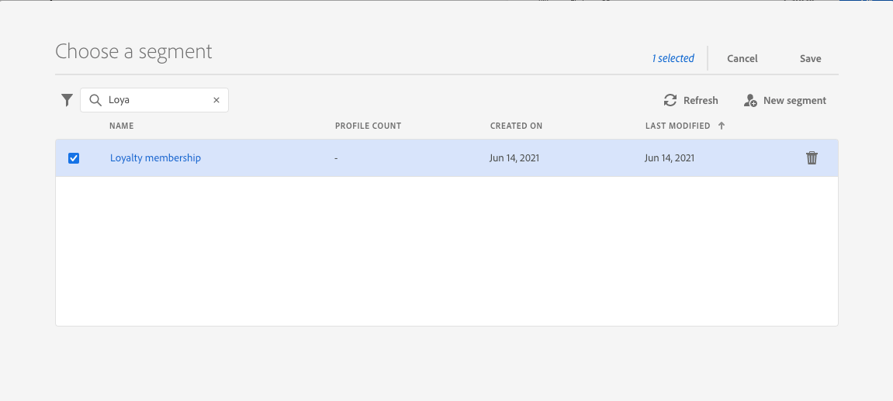

# 区段鉴别事件 {#segment-qualification}

## 关于客户细分资格事件{#about-segment-qualification}

>[!CONTEXTUALHELP]
>id="ajo_journey_event_segment_qualification"
>title="区段鉴别事件"
>abstract="此活动允许您的历程侦听 Adobe Experience Platform 客户细分中用户档案的进出口，以便使个人进入历程或在历程中前进。"

此活动允许您的历程侦听 Adobe Experience Platform 客户细分中用户档案的进出口，以便使个人进入历程或在历程中前进。有关创建客户细分的更多信息，请参阅此[部分](../segment/about-segments.md)。

假设您拥有“白银客户”客户细分。通过此活动，您可以使所有新的白银客户进入历程，并向其发送一系列个性化消息。

此类事件可定位为历程的第一步或后续步骤。

>[!IMPORTANT]
>
>请记住，Adobe Experience Platform 客户细分每天计算一次（**批处理**&#x200B;客户细分）或实时计算（**流式处理**&#x200B;客户细分，使用 Adobe Experience Platform 的“高频受众”选项）。
>
>如果对所选客户细分进行流式处理，则属于此客户细分的个人可能会实时进入该历程。如果区段是批处理，则新近符合此区段资格的人员可能将在Adobe Experience Platform上执行区段计算时进入历程。
>
>从读取区段、区段鉴别或业务事件活动开始的历程中，无法使用体验事件字段组。

1. 展开 **[!UICONTROL 事件]** 类别和拖放 **[!UICONTROL 区段鉴别]** 活动。

   

1. 添加 **[!UICONTROL 标签]** 到活动。 此步骤是可选的。

1. 单击 **[!UICONTROL 区段]** 字段，然后选择要利用的区段。

   >[!NOTE]
   >
   >请注意，您可以自定义列表中显示的列，并对其进行排序。

   

   添加区段后， **[!UICONTROL 复制]** 按钮可复制其名称和ID:

   `{"name":"Loyalty membership“,”id":"8597c5dc-70e3-4b05-8fb9-7e938f5c07a3"}`

   

1. 在 **[!UICONTROL 行为]** 字段中，选择要侦听客户细分入口和/或出口。

   >[!NOTE]
   >
   >请注意 **[!UICONTROL 输入]** 和 **[!UICONTROL 退出]** 与 **已实现** 和 **已退出** 区段参与状态。Adobe Experience Platform 有关如何评估区段的更多信息，请参阅 [Segmentation Service文档](https://experienceleague.adobe.com/docs/experience-platform/segmentation/tutorials/evaluate-a-segment.html#interpret-segment-results){target=&quot;_blank&quot;}。

1. 选择命名空间。仅当事件被定位为历程的第一步时，才需要此操作。

   

有效负荷包含以下可以在条件和操作中使用的上下文信息：

* 行为（入口、出口）
* 资格时间戳
* 客户细分 ID

在后面的条件或操作中使用表达式编辑器时 **[!UICONTROL 区段鉴别]** 活动，则您有权访问 **[!UICONTROL 区段鉴别]** 节点。 您可以在 **[!UICONTROL 上次资格鉴定时间]** 和 **[!UICONTROL 状态]** （进入或退出）。

请参阅[条件活动](../building-journeys/condition-activity.md#about_condition)。

包含区段鉴别事件的新历程在您发布后10分钟内可运行。 此时间间隔对应于专用服务的缓存刷新时间间隔。 因此，您必须等待十分钟，才能使用此历程。

## 最佳实践 {#best-practices-segments}

的 **[!UICONTROL 区段鉴别]** 活动允许在Adobe Experience Platform客户细分中获得资格或被取消资格的个人在历程中立即进入。

该信息的接收速度很快。所做的测量显示速度为每秒接收 10,000 个事件。因此，您应该确保了解入口峰值可能如何出现、如何避开，以及如何使历程针对此类情况做好准备。

### 批处理客户细分{#batch-speed-segment-qualification}

在对批处理客户细分使用客户细分资格时，请注意，在每日计算时将出现入口峰值。峰值的大小将取决于每天进入（或退出）客户细分的个人数量。

此外，如果在历程中新建并立即使用批处理客户细分，则第一批计算可能会使大量个人进入历程。

### 流式处理客户细分{#streamed-speed-segment-qualification}

在对流式处理客户细分使用客户细分资格时，由于持续评估客户细分，因此入口/出口出现大量峰值的风险较小。如果客户细分定义导致大量客户同时获得资格，则仍然可能出现峰值。

有关流式分段的更多信息，请参阅 [Adobe Experience Platform文档](https://experienceleague.adobe.com/docs/experience-platform/segmentation/api/streaming-segmentation.html#api)

### 如何避免过载{#overloads-speed-segment-qualification}

以下是有助于避免使历程中利用的系统（数据源、自定义操作、渠道操作活动）过载的一些最佳实践。

请勿在 **[!UICONTROL 区段鉴别]** 活动，即在创建批处理客户细分后立即创建该细分。 它将避免第一个计算峰值。请注意，如果您要使用从未计算的客户细分，则历程画布中将显示黄色警告。

为历程中使用的数据源和操作设置上限规则，以避免其过载。 在 [Journey Orchestration文档](https://experienceleague.adobe.com/docs/journeys/using/working-with-apis/capping.html){target=&quot;_blank&quot;}。 请注意，上限规则不带重试。如果需要重试，则必须通过选中方框在历程中使用替代路径 **[!UICONTROL 在出现超时或错误时添加替代路径]** 中。

在生产历程中使用客户细分之前，请始终首先评估每天符合此客户细分条件的个人数量。为此，您可以检查 **[!UICONTROL 区段]** 菜单，打开区段，然后查看 **[!UICONTROL 一段时间的用户档案]** 图表。

