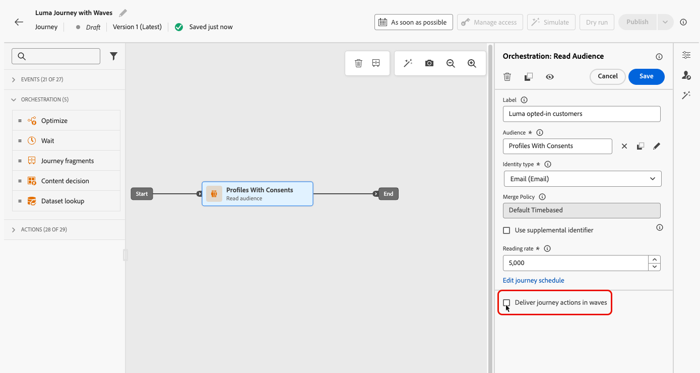
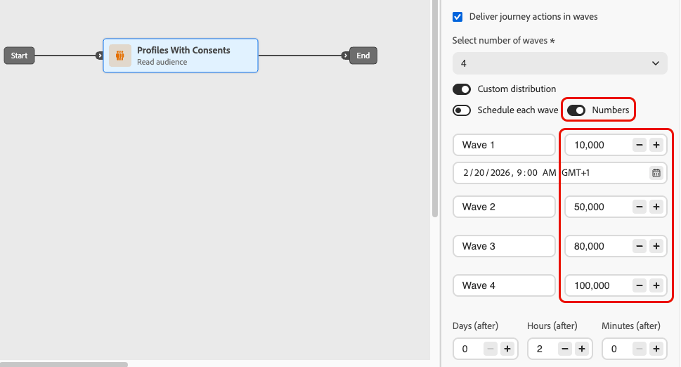

# 在历程中按波次发送 {#send-using-waves-journeys}

>[!BEGINSHADEBOX]

**在此页面上：**&#x200B;了解如何以称为批次的计划批次，从读取受众历程投放出站消息，以平衡负载、保护下游系统并支持可投放性。

>[!ENDSHADEBOX]

您可以在一段时间内分批（批次）投放历程中的出站消息，而不是一次投放所有消息。 Wave发送有助于平衡负载，避免压倒性的下游系统（如呼叫中心或登陆页面），并支持可投放性和发件人信誉，特别是对于高容量读取受众历程。

<!--
>[!CAUTION]
>
>Wave sending is available for read audience journeys only and applies to **outbound** actions only (Email, SMS, Push, Direct mail).
-->

当您定义受众如何进入以及操作计划方式时，可以在历程级别对其进行配置。 您可以定义批次的数量、大小（以受众百分比或绝对数字表示）以及每个批次运行的时间。

## 限制和防护 {#limitations-guardrails}

* 波次发送仅适用于计划程序类型为&#x200B;**[!DNL As soon as possible]**&#x200B;和&#x200B;**[!UICONTROL 一次]**&#x200B;的读取受众历程。 在[历程计划](read-audience.md#schedule)中了解详情。
* 波动发送不适用于定期、事件触发、业务事件、测试模式或模拟历程。
* 您必须至少定义&#x200B;**2波**，并且最多可添加&#x200B;**10波**。
* 两个批次开始的最小间隔为&#x200B;**30分钟**。
* 波次开始时间不能早于历程开始时间或过去时间。
* 将受众拆分为批次最多可能需要1小时。 在此之前，用户档案可能无法进入历程。
* 在单个历程版本中，两个批次不会同时运行。 下一波只在上一波结束后开始。 例如，如果波形间隔1小时而第一个波形运行2小时，则第二个波形在第一波形结束时启动，而不是在其计划时间启动。
* 当平台应用配额限制或系统容量负荷较重时，波动启动可能会延迟。

## 在历程中配置波次发送 {#configure-wave-sending}

1. 通过[读取受众](read-audience.md)活动开始您的历程。

1. 双击&#x200B;**[!UICONTROL 读取受众]**&#x200B;活动以打开其属性并选择&#x200B;**[!UICONTROL 以批次方式交付历程操作]**&#x200B;选项。

   {width="100%"}

1. 设置&#x200B;**批次数**（例如，4）。

   {width="80%"}

   >[!NOTE]
   >
   >您必须至少定义2个波段，并且最多可添加10个波段。

1. 选择如何定义波次大小和时间，如下所述。

### 相等波段 {#equal-waves}

默认情况下，受众会拆分为大小相等的批次。 设置每个波次开始之间的固定间隔（例如，2小时）。

{width="70%"}

>[!NOTE]
>
>两个批次开始的最小间隔为&#x200B;**30分钟**。

然后，系统自动安排后续波次（例如，第一个波次在早上9:00，第二个波次在晚上11:00，第三个波次在晚上1:00，第四个波次在晚上3:00）。

### 自定义分发 {#custom-distribution}

选择&#x200B;**[!UICONTROL 自定义分布]**&#x200B;选项，将每个波次的大小定义为总受众的百分比（例如，15%、20%、25%、40%）。

{width="70%"}

选择&#x200B;**[!UICONTROL 数字]**&#x200B;可将每个波次的大小定义为配置文件的绝对数（例如，10,000；50,000）。

{width="70%"}

>[!NOTE]
>* 使用百分比时，所有批次的总计必须为100%。 如果不是这种情况，将显示警告。
>* 使用数字时，系统不会验证覆盖范围 — 确保您的波次大小覆盖目标受众。 [了解详情](#faq)

### 自定义计划 {#custom-schedule}

选择&#x200B;**[!UICONTROL 计划每个波次]**&#x200B;以定义每个波次的特定开始日期和时间。 批次不需要均匀隔开（例如，上午9:00，上午11:00，下午5:00，晚上8:30）。

{width="70%"}

>[!NOTE]
>
>两个批次开始的最小间隔为&#x200B;**30分钟**。

## 用例 {#use-cases}

Wave发送可帮助您控制发送消息的时间和数量，这可以提高可投放性，保护发件人信誉，并使发送与您的运营容量相匹配。 考虑在以下情况下使用波段：

* **呼叫中心或响应管理：**&#x200B;限制每天或每小时传出多少条消息，以便下游团队（例如，客户关怀团队）可以处理响应。 例如，每天发送20条消息以匹配呼叫中心容量。

  {width="55%"}

* **高容量和可投放性：**&#x200B;避免一次发送一个非常大的旅程。 随时间分散投放，以帮助维护发件人的信誉并降低被标记为垃圾邮件的风险。

  {width="55%"}

* **提升：**&#x200B;使用新平台或IP时，逐步增加容量（例如，第一波为10%，然后为15%、20%，以此类推）以逐步建立声誉。

  {width="55%"}

## 常见问题 {#faq}

+++ 如果波浪大小的总和不等于总受众会发生什么？

* 如果您的波次大小之和&#x200B;**超过**&#x200B;个受众（例如，您计划在第一波次为100,000个受众发送100,000个受众），则第一波次将发送给所有受众，而其余波次将没有任何人可发送至 — 这些波次将不会执行。
* 如果总和&#x200B;**小于受众**（例如，您为100,000的受众定义了四个批次共40,000个配置文件），则只有这些批次中包含的用户档案将收到消息。 其他受众将不会收到该通信，并且以后将不会重试。

+++

+++ 我是否可以为各个批次分配不同的区段或标准？

您只能定义波的大小和时间。 同一受众在历程中流动；您不能将不同的区段或标准分配给单个批次。

+++

## 另请参阅 {#see-also}

* [在历程中使用受众](read-audience.md) — 配置读取受众活动。

+++ AI知识参考

本节包含结构化知识，用于支持与本主题相关的解释、检索和问答。

要全面了解相关信息，应将此信息与本页上的文档相结合。 这两个源都不是独立的；页面描述了功能，而本节提供了其他上下文来帮助消除术语、意图、适用性和约束条件的歧义。

* **TL；DR：**&#x200B;本页介绍如何在Adobe Journey Optimizer读取受众历程中配置波次发送，以便随着时间推移以受控批次发送出站消息，从而提高可投放性并保护发件人信誉。

**意图：**
* 在读取受众历程中启用波次发送以批量投放消息
* 将相等的波次配置为每个波次之间有固定间隔
* 将自定义波次大小定义为百分比或绝对配置文件计数
* 使用自定义计划以特定开始日期和时间计划每个波次
* 控制投放量，以保护发件人的信誉或与运营容量相符

**术语表：**
* **批次发送**：一种投放模式，它将读取受众拆分为批次（批次），并按照计划的间隔向每个批次发送消息，而不是一次发送所有消息&#x200B;*（产品特定）*
* **相等批次**：批次配置，在此配置中，受众将分成大小相等的部分，批次开始于&#x200B;*（产品特定）*&#x200B;之间，间隔固定
* **自定义分布**：一种波动配置，其中每个波动的大小被手动定义为配置文件&#x200B;*（产品特定）*&#x200B;的百分比或绝对数
* **自定义计划**：波动配置，其中每个波动都有特定的开始日期和时间，允许不均匀的间距&#x200B;*（产品特定）*

**护栏：**
* 波次发送仅适用于具有“尽快”和“一次”调度程序类型的读取受众历程；不适用于定期、事件触发、业务事件、测试模式或模拟运行历程。
* 必须定义至少2个波次和最多10个波次。
* 两个连续批次开始的最小间隔为30分钟。
* 波次开始时间不能早于历程开始时间或过去时间。
* 将受众拆分为批次最长可能需要1小时；在此之前，无法输入用户档案。
* 在单个历程版本中，两个批次从不同时运行；下一批次仅在前一个批次完成后开始。
* 波次启动可能会因平台配额限制或系统负载过大而延迟。
* 使用基于百分比的自定义分配时，所有批次的总计必须为100%。
* 使用基于数字的自定义分发时，系统不会验证总覆盖率；用户必须确保波次大小涵盖目标受众。
* 如果波次大小超过受众，则第一个波次会发送给所有受众，而其余波次则不会执行。
* 如果波次总大小小于受众，则只有已定义波次中的用户档案才会收到消息；其余用户档案不会重试。

**术语：**
* 规范名称：波次发送 — 缩写：无 — 变体：批传送、基于波次的传送、分阶段发送
* 同义词： &quot;waves&quot; = &quot;batches&quot; = &quot;delivery phases&quot;
* 请勿混淆：“波次发送”≠“循环历程”（波次发送将单个受众拆分为定时批次；循环历程按计划重新读取受众）

**常见问题解答：**
* **问：波动发送能否用于周期性历程？**  — 否；波次发送仅适用于具有“尽快”或“一次”计划程序类型的读取受众历程。
* **问：两批次之间的最短间隔是多少？**  — 连续两批次开始之间的30分钟。
* **问：如果我的波次大小总计超过受众，会发生什么情况？**  — 第一个批次发送给完整受众，后续批次没有要发送的用户档案；不执行它们。
* **问：我可以为各个批次分配不同的内容或区段吗？**  — 否；所有批次使用相同的受众和历程内容。 每个波形只能自定义大小和时间。
* **问：我可以配置多少批次处理？**  — 每个旅程2至10波。
* **问：何时应使用波动发送？**  — 使用它来保护高容量发送的发件人信誉，使投放与下游团队容量（如呼叫中心）保持一致，或在新的IP或平台上逐步增加容量。

+++
