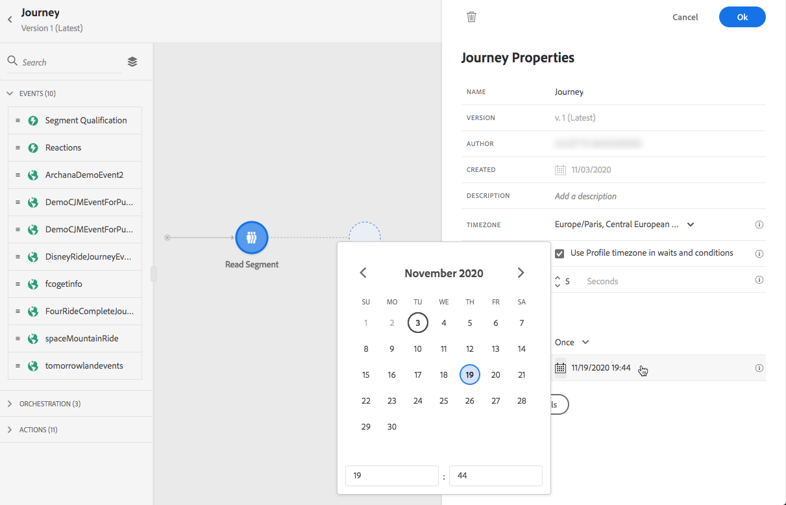

# 历程执行 {#message-execution}

## 测试您的历程

您可以使用测试用户档案测试您的历程。 建议此步骤验证您的设置和消息。

在中了解详情 [部分](testing-the-journey.md).

## Activate your journey

您必须发布历程才能激活它。

在中了解详情 [部分](publishing-the-journey.md).

发布后，您可以使用专用的报告工具监控您的历程以衡量历程的有效性。

[Learn more about reports](../reports/live-report.md)

## 发送邮件 {#send-messages}

When your message has a content defined and is published, it is ready to be sent through a [journey](journey.md).

>[!NOTE]
>
>You can add a message that is still in draft mode to a journey, but make sure the message is published before publishing the journey.

Once a message is sent, you can monitor its execution through multiple indicators. [Learn more about monitoring message execution](../message-monitoring.md).

## Schedule messages {#schedule-messages}

可以通过 **[!UICONTROL Read Segment]** 活动 [历程](journey.md). 您可以指定区段将何时进入历程。 [了解有关读取区段活动的更多信息](read-segment.md).

为此，请执行以下步骤：

1. 编辑历程，拖放 **[!UICONTROL Read Segment]** 活动并开始配置。 [Learn more about configuring the Read Segment activity](read-segment.md#configuring-segment-trigger-activity).

1. Click the **[!UICONTROL Edit journey schedule]** link to access the journey&#39;s properties.

   

1. Configure the **[!UICONTROL Scheduler type]** field: select the desired value from the list to make the segment enter the journey on a specific date/time, or on a recurring basis.

   >[!NOTE]
   >
   >的 **[!UICONTROL Schedule]** 部分仅在 **[!UICONTROL Read Segment]** 活动已放入画布中。

   

1. 如果您选择 **[!UICONTROL Once]**，定义区段进入历程的特定日期和时间。

   

1. If you select a recurring method, edit the start date and time. 您还可以定义可选的结束日期和时间。

   

   >[!NOTE]
   >
   >默认情况下，区段会进入历程 **[!UICONTROL As soon as possible]**，表示历程发布1小时后。

1. 单击 **[!UICONTROL OK]** 以保存更改。

<!--Unitary messages that are triggered by an event within a journey cannot be scheduled.-->
