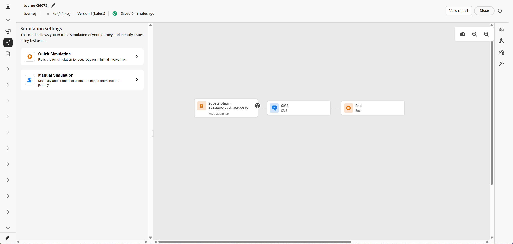
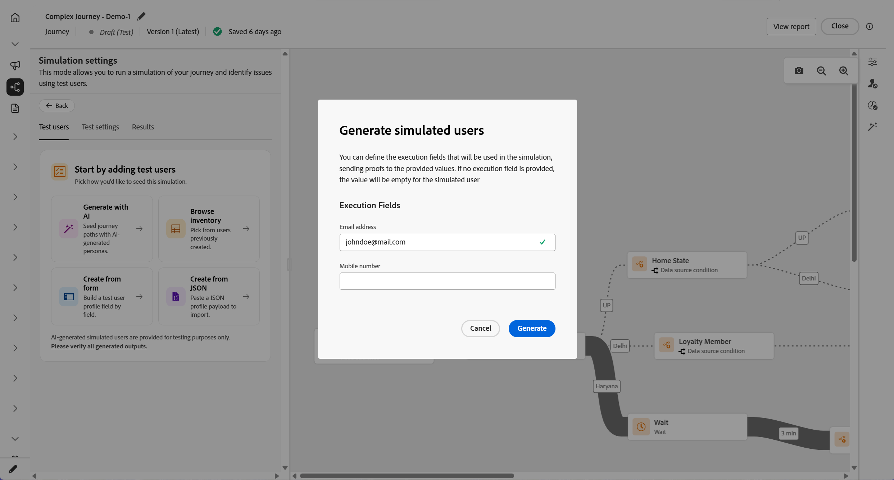
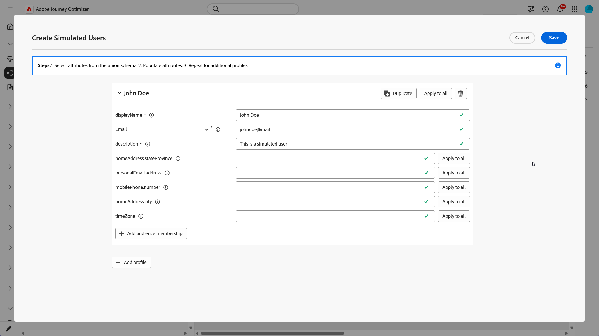

# 模拟您的历程 {#simulate-journey}

>[!IMPORTANT]
>
>您需要至少具有下列权限之一才能访问&#x200B;**[!UICONTROL 模拟]**&#x200B;功能： **模拟历程**、**发布历程**&#x200B;或&#x200B;**批准并发布历程**。 [了解详情](../administration/permissions.md)

在发布之前，使用&#x200B;**[!UICONTROL 模拟]**&#x200B;与&#x200B;**模拟用户**&#x200B;一起验证您的历程。 此页面将指导您完成&#x200B;**[!UICONTROL 快速模拟]**&#x200B;和&#x200B;**[!UICONTROL 手动模拟]**，创建并发送模拟用户，在历程需要它们时触发单一事件，以及查看&#x200B;**[!UICONTROL 结果]**&#x200B;日志。

有关旅程类型的概述，请参阅[历程模拟入门](simulate-journey-gs.md)。

## 模拟类型 {#simulation-types}

激活后，包含读取受众条目的批量历程提供两种运行模拟的方式：

* **[!UICONTROL 快速模拟]**&#x200B;使用由Journey Agent支持的生成用户、生成的事件值和默认测试设置进行端到端运行。 这是一种以最少干预快速模拟端到端历程的方法。 选择此选项后，快速模拟会立即启动。

* **[!UICONTROL 手动模拟]**&#x200B;允许您手动逐步运行模拟。 创建模拟用户（手动或使用Journey Agent），将其触发到旅程中，定义事件负载（手动或使用Journey Agent），并覆盖等待。

### 快速模拟 {#quick-simulation}

在&#x200B;**[!UICONTROL 模拟]**&#x200B;中的任何历程中，**[!UICONTROL 快速模拟]**&#x200B;使用生成的用户、事件值和预填充设置运行历程。

1. 选择&#x200B;**[!UICONTROL 快速模拟]**。

1. 查看Adobe Journey Optimizer为运行收集的字段。 单击&#x200B;**[!UICONTROL 更新值]**&#x200B;以更改测试设置和执行地址，或在不更改的情况下继续。

   仅当历程使用等待或渠道时，才会显示此步骤。 您可以调整模拟用户的所有等待持续时间和执行地址，例如，使用您自己的电子邮件，使来自运行的消息转到您的收件箱。

   

1. 如果您打开&#x200B;**[!UICONTROL 更新值]**，请编辑设置，例如用于消息校对的地址，然后确认开始模拟。

   

1. Journey Agent根据旅程定义生成一组模拟用户。

   对于包含电子邮件、短信或推送节点的历程，代理会提示您确认要使用的电子邮件地址、电话号码或推送令牌。 使用这些值生成模拟用户。 完成后，单击&#x200B;**[!UICONTROL 生成]**。

1. 运行完成后，单击&#x200B;**[!UICONTROL 查看结果]**&#x200B;以查看路径、错误和未覆盖的分支。 查看[查看结果](#viewing-results)。

   

快速模拟还支持事件触发的历程和包含事件活动的历程。 事件值会为每个生成的模拟用户自动设置和触发。 用户进入历程后，一旦他们达到相应的等待，就会触发每个事件。

### 手动模拟 {#manual-simulation}

当您需要选择每个模拟用户、控制发送顺序、配置事件有效负载并覆盖运行的&#x200B;**[!UICONTROL 等待]**&#x200B;持续时间时，请选择&#x200B;**[!UICONTROL 手动模拟]**。

继续[创建和管理模拟用户](#test-users)、[触发您的事件](#firing-events)和[查看结果](#viewing-results)。

## 创建和管理模拟用户 {#test-users}

>[!IMPORTANT]
>
>您需要至少具有下列权限之一才能访问&#x200B;**[!UICONTROL 模拟]**&#x200B;功能： **模拟历程**、**发布历程**&#x200B;或&#x200B;**批准并发布历程**。 [了解详情](../administration/permissions.md)

模拟用户是您在&#x200B;**[!UICONTROL 模拟设置]**&#x200B;中定义的临时配置文件类实体。 本节介绍如何创建缩览图、保存它们以供重用、在列表中调整或删除它们，并将它们发送到历程中。

1. 首先填充&#x200B;**[!UICONTROL 测试用户]**&#x200B;列表：

   +++ 使用AI生成用户

   Adobe Journey Optimizer根据旅程定义生成一组模拟用户。

   对于包含电子邮件或短信节点的历程，AI会提示您确认要使用的电子邮件地址或电话号码。 完成后，单击&#x200B;**[!UICONTROL 生成]**。

   

   +++

   +++ 浏览清单

   选择&#x200B;**[!UICONTROL 浏览清单]**&#x200B;以添加已保存的模拟用户，例如，从表单或JSON创建的用户，或在运行AI生成后保留的用户。

   

   +++

   +++ 从表单创建

   1. 输入&#x200B;**[!UICONTROL 显示名称]**、**[!UICONTROL 标识命名空间]**&#x200B;和&#x200B;**[!UICONTROL 描述]**&#x200B;以标识此模拟用户。

      

   1. 然后，从合并架构中选择要为该用户填充的属性。

   1. 单击&#x200B;**[!UICONTROL 添加受众成员资格]**&#x200B;以模拟区段成员资格。

   1. 在&#x200B;**[!UICONTROL 创建模拟用户]**&#x200B;窗口中，单击&#x200B;**[!UICONTROL 添加模拟用户]**&#x200B;以在一个会话中定义多个模拟用户。

      您可以更改用户在列表中的显示方式，折叠栈叠视图中的每个卡片，或打开用户的属性元数据。

      

   1. 从“模拟用户”菜单中，使用&#x200B;**[!UICONTROL 复制]**&#x200B;复制用户，**[!UICONTROL 将所有属性应用于其他用户]**&#x200B;将某个用户的属性复制到会话中的其他每个用户，或使用&#x200B;**[!UICONTROL 删除]**&#x200B;删除用户。

      

   1. 完成此会话中的用户配置后，单击&#x200B;**[!UICONTROL 保存]**。

   +++

   +++ 从JSON创建

   通过使用模拟用户数据更新相应的字段来定义新的模拟用户。

   

   +++

1. 您创建的模拟用户出现在&#x200B;**[!UICONTROL 测试用户]**&#x200B;列表中。 对于每个条目，选择下列选项之一：

   * ：更新模拟用户的详细信息。
   * ：仅对此模拟用户运行模拟。

     此选项不适用于以事件开始的历程，因为模拟用户进入由发送的事件触发。 [了解详情](#firing-events)

   * ：从此列表中移除用户。 模拟用户未被删除，并且在“模拟用户”选项中仍然可用。

   

1. 要在选择后更改列表，请单击&#x200B;**[!UICONTROL 管理用户]**&#x200B;从清单中或通过创建新用户来添加更多模拟用户。 若要从&#x200B;**[!UICONTROL 测试用户]**&#x200B;列表中删除此运行的每个用户，请选择&#x200B;**[!UICONTROL 清除所有用户]**。

   

1. 如果您的历程包含&#x200B;**[!UICONTROL 等待]**&#x200B;活动，请打开&#x200B;**[!UICONTROL 测试设置]**&#x200B;选项卡以微调在模拟期间等待的时间。 例如，如果实时&#x200B;**[!UICONTROL 等待]**&#x200B;活动配置了几天，则可以将其覆盖为10秒，以便模拟用户在移至下一个活动之前仅在节点上花费那么长时间。

1. 单击&#x200B;**[!UICONTROL 全部发送]**&#x200B;以将列表中的每个模拟用户发送到历程中，或者单击行上的以仅发送该用户。 当模拟用户成功进入历程时，将显示`Simulated users have entered the journey successfully.`确认消息。

   在用户进入历程后在画布上显示成功消息和路径后

1. 如果历程包含单一事件，则需要选择要触发的事件。 查看[触发您的事件](#firing-events)。

1. 访问&#x200B;**[!UICONTROL 结果]**&#x200B;选项卡以打开执行日志并查看每个步骤的运行方式。 有关详细信息，请参阅[查看结果](#viewing-results)。

1. 完成测试后，打开&#x200B;**[!UICONTROL 管理模拟]**&#x200B;菜单：

   * **[!UICONTROL 关闭模拟]**&#x200B;以退出当前模拟会话。
   * **[!UICONTROL 重置模拟]**&#x200B;以清除当前运行中的所有数据、选定的模拟用户、定义的事件值和其他测试设置，以便您可以从头开始新的模拟。

     

在&#x200B;**[!UICONTROL 模拟]**&#x200B;中验证历程后，查看&#x200B;**[!UICONTROL 结果]**&#x200B;日志。 如果出现错误，请保留&#x200B;**[!UICONTROL 模拟]**，将所需的更改应用到历程，然后再次运行&#x200B;**[!UICONTROL 模拟]**，直到运行看起来正确为止。 然后，您可以发布历程。 查看[发布您的历程](../building-journeys/publish-journey.md)。

## 触发您的事件 {#firing-events}

如果您的历程包括一个或多个单一事件，则可以在模拟活动时触发它们。 对于不是从事件开始但包含事件的历程，此部分在模拟用户进入历程之前不可见。

1. 在&#x200B;**[!UICONTROL 选择事件类型]**&#x200B;中，选择要为此模拟触发的事件。

   

1. 若要对列表中的每个用户应用相同的更改，请使用&#x200B;**[!UICONTROL 管理事件]**&#x200B;选项来：

   * **[!UICONTROL 生成事件值]**&#x200B;以允许Journey Agent使用AI生成所有负载。 生成值时，用户被标记为&#x200B;**[!UICONTROL 准备发送]**。
   * **[!UICONTROL 编辑事件数据]**&#x200B;以更改列表中每个模拟用户的负载。

   

1. 通过单击用户旁边的为每个用户配置事件有效负载，以：

   * **[!UICONTROL 生成事件值]**&#x200B;以允许Journey Agent使用AI生成有效负载。 生成值时，用户被标记为&#x200B;**[!UICONTROL 准备发送]**。
   * **[!UICONTROL 编辑事件数据]**&#x200B;以仅更改该模拟用户的负载。

   测试事件中的

1. 在&#x200B;**[!UICONTROL 测试事件]**&#x200B;中，选择&#x200B;**[!UICONTROL 全部发送]**&#x200B;以便为&#x200B;**[!UICONTROL 测试用户]**&#x200B;下列出的所有模拟用户发送此事件，或选择以便仅为该用户触发单个事件。

   

1. 触发事件后，画布会更新以反映每个用户的进度。

1. 访问&#x200B;**[!UICONTROL 结果]**&#x200B;选项卡以打开执行日志并查看每个步骤的运行方式。 有关详细信息，请参阅[查看结果](#viewing-results)。

1. 完成测试后，打开&#x200B;**[!UICONTROL 管理模拟]**&#x200B;菜单：

   * **[!UICONTROL 关闭模拟]**&#x200B;以退出当前模拟会话。
   * **[!UICONTROL 重置模拟]**&#x200B;以清除当前运行中的所有数据、选定的模拟用户、定义的事件值和其他测试设置，以便您可以从头开始新的模拟。

     

## 查看结果 {#viewing-results}

**[!UICONTROL 结果]**&#x200B;选项卡允许您查看测试结果。 在&#x200B;**[!UICONTROL 测试用户]**&#x200B;下拉列表中，选择要检查其执行的模拟用户。

选择&#x200B;**[!UICONTROL 全部]**&#x200B;可查看运行中跨每个模拟用户聚合的结果。 此视图可帮助您概览整个模拟（包括活动、结果和错误），而无需先选择单个模拟用户。

对于每个活动，日志都可以显示模拟用户是已进入还是退出该步骤，以及在模拟期间发生的错误。

对于&#x200B;**等待**&#x200B;活动，日志包含两个与持续时间相关的值：

* **定义的持续时间**：在已发布历程的&#x200B;**等待**&#x200B;活动上指定的持续时间，该持续时间将在历程处于实时状态后应用。 日志记录模拟是否从测试设置应用覆盖（例如10秒），而不是仅依赖历程上定义的值。
* **实际持续时间**：模拟用户在&#x200B;**等待**&#x200B;活动上停留的经过时间。 此值是从&#x200B;**[!UICONTROL 测试设置]**&#x200B;选项卡设置的。

当日志中出现错误时，保留&#x200B;**模拟**，将所需的更改应用于历程，然后再次运行&#x200B;**模拟**。 验证成功后，发布历程。 查看[发布您的历程](../building-journeys/publish-journey.md)。
