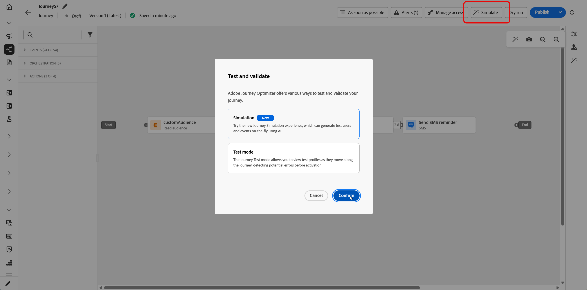

# 历程模拟入门 {#simulate-journey-gs}

>[!BEGINSHADEBOX]

**在此页面上：**&#x200B;了解历程模拟如何让您与模拟用户一起进行测试，以及在发布之前，模拟体验如何根据您的历程类型而变化。

>[!ENDSHADEBOX]

>[!IMPORTANT]
>
>* 要使用&#x200B;**[!UICONTROL 模拟]**，请从&#x200B;**[!UICONTROL 历程]**&#x200B;功能中至少分配一个权限： **模拟历程**、**发布历程**&#x200B;或&#x200B;**批准并发布历程**。 相同的权限允许您创建和管理模拟用户，不需要&#x200B;**[!UICONTROL 模拟用户]**&#x200B;权限。 [了解详情](../administration/permissions.md)
>
>* 若要管理不具有&#x200B;**[!UICONTROL 模拟]**&#x200B;的模拟用户，请分配&#x200B;**管理模拟用户**&#x200B;或&#x200B;**查看模拟用户**（来自&#x200B;**[!UICONTROL 模拟用户]**&#x200B;功能）。
>
>* 对于模拟中的AI （**[!UICONTROL 快速模拟]**，AI生成的用户，**[!UICONTROL 生成事件值]**），从&#x200B;**[!UICONTROL AI助手]**&#x200B;功能分配&#x200B;**[!UICONTROL 生成内容]**。

除了&#x200B;**草稿**、**测试模式**&#x200B;和&#x200B;**实时**&#x200B;之外，您还可以将历程设置为&#x200B;**[!UICONTROL 模拟]**。 在Simulation中，使用&#x200B;**模拟用户**&#x200B;进行测试：您添加的临时配置文件类实体，而不使用Adobe Experience Platform中的持久测试配置文件。

Adobe Journey Optimizer提供两种测试和验证旅程的方法：

* **[模拟](simulate-journey.md#test-users)**：使用&#x200B;**[!UICONTROL 模拟]**&#x200B;旅程功能，并在Adobe Experience Platform中模拟没有预先创建用户档案的用户，同时支持AI支持的用户和手动创建的用户。

* **[测试模式](testing-the-journey.md)**：使用在Adobe Experience Platform中标记为测试配置文件的永久配置文件，可跨会话重用。 当您需要一致的预定义数据时，请选择此方法。 [了解如何创建测试用户档案](../audience/creating-test-profiles.md)。

## 按历程类型模拟 {#by-journey-type}

**[!UICONTROL 模拟]**&#x200B;面板仅显示历程所需的步骤。 这取决于用户档案进入历程的方式。 受这些因素影响，Adobe Journey Optimizer呈现了不同的模拟体验。 展开下面的每种类型以查看运行的不同之处以及您使用的面板。

有关详细信息，请参阅[模拟您的历程](simulate-journey.md)。

+++ 具有读取受众的批量历程

历程由&#x200B;**[!UICONTROL 读取受众]**触发，画布没有单一的事件活动。在模拟期间，不会触发受众群体。仅模拟用户进入旅程。
为模拟选择的模拟用户出现在**测试用户**&#x200B;部分：

具有只读受众的批次历程的

+++

+++ 具有读取受众和单一事件的批量历程

包含沿路径的一个或多个单一事件的区段触发历程。首先触发模拟用户进入模拟，然后为在事件节点等待的用户触发事件。
为模拟和已配置事件选择的模拟用户将分别显示在测试用户和测试事件部分。在模拟用户进入历程之前，测试事件部分将不可见。

具有只读受众的批次历程的

+++

+++ 单一历程

历程从单一事件开始，而不是读取受众。直到为其触发该开始事件后，模拟用户才会进入历程。
为模拟和配置事件选择的模拟用户将分别显示在**测试用户**&#x200B;和&#x200B;**测试事件**&#x200B;部分。**测试用户**&#x200B;部分不包括将模拟用户触发历程的操作。您从&#x200B;**测试事件**&#x200B;触发条目。

具有只读受众的批次历程的

+++

## 启动模拟 {#launch}

将历程切换到&#x200B;**[!UICONTROL 模拟]**&#x200B;以测试模拟用户。 [模拟您的历程](simulate-journey.md)中详细介绍了分步任务。

1. 在历程中，单击&#x200B;**[!UICONTROL 模拟]**&#x200B;并选择&#x200B;**[!UICONTROL 模拟]**。

   历程界面中的

1. 等待激活完成。 当历程切换到&#x200B;**[!UICONTROL 模拟]**&#x200B;时，面板中的控件被禁用，并在激活完成后自动重新启用。

## 限制 {#limitations}

在此版本中，**[!UICONTROL Simulation]**&#x200B;可能不支持&#x200B;**[!UICONTROL 测试模式]**&#x200B;或实时历程支持的每个活动、渠道或集成，并且行为可能会随着功能的完善而改变。 请将此文章用于支持的工作流。

请参阅下面的下拉列表以了解有关模拟限制的更多信息。

+++ 节点级限制

某些节点阻止&#x200B;**[!UICONTROL 模拟]**&#x200B;启动。 其他应用程序则使用下述行为在模拟中运行。 如果在模拟之前必须删除或更改节点，请先更新历程。

| 受限制的节点 | 注释 |
| --- | --- |
| 业务事件 | 您无法在&#x200B;**[!UICONTROL 模拟]**&#x200B;中运行以业务事件开始的历程。 |
| 补充ID（多次重新进入） | 启用多次重新进入时，**[!UICONTROL 模拟]**&#x200B;不会启动，并且同一模拟用户可能同时具有多个活动实例。 |
| 内容决策节点 | 在模拟历程之前，请移除或更改此活动。 |
| 数据集查找 | **[!UICONTROL 模拟]**&#x200B;不支持按键查找客户数据集。 在运行模拟之前删除或更改此活动。 |
| **[!UICONTROL 优化]**&#x200B;活动 | 不支持&#x200B;**[!UICONTROL 试验]**&#x200B;和&#x200B;**[!UICONTROL 定位规则]**。 在模拟之前删除或更改节点。  其他&#x200B;**[!UICONTROL 优化]**&#x200B;方法的行为如下：  **[!UICONTROL 百分比拆分&#x200B;]**： Journey Agent为每个分支创建一个模拟用户，而不是根据分支百分比。 在运行时，实时评估会选取分支，并且可能与生成的路径不同。 您不能嘲笑分支选择。 要引导用户，请依靠画布上的分支顺序。 始终选择顶部分支。  **[!UICONTROL 时间条件]**：条件在运行时应用，就像在实时历程中一样。 例如，从8:00到20:00的窗口仅允许用户在该窗口内运行模拟时通过。 您不能模拟执行时间。 设置条件以匹配测试时的当前时间。  **[!UICONTROL 日期条件&#x200B;]**：条件在运行时与实时历程一样应用。 例如，2026年6月8日为日期时，仅允许用户在该日期运行模拟时通过。 您不能模拟执行日期。 测试时将条件设置为当前日期。  **[!UICONTROL 配置文件上限]**：模拟期间未强制设置上限。 Journey Agent会为每个分支创建一个模拟用户。 您不能嘲笑分支选择。 要引导用户，请依靠画布上的分支顺序。 始终选择顶部分支。 |
| 超时和错误分支 | Journey Agent不会为活动超时或错误分支生成用户。 只有在模拟期间发生真正的超时或错误时，用户才输入这些路径。 |
| 超时分支（事件活动） | 已创建模拟用户，但在&#x200B;**[!UICONTROL 手动模拟]**&#x200B;中，Journey Agent不会决定谁进入事件超时分支。 通过发送或不发送事件控制路径。 例如，要测试超时分支，请等待配置的超时，并且不要发送事件。 **[!UICONTROL 快速模拟]**&#x200B;可以自动发送或阻止事件以覆盖超时分支。 |
| 反应事件 | 反应事件在模拟中运行，但动作必须在现实生活中发生。 例如，电子邮件&#x200B;**打开**&#x200B;的反应需要打开校样邮件。 您不能在模拟UI中模拟反应。 |
| 外部数据源 | 在模拟期间运行的调用与实时历程中的调用运行方式相同。 下游活动可以使用响应，但您无法对其进行模拟。 当响应值馈送&#x200B;**[!UICONTROL Optimize]**&#x200B;活动时，Journey Agent无法发明该输出。 其仅产生呼叫之输入值。 例如，如果呼叫采用用户档案城市并返回天气，则Agent会为模拟用户设置城市，而实时呼叫会返回天气。 |
| 自定义操作 | 行为与外部数据源匹配。 出站调用是实时运行的。 Journey Agent会填充输入。 输出来自实时响应。 您不能模拟响应。 |
| 外部受众属性扩充 | 使用此验证时，使用来自外部受众源的个性化属性的历程不会在&#x200B;**[!UICONTROL Simulation]**&#x200B;中启动。 |

+++

 

+++ 功能限制

**[!UICONTROL 模拟]**&#x200B;不支持以下功能。

| 功能 | 注释 |
| --- | --- |
| 退出标准 | 运行&#x200B;**[!UICONTROL 模拟]**&#x200B;时未应用退出条件。 |
| 在操作中进行[!DNL Adobe Journey Optimizer]决策，例如，使用Adobe Journey Optimizer决策发送电子邮件内容 | 对于使用[!DNL Adobe Journey Optimizer]决策的内容，不会生成操作验证。 |
| 模拟自定义操作响应 | 默认情况下，[!UICONTROL 自定义操作]执行真正的出站调用。 正在模拟响应，因此不支持任何外部调用运行。 |
| 同意策略评估 | 无法在模拟用户级别模拟同意，并且在模拟期间不评估同意策略。 |
| 历程上限和仲裁 | 在模拟期间未评估或强制。 |
| 频率封顶（按渠道或通信类型） | 在模拟期间未评估或强制。 |
| 选择退出管理、禁止和允许列表 | 未在模拟期间评估或应用。 |
| 渠道配置中的动态子域和动态属性 | 不支持。 |
| 发送时间优化(STO) | 未在模拟期间评估或应用。 |
| 沙盒工具（跨沙盒复制模拟用户） | 不支持。 |
| 历程中的波次发送 | 不支持。 |
| 免打扰时间 | 未在模拟期间评估或应用。 |
| Privacy service | 模拟用户不是符合GDPR的永久性配置文件。 请勿在模拟用户中包含真实的客户数据。 |

+++

 

+++ 定量护栏 

这些护栏适用于&#x200B;**[!UICONTROL 模拟]**。 数字大写是在历程界面和运行时强制实施的。 在以后的版本中，限制可能会发生变化。 如果您在天花板附近运行，请验证沙盒中的行为。

| 护栏 | 限制 | 注释 |
| --- | --- | --- |
| 一次可选择和触发的最大模拟用户数（批处理历程、事件触发的流程和受众资格流程） | 20 | 每个&#x200B;**[!UICONTROL 发送所有]**&#x200B;或&#x200B;**[!UICONTROL 触发选定事件]**&#x200B;计数，而不是整个历程的累积上限。 |
| 每代请求的最大模拟用户数 | 50 | 通过&#x200B;**[!UICONTROL 快速模拟]**&#x200B;或&#x200B;**[!UICONTROL 在**[!UICONTROL &#x200B;手动模拟&#x200B;]**中使用AI]**&#x200B;生成，Journey Agent在一个请求中生成的最大模拟用户数。 如果历程具有超过&#x200B;**50**&#x200B;个路径，Journey Agent将随机选择路径以生成这些&#x200B;**50**&#x200B;模拟用户。 |
| 在单个模拟运行中测试的最大独特模拟用户数 | 100 | 在一个运行块中联系&#x200B;**100**&#x200B;个独特用户&#x200B;**[!UICONTROL 为新模拟用户选择模拟用户]**。 如果您位于&#x200B;**90**，则最多可以在同一块之前添加&#x200B;**10**&#x200B;个其他内容。 |
| 在一个沙盒中可同时在&#x200B;**[!UICONTROL 模拟]**&#x200B;中运行的最大旅程 | 20 | Cap同时在该沙盒中由每个&#x200B;**[!UICONTROL 模拟]**&#x200B;历程共享。 |
| 一个沙盒中最大活动模拟用户数 | 2,000 | 一次可存在于沙盒中的最大模拟用户数。 Adobe可以根据客户反馈调整此限制。 |
| 事件预填充（仅限浏览器） | — | 您只能在基于浏览器的模拟UI中预填事件有效负载字段。 预填充的值将保留在该浏览器中，并且不会同步到其他浏览器、设备或会话，因此您可能会在测试的每个位置看到不同的预填充数据。 |

+++
