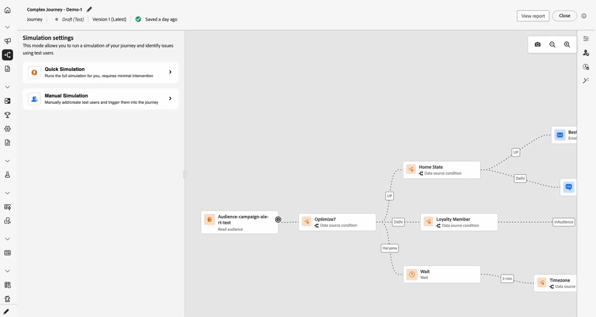

# 历程模拟入门 {#simulate-journey-gs}

除了&#x200B;**草稿**、**测试模式**&#x200B;和&#x200B;**实时**&#x200B;之外，您还可以将历程设置为&#x200B;**[!UICONTROL 模拟]**。 在Simulation中，使用&#x200B;**模拟用户**&#x200B;进行测试：您添加的临时配置文件类实体，而不使用Adobe Experience Platform中的持久测试配置文件。

Adobe Journey Optimizer提供两种测试和验证旅程的方法：

* **[模拟](#test-users)**：使用&#x200B;**[!UICONTROL 模拟]**&#x200B;历程功能并模拟用户在Adobe Experience Platform中快速运行，但不预先创建配置文件。

* **[测试模式](testing-the-journey.md)**：使用在Adobe Experience Platform中标记为测试配置文件的永久配置文件，可跨会话重用。 当您需要一致的预定义数据时，请选择此方法。 [了解如何创建测试用户档案](../audience/creating-test-profiles.md)。

## 按历程类型模拟 {#by-journey-type}

**[!UICONTROL 模拟]**&#x200B;面板仅显示历程所需的步骤。 这取决于用户档案进入历程的方式。 受这些因素影响，Adobe Journey Optimizer呈现了不同的模拟体验。 展开下面的每种类型以查看运行的不同之处以及您使用的面板。

有关详细信息，请参阅[模拟您的历程](simulate-journey.md)。

+++ 具有读取受众的批量历程

历程由&#x200B;**读取受众**&#x200B;触发。 画布没有单一事件活动，用户档案仅在条件、等待和渠道操作中移动。

通过读取受众的&#x200B;**批处理历程**，您可以访问快速模拟或手动模拟。

具有只读受众的批次历程的

+++

+++ 具有读取受众和单一事件的批量历程

包含沿路径的一个或多个单一事件的区段触发历程。 在中发送用户后，您将为在事件节点等待的用户触发事件。

通过具有读取受众和单一事件的&#x200B;**批处理历程**，您可以访问快速模拟或手动模拟。

历程界面中的

+++

+++ 单一历程

历程&#x200B;**以单一事件（而非读取受众）开始**。 直到为其触发该开始事件后，模拟用户才会进入历程。

使用&#x200B;**单一历程**，您可以直接访问手动模拟菜单。

单一历程的

+++

## 启动模拟 {#launch}

将历程切换到&#x200B;**[!UICONTROL 模拟]**&#x200B;以测试模拟用户。 [模拟您的历程](simulate-journey.md)中详细介绍了分步任务。

1. 在历程中，单击&#x200B;**[!UICONTROL 模拟]**&#x200B;并选择&#x200B;**[!UICONTROL 模拟]**。

   历程界面中的

1. 等待激活完成。 当历程切换到&#x200B;**[!UICONTROL 模拟]**&#x200B;时，面板中的控件被禁用，并在激活完成后自动重新启用。

## 限制 {#limitations}

在此版本中，**[!UICONTROL Simulation]**&#x200B;可能不支持&#x200B;**[!UICONTROL 测试模式]**&#x200B;或实时历程支持的每个活动、渠道或集成，并且行为可能会随着功能的完善而改变。 请将此文章用于支持的工作流。

请参阅下面的下拉菜单以了解有关模拟限制的更多信息。

+++ 节点级限制

如果历程包含以下任何节点，则无法在&#x200B;**[!UICONTROL 模拟]**&#x200B;中启动该历程。 在运行模拟之前，必须修改历程或移除相关节点。

| 受限制的节点 | 注释 |
| --- | --- |
| 业务事件 | 不能在&#x200B;**[!UICONTROL 模拟]**&#x200B;中运行以业务事件开始的历程。 |
| 补充ID（多次重新进入） | 并发重入（同一模拟用户的多个活动实例）会阻止启动&#x200B;**[!UICONTROL 模拟]**。 |
| 内容决策节点 | 在模拟历程之前，必须删除或更改此活动。 |
| 数据集查找 | 不支持按键查找客户数据集；包含此活动的历程无法在&#x200B;**[!UICONTROL 模拟]**&#x200B;中运行。 |
| 路径试验（优化 — 试验变体） | 在&#x200B;**[!UICONTROL 模拟]**&#x200B;中不受支持。 您仍然可以为以前在&#x200B;**[!UICONTROL 条件]**（例如，数据源条件）下存在的流使用&#x200B;**[!UICONTROL 优化]**。 |
| 路径定位（优化、定位规则变量） | 在&#x200B;**[!UICONTROL 模拟]**&#x200B;中不受支持。 |
| 外部受众属性扩充 | 当此验证处于活动状态时，使用来自外部受众源的个性化属性的历程将不会在&#x200B;**[!UICONTROL Simulation]**&#x200B;中启动。 |

+++

 

+++ 功能限制

**[!UICONTROL 模拟]**&#x200B;不支持以下功能。

| 功能 | 注释 |
| --- | --- |
| 退出标准 | 运行&#x200B;**[!UICONTROL 模拟]**&#x200B;时未应用退出条件。 |
| 在操作中进行[!DNL Adobe Journey Optimizer]决策（例如，使用Adobe Journey Optimizer decisioning的电子邮件内容） | 对于使用[!DNL Adobe Journey Optimizer]决策的内容，不会生成操作验证。 |
| 模拟自定义操作响应 | 默认情况下，[!UICONTROL 自定义操作]执行真正的出站调用。 正在模拟响应，因此不支持任何外部调用运行。 |
| 同意策略评估 | 无法在模拟用户级别模拟同意。 |
| 历程上限和仲裁 | 在&#x200B;**[!UICONTROL 模拟]**&#x200B;中不受支持。 |
| 频率封顶（按渠道或通信类型） | 在&#x200B;**[!UICONTROL 模拟]**&#x200B;中不受支持。 |
| 选择退出管理、禁止和允许列表 | 遵循适用的报文传送路由配置。 |
| 渠道配置中的动态子域和动态属性 | 遵循适用的报文传送路由配置。 |
| 发送时间优化(STO) | 在&#x200B;**[!UICONTROL 模拟]**&#x200B;中不受支持。 |
| 沙盒工具（跨沙盒复制模拟用户） | 不支持。 |
| 历程中的波次发送 | 不支持。 |
| 免打扰时间 | 不支持。 |
| 选择退出管理、禁止和允许列表 | 不支持。 |
| 渠道配置中的动态子域和动态属性 | 不支持。 |
| Privacy service | 模拟用户不是符合GDPR的永久性配置文件。 请勿在模拟用户中包含真实的客户数据。 |

+++

 

+++ 定量护栏 

这些护栏适用于&#x200B;**[!UICONTROL 模拟]**。 数字大写是在历程界面和运行时强制实施的。 在以后的版本中，限制可能会更改；如果您在接近上限的位置运行，请验证沙盒中的行为。

| 护栏 | 限制 | 注释 |
| --- | --- | --- |
| 一次可选择和触发的最大模拟用户数（批处理历程、事件触发的流程和受众资格流程） | 20 | 每个&#x200B;**[!UICONTROL 发送所有]**&#x200B;或&#x200B;**[!UICONTROL 触发器选定事件]**&#x200B;计数；不是整个历程的累积上限。 |
| 在单个模拟运行中测试的最大独特模拟用户数 | 100 | 在一个运行块中联系&#x200B;**100**&#x200B;个独特用户&#x200B;**[!UICONTROL 为新模拟用户选择模拟用户]**。 如果您位于&#x200B;**90**，则最多可以在同一块之前添加&#x200B;**10**&#x200B;个其他内容。 |
| 在一个沙盒中可同时在&#x200B;**[!UICONTROL 模拟]**&#x200B;中运行的最大旅程 | 20 | Cap同时在该沙盒中由每个&#x200B;**[!UICONTROL 模拟]**&#x200B;历程共享。 |
| 一个沙盒中最大活动模拟用户数 | 2,000 | 一次可存在于沙盒中的最大模拟用户数。 Adobe可以根据客户反馈调整此限制。 |
| 事件预填充（仅限浏览器） | — | 您只能在基于浏览器的模拟UI中预填事件有效负载字段。 预填充的值将保留在该浏览器中，并且不会同步到其他浏览器、设备或会话，因此您可能会在测试的每个位置看到不同的预填充数据。 |

+++
