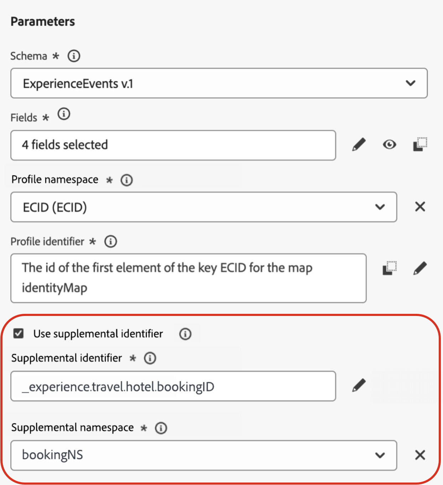
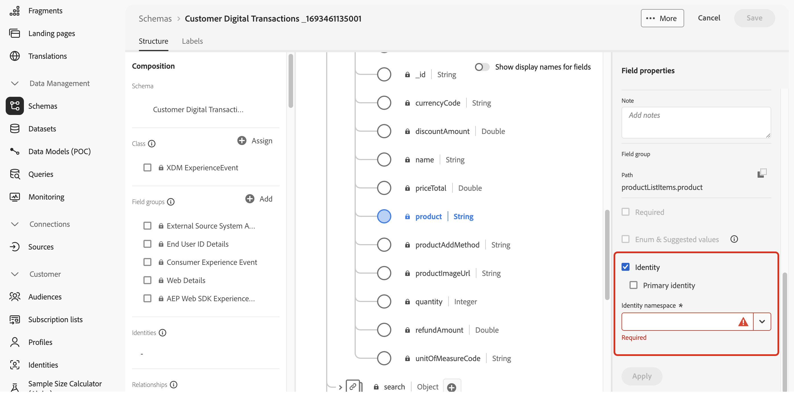
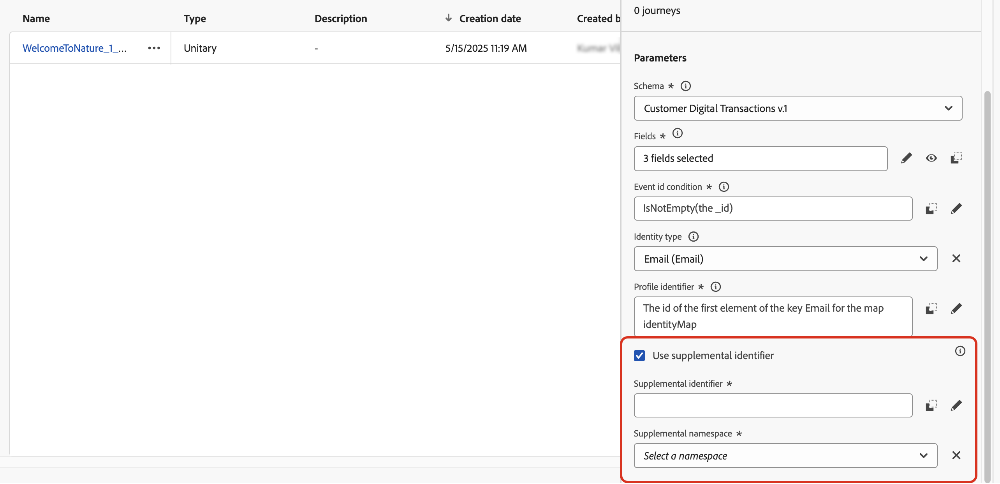

# 事件触发的历程中的补充标识符 {#supplemental-id}

>[!CONTEXTUALHELP]
>id="ajo_journey_parameters_supplemental_identifier"
>title="使用补充标识符"
>abstract="补充标识符是辅助标识符，可为历程的执行提供额外的背景信息。若要定义它，请选择要用作补充标识符的字段，并选择与其关联的命名空间。"

>[!AVAILABILITY]
>
>此功能仅面向一部分组织（限量发布）。要获得访问权限，请与 Adobe 代表联系。

默认情况下，事件触发的历程会在&#x200B;**配置文件ID**&#x200B;的上下文中执行。 这意味着，只要用户档案在给定历程中处于活动状态，它就无法重新进入另一个历程。 为防止出现这种情况，Journey Optimizer允许您在事件中捕获&#x200B;**补充标识符**，例如订单ID、订阅ID、处方ID以及配置文件ID。
在本例中，我们添加了预订ID作为补充标识符。

{width=40% zoomable}

这样，由事件触发的历程将在与补充标识符关联的用户档案ID（此处为预订ID）的上下文中执行。 为补充标识符的每个迭代执行历程的一个实例。 如果访客进行了不同的预订，这将允许历程中出现多个相同用户档案ID的入口。

此外，Journey Optimizer允许您利用补充标识符的属性（例如，预订编号、处方续订日期、产品类型）进行消息自定义，从而确保高度相关的通信。<!--Example: A healthcare provider can send renewal reminders for each prescription in a patient's profile.-->

## 保护和限制

* **并发实例限制**：配置文件不能包含超过10个并发历程实例。

<!--* **Array depth**: Supplemental identifier objects can have a maximum depth of 3 levels (2 levels of nesting).

    +++Example

    ```
    [
    (level 1) "Atorvastatin" : {
    "description" : "used to lower cholesterol",
    "renewal_date" : "11/20/25",
    "dosage" : "10mg"
    (level 2) "ingredients" : [
    (level 3) "Atorvastatin calcium",
    "lactose monohydrate",
    "microcrystalline cellulose",
    "other" ]
    }
    ]
    ```

    +++
-->
* **退出标准**：如果触发退出标准，则将退出当前历程中实时接收的用户档案的所有实例。 它与配置文件ID +补充标识符组合无关。

* **频率规则**：根据补充标识符使用率创建的每个历程实例都计入频率上限，即使单个事件导致多个历程实例也是如此。

* **数据类型和架构结构**：补充标识符的类型必须为`string`。 它可以是独立的字符串属性，也可以是对象数组中的字符串属性。 独立的字符串属性将生成单个历程实例，而对象数组中的字符串属性将生成每个对象数组的迭代的唯一历程实例。 不支持字符串数组和映射。

## 添加补充标识符并在历程中利用它

要在历程中使用补充标识符，请执行以下步骤：

1. **在事件架构中将属性标记为标识符**

   1. 访问事件架构，找到要用作补充标识符的属性（例如，预订ID、订阅ID），并将其标记为ID。 [了解如何使用架构](../data/get-started-schemas.md)

   1. 将标识符标记为&#x200B;**[!UICONTROL 标识]**。

      

      >[!IMPORTANT]
      >
      >确保不将属性标记为&#x200B;**主标识**。

   1. 选择要与补充ID关联的命名空间。 这必须是非人员标识符命名空间。

1. **将补充ID添加到事件**

   1. 创建或编辑所需的事件。 [了解如何配置单一事件](../event/about-creating.md)

   1. 在事件配置屏幕中，选中&#x200B;**[!UICONTROL Use supplemental identifier]**&#x200B;选项。

      

   1. 使用表达式编辑器选择标记为补充ID的属性。

   1. 选择补充ID后，关联的命名空间在事件配置屏幕中显示为只读。

1. **将事件添加到历程**

   将已配置事件拖到历程画布上。 它会根据用户档案ID和补充ID触发历程条目。

   

1. **利用补充ID属性**

   使用表达式编辑器和个性化编辑器为个性化或条件逻辑引用补充标识符的属性。 可从&#x200B;**[!UICONTROL 上下文属性]**&#x200B;菜单访问属性。

   

   >[!NOTE]
   >
   >如果您使用数组（例如，多个处方或策略），请使用公式来提取特定元素。

+++ 查看示例

   在补充ID为`bookingNum`且属性位于同一级别`bookingCountry`的对象数组中，历程将根据bookingNum遍历数组对象，并为每个对象创建历程实例。

   * 条件活动中的以下表达式将遍历对象数组，并检查`bookingCountry`的值是否等于“FR”：

     ```
     @event{<event_name>.<object_path>.<object_array_name>.all(currentEventField.<attribute_path>.bookingNum==${supplementalId}).at(0).<attribute_path>.bookingCountry}=="FR"
     ```

   * 电子邮件个性化编辑器中的以下表达式将遍历对象数组，提取适用于当前历程实例的`bookingCountry`，并将其显示在内容中：

     ```
     {{#each context.journey.events.<event_ID>.<object_path>.<object_array_name> as |l|}} 
     
      {{l.<attribute_path>.bookingCountry}}  
     
     {{/each}}
     ```

   * 用于触发历程的事件示例：

     ```
     "bookingList": [
           {
               "bookingInfo": {
                   "bookingNum": "x1",
                         "bookingCountry": "US"
               }
           },
           {
               "bookingInfo": {
                   "bookingNum": "x2",
                   "bookingCountry": "FR"
               }
           }
       ]
     ```

+++

1. **发布历程**

   配置完毕后，发布历程以开始使用基于补充标识符的多个并发条目。

## 示例用例

### **策略续订通知**

* **方案**：保险公司向客户持有的每个有效保单发送续订提醒。
* **执行**：
   * 个人资料： “John”。
   * 补充ID： `"AutoPolicy123", "HomePolicy456"`。
   * 历程针对每个策略单独执行，并提供个性化的续订日期、服务范围详细信息和高级信息。

### **订阅管理**

* **方案**：订阅服务为绑定到客户配置文件的每个订阅发送定制的消息。
* **执行**：
   * 个人资料： “Jane”。
   * 补充ID： `"Luma Yoga Program ", "Luma Fitness PlPrograman"`。
   * 历程针对每个订阅单独执行，并提供个性化的续订优惠。

### **产品推荐**

* **情景**：电子商务平台根据客户购买的特定产品发送推荐。
* **执行**：
   * 个人资料：“Alex”。
   * 补充ID： `"productID1234", "productID5678"`。
   * 历程针对每个产品单独执行，并提供个性化的追加销售机会。
