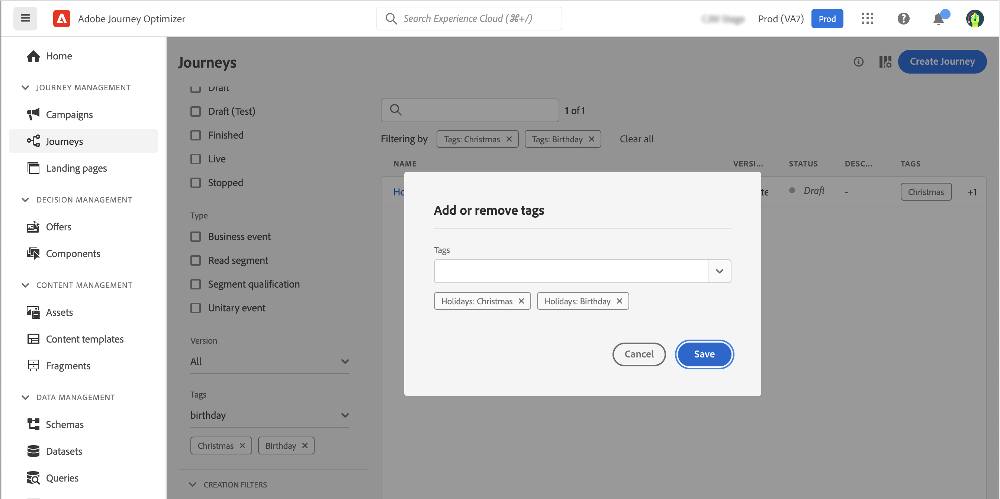

# 管理历程中的标记 {#journey_tags}

作为Journey Optimizer的从业者，您可以使用标记整理您的历程。 标记是对对象进行分类以改进搜索的一种快速而简单的方法。

## 将标记添加到历程

历程属性中的&#x200B;**标记**&#x200B;字段允许您为历程定义标记。 您可以选择现有标记，也可以创建新标记。开始键入所需标记的名称，然后从列表中选择该名称。如果不可用，请单击&#x200B;**创建**&#x200B;以创建一个新模板并将其添加到您的历程中。 您可以根据需要定义任意数量的标记。

定义的标记列表显示在&#x200B;**标记**&#x200B;字段的下方。

>[!NOTE]
>
> 标记区分大小写
> 
> 如果复制或创建新版本的历程，则将保留标记。

## 标记筛选

历程列表会显示一个专用列，以便您轻松实现标记的可视化。

过滤器也可用于仅显示具有特定标记的历程。

您可以从任何类型的历程（实时、草稿等）中添加或删除标记。 单击历程旁边的&#x200B;**更多操作**&#x200B;图标，然后选择&#x200B;**编辑标记**。

## 管理标记

管理员可以删除标记，并使用&#x200B;**管理**&#x200B;下的&#x200B;**标记**&#x200B;菜单按类别进行组织。请参阅此[文档](https://experienceleague.adobe.com/docs/experience-platform/administrative-tags/overview.html?lang=zh-Hans)。

>[!NOTE]
>
> 历程中定义的标记会添加到内置的“未分类”类别。
