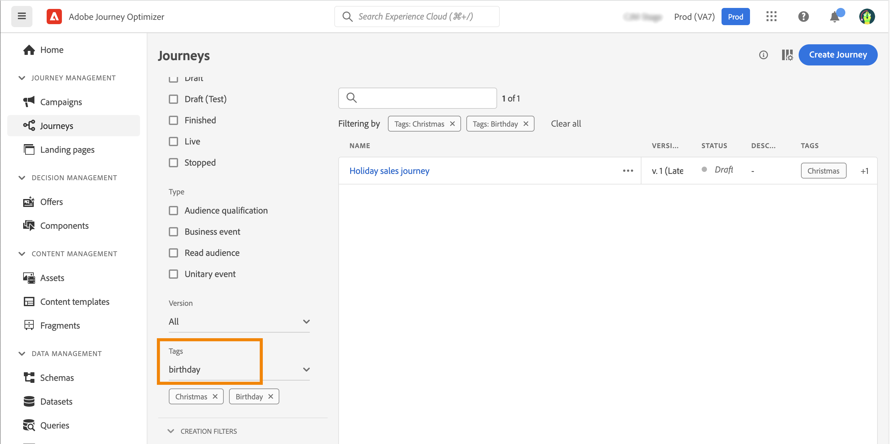

# 管理历程中的标记 {#journey_tags}

>[!BEGINSHADEBOX]

**在此页面上：**&#x200B;了解如何使用标记和标记类别来组织历程，以便比命名惯例更轻松地分类、过滤和查找历程。

>[!ENDSHADEBOX]

作为Journey Optimizer的从业者，您可以使用标记整理您的历程。 标记是用于进行对象分类的一种快速而简单的方法，能够改进搜索。

## 标记与命名惯例 {#tags-vs-naming}

团队通常依赖复杂的命名惯例将元数据直接存储在历程名称中 — 例如： *生命周期营销 — 教育 — 客户入门V2 — 应用程序教育 — 2025年第三季度*。 尽管出发点是好的，但这一方法有一个关键弱点：随着团队成员的工作规模变化，常规很少得到一致应用，旅程清单变得难以导航。

Journey Optimizer中的&#x200B;**标记类别**&#x200B;提供了更好的替代方案。 您无需在名称中编码元数据，而是可以将已分类的标记附加到每个历程（例如，团队、目标、阶段、季度），并使用过滤器来查找它们。 然后，历程名称可以关注真正重要的内容：所推动的客户里程碑。

标记类别与命名惯例相比的好处：

* **一致性** — 从受控列表中选择标记，而不是自由键入。
* **可过滤性** — 可以使用任何标记值的组合立即对历程列表进行切片。
* **清晰度** — 历程名称保持简短并以里程碑为中心。
* **可扩展性** — 添加新的元数据维度意味着创建新的标记类别，而不是重写命名约定。

有关建议的设置工作流，请参阅下面的[为历程管理设置标记类别](#tags-setup)。

## 将标记添加到历程

历程属性中的&#x200B;**标记**&#x200B;字段允许您为历程定义标记。 您可以选择现有标记，也可以创建新标记。 开始键入所需标记的名称，然后从列表中选择该名称。 如果不可用，请单击&#x200B;**创建**&#x200B;以创建一个新模板并将其添加到您的历程中。 您可以根据需要定义任意数量的标记。

历程属性中用于分类和组织的

定义的标记列表显示在&#x200B;**标记**&#x200B;字段的下方。

>[!NOTE]
>
> 标记区分大小写
> 
> 如果复制或创建新版本的历程，则将保留标记。

## 标记筛选

历程列表会显示一个专用列，以便您轻松实现标记的可视化。

过滤器也可用于仅显示具有特定标记的历程。

您可以从任何类型的历程（实时、草稿等）中添加或删除标记。 单击历程旁边的&#x200B;**更多操作**&#x200B;图标，然后选择&#x200B;**编辑标记**。

## 管理标记

管理员可以删除标记，并使用&#x200B;**管理**&#x200B;下的&#x200B;**标记**&#x200B;菜单按类别进行组织。 请参阅此[文档](https://experienceleague.adobe.com/docs/experience-platform/administrative-tags/overview.html?lang=zh-Hans)。

>[!NOTE]
>
> 历程中定义的标记会添加到内置的“未分类”类别。

## 设置历程管理的标记类别 {#tags-setup}

按照以下步骤在整个团队中将复杂的命名惯例替换为基于标记的方法。

**步骤1 — 创建标记类别（管理员）**

在&#x200B;**[!UICONTROL 管理]** > **[!UICONTROL 标记]**&#x200B;中，为团队当前在历程名称中编码的每个元数据属性创建一个类别 — 例如： *团队*、*营销目标*、*营销活动*、*阶段*、*季度*。

**步骤2 — 使用标记值（管理员）填充每个类别**

在每个类别中，创建表示所有可能值的标记。 例如，*阶段*&#x200B;类别可能包含：*感知*、*入门*、*保留*、*回访*。

**步骤3 — 在创建历程（从业者）时应用标记**

每次创建新历程时，从历程属性中的每个类别中选择适当的标记。 历程通常每个类别包含一个标记。

**步骤4 — 命名里程碑的历程，按标记筛选**

将历程名称集中在它推动的客户里程碑上（例如&#x200B;*首次忠诚度交易*）。 在历程列表中使用标记过滤器，以通过任意元数据组合来查找历程，而无需依赖名称解析。

>[!TIP]
>
>有关此方法及其大规模好处的更广泛讨论，请参阅[Journey Optimizer高级历程的最佳实践](https://experienceleague.adobe.com/en/perspectives/best-practices-for-advanced-journeys-in-journey-optimizer){target="_blank"}。

+++ AI知识参考

本节包含结构化知识，用于支持与本主题相关的解释、检索和问答。

要全面了解相关信息，应将此信息与本页上的文档相结合。 这两个源都不是独立的；页面描述了功能，而本节提供了其他上下文来帮助消除术语、意图、适用性和约束条件的歧义。

* **TL；DR：**&#x200B;本页介绍如何在Adobe Journey Optimizer中添加、筛选和管理旅程上的标记，以及为什么标记类别是组织大型旅程列表的复杂命名约定的更好替代方法。

**意图：**
* 从历程属性标记字段将标记添加到历程
* 按一个或多个标记筛选历程列表以快速找到特定历程
* 编辑任何状态的现有历程（实时、草稿等）上的标记 通过更多操作
* 以管理员身份创建和组织标记类别，以强制实施一致的元数据
* 使用基于标记的结构化方法替换复杂的历程命名约定

**术语表：**
* **标记**：附加到历程的标签以对其进行分类和过滤；不区分大小写并在复制历程或对其进行版本控制时保留&#x200B;*（产品特定）*
* **标记类别**：管理员在“管理”>“标记”下创建的相关标记值分组，启用结构化元数据分类&#x200B;*（产品特定）*
* **未分类的类别**：将直接在历程中创建的标记自动分配给的内置默认类别&#x200B;*（产品特定）*

**护栏：**
* 标记区分大小写
* 历程中定义的标记会自动添加到内置的“未分类”类别，除非管理员将它们分配给命名类别
* 只有管理员可以通过Administration > Tags菜单删除标记和管理标记类别
* 标记会在复制历程或创建新版本时保留

**术语：**
* 规范名称：标记 — 首字母缩写：none — 变体：历程标记、管理标记
* 规范名称：标记类别 — 缩写：无 — 变体：标记组
* 请勿混淆：“标记”（历程分类标签）≠“命名约定”（直接在历程名称中编码的元数据）

**常见问题解答：**
* **问：如何向历程添加标记？**  — 在历程属性中，在标记字段中键入标记名称并从列表中选择它，或单击“创建”以添加新标记。
* **问：能否将标记添加到实时历程？**  — 是的。 单击列表中历程旁边的更多操作图标，然后选择编辑标记，以在任何历程中添加或删除标记，而不管状态如何。
* **问：标记是否区分大小写？**  — 不。 标记不区分大小写。
* **问：当我复制历程或创建新版本时，标记会发生什么情况？**  — 标记将保留在重复版本或新版本上。
* **问：谁可以删除标记或创建标记类别？**  — 只有管理员可以通过Administration > Tags菜单删除标记和管理标记类别。
* **问：为什么使用标记类别而不是命名惯例？**  — 标记类别通过受控列表强制执行一致性，允许即时进行多维筛选，保持历程名称简短且以里程碑为中心，并通过添加新类别而不重写命名规则而轻松扩展。

+++
