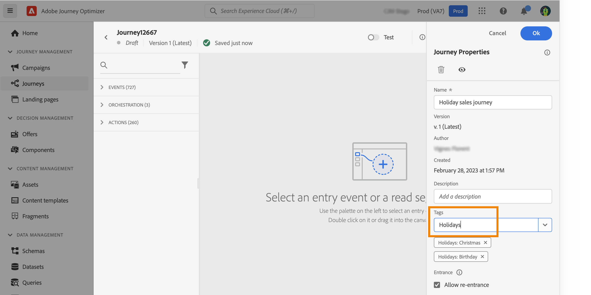

# 管理历程中的标记 {#journey_tags}

作为Journey Optimizer的从业者，您可以使用标记来整理历程。 标记是对对象进行分类以改进搜索的一种快速而简单的方法。

>[!AVAILABILITY]
>
> 统一标记当前为测试版。 文档和功能可能会发生变化。

## 将标记添加到历程

此 **标记** 利用历程属性中的字段，可定义历程的标记。 您可以选择现有标记，也可以创建新标记。 开始键入所需标记的名称，然后从列表中选择该标记。 如果不可用，请单击 **创建** 以创建新体验包并将其添加到您的旅程。 您可以根据需要定义任意数量的标记。

定义的标记列表显示在下面 **标记** 字段。

>[!NOTE]
>
> 标记区分大小写
> 
> 如果复制或创建新版本的历程，将保留标记。

## 按标记筛选

历程列表会显示一个专用列，以便您轻松实现标记的可视化。

过滤器也可用于仅显示具有特定标记的历程。

您可以从任何类型的历程（实时、草稿等）中添加或删除标记。 单击 **更多操作** 图标，然后选择 **编辑标记**.

## 管理标记

管理员可以删除标记，并使用按类别对标记进行整理 **标记** 菜单，在下 **管理**. 请参阅此 [文档](https://experienceleague.adobe.com/docs/experience-platform/administrative-tags/overview.html).

>[!NOTE]
>
> 历程中定义的标记会添加到内置的“未分类”类别中。
